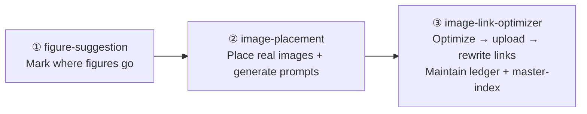

# Image Pipeline Skills — Reference Notes (2026-06-05)

## Pipeline Overview



| Skill | Stage | Owns |
|---|---|---|
| `figure-suggestion` | ① | `<!-- FIGURE SUGGESTION -->` blocks in chapter files |
| `image-placement` | ② | Local figure links, sequential numbering, Gemini prompts |
| `image-link-optimizer` | ③ | `.images/book-media.md` ledger, `.images/master-image-index.csv` |
| `chapter-media` | 🎬 orchestrator | Full pipeline (menu-driven, plan-first) |

## Figure Suggestion Format

**Canonical** (as of 2026-06-05):
```markdown
<!-- FIGURE SUGGESTION -->
```
A side-by-side comparison showing one wide spreadsheet vs two related tables.
Caption hint: One subject per table reduces duplication.
```
```

- HTML comment marks it for pipeline scanners
- Fenced code block holds the suggestion text
- Invisible to all renderers (HTML, DOCX, TOC, Pandoc)

**Deprecated** — recognized but not produced:
- `#### 🎨 Figure Suggestion` (old H4 heading form)
- `*Figure suggestion: ...*` (old italic line form)

## Master Image Index

- **File:** `.images/master-image-index.csv`
- **Owned by:** `image-link-optimizer` (stage ③)
- **Rebuilt after every ledger write** — never left stale
- **Each row has:** unique sequential `chNN-NNN` ID, Cloudinary URL, local `production_file` path, caption
- **CSV quoting rule:** Cloudinary URLs contain commas (`f_auto,q_auto,c_limit`) — fields must be double-quoted
- **Local path rule:** `production_file` must point to actual current file location, not historical paths

## Generation Model & Gate

- **Model:** Gemini (Gemini 2.5 Pro / Imagen-capable)
- **Gate:** `image-placement` has a mandatory **Generation Gate** — before any API call, it presents all prompts with estimated cost and asks for explicit approval
- Prompts are reviewed at two levels: the placement plan approval (Phase 2, item 7) and the dedicated Generation Gate (Phase 2, item 6)
- Never generate without the Generation Gate confirmation — prompts may need adjustment, and generation consumes credits

## Image Folder Organization

For each chapter, `.images/chNN-*/` is organized into:
- `used/` — optimized files referenced in the chapter (from `chNN-used/`)
- `unused/` — source images and subfolders not currently referenced
- `recommend-delete/` — non-image files (`.pptx`, `.py`, `.zip`, `.mp4`, `.gif`), Gemini raw outputs, 0-byte files

## Key Rules (Across All Skills)

1. **Plan first, edit after approval** — `image-placement` and `chapter-media` produce plans before any writes
2. **One figure per sub-section** minimum — `figure-suggestion` targets every `##` and `###`
3. **Sequential figure numbers** — `image-placement` numbers per chapter (Figure 4.1, 4.2, …)
4. **Local links only in stage 2** — Cloudinary URLs only appear after `image-link-optimizer`
5. **Never leave index stale** — safety rule #12 in `image-link-optimizer`

## Changes Applied 2026-06-05

1. `figure-suggestion` — canonical format changed from H4 `#### 🎨 Figure Suggestion` to `<!-- FIGURE SUGGESTION -->` + fenced code block
2. `image-placement` — scanner updated to recognize new format as primary; H4 and italic as deprecated
3. `image-link-optimizer` — added "Master Image Index" section with rebuild procedure, CSV schema, and safety rule #12
4. `master-image-index.csv` — rebuilt with 207 entries across ch01–ch05, unique sequential IDs per chapter, both Cloudinary URLs and local paths
