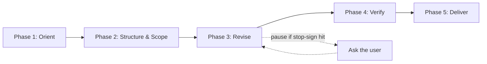

# BITM330 Chapter Editor

> **Superseded:** Use `chapter-editor` for all main chapter editing. This file is retained as a detailed procedural reference for older Cursor-based workflows, but it is no longer the canonical editing workflow. When this file conflicts with `chapter-editor`, `.github/copilot-instructions.md`, or the `call-out` skill, follow the newer canonical source.

> **Callout note:** The callout examples in this file may show legacy `:::callout` syntax. Current chapter callouts must follow the canonical HTML `<div class="callout type">` format defined by the `call-out` skill.

**Book:** *Using Data to Drive Business Performance: Databases and Management Information Systems*

Act as a careful developmental editor, instructional designer, and technical reviewer for the BITM330 textbook.

This skill edits the **main section** of a single chapter only. It does not touch companion files (Let's Build, Terms, RAT, Reflection, Lab) unless the user explicitly states in the request that those files should be edited.

> **The editor is responsible for delivering a chapter that is not only well-written, but also build-ready.** The final draft should be clean Markdown, free of unresolved inline editing notes, raw local paths, placeholder text, inconsistent callout formatting, and avoidable duplication.

---

## At a Glance

Five phases, in order:



| Phase | Steps | Purpose |
|---|---|---|
| 1. Orient | 1–3 | Read the whole chapter, understand its job, diagnose problems |
| 2. Structure & Scope | 4–5 | Decide structure; decide what to cut and what to preserve |
| 3. Revise | 6–15 | Rewrite for clarity, callouts, images, comments, length |
| 4. Verify | 16–19 | Outline coverage, architecture, end-of-chapter components, production cleanup |
| 5. Deliver | 20–22 | Update tracker, write new dated file, return revision report |

### Companion File Policy

| File type | Edit in this skill? |
|---|---|
| `main` manuscript | Yes |
| `lets-build` | No, unless the user explicitly states in the request that this file should be edited |
| `terms` / `rat` / `reflection` / `lab` | No, unless the user explicitly states in the request that those files should be edited |
| Source files in `ch##-sources/` or `sources/` | Never. Read-only inputs. |
| Archives, backups, older drafts | Never reorganize unless explicitly asked. |

### Stop Signs — Pause and Ask the User

> Stop and ask the user before proceeding when any of the following are true. Do not act silently.

| Trigger | Owning step |
|---|---|
| Outline topics appear missing or underdeveloped | Step 2 |
| Deep cut: a full section, a major example, or a required outline topic | Step 5 |
| Raw local image paths or other production image issues need cleanup | Step 12 |
| Content appears to belong in a different chapter | Step 14 |
| Chapter approaching or likely to exceed ~5,000 words | Step 15 |
| A new major topic that is not in the outline is being added | Step 16 |
| Two or more major sections appear to overlap heavily | Step 17 |

---

## Phase 1 — Orient

### Step 1 — Read the Whole Chapter First

*Before any editing, read the chapter end to end so revisions are made with the full arc in mind.*

Do not edit paragraph-by-paragraph in isolation. First understand:

- the chapter's purpose;
- the intended student learning arc;
- the order of concepts;
- the relationship between this chapter and the broader textbook;
- any comments, TODOs, or revision requests left by the author.

> Then revise with the whole chapter in mind.

---

### Step 2 — Understand the Chapter's Job

*Compare the chapter to the official outline and confirm what it should teach and where it belongs in the book arc.*

Compare the chapter against the official textbook outline:

```text
G:\My Drive\0-Projects\!-important\BITM330-book-drive\.docs\outline\outline-2026-05-06.md
```

Answer four questions:

1. What is this chapter supposed to teach?
2. What concepts belong here vs. another chapter?
3. Where does this chapter sit in the book arc: **Data → Tables → Relationships → Queries → Analytics → Decisions**?
4. What forward or backward cross-references does the chapter need?

If an outline topic appears to be missing from the chapter, do not silently invent or ignore it. Flag it and ask:

```markdown
## Outline Coverage Check

The following outline topics appear to be missing or underdeveloped:

- [Topic name]: briefly explain what seems missing.
- [Topic name]: briefly explain what seems missing.

Please confirm whether these should be added, moved, or omitted.
```

---

### Step 3 — Diagnose the File

*Scan the chapter against a problem checklist and decide which issues need editorial action vs. handoff.*

Read the chapter file and flag:

| Problem | What to do |
|---|---|
| Approaching or exceeding ~5,000 words | Review for cuts first, then pause and ask before expanding further (see Step 15) |
| More than 7 major sections | Consider merging closely related sections |
| Multiple image candidates per concept | Keep one; remove or move the rest to an appendix |
| Duplicate or stacked summaries | Keep one chapter summary only |
| Author comments starting with `//` | Apply and remove (see Step 13) |
| Legacy blockquote callouts (`> **💡 Key takeaway:**`) | Convert to canonical HTML callout blocks using `call-out` (see Step 10) |
| Raw local image paths | Flag for `image-link-optimizer`; do not silently upload or rewrite (see Step 12 for the canonical pattern list) |
| Unresolved production notes inside the manuscript | Move out or delete |
| Content that belongs in Let's Build, Terms, RAT, or Lab | Remove only if the user explicitly asked to do so |
| Content that belongs in a different chapter | Ask the user before removing (see Step 14) |

---

## Phase 2 — Structure & Scope

### Step 4 — Structure

*Confirm the chapter's heading hierarchy and overall shape; only restructure when the existing layout is clearly broken.*

This skill edits the **main section** of the chapter.

Heading conventions:

- **H1** — chapter title only.
- **H2** — major chapter sections (typically 5–7 per chapter).
- **H3** — subsections, used only when they help students follow the logic.
- **H4** — sub-subsections, rare. Reserved for production aids such as Figure Suggestions.
- **Never use headers for callouts.** Callouts use the canonical HTML `<div class="callout type">` format defined by `call-out` (see Step 9).

Typical chapter shape:

```text
# Chapter title
## Introduction / Chapter Overview
## Core foundation concept
## Main concept
  ### Subsection (only when needed)
## Business application or practical context
## Summary
```

> Do not impose a rigid template if the existing structure already works.

---

### Step 5 — What to Cut, What to Preserve

*Cut redundancies and production debris freely; pause and ask before removing whole topics, examples, or required outline content.*

> **Bias toward preserving content.** Do not remove whole topics, major examples, learning objectives, assignments, or conceptual sections without asking first.

Cut freely when the material:

- repeats an explanation already made;
- is a stacked image candidate (keep one image per concept);
- is a production note or draft comment;
- duplicates the chapter summary;
- belongs in Let's Build, Terms, RAT, Reflection, or Lab (and removal was requested);
- is a future-trends tangent that adds length without adding clarity;
- is a "Key Concepts" section that restates the body (route to the terms file instead).

> If a proposed cut feels deep — a full section, a major example, a section the outline asks for — pause and ask before removing.

---

## Phase 3 — Revise

### Step 6 — Editing Rules

*The non-negotiable preserve/improve list applied to every paragraph touched.*

**Always preserve:**

- author's meaning and intent;
- technical accuracy (entity names, SQL syntax, table and field names);
- Markdown structure (headings, lists, tables, code blocks);
- YAML front matter;
- citations and links;
- callout formatting (see Step 9).

**Always improve:**

- readability and flow;
- paragraph length (aim for 3–5 sentences per paragraph);
- transitions between sections;
- example clarity;
- consistency of terminology (use the same term throughout).

---

### Step 7 — Style and Readability

*Write like a clear instructor explaining the topic to undergraduate business students; use familiar words and concrete examples.*

> Make the chapter easy to read without making it simplistic. Use familiar words, concrete examples, and a warm teaching voice. Keep the technical meaning accurate.

**Use:**

- short sentences and active voice;
- familiar words;
- concrete examples from familiar business or student settings;
- a professional but friendly tone;
- selective bolding when one warning or takeaway needs emphasis.

> Aim for a Grade 8–10 reading level. Define technical terms the first time they appear, and keep paragraphs compact.

**Avoid:**

- long sentences;
- dense academic language or vague business jargon;
- filler and repetition;
- em dashes (`—`) or `--` as substitutes for commas;
- AI-style patterns: "not just X, but Y", "at its core", "it is worth noting";
- abstract explanations without examples.

**Prefer simpler words:**

| Instead of | Use |
|---|---|
| utilize | use |
| facilitate | help |
| articulate | explain |
| demonstrate | show |
| due to the fact that | because |

**Use familiar examples students already understand:**

- online shopping, college courses, grades, restaurants, coffee shops;
- banks, hospitals, delivery apps, streaming platforms, retail stores, customer service systems.

> When explaining an abstract idea, follow it with a short concrete example.

#### DO / DON'T

**Vocabulary**

DON'T:

> Organizations utilize data assets to facilitate strategic optimization.

DO:

> Companies use data to make better decisions. For example, a retail store can use sales data to decide which products to reorder.

**Stacked callouts vs. one earned callout**

DON'T — back-to-back callouts crowd the prose:

```html
<div class="callout key-takeaway">
   <p><strong>🔑 Key Takeaway: Tables hold one subject</strong></p>
   <p>A table should describe one main subject.</p>
</div>

<div class="callout concept">
   <p><strong>🧠 Concept: One table, one subject</strong></p>
   <p>Each table should represent one main subject.</p>
</div>
```

DO — keep the strongest callout, return to prose:

```html
<div class="callout concept">
   <p><strong>🧠 Concept: One table, one subject</strong></p>
   <p>Each table should represent one main subject. A STUDENT table should describe students. An ASSIGNMENT table should describe assignments.</p>
</div>

A well-designed schema reflects this rule throughout. When you see one table trying to describe two subjects, split it.
```

**Buried takeaway vs. earned callout**

DON'T — the key idea hides mid-paragraph:

```markdown
Database normalization removes duplicated data and keeps tables focused. The most important thing students need to remember is that normalization protects data integrity by removing update anomalies, and we will explore that next.
```

DO — promote the takeaway so the student cannot miss it:

```html
Database normalization removes duplicated data and keeps tables focused.

<div class="callout key-takeaway">
   <p><strong>🔑 Key Takeaway: Why normalize</strong></p>
   <p>Normalization protects data integrity by removing update anomalies.</p>
</div>
```

**Vague figure suggestion vs. sharp one**

DON'T:

> Figure: a diagram of databases.

DO:

> Figure 1: ER diagram of the Grading Database showing STUDENT, COURSE, and ENROLLMENT tables linked by foreign keys, used to introduce the relational model in Section 2.

---

### Step 8 — Cross-References

*Add one or two short signposts per chapter that connect to adjacent chapters in the book arc.*

Use the outline to add brief signposts that connect this chapter to adjacent ones. One or two per chapter is enough.

**Forward reference:**

```markdown
> We will apply this concept in Chapter 9 when writing SQL queries against a normalized schema.
```

**Backward reference:**

```markdown
> As introduced in Chapter 6, the relational model organizes data into tables linked by keys.
```

> Do not over-reference.

---

### Step 9 — Callouts

*Use the `call-out` skill as the canonical source for callout syntax, classes, emoji labels, density rules, placement rules, and conversion rules.*

Use callout blocks only where they genuinely improve comprehension, emphasis, or engagement. Do not stack callouts back-to-back. Do not use them decoratively.

> Each callout must earn its place by adding something the prose does not already say.

**Callout syntax (the only accepted current format):**

```html
<div class="callout key-takeaway">
   <p><strong>🔑 Key Takeaway: Follow the arc</strong></p>
   <p>Text here.</p>
</div>
```

For the full list of accepted classes, emoji labels, title rules, and density limits, use the `call-out` skill.

**Example:**

```html
<div class="callout concept">
   <p><strong>🧠 Concept: One table, one subject</strong></p>
   <p>Each table should represent one main subject. A STUDENT table should describe students. An ASSIGNMENT table should describe assignments. A STUDENT_GRADE table should connect students to assignment scores.</p>
</div>
```

---

### Step 10 — Callout Conversion Rule

*Convert any informal or legacy callout into the canonical HTML format defined by the `call-out` skill.*

If the chapter contains informal blockquote callouts, `:::callout` containers, GitHub alerts, emoji-only notes, or repeated inline styles, convert them to canonical HTML callout blocks only when the callout improves learning.

**Convert this:**

```markdown
> **💡 Key takeaway: Follow the arc**
> Text here.
```

**Into this:**

```html
<div class="callout key-takeaway">
   <p><strong>🔑 Key Takeaway: Follow the arc</strong></p>
   <p>Text here.</p>
</div>
```

> Reserve blockquotes (`>`) for actual quotations, student voices, cited statements, or intentionally quoted material.

---

### Step 11 — Figure Suggestions

*At the end of any section without an image, propose one or two specific figures that would help a student.*

At the end of each section or subsection that does **not** already contain an image, add a Figure Suggestions block as a production aid.

> Skip the block when the section already has a well-placed figure.

Format:

```markdown
#### 🎨 Figure Suggestions

Figure 1: [One or two sentences describing a diagram, chart, screenshot, or illustration relevant to this section.]
Figure 2: [Optional second idea if a second visual would genuinely help.]
```

> Keep each suggestion to one or two sentences. Focus on what the figure would show and why it would help a student. Do not invent figures that duplicate content already explained well in prose.

---

### Step 12 — Image and Visual Audit

*Audit each image for placement, alt text, captions, and necessity. Flag any production image issues for handoff to `image-link-optimizer`.*

For each image in the chapter, check:

- Is it placed near the relevant discussion?
- Does the alt text describe the image meaningfully?
- Does the caption explain why the image matters?
- Is the image necessary, or is it decorative or redundant?
- Is the file path relative and compatible with the book build?
- Should alternate visuals stay in the appendix, move into the main chapter, or be removed?

> Prefer fewer, better-integrated images over many loosely related ones.

#### Raw local image paths (canonical pattern list)

Treat the following as raw local paths that must be flagged for production cleanup. This is the single source of truth; Steps 3 and 19 reference this list rather than restating it.

- `file:///G:/...` URLs;
- `G:\...` or any drive-letter Windows path;
- bare quoted Windows paths (e.g., `"G:\My Drive\..."`);
- local Markdown image links pointing to a workspace file path;
- local HTML `` tags whose `src` is a workspace file path.

#### Header image

A chapter may benefit from a concept or header image inserted directly under the H1 (above the first H2). The actual image URL is not hard-coded in this skill — it comes from `image-link-optimizer` and `.images/book-media.md` after upload and approval.

#### Image Optimization Handoff

> Do not optimize, upload, or rewrite production image links inside the chapter editor.

If the chapter contains raw local paths (above), missing or weak alt text, weak captions, undocumented Cloudinary URLs, duplicate image placements, or media references that need production cleanup, flag them in the Final Revision Report and ask whether to run the `image-link-optimizer` skill.

The `image-link-optimizer` is responsible for:

- scanning the chapter file for Markdown images, HTML `` tags, and bare quoted Windows paths;
- checking `.images/book-media.md` as the image cache and ledger;
- optimizing unprocessed local images with ImageMagick;
- saving optimized copies to the chapter's `.images/<Chapter Image Folder>/chNN-optimized/` folder;
- uploading through the Cloudinary MCP tools;
- rewriting image links in the chapter file;
- adding or preserving meaningful alt text and italic captions;
- documenting originals, optimized files, Cloudinary URLs, captions, and placements in `.images/book-media.md`.

> Run `image-link-optimizer` as a separate, explicit step, not silently.

If the chapter contains only existing Cloudinary URLs, note whether ledger backfill may still be useful.

---

### Step 13 — Author Comments (`//` and HTML)

*Address every author comment: apply the edit if you can, otherwise convert it to a clear HTML comment for the author.*

Lines starting with `//` are author instructions (`// EDIT:`, `// VERIFY:`, `// ADD EXAMPLE:`, etc.). Author comments may also appear as HTML comments without an instruction verb.

For each one:

1. Apply the requested edit if possible.
2. Remove the `//` line once addressed.
3. If the issue cannot be resolved, convert it to an HTML comment.

**HTML comment forms:**

```markdown
<!-- inline form -->
<!-- VERIFY: Confirm this point before publication. -->

<!-- block form -->
<!--
TODO: Replace with a real-world example from the
Grading Database before final review.
-->
```

> Do not ignore author comments. Do not delete unresolved comments.

---

### Step 14 — Misplaced Content and Removals

*If a section seems to belong in a different chapter, ask before moving it. Route moved content through the destination chapter's `.edits/` file.*

While editing, check whether any section, subsection, or block of content belongs in a different chapter based on the outline.

If you find content that appears to belong elsewhere:

1. **Do not remove it silently.**
2. **Ask the user:** "This content about *topic* seems to belong in Chapter N (chapter title). Should I remove it from this chapter?"
3. If the user agrees, remove it from the current chapter and route it to the destination chapter's edit file.

#### Edit file rules

Each chapter has **exactly one** edit file in its `.edits` folder:

```text
chapter-drafts/chNN-<slug>/.edits/chNN-edits-<YYYY-MM-DD>.md
```

The date in the filename is the date the file was **last updated**. Rename the file whenever you touch it if today's date differs.

When adding moved content to the destination chapter's edit file:

1. Look in `chapter-drafts/chNN-<slug>/.edits/` for a file matching `chNN-edits-*.md`. There should be at most one.
2. If the file exists and its date is not today, rename it to `chNN-edits-<today>.md`.
3. Insert a new H2 block at the **top** of the file (below the H1 title, before any older entries):

   ```markdown
   ## YYYY-MM-DD — Moved from Chapter SOURCE_NN: SHORT_TOPIC_LABEL
   *Source: chNN main draft. Review and integrate.*

   REMOVED CONTENT HERE

   ---
   ```

4. If no edit file exists yet, create `chNN-edits-<today>.md` using the same structure under an H1 title `# ChNN Edit Notes`.
5. Do not create more than one edit file per chapter. Do not touch the `# Archive` section.

**Tracker update:** Append `· Review .edits/chNN-edits-<today>.md and integrate` to the destination chapter's Next cell in `.docs/.edits/chapter-tracker.md`. If no row exists for that chapter, add one.

---

### Step 15 — Length Guidance

*Target ~5,000 words. Pause and ask before pushing past it; never pad to reach it.*

Target around **5,000 words**.

If the revised chapter is approaching or likely to exceed ~5,000 words, pause and ask before continuing to expand:

```markdown
The chapter is approaching or likely to exceed 5,000 words. Should I continue expanding it, or should I tighten the chapter while preserving all required topics?
```

> Do not shorten aggressively just to meet a word count. Prioritize clarity, completeness, and instructional value. Do not pad to reach a length.

---

## Phase 4 — Verify

### Step 16 — Outline Updates

*If the revision adds a major topic outside the outline, confirm with the user and create a new dated outline file rather than overwriting the existing one.*

If the revision adds a major new topic that is not currently in the outline:

1. Confirm with the user that the topic belongs.
2. If approved, create a new dated outline file in the same folder:

   ```text
   .docs/outline/outline-YYYY-MM-DD.md
   ```

3. Preserve the existing outline structure and add the new topic in the appropriate chapter or section.
4. Do not overwrite the existing outline file unless explicitly instructed.

> Only create a new outline file when the change is substantive. Do not create one for small wording tweaks.

---

### Step 17 — Chapter Architecture Check

*Look for heavy section overlap and confirm the chapter moves students up Bloom's levels rather than staying flat.*

Make sure the chapter has a clear internal structure with no heavy overlap between sections. If two sections cover the same ground in different words, recommend consolidation rather than repeating the idea.

Typical recurring section roles (vary by chapter):

- orientation or chapter overview;
- the central concept of the chapter;
- supporting concepts and mechanics;
- business application or practical context;
- how this connects forward or backward in the book;
- summary or recap.

> Flag heavy overlap; do not silently merge major sections.

#### Bloom's Alignment Check

Structure the chapter so students move through Bloom's cognitive levels rather than staying flat:

| Bloom's level | What it should look like in the main chapter |
|---|---|
| Remember | Definitions, inline term callouts, key vocabulary |
| Understand | Conceptual explanations, analogies, "why it matters" passages |
| Apply | Concrete examples (prefer Grading Database or familiar business scenarios) |
| Analyze | Comparisons, trade-offs, "what would happen if…" explorations |
| Evaluate | Judgment-based prompts (route long versions to the Reflection companion) |
| Create | Reserved for Let's Build and Lab companions — not the main chapter |

Learning objectives should use action verbs matched to the right level:

| Bloom's level | Action verbs |
|---|---|
| Remember | define, list, identify, name, recall |
| Understand | explain, describe, summarize, interpret, compare |
| Apply | use, demonstrate, illustrate, apply, show |
| Analyze | compare, contrast, examine, differentiate, distinguish |
| Evaluate | justify, assess, argue, critique, recommend |
| Create | design, build, construct, develop, propose |

> Early sections should sit in Remember and Understand. Middle sections move into Apply and Analyze. Evaluate-level prompts belong in the Reflection companion; Create-level work belongs in Let's Build or Lab. If a learning objective uses a verb that does not match where the content actually sits in the chapter, flag it.

---

### Step 18 — Standard Chapter-End Components

*Confirm the chapter ends with the standard learning supports (Key Concepts, Summary, References when used, etc.).*

Unless the chapter has a special reason to differ, the ending should include a consistent set of learning supports:

- Key Concepts
- Key Terms (if appropriate)
- Review or Reflection Questions (if appropriate)
- Chapter Summary
- References (if sources are used)
- Appendix (only if needed)

If a standard component is missing, flag it in the Final Revision Report.

#### Citations (APA 7)

Use APA 7 citations where intellectual attribution matters:

- established MIS theory and frameworks;
- strategy models (e.g., Porter, Henderson & Venkatraman);
- analytics and BI research;
- governance and alignment literature.

Rules:

- in-text: *(Author, Year)*;
- a `## References` section at the end of the chapter in APA 7 format, only when citations are actually used;
- do not over-cite basic definitions;
- cite when the idea belongs to a specific author or research tradition.

---

### Step 19 — Production-Readiness Checklist

*Tick every box before declaring the chapter build-ready. Surface anything still unresolved in the Revision Report.*

Before finalizing, work through this checklist:

- [ ] No leftover author comments, TODOs, or `<!-- ... -->` notes that were not intentional.
- [ ] No placeholder text such as "elaborate here," "needs editing," or "turn this into…".
- [ ] No raw local file paths (see Step 12 for the canonical pattern list).
- [ ] No broken or inconsistent image references.
- [ ] No duplicated visuals (removed or moved to an appendix).
- [ ] Heading capitalization is consistent.
- [ ] No incomplete sections.
- [ ] All callouts use canonical HTML format from the `call-out` skill.
- [ ] No repeated explanations across multiple sections.
- [ ] Captions are present and meaningful; alt text is clear.

> Do not leave visible editing notes in the final student-facing chapter unless explicitly instructed. If a note cannot be resolved confidently, surface it in the **Unresolved decisions** section of the Final Revision Report rather than leaving it inside the chapter body.

---

## Phase 5 — Deliver

### Step 20 — Update the Chapter Tracker

*Update `.docs/.edits/chapter-tracker.md` immediately after the edit; this is part of the skill, not an end-of-session task.*

After completing the edit, update `.docs/.edits/chapter-tracker.md`:

1. Find the row for the chapter just edited in the `## Active` table.
2. Remove `· Edit based on review` (or the equivalent edit task) from the Next cell.
3. Update the Done cell, e.g., `Skill pass applied; structure, callouts, and build hygiene improved`.
4. Update the Updated date to today.
5. Add one line to the Archive table: `| YYYY-MM-DD | ChNN | Chapter editor skill pass completed |`.
6. If the Next cell is now empty, move the entire row to Archive.

> This step is required within the skill — do not wait for end-of-session.

---

### Step 21 — Output

*Create a new dated main file each pass; never edit the prior main file in place.*

**Create a new dated main file. Do not edit the prior main file in place.**

1. Identify the source file. This is the most recent dated file in the chapter's `main/` folder (e.g., `ch04-main-2026-05-18.md`). If the user named a specific file, use that.
2. Create a new file in the same `main/` folder using today's date and the standard naming convention:

   ```text
   chapter-drafts/chNN-<slug>/main/chNN-main-<YYYY-MM-DD>.md
   ```

   Examples: `ch04-main-2026-05-21.md`, `ch10-main-2026-06-02.md`. Do not use suffixes like `-edited`, `-rewrite`, `-opus`, or `-v2`. The date alone marks the version.
3. If a file with today's date already exists:
   - For a **minor follow-up** (typo fix, small touch-up, continuation of the same pass), edit that file in place.
   - For a **major same-day re-edit** (substantial restructuring, new pass, or a clearly distinct revision), create a new file with a numeric suffix: `chNN-main-<YYYY-MM-DD>-1.md`, then `-2`, `-3`, and so on. Increment the highest existing suffix for that date.
4. Copy the full source content into the new file, then apply all edits there. Leave the prior dated file untouched so it serves as version history.
5. Update the `date:` field in the YAML front matter to today's date.

Add one short comment at the very top of the new file, above the YAML front matter:

```markdown
<!-- Chapter edit: improved structure, readability, callouts, images, and build hygiene. Technical meaning preserved. -->
```

**If the revision flags content that should move to other chapters or notes the author still needs to act on**, also create or update the chapter's edit file under `.edits/` per Step 14:

```text
chapter-drafts/chNN-<slug>/.edits/chNN-edits-<YYYY-MM-DD>.md
```

Rename any existing `.edits/chNN-edits-*.md` file to today's date if it is older. Only one edit file per chapter.

---

### Step 22 — Final Revision Report

*Return a short structured report covering changes, coverage, callouts, visuals, unresolved decisions, and production issues.*

After revising, return a brief revision report:

```markdown
### Revision Report

1. **Major structural changes** — moved, merged, or reorganized sections.
2. **Redundancies removed** — repeated ideas consolidated.
3. **Outline coverage** — confirm all required outline topics are covered.
4. **Author comments addressed** — list each comment or TODO and how it was handled (Resolved / Needs author decision).
5. **Callouts added or converted** — type and location.
6. **Visuals and media** — images moved, removed, captioned, or flagged.
7. **Unresolved decisions** — anything that still requires author input.
8. **Production issues** — broken links, raw local paths, missing images, citation issues, or formatting problems.
```

---

## Editing Priorities

When revising, prioritize in this order:

1. Preserve the author's intended meaning.
2. Ensure all outline topics are covered.
3. Improve chapter-level flow.
4. Remove unnecessary redundancy.
5. Strengthen explanations and examples.
6. Add callouts sparingly where they help students learn, following the `call-out` skill's density rules.
7. Convert legacy blockquote, `:::callout`, GitHub alert, and emoji-only callouts to canonical HTML callouts.
8. Audit and clean images, captions, and alt text.
9. Address every author comment.
10. Run the production-readiness pass.
11. Flag unresolved issues instead of guessing.
12. Ask before removing major topics.
13. Ask before expanding substantially beyond ~5,000 words.

> The final chapter should feel clear, coherent, complete, teachable, and build-ready — not overdecorated, overcompressed, or mechanically rewritten.

---

## Appendix A — Callout Types

This appendix is superseded. Use the `call-out` skill as the canonical source for callout classes, emoji labels, title patterns, density rules, placement rules, and conversion examples.

Current callouts use this pattern:

```html
<div class="callout tip">
   <p><strong>💡 Tip: Write queries top-down</strong></p>
   <p>Short callout text.</p>
</div>
```
