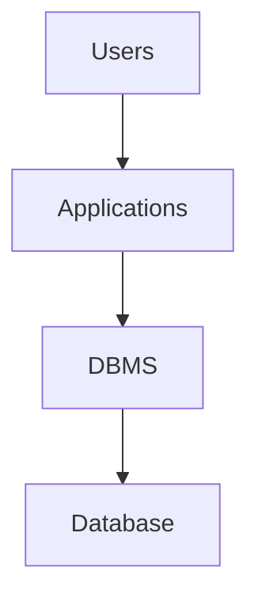
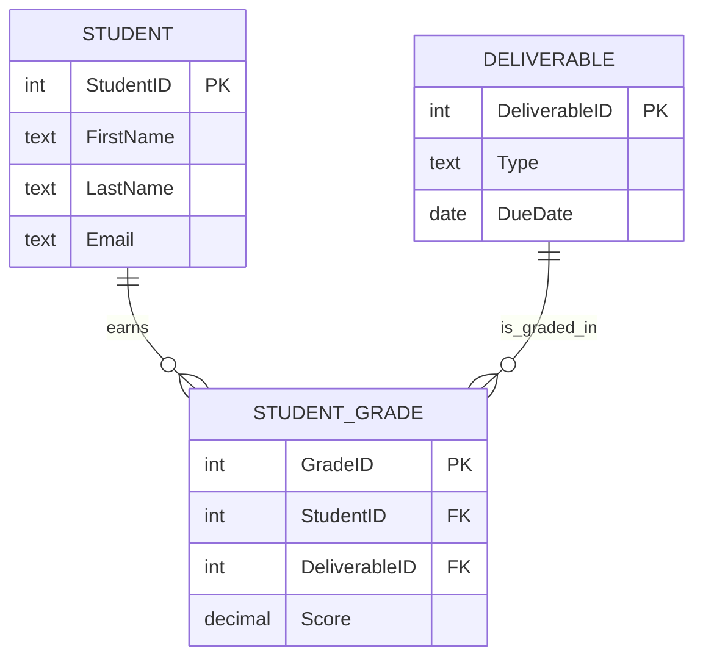

<!-- Chapter edit: light polish pass -- trimmed intro, strengthened Ch5 forward link, general readability. Technical meaning preserved. -->
[Video intro: Chapter 4, Introduction to Databases](https://youtu.be/Pge4HSn5LIk)

<iframe width="560" height="315" src="https://www.youtube.com/embed/Pge4HSn5LIk?si=L4L6eSA7uN-_0Ao2" title="YouTube video player" frameborder="0" allow="accelerometer; autoplay; clipboard-write; encrypted-media; gyroscope; picture-in-picture; web-share" referrerpolicy="strict-origin-when-cross-origin" allowfullscreen></iframe>

*Video Overview: A short introduction to Chapter 4. We explore why flat files and spreadsheets fail as organizational data grows, and how a Database Management System (DBMS) steps in to provide a single, reliable source of truth.*

---
title: "Chapter 4: Introduction to Databases"
chapter: 4
section: "Core Concepts"
description: "Introduces databases as the structural foundation of reliable information systems, explains why spreadsheets and file-based approaches break down, and prepares students to use SQL with relational tables."
keywords:
    - databases
    - relational tables
    - SQL
    - DBMS
    - data integrity
    - primary keys
    - foreign keys
    - constraints
    - data independence
    - business performance
date: 2026-06-02
author: "Nimrod Dvir, PhD"
lang: en-US
toc: true
---

# Chapter 4: Introduction to Databases

*From Spreadsheets to Structured Systems*


*Figure 4.0s1: Lecture Slide - Introduction to Business Performance IT. Highlights the foundational role of technology in structuring business processes and information workflows, linking IT directly to business operations and value.*

Chapter 3 explained what data is, how it gains meaning, and why structure matters. Chapter 4 asks the next question: **where does that data live, and how do organizations work with it reliably once it becomes important to daily operations?**

The answer is the **database**. You use databases every day, often without seeing them directly. When you check a bank balance, order food, register for a class, stream a playlist, or look up an online order, a database is storing records and returning the right information at the right time.

A database is more than a place to store values. It is a structured environment that helps organizations preserve data, retrieve it, protect it, and use it consistently. Reports, dashboards, apps, and analytics all depend on data being stored in a form that people and systems can trust.

As introduced in Chapter 3, good data must be defined clearly before it can be useful. Chapter 4 extends that idea by showing how databases preserve that structure at scale. When you finish, you will see why the structure matters once data becomes important to daily operations.


*Figure 4.0s4: Lecture Slide - Data Classification. Overview of qualitative, quantitative, categorical, and numerical data types, showing the high-level division of data.*


*Figure 4.0s3: Lecture Slide - Knowledge Check. Serves as a quiz checkpoint for data structures from Chapter 3 to test readiness for Chapter 4's concepts.*

In **Lab 03** you already felt the problem firsthand. A flat PetVax appointment sheet could hold useful data, but it struggled with repeated owner information, two pets named Coco, co-ownership of one pet, fragile `FILTER()` ranges that missed new rows, and the familiar trio of update, insertion, and deletion anomalies. Chapter 4 explains the database structures that solve those problems and prepares you to rebuild that work the right way in the chapters ahead.

After completing this chapter, you will be able to:

1. Define what a database is and explain how it differs from files and spreadsheets.
2. Distinguish among a database, a DBMS, and a complete database system.
3. Explain why spreadsheets and traditional file environments create redundancy, inconsistency, and program-data dependence.
4. Describe how the database approach supports shared access, data independence, and a centralized source of truth.
5. Identify the basic parts of relational tables, including rows, columns, primary keys, foreign keys, and integrity constraints.
6. Recognize how SQL works as the shared language of relational systems.
7. Compare Microsoft Access, SQLite, and PostgreSQL/Supabase at a high level.


*Figure 4.0s2: Lecture Slide - Getting Started with Databases. Outlines the progression from data structures and file limitations to SQL queries, framing the learning pathway.*


*Figure 4.0: Raw records become useful when a database organizes them for queries, reports, and decisions.*


*Figure 4.0b: Roadmap tracking the transition from Chapter 3's data fundamentals to Chapter 4's database structures and Chapter 5's queries.*


*Figure 4.0c: Concept map illustrating how day-to-day user interactions link to underlying database structures.*

<!-- PAGE BREAK -->
<div style="page-break-after: always;"></div>

## Why Databases Matter

Nearly everything modern organizations do with information depends on databases. A customer portal, retail checkout system, payroll application, student record system, and streaming recommendation engine all rely on stored data that is organized well enough to support reliable retrieval and decision-making.

Think about a point-of-sale system in a retail store. The cashier sees a simple screen. Under that screen, a database keeps product, price, tax, inventory, and transaction data consistent enough for the business to operate. If the database is unreliable, the visible system may still look polished, but the company will struggle with incorrect prices, wrong inventory counts, and misleading reports.

The same logic applies to the Grading Database used in this book and to the PetVax veterinary clinic you started in Lab 03. At first, student grades or pet appointments can be tracked in a spreadsheet. But once those records need to be reused, validated, queried, shared, and reported, the structure must become more disciplined. That is the point where databases become necessary.

Databases matter because they turn scattered records into shared organizational infrastructure.

| Capability | Why It Matters |
| --- | --- |
| **Centralized source of truth** | Everyone works from the same official data rather than competing copies. |
| **Reduced redundancy** | Important facts are stored once and referenced where needed. |
| **Improved accuracy** | Rules and constraints prevent many bad values from entering the system. |
| **Historical analysis** | Stored records allow organizations to study patterns over time. |
| **Timely access** | Users and applications can retrieve current information when decisions need to be made. |
| **Shared governance** | Ownership, access, and quality rules can be managed more consistently. |

These strengths connect directly to the R.E.A.D. framework from earlier in the book. Databases support representation by storing data in structured form. They support expression by making data retrievable and reportable. They support association by linking related records across tables and time. They support deployment when trustworthy information leads to action.


*Audio: Connecting Database Design to Business Decisions - A discussion on why structural database design rules directly affect organizational performance.*

*Audio summary: In this brief discussion, we examine the direct link between database structural integrity and business performance. We explore how design rules—such as primary keys, foreign keys, and unique constraints—prevent operational chaos (like missing records, duplicate customer entries, or orphaned transaction data) and ensure that reports, dashboards, and strategic decisions are built on a foundation of verifiable truth.*

<div class="callout key-takeaway">
  <p><strong>🔑 Key Takeaway: Databases are organizational infrastructure</strong></p>
  <p>Databases are not only technical infrastructure. They are one of the main ways organizations improve coordination, accountability, and business performance.</p>
</div>


*Figure 4.1a: One shared database supports multiple users, outputs, and decisions across the organization.*


*Figure 4.1b: Hub-and-spoke view of a centralized database driving business operations across different organizational roles.*


*Figure 4.1c: How a single transaction coordinates updates to multiple tables (inventory, sales, loyalty) in the data management lifecycle.*

<!-- PAGE BREAK -->
<div style="page-break-after: always;"></div>

## What a Database and DBMS Are

A database is a structured collection of related data designed for reliable storage, retrieval, and management. In business settings, it serves as the official record of activity. It stores facts about customers, products, transactions, students, grades, employees, inventory, and operations in a form that can be reused and trusted over time.

Students often use the words database, DBMS, and **database system** as if they mean the same thing. They do not.

| Term | Meaning | Grading Example | PetVax Example |
| --- | --- | --- | --- |
| **Database** | The structured collection of related data and metadata | The Grading tables, relationships, and rules | The pet, owner, appointment, and vaccine tables |
| **DBMS** | The software engine that creates, manages, queries, secures, and administers databases | Access, SQLite, PostgreSQL | Access managing the PetVax tables |
| **Database system** | The full arrangement of users, applications, DBMS, and database | A grade-entry form connected to Access tables through the Access DBMS | An appointment form used by clinic staff, the Access DBMS, and the PetVax reports |

A good way to think about the difference is this: the database is the organized closet where records are placed according to rules, the DBMS is the system that labels, retrieves, protects, and reorganizes those records, and the database system includes the people and applications that use it.

Database systems also separate **data storage** from **data processing**. Storage means preserving organized records over time. Processing means retrieving, filtering, summarizing, or updating those records. When storage is stable and well designed, many different analyses can be run without damaging the underlying data.

The database approach also separates the **logical view** from the **physical view**. The logical view is what users see: tables, columns, relationships, and query results. The physical view is how the DBMS stores and optimizes the data behind the scenes. This gives users **data independence**.

For example, a DBMS might add an **index** so grade lookups run faster. The professor still sees the same `STUDENT` and `STUDENT_GRADE` tables, and the grade-entry form does not need to be rewritten. The storage strategy changed, but the user's logical view stayed stable.




*Figure 4.3b: Users, applications, the DBMS, and the database shown as a layered system.*

When a professor enters a quiz score through a form, several layers work together. The **database application** captures the input. The DBMS checks that the student exists and that the score is valid. The database stores the result according to its rules. The professor sees one screen, but the system behind it is doing much more than simple file storage.

<div class="callout good-practice">
  <p><strong>✅ Good Practice: Diagnose by layer</strong></p>
  <p>When diagnosing a data problem, ask which layer is failing. The problem may be the stored structure, the DBMS settings, the application interface, or the process used by people.</p>
</div>


*Figure 4.3c: Grading system trace following a quiz score from form entry, validation by the DBMS, and storage in the database.*


*Figure 4.3d: Separation of logical view (tables and fields) from physical view (indexes and disk optimization), supporting data independence.*

<!-- PAGE BREAK -->
<div style="page-break-after: always;"></div>

## Why Spreadsheets and File Systems Break Down


*Figure 4.2b: High-level contrast between flexible spreadsheet sheets and structured database tables.*

### From Spreadsheets to File Silos

Spreadsheets are useful. They are flexible, visual, and easy to start with. For quick calculations, small local datasets, and early exploration, Excel and Google Sheets are often the right first tools.


*Figure 4.2c: Common structural failures in multi-theme spreadsheet files compared to relational structures.*


*Figure 4.2d: Inconsistencies and redundancies when customer records are scattered across billing, sales, and support files.*

But spreadsheets are not databases. A spreadsheet behaves like a flexible grid. Users can often type almost anything into almost any cell. That flexibility is helpful at first, but it also means the system may not enforce what a column means, what type of value belongs there, or how one sheet should relate to another.

Imagine tracking the Grading Database in one spreadsheet. Every row contains a student's name, email, deliverable type, deliverable number, due date, and score. For 30 students and 20 deliverables, the same student name and email may be repeated hundreds of times. If one email changes, every copy must be updated. Miss one, and the spreadsheet now contains conflicting versions of the truth.

That problem grows in the traditional **file environment**. Before databases became standard, organizations often stored data in separate files maintained by different departments or applications. One office might keep a billing file. Another might keep a sales file. Another might keep a support file. Each file may contain part of the same customer record, but not necessarily the same version.

The classic problems of the file environment are straightforward:

| Problem | What It Means | Business Result |
| --- | --- | --- |
| **Redundancy** | The same fact is stored in many places | Waste and repeated updates |
| **Inconsistency** | Different copies stop matching | Conflicting reports and bad decisions |
| **Program-data dependence** | Programs are tightly tied to file structure | Small file changes break reports and apps |
| **Low flexibility** | It is hard to combine data across sources | Slow, fragile analysis |
| **Weak control** | Rules and access are often informal | More errors and less trust |

Spreadsheets also struggle with modification anomalies when too many facts are mixed into one flat table.

| Anomaly | What Happens | Grading Example |
| --- | --- | --- |
| **Insertion anomaly** | You cannot add one kind of fact without another | A new deliverable cannot be recorded cleanly until a student has a score |
| **Update anomaly** | One fact must be changed in many rows | A student's email must be updated everywhere it appears |
| **Deletion anomaly** | Removing one row removes another fact too | Deleting the last score for a deliverable erases evidence that the deliverable existed |

### Anomalies in Flat Tables

Spreadsheet users often try to avoid these problems with lookup formulas such as `VLOOKUP` or `XLOOKUP`. Those tools can help, but they are still workarounds. They do not create enforced relationships, shared integrity rules, or real centralized storage.

You met every one of these problems in Lab 03. The table below ties what you felt in the PetVax sheet back to the formal database concepts in this chapter.


*Figure 4.2e: Visual representation of insertion, update, and deletion anomalies occurring within a single flat table.*

| Lab 03 problem | Database concept |
| --- | --- |
| Sarah Perry's email changed in one row only | Update anomaly |
| Rex could not be stored cleanly without an appointment | Insertion anomaly |
| Deleting Angel's appointment erased evidence Angel existed | Deletion anomaly |
| A fixed `FILTER()` range missed newly added rows | Query fragility |
| Two pets named Charlie or Coco could not be told apart | Need for stable identifiers (primary keys) |
| One pet (Coco) had two owners | Need for related tables and a link table |


*Figure 4.2: File silos compared with the centralized database approach.*

<div class="callout warning">
  <p><strong>⚠️ Warning: Neat-looking does not mean reliable</strong></p>
  <p>The biggest weakness of spreadsheets is not appearance. It is the lack of enforced structure. A spreadsheet may still look neat while quietly allowing inconsistent dates, duplicate records, missing values, and fragile relationships.</p>
</div>

<!-- PAGE BREAK -->
<div style="page-break-after: always;"></div>

## The Database Approach

The **database approach** answers each of the problems above. It stores related facts in structured tables, defines metadata that describes the structure, uses keys to identify and connect records, enforces rules through the DBMS, and allows many users or applications to retrieve consistent data from the same shared source.


*Figure 4.2f: How moving customer and order subjects to independent tables eliminates redundancy.*


*Figure 4.2g: Flow diagram demonstrating data integration through metadata, keys, constraints, and shared queries.*


*Figure 4.2h: The data hierarchy, showing how bits build fields, fields build records, and records build tables in a database.*

The contrast is sharp when you place the two approaches side by side.

| Spreadsheet or flat file | Database approach |
| --- | --- |
| One big sheet mixes many subjects | Separate tables store different subjects |
| Repeated facts are typed many times | Shared facts are stored once and referenced |
| Formulas simulate connections between sheets | Keys define real relationships between tables |
| Users manually try to avoid errors | Constraints enforce many rules automatically |
| Queries depend on fragile ranges | Queries use table and field names |
| One file may become many conflicting copies | One database can serve as a shared source of truth |

You do not need to know how to design tables yet. The point for now is that the database approach is a different way of thinking about data, not just a fancier spreadsheet. The rest of this chapter unpacks the pieces that make it work.

<!-- PAGE BREAK -->
<div style="page-break-after: always;"></div>

## Tables, Keys, and Constraints

### Rows, Columns, and Table Rules

At the heart of a relational database is the **relational table**. A table stores data about one subject in a clear and consistent way. Rows, also called records, represent individual instances. Columns, also called fields or attributes, represent characteristics of those instances. Each cell contains one value for one attribute of one record.


*Figure 4.4b: Structure of a relational table, highlighting columns (attributes), rows (records), and cells.*


*Figure 4.4c: Comparison between a disciplined, single-theme table and a mixed, unstructured table.*

Here is a simple `STUDENT` table:

| StudentID | FirstName | LastName | Email | Birthday |
| --- | --- | --- | --- | --- |
| 1001 | Maria | Santos | `msantos@albany.edu` | 2003-05-14 |
| 1002 | James | Chen | `jchen@albany.edu` | 2002-11-22 |
| 1003 | Aisha | Rahman | `arahman@albany.edu` | 2004-01-08 |

Each row represents one student. Each column has one clear meaning. The table works well because the structure is disciplined.

Relational tables follow a few core rules:

| Rule | Why It Matters |
| --- | --- |
| **Each table has a unique name** | Queries and documentation can refer to it without ambiguity |
| **Each row represents one instance of one entity** | Student facts do not get mixed with deliverable facts |
| **No two rows are identical** | The database can distinguish one record from another |
| **Each cell contains one atomic value** | Filtering, sorting, and aggregation stay possible |
| **Each column has one clear meaning** | Users and systems interpret values consistently |
| **Values in a column follow a consistent type** | Dates behave like dates, numbers like numbers, text like text |
| **Rows must be uniquely identifiable** | A specific record can be found and referenced reliably |
| **Row and column order do not create meaning** | Data is retrieved by names and values, not by position |

When database designers document a table, they often use a compact schema notation:

```text
STUDENT(StudentID, FirstName, LastName, Email, Birthday)
```

The table name is usually written in all caps. Column names appear inside parentheses. The primary key is marked separately in diagrams, data dictionaries, or SQL definitions. The notation is simple, but the rule behind it matters: a database table should have one clear subject, clearly named attributes, and a reliable way to identify each row.

<!-- PAGE BREAK -->
<div style="page-break-after: always;"></div>

### Primary and Foreign Keys

Keys make this structure usable. A key is one or more columns used to identify a row. A **primary key** is the key chosen as the official unique identifier for a table. It uniquely identifies each row and can never be `NULL`. A **foreign key** is a column in one table that references the primary key of another table.

Primary keys solve a practical business problem: names are not unique, emails change, and descriptive fields can be duplicated. A well-designed database should not depend on a student's name to identify that student. It should use a stable identifier such as `StudentID`. The same logic applies to PetVax. `PetName = Coco` is not enough, because two pets can share a name and one pet can have two owners. A stable `PetID` identifies the pet, and a separate link table can connect a pet to more than one owner.


*Figure 4.4d: Lecture Slide - Unordered Labels (Nominal Data). Nominal values represent discrete labels with no qualitative hierarchy or ordering (e.g., StudentID, Major).*


*Figure 4.4e: How primary and foreign keys connect STUDENT and STUDENT_GRADE tables.*


*Figure 4.4f: Terminology map for candidate, primary, composite, natural, and surrogate keys.*

In the Grading Database, `STUDENT.StudentID` is a primary key. `STUDENT_GRADE.StudentID` is a foreign key that references it. That design lets student information be stored once while still linking each grade to the correct student.

Those links also make SQL joins possible. In Chapter 5, you will join `STUDENT` to `STUDENT_GRADE` yourself and see how SQL uses matching key values to reconnect facts that were stored in separate tables. Without keys, the database would have no reliable way to know which grade belongs to which student.

For now, focus on **primary keys** and **foreign keys**. The other key terms below are useful vocabulary you will see again in Chapter 6, but you do not need to design complex keys in this chapter.

| Key Type | Meaning | Example |
| --- | --- | --- |
| **Candidate key** | Any column or set of columns that could uniquely identify rows; one is chosen as the primary key and the others become alternates | A `StudentID` or a unique university email |
| **Primary key** | The candidate key selected as the table's official row identifier | `StudentID` in `STUDENT` |
| **Composite key** | A key made from two or more columns together | `BuildingNumber` + `ApartmentNumber` in an apartment table |
| **Natural key** | A key based on a real-world value that already has meaning | A stable course code or letter grade value |
| **Surrogate key** | An artificial identifier created for the database | An auto-numbered `StudentID` or `GradeID` |

Surrogate keys are common in business databases because they are stable and short. A student's email might change, but a `StudentID` can remain the same. Natural keys can still be useful when the real-world value is stable and controlled, but designers should be careful before relying on values that people may rename, reuse, or mistype.


*Figure 4.4g: Lecture Slide - Ordered Labels (Ordinal Data). Ordinal values represent ranked or ordered categories (e.g., class standing, course level) where differences are not mathematically uniform.*

<div class="callout good-practice">
  <p><strong>✅ Good Practice: Identify rows with stable keys</strong></p>
  <p>Use stable identifiers for primary keys. Descriptive values such as names, emails, and addresses are useful attributes, but they often change and should rarely be the only way to identify a record.</p>
</div>

Do not worry if the diagram below looks formal. For now, read it as a picture showing that students and deliverables are stored separately, while grades connect them through shared key values.



<div class="callout example">
  <p><strong>🧪 Example: Why PetName is not enough</strong></p>
  <p>In PetVax, two pets named Coco may visit the clinic. Storing only <code>PetName</code> makes it impossible to tell their records apart, and one pet with two owners cannot be modeled cleanly at all. Giving each pet its own stable <code>PetID</code> and connecting pets to owners through a relationship solves both problems at once. You will build this structure in later chapters.</p>
</div>

<!-- PAGE BREAK -->
<div style="page-break-after: always;"></div>

### Constraints That Protect Data

**Constraints** add another layer of protection. They are rules enforced by the DBMS. Some constraints protect identity. Some protect relationships. Others protect the values that may be entered into a field.


*Figure 4.4h: Constraint rules (NOT NULL, UNIQUE, CHECK, FOREIGN KEY) serving as structural filters for database input.*


*Figure 4.4i: Key dimensions of data quality (accuracy, consistency, timeliness) enforced by database constraints.*

| Constraint | What It Protects |
| --- | --- |
| **`NOT NULL`** | Requires a value |
| **`UNIQUE`** | Prevents duplicates in a field that should stay unique |
| **`PRIMARY KEY`** | Ensures unique, non-null row identity |
| **`FOREIGN KEY`** | Preserves valid relationships across tables |
| **`CHECK`** | Restricts values to an allowed range or rule |

For example, a **CHECK constraint** such as `CHECK (Score BETWEEN 0 AND 100)` prevents impossible scores. A foreign key prevents a grade from referring to a student who does not exist. A **NOT NULL constraint** can require an email address, score, or due date when that value is essential.

Different platforms expose these ideas differently. In SQL systems such as SQLite or PostgreSQL, constraints are written directly in SQL when the table is created. In Microsoft Access, the same ideas appear through table design settings: required fields, **validation rules**, field-size limits, indexes, and the Relationships window. The vocabulary may differ, but the protection the database provides is the same.

A short SQLite-style table definition shows what these constraints look like in code:

```sql
CREATE TABLE STUDENT (
    StudentID INTEGER PRIMARY KEY,
    Email     TEXT    NOT NULL UNIQUE
);

CREATE TABLE STUDENT_GRADE (
    GradeID    INTEGER PRIMARY KEY,
    StudentID  INTEGER NOT NULL REFERENCES STUDENT(StudentID),
    Score      NUMERIC CHECK (Score BETWEEN 0 AND 100)
);
```

You do not need to write SQL like this yet. Notice only that every rule shown in the constraints table appears in the code: `PRIMARY KEY`, `NOT NULL`, `UNIQUE`, `REFERENCES` (a foreign key), and `CHECK`.

These rules are part of the database's **metadata**: data about the database itself. Metadata includes table names, column names, data types, keys, relationships, and constraints. A **data dictionary** collects that metadata in a form people can read. A small slice looks like this:

| Table | Column | Type | Key | Rule |
| --- | --- | --- | --- | --- |
| `STUDENT` | `StudentID` | INTEGER | Primary | Not null, unique |
| `STUDENT` | `Email` | TEXT | — | Not null, unique |
| `STUDENT_GRADE` | `StudentID` | INTEGER | Foreign → `STUDENT` | Must match a real `StudentID` |
| `STUDENT_GRADE` | `Score` | NUMERIC | — | Between 0 and 100 |

The DBMS uses the same structural information to enforce these rules automatically.

This is why constraints are different from asking users to "be careful." The system rejects many bad values before they can distort a report, dashboard, or decision.

This chapter keeps keys and constraints at an introductory level. Later chapters will go deeper into relationships, referential integrity, anomalies, and normalization. For now, the main idea is simple: tables create structure, keys create identity and connection, constraints protect data quality, and metadata explains the rules the database is using.

> We will use this structure directly in Chapter 5 when SQL starts working against real tables, and we will return to relationship design more fully in Chapter 6.


*Figure 4.4: A relational table shown with labeled columns, sample rows, and a clearly marked primary key.*

<!-- PAGE BREAK -->
<div style="page-break-after: always;"></div>

## SQL and Platforms as the Next Step

SQL, or Structured Query Language, is the standard language used to work with relational databases. SQL matters because it gives users and applications a consistent way to retrieve, filter, update, and summarize structured data.


*Figure 4.5b: SQL statement translating a user's analytical question into structural data criteria.*


*Figure 4.5c: Architectural spectrum contrasting lightweight, local file-based systems (Access, SQLite) with multi-user server databases (PostgreSQL).*

At this stage, you do not need deep SQL fluency. The goal is recognition. SQL is declarative, which means users state what result they want and let the DBMS decide how to retrieve it. When someone writes a `SELECT` query, they are describing the result, not giving the computer a step-by-step storage procedure.

The chapters ahead will build this skill carefully. Chapter 5 will focus on writing SQL directly. For now, it is enough to see why SQL belongs wherever relational tables, keys, and constraints exist.

The same SQL logic works across many platforms because the relational structure is shared. A query that asks, "Which students scored above 90 on the midterm?" depends on tables, columns, keys, and conditions. The screen may look different in Access, SQLite, or Supabase, but the reasoning stays the same.

This course uses three platforms because each teaches a different part of database work.

| Platform | Best For | What It Helps Students See |
| --- | --- | --- |
| **Microsoft Access** | Visual learning and small local databases | Tables, relationships, forms, and reports in one environment |
| **SQLite** | Lightweight SQL practice | Portable, file-based database behavior with little setup |
| **PostgreSQL / Supabase** | Shared and production-style systems | Strong typing, multi-user access, and server-based workflows |


*Figure 4.5d: Core visual components of the Microsoft Access desktop DBMS: tables, queries, forms, and reports.*

The most useful architectural contrast is between local file-based databases and server-based databases. Access and SQLite are local or file-based tools. PostgreSQL is a server-based system. Local tools are easier to start with. Server systems are better when many users, applications, and services need to connect at the same time, because the DBMS manages **concurrency**: the rules that keep data consistent and protected when two or more users try to read or update the same record at once.

One final preview matters here. Early database work sometimes uses one big table because it keeps rows and columns visible. That simplicity can help students learn. As a long-term design, though, one big table becomes fragile because it repeats facts and mixes too many themes together. Later chapters will show how related tables solve that problem more fully.

<div class="callout warning">
  <p><strong>⚠️ Warning: Valid SQL can still produce weak insight</strong></p>
  <p>SQL syntax can be correct while the business meaning is wrong. For example, a system may let you average an ID field, but an identifier is not a meaningful measurement. The data-type and measurement ideas from Chapter 3 still matter once you begin querying.</p>
</div>


*Figure 4.5e: How data types and measurement scales align with their analytical and business applications.*


*Figure 4.5s5: Lecture Slide - Core Types Transition. Acts as a transition slide summarizing why qualitative properties differ fundamentally from measurable numbers.*


*Figure 4.5s6: Lecture Slide - Descriptive vs. Numeric Data. Qualitative data captures qualities or descriptive attributes (e.g., major, gender), whereas quantitative data measures numeric quantities (e.g., GPA, counts).*


*Figure 4.5s7: Lecture Slide - Measurement Definitions. Explains the difference between properties defined by quality versus numeric scale values.*


*Figure 4.5s8: Lecture Slide - Data Categories. Distinguishes between categories representing discrete classes and numerical values representing scale-based values.*


*Figure 4.5s9: Lecture Slide - Characteristics Representation. Shows that categorical data can take numerical values (e.g., 0 and 1) but these numbers carry no mathematical weight.*


*Figure 4.5s12: Lecture Slide - Ordered Units with Equal Intervals. Defines interval data as numeric values where exact differences are uniform, but there is no absolute zero.*


*Figure 4.5s13: Lecture Slide - Equal Intervals with Absolute Zero. Defines ratio data as numeric measurements where a true zero point exists, making mathematical ratios valid.*


*Figure 4.5s14: Lecture Slide - NOIR Framework Summary. Summarizes nominal, ordinal, interval, and ratio characteristics in a visual matrix to serve as a cheat-sheet for query logic.*


*Figure 4.6: Access, SQLite, and PostgreSQL shown along a spectrum of database environments.*

<!-- PAGE BREAK -->
<div style="page-break-after: always;"></div>

## Summary

Chapter 4 introduced databases as the structural foundation of reliable information systems. It showed why spreadsheets and file-based environments become fragile as data grows in importance, reuse, and scale. Spreadsheets remain useful for quick local work, but they do not reliably enforce relationships, integrity rules, shared access, or consistent structure.

The chapter then explained the database approach. A database is the structured collection of related data. A DBMS is the software engine that manages it. A full database system also includes users and applications. Together, these layers allow organizations to store data once, reuse it widely, and protect it with shared rules.

You also learned the basic structure of relational tables. Rows represent records. Columns represent attributes. Primary keys identify rows. Foreign keys connect tables. Candidate, composite, natural, and surrogate keys describe different ways records can be identified. Constraints such as `NOT NULL`, `UNIQUE`, `PRIMARY KEY`, `FOREIGN KEY`, and `CHECK` help preserve trustworthy data.

Finally, the chapter introduced SQL and the three course platforms at a high level. That work prepares you for Chapter 5, where you will begin using SQL directly, and for Chapter 6, where you will study relationships and relational structure in more depth.

You are now ready to talk about data using the right vocabulary, recognize when a spreadsheet has outgrown its role, and read a simple table definition with a clear sense of what each rule is protecting. Keep one idea above all the others as you move on:

> A database is not just a better spreadsheet. It is a structured system for storing related data reliably, protecting it with rules, and making it reusable across questions, reports, applications, and decisions.


*Chapter 4 summary visual: Databases, tables, SQL, and platforms brought together in one closing recap image.*


*Figure 4.7: Conceptual pathway from file system limitations to database tables, keys, constraints, and SQL.*


*Figure 4.7s15: Lecture Slide - In-Class Review. Prompts students to evaluate how data types affect database structural modeling and practice translating concepts.*

<!-- PAGE BREAK -->
<div style="page-break-after: always;"></div>

## Further Reading

Connolly, T., & Begg, C. (2015). *Database systems: A practical approach to design, implementation, and management* (6th ed.). Pearson.

Date, C. J. (2004). *An introduction to database systems* (8th ed.). Pearson/Addison Wesley.

Davenport, T. H., & Harris, J. G. (2017). *Competing on analytics: The new science of winning* (Updated ed.). Harvard Business Review Press.

Elmasri, R., & Navathe, S. B. (2016). *Fundamentals of database systems* (7th ed.). Pearson.

Hoffer, J. A., Venkataraman, R., & Topi, H. (2019). *Modern database management* (13th ed.). Pearson.

Laudon, K. C., & Laudon, J. P. (2024). *Management information systems: Managing the digital firm* (18th ed.). Pearson.


## Figures Index

| Figure | Section | Caption | Source file |
|---|---|---|---|
| 4.0 | Chapter 4: Introduction to Databases | Raw records become useful when a database organizes them for queries, reports, and decisions. | `database-intro.jpg` |
| 4.0b | Chapter 4: Introduction to Databases | Roadmap tracking the transition from Chapter 3's data fundamentals to Chapter 4's database structures and Chapter 5's queries. | `figure_40b_chapter_roadmapcreate_a_textboo.jpg` |
| 4.0c | Chapter 4: Introduction to Databases | Concept map illustrating how day-to-day user interactions link to underlying database structures. | `figure_40_chapter_4_concept_mapcreate_a_cl.jpg` |
| 4.0s1 | Chapter 4: Introduction to Databases | Lecture Slide - Introduction to Business Performance IT. Highlights the foundational role of technology in structuring business processes and information workflows, linking IT directly to business operations and value. | `database-foundations-001.png` |
| 4.0s2 | Chapter 4: Introduction to Databases | Lecture Slide - Getting Started with Databases. Outlines the progression from data structures and file limitations to SQL queries, framing the learning pathway. | `database-foundations-002.png` |
| 4.0s3 | Chapter 4: Introduction to Databases | Lecture Slide - Knowledge Check. Serves as a quiz checkpoint for data structures from Chapter 3 to test readiness for Chapter 4's concepts. | `database-foundations-003.png` |
| 4.0s4 | Chapter 4: Introduction to Databases | Lecture Slide - Data Classification. Overview of qualitative, quantitative, categorical, and numerical data types, showing the high-level division of data. | `database-foundations-004.png` |
| 4.1a | Why Databases Matter | One shared database supports multiple users, outputs, and decisions across the organization. | `figure_41a_one_shared_database_multiple_outp.jpg` |
| 4.1b | Why Databases Matter | Hub-and-spoke view of a centralized database driving business operations across different organizational roles. | `datbase-in-center.jpg` |
| 4.1c | Why Databases Matter | How a single transaction coordinates updates to multiple tables (inventory, sales, loyalty) in the data management lifecycle. | `figure_41_datamanagement_lifecyclecreate_.jpg` |
| 4.2 | Anomalies in Flat Tables | File silos compared with the centralized database approach. | `file-vs-db.jpg` |
| 4.2b | Why Spreadsheets and File Systems Break Down | High-level contrast between flexible spreadsheet sheets and structured database tables. | `ch04-to-add-spreadsheet-vs-database-strengths.png` |
| 4.2c | From Spreadsheets to File Silos | Common structural failures in multi-theme spreadsheet files compared to relational structures. | `ch04-to-add-spreadsheet-vs-database-detailed.png` |
| 4.2d | From Spreadsheets to File Silos | Inconsistencies and redundancies when customer records are scattered across billing, sales, and support files. | `database-vs-filesystem.jpg` |
| 4.2e | Anomalies in Flat Tables | Visual representation of insertion, update, and deletion anomalies occurring within a single flat table. | `figure_47_one_big_table_vs_related_tablesc.jpg` |
| 4.2f | The Database Approach | How moving customer and order subjects to independent tables eliminates redundancy. | `users-to-tables.jpg` |
| 4.2g | The Database Approach | Flow diagram demonstrating data integration through metadata, keys, constraints, and shared queries. | `data-flow.png` |
| 4.2h | The Database Approach | The data hierarchy, showing how bits build fields, fields build records, and records build tables in a database. | `ch04-to-add-data-hierarchy.png` |
| 4.3b | What a Database and DBMS Are | Users, applications, the DBMS, and the database shown as a layered system. | `figure_43b_database_system_layerscreate_a_.jpg` |
| 4.3c | What a Database and DBMS Are | Grading system trace following a quiz score from form entry, validation by the DBMS, and storage in the database. | `ch04-to-add-grading-database-preview.png` |
| 4.3d | What a Database and DBMS Are | Separation of logical view (tables and fields) from physical view (indexes and disk optimization), supporting data independence. | `figure_43_logical_vs_physical_views_of_data.jpg` |
| 4.4 | Constraints That Protect Data | A relational table shown with labeled columns, sample rows, and a clearly marked primary key. | `database-schema.jpg` |
| 4.4b | Rows, Columns, and Table Rules | Structure of a relational table, highlighting columns (attributes), rows (records), and cells. | `new_figure_anatomy_of_a_relational_tablecre.jpg` |
| 4.4c | Rows, Columns, and Table Rules | Comparison between a disciplined, single-theme table and a mixed, unstructured table. | `normalization.jpg` |
| 4.4d | Primary and Foreign Keys | Lecture Slide - Unordered Labels (Nominal Data). Nominal values represent discrete labels with no qualitative hierarchy or ordering (e.g., StudentID, Major). | `database-foundations-010.png` |
| 4.4e | Primary and Foreign Keys | How primary and foreign keys connect STUDENT and STUDENT_GRADE tables. | `sql-relationships.jpg` |
| 4.4f | Primary and Foreign Keys | Terminology map for candidate, primary, composite, natural, and surrogate keys. | `keys.jpg` |
| 4.4g | Primary and Foreign Keys | Lecture Slide - Ordered Labels (Ordinal Data). Ordinal values represent ranked or ordered categories (e.g., class standing, course level) where differences are not mathematically uniform. | `database-foundations-011.png` |
| 4.4h | Constraints That Protect Data | Constraint rules (NOT NULL, UNIQUE, CHECK, FOREIGN KEY) serving as structural filters for database input. | `new_figure_constraint_enforcementcreate_a_s.png` |
| 4.4i | Constraints That Protect Data | Key dimensions of data quality (accuracy, consistency, timeliness) enforced by database constraints. | `ch04-to-add-data-quality-dimensions.png` |
| 4.5b | SQL and Platforms as the Next Step | SQL statement translating a user's analytical question into structural data criteria. | `SQL=questions.jpg` |
| 4.5c | SQL and Platforms as the Next Step | Architectural spectrum contrasting lightweight, local file-based systems (Access, SQLite) with multi-user server databases (PostgreSQL). | `local-vs-server.jpg` |
| 4.5d | SQL and Platforms as the Next Step | Core visual components of the Microsoft Access desktop DBMS: tables, queries, forms, and reports. | `ms-access-objects.jpg` |
| 4.5e | SQL and Platforms as the Next Step | How data types and measurement scales align with their analytical and business applications. | `ch04-to-add-data-types-analytical-uses.png` |
| 4.5s5 | SQL and Platforms as the Next Step | Lecture Slide - Core Types Transition. Acts as a transition slide summarizing why qualitative properties differ fundamentally from measurable numbers. | `database-foundations-005.png` |
| 4.5s6 | SQL and Platforms as the Next Step | Lecture Slide - Descriptive vs. Numeric Data. Qualitative data captures qualities or descriptive attributes (e.g., major, gender), whereas quantitative data measures numeric quantities (e.g., GPA, counts). | `database-foundations-006.png` |
| 4.5s7 | SQL and Platforms as the Next Step | Lecture Slide - Measurement Definitions. Explains the difference between properties defined by quality versus numeric scale values. | `database-foundations-007.png` |
| 4.5s8 | SQL and Platforms as the Next Step | Lecture Slide - Data Categories. Distinguishes between categories representing discrete classes and numerical values representing scale-based values. | `database-foundations-008.png` |
| 4.5s9 | SQL and Platforms as the Next Step | Lecture Slide - Characteristics Representation. Shows that categorical data can take numerical values (e.g., 0 and 1) but these numbers carry no mathematical weight. | `database-foundations-009.png` |
| 4.5s12 | SQL and Platforms as the Next Step | Lecture Slide - Ordered Units with Equal Intervals. Defines interval data as numeric values where exact differences are uniform, but there is no absolute zero. | `database-foundations-012.png` |
| 4.5s13 | SQL and Platforms as the Next Step | Lecture Slide - Equal Intervals with Absolute Zero. Defines ratio data as numeric measurements where a true zero point exists, making mathematical ratios valid. | `database-foundations-013.png` |
| 4.5s14 | SQL and Platforms as the Next Step | Lecture Slide - NOIR Framework Summary. Summarizes nominal, ordinal, interval, and ratio characteristics in a visual matrix to serve as a cheat-sheet for query logic. | `database-foundations-014.png` |
| 4.6 | SQL and Platforms as the Next Step | Access, SQLite, and PostgreSQL shown along a spectrum of database environments. | `dbms-compare.jpg` |
| 4.7 | Summary | Conceptual pathway from file system limitations to database tables, keys, constraints, and SQL. | `learning-map.jpg` |
| 4.7s15 | Summary | Lecture Slide - In-Class Review. Prompts students to evaluate how data types affect database structural modeling and practice translating concepts. | `database-foundations-015.png` |
