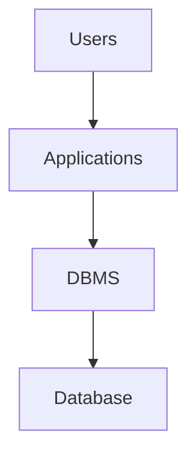

<!-- Chapter edit: improved structure, readability, callouts, and build hygiene. Technical meaning preserved. -->

# Chapter 4: Introduction to Databases

*From Spreadsheets to Structured Systems*

[Video intro: Chapter 4, Introduction to Databases](https://youtu.be/Pge4HSn5LIk)

<iframe width="560" height="315" src="https://www.youtube.com/embed/Pge4HSn5LIk?si=L4L6eSA7uN-_0Ao2" title="YouTube video player" frameborder="0" allow="accelerometer; autoplay; clipboard-write; encrypted-media; gyroscope; picture-in-picture; web-share" referrerpolicy="strict-origin-when-cross-origin" allowfullscreen></iframe>

*Video Overview: A short introduction to Chapter 4. We explore why flat files and spreadsheets fail as organizational data grows, and how a Database Management System (DBMS) steps in to provide a single, reliable source of truth.*


*Figure 4.1 — Lecture slide introducing how technology structures business processes and information flows.*

Chapter 3 explained what data is, how it gains meaning, and why structure matters. Chapter 4 asks the next question: **where does that data live, and how do organizations work with it reliably?**

The answer is the **database**. You use databases every day when you check a bank balance, order food, register for a class, stream a playlist, or look up an online order. In each case, a database stores records and returns the right information at the right time.

A database is more than storage. It is a structured environment that helps organizations preserve, retrieve, protect, and use data consistently. Reports, dashboards, apps, and analytics all depend on data that people and systems can trust.


*Figure 4.2 — Lecture slide reviewing qualitative, quantitative, categorical, and numerical data.*


*Figure 4.3 — Knowledge check connecting Chapter 3 data structures to Chapter 4 database concepts.*

In **Lab 03** you felt the problem firsthand. A flat PetVax appointment sheet held useful data, but it struggled with repeated owner information, two pets named Coco, co-ownership, fragile `FILTER()` ranges, and update, insertion, and deletion anomalies. Chapter 4 explains the database structures that solve those problems.

After completing this chapter, you will be able to:

1. Define what a database is and explain how it differs from files and spreadsheets.
2. Distinguish among a database, a DBMS, and a complete database system.
3. Explain why spreadsheets and traditional file environments create redundancy, inconsistency, and program-data dependence.
4. Describe how the database approach supports shared access, data independence, and a centralized source of truth.
5. Identify the basic parts of relational tables, including rows, columns, primary keys, foreign keys, and integrity constraints.
6. Recognize how SQL works as the shared language of relational systems.
7. Compare Microsoft Access, SQLite, and PostgreSQL/Supabase at a high level.


*Figure 4.4 — Learning path from data structures and file limits to SQL queries.*


*Figure 4.5 — Raw records become useful when a database organizes them for queries, reports, and decisions.*


*Figure 4.6 — Roadmap tracking the transition from Chapter 3's data fundamentals to Chapter 4's database structures and Chapter 5's queries.*


*Figure 4.7 — Concept map illustrating how day-to-day user interactions link to underlying database structures.*

<!-- PAGE BREAK -->
<div style="page-break-after: always;"></div>

## Core Concepts

<p align="center">
  
</p>

<p align="center"><em>Core Concepts introduces the main ideas, examples, and diagrams that explain how databases create reliable structure for organizational data.</em></p>

## Why Databases Matter

Nearly everything modern organizations do with information depends on databases. A customer portal, retail checkout system, payroll application, student record system, and streaming recommendation engine all rely on stored data that is organized well enough to support reliable retrieval and decision-making.

Think about a point-of-sale system in a retail store. The cashier sees a simple screen. Under that screen, a database keeps product, price, tax, inventory, and transaction data consistent enough for the business to operate. If the database is unreliable, the visible system may still look polished, but the company will struggle with incorrect prices, wrong inventory counts, and misleading reports.

The same logic applies to the Grading Database used in this book and to the PetVax veterinary clinic you started in Lab 03. At first, student grades or pet appointments can be tracked in a spreadsheet. But once those records need to be reused, validated, queried, shared, and reported, the structure must become more disciplined. That is the point where databases become necessary.

Databases matter because they turn scattered records into shared organizational infrastructure.

| Capability | Why It Matters |
| --- | --- |
| **Centralized source of truth** | Everyone works from the same official data rather than competing copies. |
| **Reduced redundancy** | Important facts are stored once and referenced where needed. |
| **Improved accuracy** | Rules and constraints prevent many bad values from entering the system. |
| **Historical analysis** | Stored records allow organizations to study patterns over time. |
| **Timely access** | Users and applications can retrieve current information when decisions need to be made. |
| **Shared governance** | Ownership, access, and quality rules can be managed more consistently. |

These strengths connect directly to the R.E.A.D. framework from earlier in the book: databases represent data in structured form, make it expressible through reports and queries, associate related records, and support deployment when trustworthy information leads to action.


*Audio: Connecting Database Design to Business Decisions - A discussion on why structural database design rules directly affect organizational performance.*

*Audio summary: In this brief discussion, we examine the direct link between database structural integrity and business performance. Design rules such as primary keys, foreign keys, and unique constraints prevent operational chaos and keep reports, dashboards, and decisions built on verifiable truth.*

<div class="callout key-takeaway">
  <p><strong>🔑 Key Takeaway: Databases are organizational infrastructure</strong></p>
  <p>Databases help organizations improve coordination, accountability, and business performance.</p>
</div>


*Figure 4.8 — One shared database supports multiple users, outputs, and decisions across the organization.*


*Figure 4.9 — Hub-and-spoke view of a centralized database driving business operations across different organizational roles.*


*Figure 4.10 — One transaction coordinating inventory, sales, and loyalty updates.*

<!-- PAGE BREAK -->
<div style="page-break-after: always;"></div>

## What a Database and DBMS Are

A database is a structured collection of related data designed for reliable storage, retrieval, and management. In business settings, it serves as the official record of activity. It stores facts about customers, products, transactions, students, grades, employees, inventory, and operations in a form that can be reused and trusted over time.

Students often use the words database, DBMS, and **database system** as if they mean the same thing. They do not.

| Term | Meaning | Grading Example | PetVax Example |
| --- | --- | --- | --- |
| **Database** | The structured collection of related data and metadata | The Grading tables, relationships, and rules | The pet, owner, appointment, and vaccine tables |
| **DBMS** | The software engine that creates, manages, queries, secures, and administers databases | Access, SQLite, PostgreSQL | Access managing the PetVax tables |
| **Database system** | The full arrangement of users, applications, DBMS, and database | A grade-entry form connected to Access tables through the Access DBMS | An appointment form used by clinic staff, the Access DBMS, and the PetVax reports |

A simple distinction helps: the database holds records according to rules, the DBMS manages and protects those records, and the database system includes the people and applications that use them.

Database systems also separate **data storage** from **data processing**. Storage preserves organized records over time. Processing retrieves, filters, summarizes, or updates those records. When storage is stable, many analyses can run without damaging the underlying data.

The database approach also separates the **logical view** from the **physical view**. The logical view is what users see: tables, columns, relationships, and query results. The physical view is how the DBMS stores and optimizes the data behind the scenes. This gives users **data independence**.

For example, a DBMS might add an **index** so grade lookups run faster. The professor still sees the same `STUDENT` and `STUDENT_GRADE` tables, and the grade-entry form does not need to be rewritten. The storage strategy changed, but the user's logical view stayed stable.




*Figure 4.11 — Users, applications, the DBMS, and the database shown as a layered system.*

When a professor enters a quiz score through a form, several layers work together. The **database application** captures the input. The DBMS checks that the student exists and that the score is valid. The database stores the result according to its rules. The professor sees one screen, but the system is doing more than file storage.

<div class="callout good-practice">
  <p><strong>✅ Good Practice: Diagnose by layer</strong></p>
  <p>When diagnosing a data problem, ask which layer is failing: the stored structure, DBMS settings, application interface, or human process.</p>
</div>


*Figure 4.12 — A quiz score moving from form entry to DBMS validation and storage.*


*Figure 4.13 — Logical tables and fields separated from physical storage and indexes.*

<!-- PAGE BREAK -->
<div style="page-break-after: always;"></div>

## Why Spreadsheets and File Systems Break Down


*Figure 4.14 — High-level contrast between flexible spreadsheet sheets and structured database tables.*

### From Spreadsheets to File Silos

Spreadsheets are useful. They are flexible, visual, and easy to start with. For quick calculations, small local datasets, and early exploration, they are often the right first tools.


*Figure 4.15 — Common structural failures in multi-theme spreadsheet files compared to relational structures.*


*Figure 4.16 — Inconsistencies and redundancies when customer records are scattered across billing, sales, and support files.*

But spreadsheets are not databases. A spreadsheet behaves like a flexible grid where users can often type almost anything into almost any cell. That flexibility helps at first, but it also means the system may not enforce what a column means, what type of value belongs there, or how one sheet relates to another.

Imagine tracking the Grading Database in one spreadsheet. Every row contains a student's name, email, deliverable type, deliverable number, due date, and score. For 30 students and 20 deliverables, the same student name and email may repeat hundreds of times. If one email changes, every copy must be updated. Miss one, and the spreadsheet now contains conflicting versions of the truth.

That problem grows in the traditional **file environment**. Before databases became standard, organizations often stored data in separate departmental files: billing, sales, support, and more. Each file may contain part of the same customer record, but not the same version.

The classic problems of the file environment are straightforward:

| Problem | What It Means | Business Result |
| --- | --- | --- |
| **Redundancy** | The same fact is stored in many places | Waste and repeated updates |
| **Inconsistency** | Different copies stop matching | Conflicting reports and bad decisions |
| **Program-data dependence** | Programs are tightly tied to file structure | Small file changes break reports and apps |
| **Low flexibility** | It is hard to combine data across sources | Slow, fragile analysis |
| **Weak control** | Rules and access are often informal | More errors and less trust |

Spreadsheets also struggle with modification anomalies when too many facts are mixed into one flat table.

| Anomaly | What Happens | Grading Example |
| --- | --- | --- |
| **Insertion anomaly** | You cannot add one kind of fact without another | A new deliverable cannot be recorded cleanly until a student has a score |
| **Update anomaly** | One fact must be changed in many rows | A student's email must be updated everywhere it appears |
| **Deletion anomaly** | Removing one row removes another fact too | Deleting the last score for a deliverable erases evidence that the deliverable existed |

### Anomalies in Flat Tables

Spreadsheet users often try to avoid these problems with lookup formulas such as `VLOOKUP` or `XLOOKUP`. Those tools can help, but they are still workarounds. They do not create enforced relationships, shared integrity rules, or real centralized storage.

You met every one of these problems in Lab 03. The table below ties what you felt in the PetVax sheet back to the formal database concepts in this chapter.


*Figure 4.17 — Insertion, update, and deletion anomalies in a single flat table.*

| Lab 03 problem | Database concept |
| --- | --- |
| Sarah Perry's email changed in one row only | Update anomaly |
| Rex could not be stored cleanly without an appointment | Insertion anomaly |
| Deleting Angel's appointment erased evidence Angel existed | Deletion anomaly |
| A fixed `FILTER()` range missed newly added rows | Query fragility |
| Two pets named Charlie or Coco could not be told apart | Need for stable identifiers (primary keys) |
| One pet (Coco) had two owners | Need for related tables and a link table |


*Figure 4.18 — File silos compared with the centralized database approach.*

<div class="callout warning">
  <p><strong>⚠️ Warning: Neat-looking does not mean reliable</strong></p>
  <p>A spreadsheet may look neat while quietly allowing inconsistent dates, duplicate records, missing values, and fragile relationships.</p>
</div>

<!-- PAGE BREAK -->
<div style="page-break-after: always;"></div>

## The Database Approach

The **database approach** answers these problems by storing related facts in structured tables, documenting the structure with metadata, using keys to identify and connect records, and enforcing rules through the DBMS.


*Figure 4.19 — How moving customer and order subjects to independent tables eliminates redundancy.*


*Figure 4.20 — Flow diagram demonstrating data integration through metadata, keys, constraints, and shared queries.*


*Figure 4.21 — The data hierarchy, showing how bits build fields, fields build records, and records build tables in a database.*

The contrast is sharp when you place the two approaches side by side.

| Spreadsheet or flat file | Database approach |
| --- | --- |
| One big sheet mixes many subjects | Separate tables store different subjects |
| Repeated facts are typed many times | Shared facts are stored once and referenced |
| Formulas simulate connections between sheets | Keys define real relationships between tables |
| Users manually try to avoid errors | Constraints enforce many rules automatically |
| Queries depend on fragile ranges | Queries use table and field names |
| One file may become many conflicting copies | One database can serve as a shared source of truth |

You do not need to know how to design tables yet. The point for now is that the database approach is a different way of thinking about data, not just a fancier spreadsheet. The rest of this chapter unpacks the pieces that make it work.

<!-- PAGE BREAK -->
<div style="page-break-after: always;"></div>

## Tables, Keys, and Constraints

### Rows, Columns, and Table Rules

At the heart of a relational database is the **relational table**. A table stores data about one subject in a clear and consistent way. Rows, also called records, represent individual instances. Columns, also called fields or attributes, represent characteristics of those instances. Each cell contains one value for one attribute of one record.


*Figure 4.22 — Structure of a relational table, highlighting columns (attributes), rows (records), and cells.*


*Figure 4.23 — Disciplined single-theme table compared with a mixed table.*

Here is a simple `STUDENT` table:

| StudentID | FirstName | LastName | Email | Birthday |
| --- | --- | --- | --- | --- |
| 1001 | Maria | Santos | `msantos@albany.edu` | 2003-05-14 |
| 1002 | James | Chen | `jchen@albany.edu` | 2002-11-22 |
| 1003 | Aisha | Rahman | `arahman@albany.edu` | 2004-01-08 |

Each row represents one student. Each column has one clear meaning. The table works well because the structure is disciplined.

Relational tables follow a few core rules:

| Rule | Why It Matters |
| --- | --- |
| **Each table has a unique name** | Queries and documentation can refer to it without ambiguity |
| **Each row represents one instance of one entity** | Student facts do not get mixed with deliverable facts |
| **No two rows are identical** | The database can distinguish one record from another |
| **Each cell contains one atomic value** | Filtering, sorting, and aggregation stay possible |
| **Each column has one clear meaning** | Users and systems interpret values consistently |
| **Values in a column follow a consistent type** | Dates behave like dates, numbers like numbers, text like text |
| **Rows must be uniquely identifiable** | A specific record can be found and referenced reliably |
| **Row and column order do not create meaning** | Data is retrieved by names and values, not by position |

When database designers document a table, they often use a compact schema notation:

```text
STUDENT(StudentID, FirstName, LastName, Email, Birthday)
```

The table name is usually written in all caps, and column names appear inside parentheses. The notation is simple, but the rule behind it matters: a table should have one clear subject, clearly named attributes, and a reliable way to identify each row.

<!-- PAGE BREAK -->
<div style="page-break-after: always;"></div>

### Primary and Foreign Keys

Keys make this structure usable. A key is one or more columns used to identify a row. A **primary key** is the key chosen as the official unique identifier for a table. It uniquely identifies each row and can never be `NULL`. A **foreign key** is a column in one table that references the primary key of another table.

Primary keys solve a practical business problem: names are not unique, emails change, and descriptive fields can be duplicated. A well-designed database should not depend on a student's name to identify that student. It should use a stable identifier such as `StudentID`. The same logic applies to PetVax. `PetName = Coco` is not enough, because two pets can share a name and one pet can have two owners. A stable `PetID` identifies the pet, and a separate link table can connect a pet to more than one owner.


*Figure 4.24 — Nominal values are labels with no ranking, such as major or ID.*


*Figure 4.25 — How primary and foreign keys connect STUDENT and STUDENT_GRADE tables.*


*Figure 4.26 — Terminology map for candidate, primary, composite, natural, and surrogate keys.*

In the Grading Database, `STUDENT.StudentID` is a primary key. `STUDENT_GRADE.StudentID` is a foreign key that references it. That design lets student information be stored once while still linking each grade to the correct student.

Those links also make SQL joins possible. In Chapter 5, you will join `STUDENT` to `STUDENT_GRADE` yourself and see how SQL uses matching key values to reconnect facts that were stored in separate tables. Without keys, the database would have no reliable way to know which grade belongs to which student.

For now, focus on **primary keys** and **foreign keys**. Chapter 6 will go deeper into candidate, composite, natural, and surrogate keys. The practical rule for this chapter is simple: use a stable value to identify each row, then use matching key values to connect related rows.

Surrogate keys, such as an auto-numbered `StudentID` or `GradeID`, are common because they are stable and short. Natural keys can work when the real-world value is controlled, but names, emails, and addresses often change.


*Figure 4.27 — Ordinal values are ranked labels, such as class standing or course level.*

<div class="callout good-practice">
  <p><strong>✅ Good Practice: Identify rows with stable keys</strong></p>
  <p>Names, emails, and addresses are useful attributes, but they often change. Use stable identifiers for primary keys.</p>
</div>

The same idea shows up clearly in PetVax.

<div class="callout example">
  <p><strong>🧪 Example: Why PetName is not enough</strong></p>
  <p>In PetVax, two pets named Coco may visit the clinic, and one pet may have two owners. A stable <code>PetID</code> keeps each pet distinct and prepares the data for relationships you will build later.</p>
</div>

<!-- PAGE BREAK -->
<div style="page-break-after: always;"></div>

### Constraints That Protect Data

**Constraints** add another layer of protection. They are rules enforced by the DBMS. Some constraints protect identity. Some protect relationships. Others protect the values that may be entered into a field.


*Figure 4.28 — Constraint rules (NOT NULL, UNIQUE, CHECK, FOREIGN KEY) serving as structural filters for database input.*


*Figure 4.29 — Data quality dimensions protected by database constraints.*

| Constraint | What It Protects |
| --- | --- |
| **`NOT NULL`** | Requires a value |
| **`UNIQUE`** | Prevents duplicates in a field that should stay unique |
| **`PRIMARY KEY`** | Ensures unique, non-null row identity |
| **`FOREIGN KEY`** | Preserves valid relationships across tables |
| **`CHECK`** | Restricts values to an allowed range or rule |

For example, `CHECK (Score BETWEEN 0 AND 100)` prevents impossible scores. A foreign key prevents a grade from referring to a missing student. `NOT NULL` can require an essential email address, score, or due date.

Different platforms expose these ideas differently. SQLite and PostgreSQL write constraints directly in SQL. Microsoft Access uses table design settings such as required fields, **validation rules**, indexes, and the Relationships window. The vocabulary differs, but the protection is similar.

A short SQLite-style table definition shows what these constraints look like in code:

```sql
CREATE TABLE STUDENT (
    StudentID INTEGER PRIMARY KEY,
    Email     TEXT    NOT NULL UNIQUE
);

CREATE TABLE STUDENT_GRADE (
    GradeID    INTEGER PRIMARY KEY,
    StudentID  INTEGER NOT NULL REFERENCES STUDENT(StudentID),
    Score      NUMERIC CHECK (Score BETWEEN 0 AND 100)
);
```

You do not need to write SQL like this yet. Notice only that the code includes the same rules from the constraints table: `PRIMARY KEY`, `NOT NULL`, `UNIQUE`, `REFERENCES`, and `CHECK`.

These rules are part of the database's **metadata**: data about the database itself. A **data dictionary** collects table names, column names, data types, keys, relationships, and constraints in a form people can read.

| Table | Column | Type | Key | Rule |
| --- | --- | --- | --- | --- |
| `STUDENT` | `StudentID` | INTEGER | Primary | Not null, unique |
| `STUDENT` | `Email` | TEXT | None | Not null, unique |
| `STUDENT_GRADE` | `StudentID` | INTEGER | Foreign → `STUDENT` | Must match a real `StudentID` |
| `STUDENT_GRADE` | `Score` | NUMERIC | None | Between 0 and 100 |

The DBMS uses this structural information to reject many bad values before they distort a report, dashboard, or decision.

This chapter keeps keys and constraints introductory. For now, the main idea is simple: tables create structure, keys create identity and connection, constraints protect data quality, and metadata explains the rules the database is using.

You will use this structure directly in Chapter 5 when SQL starts working against real tables. Chapter 6 will return to relationship design in more depth.


*Figure 4.30 — A relational table shown with labeled columns, sample rows, and a clearly marked primary key.*

<!-- PAGE BREAK -->
<div style="page-break-after: always;"></div>

## SQL and Platforms as the Next Step

SQL, or Structured Query Language, is the standard language used to work with relational databases. SQL matters because it gives users and applications a consistent way to retrieve, filter, update, and summarize structured data.


*Figure 4.31 — SQL translating a user's question into table, field, and condition logic.*


*Figure 4.32 — Architectural spectrum contrasting lightweight, local file-based systems (Access, SQLite) with multi-user server databases (PostgreSQL).*

At this stage, the goal is recognition, not deep SQL fluency. SQL is declarative: users state what result they want and let the DBMS decide how to retrieve it. Chapter 5 will build this skill directly.

The same SQL logic works across many platforms because the relational structure is shared. A query that asks, "Which students scored above 90 on the midterm?" depends on tables, columns, keys, and conditions. The screen may look different in Access, SQLite, or Supabase, but the reasoning stays the same.

This course uses three platforms because each teaches a different part of database work.

| Platform | Best For | What It Helps Students See |
| --- | --- | --- |
| **Microsoft Access** | Visual learning and small local databases | Tables, relationships, forms, and reports in one environment |
| **SQLite** | Lightweight SQL practice | Portable, file-based database behavior with little setup |
| **PostgreSQL / Supabase** | Shared and production-style systems | Strong typing, multi-user access, and server-based workflows |


*Figure 4.33 — Core visual components of the Microsoft Access desktop DBMS: tables, queries, forms, and reports.*

The most useful architectural contrast is between local file-based databases and server-based databases. Access and SQLite are local or file-based tools. PostgreSQL is server-based. Local tools are easier to start with. Server systems are better when many users, applications, and services connect at the same time because the DBMS manages **concurrency**: rules that keep data consistent when users read or update records at once.

One final preview matters here. Early database work sometimes uses one big table because it keeps rows and columns visible. That simplicity can help students learn, but one big table becomes fragile when it repeats facts and mixes too many themes. Later chapters will show how related tables solve that problem.

<div class="callout warning">
  <p><strong>⚠️ Warning: Valid SQL can still produce weak insight</strong></p>
  <p>SQL syntax can be correct while the business meaning is wrong. A system may let you average an ID field, but an identifier is not a meaningful measurement.</p>
</div>


*Figure 4.34 — Data types and measurement scales mapped to analytical use.*


*Figure 4.35 — Transition from qualitative properties to measurable numbers.*


*Figure 4.36 — Qualitative attributes compared with quantitative measurements.*


*Figure 4.37 — Qualities and numeric scale values as different forms of measurement.*


*Figure 4.38 — Categorical classes compared with numerical scale values.*


*Figure 4.39 — Categorical values can use numbers without becoming measurements.*


*Figure 4.40 — Interval data has equal differences but no absolute zero.*


*Figure 4.41 — Ratio data has equal intervals and a true zero point.*


*Figure 4.42 — NOIR summary matrix for query and analysis choices.*


*Figure 4.43 — Access, SQLite, and PostgreSQL shown along a spectrum of database environments.*

<!-- PAGE BREAK -->
<div style="page-break-after: always;"></div>

## Summary

Chapter 4 introduced databases as the structural foundation of reliable information systems. It showed why spreadsheets and file-based environments become fragile as data grows in importance, reuse, and scale.

The chapter then explained the database approach. A database is the structured collection of related data. A DBMS is the software engine that manages it. A full database system also includes users and applications. Together, these layers help organizations store data once, reuse it widely, and protect it with shared rules.

You also learned the basic structure of relational tables. Rows represent records. Columns represent attributes. Primary keys identify rows. Foreign keys connect tables. Constraints such as `NOT NULL`, `UNIQUE`, `PRIMARY KEY`, `FOREIGN KEY`, and `CHECK` help preserve trustworthy data.

Finally, the chapter introduced SQL and the three course platforms at a high level. That work prepares you for Chapter 5 SQL and Chapter 6 relationship design.

You are now ready to talk about data using the right vocabulary, recognize when a spreadsheet has outgrown its role, and read a simple table definition with a clear sense of what each rule is protecting. Keep one idea above all the others as you move on:

<div class="callout key-takeaway">
  <p><strong>🔑 Key Takeaway: A database is not just a better spreadsheet</strong></p>
  <p>A database is a structured system for storing related data reliably, protecting it with rules, and making it reusable across questions, reports, applications, and decisions.</p>
</div>


*Figure 4.44 — Databases, tables, SQL, and platforms brought together in one closing recap image.*


*Figure 4.45 — Conceptual pathway from file system limitations to database tables, keys, constraints, and SQL.*


*Figure 4.46 — In-class review on data types, structure, and concept translation.*

<!-- PAGE BREAK -->
<div style="page-break-after: always;"></div>

**Further Reading**

Connolly, T., & Begg, C. (2015). *Database systems: A practical approach to design, implementation, and management* (6th ed.). Pearson.

Date, C. J. (2004). *An introduction to database systems* (8th ed.). Pearson/Addison Wesley.

Davenport, T. H., & Harris, J. G. (2017). *Competing on analytics: The new science of winning* (Updated ed.). Harvard Business Review Press.

Elmasri, R., & Navathe, S. B. (2016). *Fundamentals of database systems* (7th ed.). Pearson.

Hoffer, J. A., Venkataraman, R., & Topi, H. (2019). *Modern database management* (13th ed.). Pearson.

Laudon, K. C., & Laudon, J. P. (2024). *Management information systems: Managing the digital firm* (18th ed.). Pearson.

## Figures Index

| Figure | Section | Caption | Source file |
|---|---|---|---|
| Figure 4.1 | Introduction | Lecture slide introducing how technology structures business processes and information flows. | `ch04-001.png` |
| Figure 4.2 | Introduction | Lecture slide reviewing qualitative, quantitative, categorical, and numerical data. | `ch04-004.png` |
| Figure 4.3 | Introduction | Knowledge check connecting Chapter 3 data structures to Chapter 4 database concepts. | `ch04-003.png` |
| Figure 4.4 | Introduction | Learning path from data structures and file limits to SQL queries. | `ch04-002.png` |
| Figure 4.5 | Introduction | Raw records become useful when a database organizes them for queries, reports, and decisions. | `ch04-database-intro.png` |
| Figure 4.6 | Introduction | Roadmap tracking the transition from Chapter 3's data fundamentals to Chapter 4's database structures and Chapter 5's queries. | `ch04-40b-chapter-roadmapcreate-a-textboo.png` |
| Figure 4.7 | Introduction | Concept map illustrating how day-to-day user interactions link to underlying database structures. | `ch04-chapter-4-concept-mapcreate-a-cl.png` |
| Figure 4.8 | Why Databases Matter | One shared database supports multiple users, outputs, and decisions across the organization. | `ch04-41a-one-shared-database-multiple-outp.png` |
| Figure 4.9 | Why Databases Matter | Hub-and-spoke view of a centralized database driving business operations across different organizational roles. | `ch04-datbase-in-center.png` |
| Figure 4.10 | Why Databases Matter | One transaction coordinating inventory, sales, and loyalty updates. | `ch04-datamanagement-lifecyclecreate.png` |
| Figure 4.11 | What a Database and DBMS Are | Users, applications, the DBMS, and the database shown as a layered system. | `ch04-43b-database-system-layerscreate-a.png` |
| Figure 4.12 | What a Database and DBMS Are | A quiz score moving from form entry to DBMS validation and storage. | `ch04-grading-database-preview.png` |
| Figure 4.13 | What a Database and DBMS Are | Logical tables and fields separated from physical storage and indexes. | `ch04-logical-vs-physical-views-of-data.png` |
| Figure 4.14 | Why Spreadsheets and File Systems Break Down | High-level contrast between flexible spreadsheet sheets and structured database tables. | `ch04-spreadsheet-vs-database-strengths.png` |
| Figure 4.15 | From Spreadsheets to File Silos | Common structural failures in multi-theme spreadsheet files compared to relational structures. | `ch04-spreadsheet-vs-database-detailed.png` |
| Figure 4.16 | From Spreadsheets to File Silos | Inconsistencies and redundancies when customer records are scattered across billing, sales, and support files. | `ch04-database-vs-filesystem.png` |
| Figure 4.17 | Anomalies in Flat Tables | Insertion, update, and deletion anomalies in a single flat table. | `ch04-one-big-table-vs-related-tablesc.png` |
| Figure 4.18 | Anomalies in Flat Tables | File silos compared with the centralized database approach. | `ch04-file-vs-db.png` |
| Figure 4.19 | The Database Approach | How moving customer and order subjects to independent tables eliminates redundancy. | `ch04-users-to-tables.png` |
| Figure 4.20 | The Database Approach | Flow diagram demonstrating data integration through metadata, keys, constraints, and shared queries. | `ch04-data-flow.png` |
| Figure 4.21 | The Database Approach | The data hierarchy, showing how bits build fields, fields build records, and records build tables in a database. | `ch04-data-hierarchy.png` |
| Figure 4.22 | Rows, Columns, and Table Rules | Structure of a relational table, highlighting columns (attributes), rows (records), and cells. | `ch04-anatomy-of-a-relational-tablecre.png` |
| Figure 4.23 | Rows, Columns, and Table Rules | Disciplined single-theme table compared with a mixed table. | `ch04-normalization.png` |
| Figure 4.24 | Primary and Foreign Keys | Nominal values are labels with no ranking, such as major or ID. | `ch04-010.png` |
| Figure 4.25 | Primary and Foreign Keys | How primary and foreign keys connect STUDENT and STUDENT_GRADE tables. | `ch04-sql-relationships.png` |
| Figure 4.26 | Primary and Foreign Keys | Terminology map for candidate, primary, composite, natural, and surrogate keys. | `ch04-keys.png` |
| Figure 4.27 | Primary and Foreign Keys | Ordinal values are ranked labels, such as class standing or course level. | `ch04-011.png` |
| Figure 4.28 | Constraints That Protect Data | Constraint rules (NOT NULL, UNIQUE, CHECK, FOREIGN KEY) serving as structural filters for database input. | `ch04-constraint-enforcementcreate-a-s.png` |
| Figure 4.29 | Constraints That Protect Data | Data quality dimensions protected by database constraints. | `ch04-data-quality-dimensions.png` |
| Figure 4.30 | Constraints That Protect Data | A relational table shown with labeled columns, sample rows, and a clearly marked primary key. | `ch04-database-schema.png` |
| Figure 4.31 | SQL and Platforms as the Next Step | SQL translating a user's question into table, field, and condition logic. | `ch04-sqlquestions.png` |
| Figure 4.32 | SQL and Platforms as the Next Step | Architectural spectrum contrasting lightweight, local file-based systems (Access, SQLite) with multi-user server databases (PostgreSQL). | `ch04-local-vs-server.png` |
| Figure 4.33 | SQL and Platforms as the Next Step | Core visual components of the Microsoft Access desktop DBMS: tables, queries, forms, and reports. | `ch04-ms-access-objects.png` |
| Figure 4.34 | SQL and Platforms as the Next Step | Data types and measurement scales mapped to analytical use. | `ch04-data-types-analytical-uses.png` |
| Figure 4.35 | SQL and Platforms as the Next Step | Transition from qualitative properties to measurable numbers. | `ch04-005.png` |
| Figure 4.36 | SQL and Platforms as the Next Step | Qualitative attributes compared with quantitative measurements. | `ch04-006.png` |
| Figure 4.37 | SQL and Platforms as the Next Step | Qualities and numeric scale values as different forms of measurement. | `ch04-007.png` |
| Figure 4.38 | SQL and Platforms as the Next Step | Categorical classes compared with numerical scale values. | `ch04-008.png` |
| Figure 4.39 | SQL and Platforms as the Next Step | Categorical values can use numbers without becoming measurements. | `ch04-009.png` |
| Figure 4.40 | SQL and Platforms as the Next Step | Interval data has equal differences but no absolute zero. | `ch04-012.png` |
| Figure 4.41 | SQL and Platforms as the Next Step | Ratio data has equal intervals and a true zero point. | `ch04-013.png` |
| Figure 4.42 | SQL and Platforms as the Next Step | NOIR summary matrix for query and analysis choices. | `ch04-014.png` |
| Figure 4.43 | SQL and Platforms as the Next Step | Access, SQLite, and PostgreSQL shown along a spectrum of database environments. | `ch04-dbms-compare.png` |
| Figure 4.44 | Summary | Databases, tables, SQL, and platforms brought together in one closing recap image. | `ch04-summary.png` |
| Figure 4.45 | Summary | Conceptual pathway from file system limitations to database tables, keys, constraints, and SQL. | `ch04-learning-map.png` |
| Figure 4.46 | Summary | In-class review on data types, structure, and concept translation. | `ch04-015.png` |
