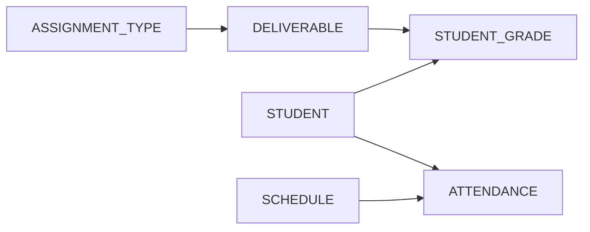
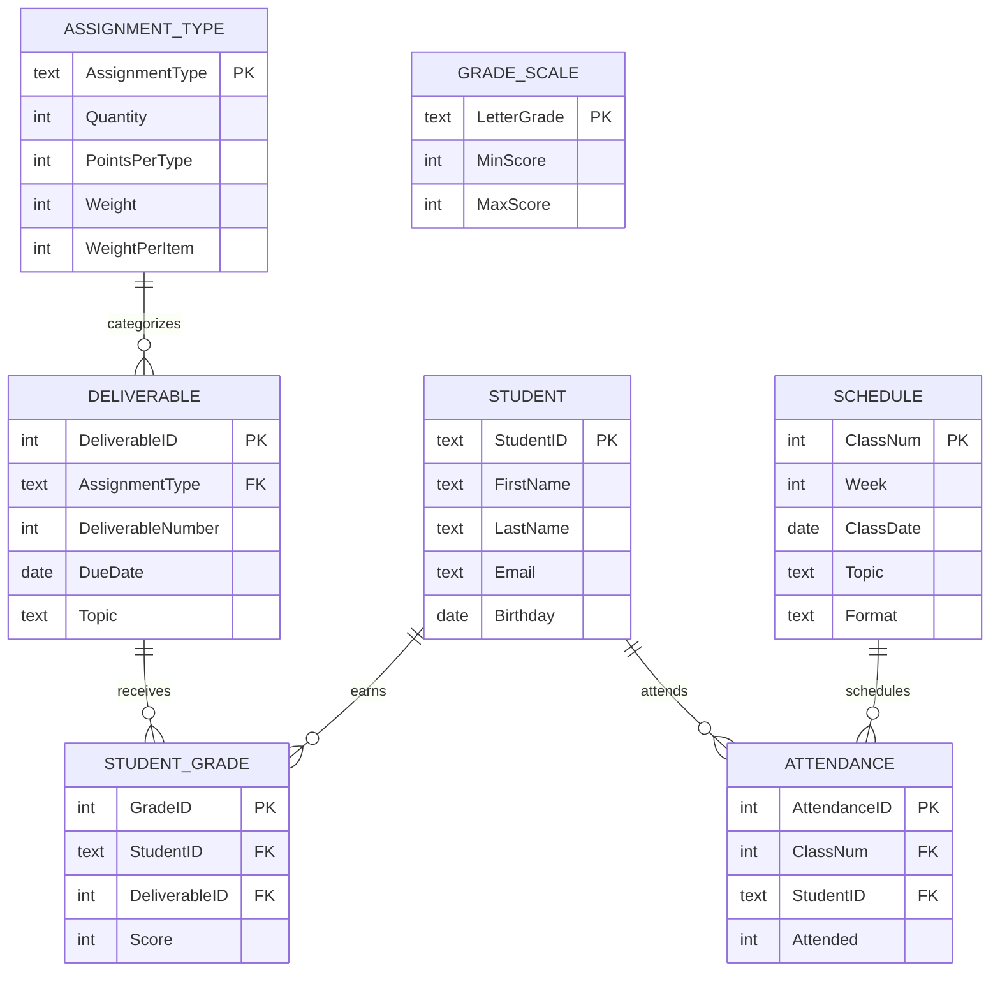

<!-- This text explains the **relational model**, a fundamental framework for organizing database data into distinct, connected tables rather than single, flat files. By separating different subjects into their own tables, designers can avoid **redundancy** and prevent **modification anomalies** that occur when data is updated, inserted, or deleted. The author details how **primary keys** provide unique identities for records, while **foreign keys** establish relationships between entities like students and grades. **Entity and referential integrity** serve as essential rules that protect the accuracy of these connections over time. Through a practical redesign of a **grading database**, the source demonstrates how **SQL joins** efficiently reconstruct information for analysis. Ultimately, the material serves as a guide for transitioning from fragile spreadsheets to **scalable, structured database systems**. -->
<!-- metadata: date="2026-05-29" -->

<!-- Chapter edit (2026-05-29): received the full joins treatment from Chapter 5 (Ch5 now keeps only a brief INNER JOIN teaser). Added a "Reading a Join" four-question lead-in before §8.1 and a "Join Types at a Glance" recognition table (INNER/LEFT/RIGHT/FULL/CROSS) at the end of §8, both adapted from Ch5's former Part 5 to the relational schema. The verbatim Ch5 Part 5 source is preserved in .edits/ch06-from-ch05-2026-05-29.md. Terms/glossary kept as-is for a later reconciliation pass. Technical meaning preserved. -->
<!-- Chapter edit: aligned dataset and cast with Ch04/05 (Alice/Brian/Carla/Daniel, S1001-style StudentID, 0–100 Score, locked weights 20/30/40/10, Score REAL); flat table shows both CategoryWeight and WeightPerItem; made Access tutorial fail-proof (text PK + integer FK); trimmed §10 to a sharper bridge; reframed §8.5 as Advanced Preview; routed appendices to terms/reflection companions via .edits. Technical meaning preserved. -->

<!-- markdownlint-disable MD036 -->

# Chapter 6: The Relational Model

*How Connected Tables Replace Redundancy with Structure, Integrity, and Analytical Power*

[Video intro: Chapter 6, The Relational Model](https://youtu.be/vWVWVtFS070)

<iframe width="560" height="315" src="https://www.youtube.com/embed/vWVWVtFS070?si=00FlymQi8mWqjCj6" title="YouTube video player" frameborder="0" allow="accelerometer; autoplay; clipboard-write; encrypted-media; gyroscope; picture-in-picture; web-share" referrerpolicy="strict-origin-when-cross-origin" allowfullscreen></iframe>

Chapter 4 introduced databases as structured systems for storing organizational data. Chapter 5 showed how SQL retrieves, filters, joins, and summarizes that data. Chapter 6 asks a deeper design question:

**Why should database data be separated into multiple connected tables in the first place?**

The answer is the **relational model**.

The relational model is the foundation of modern database design. It organizes data into separate tables, connects those tables through keys, and uses integrity rules to keep the connections valid over time. This chapter uses the Grading Database to show why one large table eventually breaks down and how relational design replaces repetition with structure.

A flat table feels easier at first. Everything appears in one place. You can scroll, filter, and sort. But once the table repeats student names, email addresses, assignment rules, due dates, attendance records, and scores, the design becomes fragile. The same fact appears in multiple places. Updates become risky. Deleted rows may remove facts that should have remained. New facts may be impossible to store without inventing unrelated data.

Relational design solves these problems by separating different kinds of facts into different tables and connecting them through shared identifiers. Instead of copying a student's name into every grade record, the database stores the student once in `STUDENT`. Grade records refer to that student by `StudentID`. Instead of repeating the rules for quizzes in every quiz row, the database stores the rules once in `ASSIGNMENT_TYPE`. Specific quizzes refer to that category.

This chapter details the **relational model** as the essential framework for creating organized and reliable database systems. It argues that **flat tables** are inherently flawed because they cause **redundancy**, leading to problematic update, insertion, and deletion **anomalies**. To resolve these issues, the model separates data into distinct **relations** connected by **primary and foreign keys**, ensuring each table represents a single subject. The source uses a grading database example to demonstrate how **entity and referential integrity** protect data accuracy and how **SQL joins** reconstruct information for analysis. Ultimately, these design principles, supported by an understanding of **functional dependencies**, establish the structural foundation necessary for advanced **database normalization**.

This design is cleaner, more reliable, more scalable, and easier to query.

## Learning Objectives

After completing this chapter, you will be able to:

1. Explain why a single-table design breaks down as data volume and business complexity grow.
2. Identify update, insertion, and deletion anomalies in a flat-table design.
3. Define the relational model and explain its core design logic.
4. Distinguish among entities, attributes, relationships, and relations.
5. Use relational terminology such as relation, tuple, and attribute correctly.
6. Distinguish among candidate, primary, composite, natural, and surrogate keys.
7. Explain how foreign keys represent one-to-one, one-to-many, and many-to-many relationships.
8. Explain entity integrity and referential integrity.
9. Trace the Grading Database from a flat table to a multi-table relational schema.
10. Use joins to reconstruct meaningful information from related tables.
11. Build the core of the Grading Database in Microsoft Access and enforce referential integrity.
12. Explain how functional dependencies prepare the way for normalization in Chapter 7.

## Chapter Roadmap

| Section | Main Question | Why It Matters |
|---|---|---|
| Why one table fails | What goes wrong when everything is stored together? | Introduces redundancy and modification anomalies. |
| Relational model basics | What does the relational model do differently? | Explains the logic of tables, rows, columns, and relationships. |
| Entities and relations | What real-world things are we modeling? | Connects business concepts to schema design. |
| Keys | How does each row get a stable identity? | Shows how records are uniquely identified. |
| Foreign keys and relationships | How do tables connect? | Explains one-to-many and many-to-many relationships. |
| Referential integrity | How does the database protect valid connections? | Prevents orphan records and invalid references. |
| Grading Database redesign | How does a flat gradebook become relational? | Applies the model to a concrete course database. |
| Joins and queries | How do separated tables become useful reports? | Shows why relational structure supports SQL analysis. |
| Access as a visual tool | How does this look in Microsoft Access? | Builds the design hands-on and makes integrity visible. |
| Functional dependencies | How do we know what belongs together? | Prepares the transition to normalization. |

---

## 1. Why One Big Table Fails

Relational thinking begins with a simple observation:

**Different kinds of data should not be forced into one table.**

Students are not assignments. Assignments are not attendance records. Assignment-type rules are not individual student scores. These things are related, but they are not the same thing.

A spreadsheet hides this distinction because it is easy to place many facts side by side in one row. That convenience is useful for quick work, but it creates structural problems when the file becomes an organizational record.

### 1.1 The Flat-Table Temptation

Imagine an instructor starts with one simple gradebook table:

```text
GRADE_FLAT(
    GradeID,
    StudentID,
    FirstName,
    LastName,
    Email,
    AssignmentType,
    DeliverableNumber,
    DueDate,
    CategoryWeight,
    WeightPerItem,
    Score
)
```

At first this seems reasonable. One row tells a complete story: a student completed a deliverable and received a score. Scores are stored on a 0–100 scale, matching the convention used in Chapters 4 and 5. The table records both `CategoryWeight` (how much the whole category counts — Quiz 20%, Exam 40%) and `WeightPerItem` (how much one specific deliverable counts — 5% for one quiz, 20% for one exam):

| GradeID | StudentID | FirstName | LastName | Email | AssignmentType | DeliverableNumber | DueDate | CategoryWeight | WeightPerItem | Score |
|---:|---|---|---|---|---|---:|---|---:|---:|---:|
| 1 | S1001 | Alice | Johnson | alice@university.edu | Quiz | 1 | 2026-09-10 | 20 | 5 | 90 |
| 2 | S1001 | Alice | Johnson | alice@university.edu | Quiz | 2 | 2026-09-17 | 20 | 5 | 95 |
| 3 | S1001 | Alice | Johnson | alice@university.edu | Exam | 1 | 2026-10-05 | 40 | 20 | 87 |
| 4 | S1002 | Brian | Lee | brian@university.edu | Quiz | 1 | 2026-09-10 | 20 | 5 | 75 |
| 5 | S1003 | Carla | Mendez | carla@university.edu | Exam | 1 | 2026-10-05 | 40 | 20 | 92 |

This table can answer simple questions, but it repeats the same facts many times. Alice's name and email appear in every row related to Alice. The quiz weight appears in every quiz row. Due dates repeat for every student who completed the same deliverable. The two weight columns repeat in every row of the same category. These repeated values are the first warning sign that the table is mixing different subjects.

:::callout{type="design-rule" title="🛠️ Database design rule: One table, one subject"}
Each table should describe one main subject. A `STUDENT` table describes students. A `DELIVERABLE` table describes assignments. A `STUDENT_GRADE` table connects students to scores. When one table tries to describe everything, no part of it stays clean.
:::

### 1.2 What the Flat Table Is Mixing

The `GRADE_FLAT` table stores at least four different categories of information.

| Category of information | Columns in the flat table | Better relational destination |
|---|---|---|
| Student identity | `StudentID`, `FirstName`, `LastName`, `Email` | `STUDENT` |
| Assignment category rules | `AssignmentType`, `CategoryWeight`, `WeightPerItem` | `ASSIGNMENT_TYPE` |
| Specific deliverables | `AssignmentType`, `DeliverableNumber`, `DueDate` | `DELIVERABLE` |
| Student performance | `StudentID`, deliverable, `Score` | `STUDENT_GRADE` |

A mixed-purpose table creates three common problems: update anomalies, insertion anomalies, and deletion anomalies.

### 1.3 Update Anomaly

An **update anomaly** occurs when the same fact appears in multiple rows and must be changed in multiple places.

Suppose Alice changes her email from `alice@university.edu` to `alice.johnson@albany.edu`. In the flat table, Alice appears in three rows. The instructor must update all three. If one row is missed, the database now stores two emails for the same student.

| GradeID | StudentID | FirstName | LastName | Email |
|---:|---|---|---|---|
| 1 | S1001 | Alice | Johnson | alice.johnson@albany.edu |
| 2 | S1001 | Alice | Johnson | alice@university.edu |
| 3 | S1001 | Alice | Johnson | alice.johnson@albany.edu |

The database now gives conflicting answers to a basic question. In a relational design, Alice's email lives once in `STUDENT`. One update covers every future query.

### 1.4 Insertion Anomaly

An **insertion anomaly** occurs when the database cannot store one fact unless another, unrelated fact is also available.

Suppose Daniel enrolls before completing any assignment. The flat table is built around grade events. There is no clean place to store Daniel unless the instructor invents a grade row with missing values:

| GradeID | StudentID | FirstName | LastName | Email | AssignmentType | DeliverableNumber | Score |
|---:|---|---|---|---|---|---:|---:|
| 8 | S1004 | Daniel | Kim | daniel@university.edu | NULL | NULL | NULL |

In a relational design, Daniel goes into `STUDENT` immediately, even if he has no rows yet in `STUDENT_GRADE`.

### 1.5 Deletion Anomaly

A **deletion anomaly** occurs when deleting one row unintentionally removes facts that should have remained.

Suppose Carla has only one row in the flat table. If that row is deleted because the score was entered by mistake, the database may also lose Carla's only stored name and email address. In a relational design, deleting a score from `STUDENT_GRADE` does not delete Carla from `STUDENT`. The two facts live in different tables because they describe different things.

### 1.6 Summary of Modification Anomalies

| Anomaly | What Happens | Grading Example | Relational Fix |
|---|---|---|---|
| Update | One fact must change in many rows | Alice's email repeats in every grade row | Store Alice once in `STUDENT` |
| Insertion | One fact cannot be added without another | Daniel cannot exist without a score | Add Daniel to `STUDENT` without grades |
| Deletion | Deleting one fact removes another | Deleting Carla's only score deletes Carla | Keep scores in `STUDENT_GRADE`, students in `STUDENT` |

:::callout{type="takeaway" title="💡 Key takeaway: Mixed tables become unreliable"}
A flat table looks simple because everything is visible at once. It becomes unreliable because it repeats facts, mixes subjects, and makes ordinary updates dangerous.
:::

<!-- 🎨 Figure Suggestions
Figure 1: A flat grading table with student identity, assignment rules, and scores color-coded to show the four mixed subjects.
-->

---

## 2. What the Relational Model Does Differently

The **relational model** was introduced by Edgar F. Codd in 1970 as a formal way to organize data into relations, which we usually call tables. It is the discipline behind the flat-table fix.

### 2.1 Definition

**The relational model** organizes data into tables called relations, where each relation represents one well-defined subject and relationships among subjects are represented through keys.

The model rests on three practical principles.

| Principle | Meaning | Grading Database Example |
|---|---|---|
| Store data in tables | Each table represents one subject | `STUDENT` stores student identity |
| One occurrence per row | Each row is one instance of that subject | One row in `STUDENT` = one student |
| Use keys instead of duplication | Related tables connect through identifiers | `STUDENT_GRADE.StudentID` refers to `STUDENT.StudentID` |

Instead of one large report-ready table, a relational database stores connected pieces. SQL joins reconstruct the view needed for any specific question.

### 2.2 The Relational Model Is Not a Software Product

The relational model is not Microsoft Access, SQLite, PostgreSQL, Oracle, or SQL Server. Those are database management systems that implement relational ideas. The same relational design can appear in any of them:

| Concept | Access | SQLite | PostgreSQL |
|---|---|---|---|
| Table | Table object | Table | Table |
| Primary key | Primary Key field | `PRIMARY KEY` | `PRIMARY KEY` |
| Foreign key | Relationship window | `FOREIGN KEY` | `FOREIGN KEY` |
| Query | Query Design or SQL View | SQL statement | SQL statement |

The interfaces differ. The relational logic stays the same.

### 2.3 Properties of a Formal Relation

Not every spreadsheet-like grid is a relation. A formal relation follows structural rules.

| Property | Meaning | Concrete Example |
|---|---|---|
| One subject | The table represents one clear subject | `STUDENT` stores student facts, not score facts |
| Rows are instances | Each row is one occurrence | One row = one student |
| Columns are attributes | Each column describes one property | `Email` describes a student's email |
| Atomic values | Each cell holds one indivisible value | Do not store `"Quiz 1, Quiz 2"` in one cell |
| Consistent domain | Values in a column are the same kind | `Score` stores numbers only |
| Unique column names | Each column has a distinct name | Avoid two columns named `Date` |
| Row order is irrelevant | Meaning does not depend on row position | Use `ORDER BY`, not row numbers |
| Column order is irrelevant | Meaning does not depend on column position | Queries refer to column names |
| No duplicate rows | Each row must be distinguishable | A primary key prevents duplicate identities |

### 2.4 Relational Vocabulary

| Everyday term | Relational term | Legacy file term | Meaning |
|---|---|---|---|
| Table | Relation | File | Collection of related rows |
| Row | Tuple | Record | One occurrence or instance |
| Column | Attribute | Field | One property or characteristic |
| Cell | Attribute value | Field value | One stored value |

This book usually uses *table*, *row*, and *column*. You should still recognize *relation*, *tuple*, and *attribute* because they appear in database theory and documentation.

### 2.5 Where This Chapter Is Going: The Seven-Table Schema

Before working through keys, relationships, and integrity, it helps to see where the chapter is heading. The redesigned Grading Database will use seven connected tables:

| Table | Purpose |
|---|---|
| `STUDENT` | Student identities and contact information |
| `ASSIGNMENT_TYPE` | Category-level grading rules (Quiz, Exam, etc.) |
| `DELIVERABLE` | Specific graded items (Quiz 1, Exam 1) |
| `STUDENT_GRADE` | One student's score on one deliverable |
| `SCHEDULE` | Class meetings |
| `ATTENDANCE` | Student attendance at class meetings |
| `GRADE_SCALE` | Letter-grade thresholds |



Keep this map in mind. Section 7 returns to it in full detail; the next several sections develop the vocabulary you need to read it.

<!-- 🎨 Figure Suggestions
Figure 1: A simple "before and after" pair: one wide flat table on the left, the seven connected Grading Database tables on the right linked by keys.
-->

---

## 3. Entities, Attributes, Relationships, and Relations

Relational design starts by identifying what the database needs to represent.

### 3.1 Entities

An **entity** is a real-world object, person, place, concept, or event the database needs to store information about.

| Entity | Why the database cares about it |
|---|---|
| Student | Students receive grades and attend class sessions |
| Deliverable | Deliverables are assignments students complete |
| Class meeting | Class meetings are sessions students may attend |
| Assignment type | Assignment types define grading rules |
| Grade scale | Grade scales convert final numeric results to letter grades |

Entities become tables when they need to be represented in the database.

### 3.2 Attributes

An **attribute** is a property that describes an entity.

```text
STUDENT     -> StudentID, FirstName, LastName, Email, Birthday
DELIVERABLE -> DeliverableID, AssignmentType, DeliverableNumber, DueDate, Topic
```

The important design question is not "What attributes exist?" but "Which entity does each attribute describe?"

- `Email` describes a student → `STUDENT`.
- `DueDate` describes a deliverable → `DELIVERABLE`.
- `Score` describes one student's result on one deliverable → `STUDENT_GRADE`.

### 3.3 Relationships

A **relationship** describes how entities are connected.

| Relationship | Plain-English meaning | Relational representation |
|---|---|---|
| Student earns grade | One student can receive many grades | `STUDENT.StudentID` → `STUDENT_GRADE.StudentID` |
| Deliverable receives scores | One deliverable has many scores | `DELIVERABLE.DeliverableID` → `STUDENT_GRADE.DeliverableID` |
| Student attends class | One student has many attendance rows | `STUDENT.StudentID` → `ATTENDANCE.StudentID` |
| Class meeting has attendance | One meeting has many attendance rows | `SCHEDULE.ClassNum` → `ATTENDANCE.ClassNum` |
| Assignment type categorizes deliverables | One type covers many deliverables | `ASSIGNMENT_TYPE.AssignmentType` → `DELIVERABLE.AssignmentType` |

Relationships are implemented with keys, especially foreign keys.

### 3.4 Relations

A **relation** is the formal table structure used to store data about an entity, relationship, event, or clearly bounded subject. Not every table represents a simple entity.

| Table | What it represents |
|---|---|
| `STUDENT` | An entity: a student |
| `ASSIGNMENT_TYPE` | A lookup/category entity: a grading category |
| `DELIVERABLE` | An entity/event: a specific assignment item |
| `STUDENT_GRADE` | A relationship/event: a student receiving a score on a deliverable |
| `ATTENDANCE` | A relationship/event: a student attending a class meeting |
| `SCHEDULE` | An entity/event: one class session |
| `GRADE_SCALE` | A lookup table: letter-grade thresholds |

### 3.5 Schema Notation

A **schema** is a formal description of database structure: table names, columns, keys, and relationships. In this book, schemas are written like this:

```text
STUDENT(StudentID, FirstName, LastName, Email, Birthday)
DELIVERABLE(DeliverableID, AssignmentType, DeliverableNumber, DueDate, Topic)
STUDENT_GRADE(GradeID, StudentID, DeliverableID, Score)
```

Conventions:

- Table names are ALL CAPS and usually singular (`STUDENT`, not `STUDENTS`).
- Column names use readable capitalization, no spaces.
- The primary key is listed first.
- Foreign keys often reuse the name of the referenced primary key.

With data types (matching the Chapter 4/5 convention of `StudentID` as a text label, not a number):

```text
STUDENT(
    StudentID TEXT PRIMARY KEY,    -- e.g., 'S1001'
    FirstName TEXT,
    LastName TEXT,
    Email TEXT,
    Birthday DATE
)
```

<!-- 🎨 Figure Suggestions
Figure 1: Side-by-side cards labeled Entity, Attribute, Relationship, and Relation, each with a Grading Database example, to anchor the four vocabulary terms.
-->

---

## 4. Keys: How Tables Identify Rows

Keys are the foundation of relational identity. They let the database know exactly which row is being referenced.

### 4.1 Why Keys Are Necessary

Names are not reliable identifiers. Two students may share a name. A student may change an email. A deliverable topic may be revised. A database needs stable identifiers that survive changes to descriptive details.

### 4.2 Candidate and Primary Keys

A **candidate key** is any column, or combination of columns, that could uniquely identify each row. A **primary key** is the candidate key chosen as the official unique identifier for the table. A primary key must be unique and must never be `NULL` — a rule called **entity integrity**.

| Candidate key for `STUDENT` | Strength | Risk |
|---|---|---|
| `StudentID` | Stable institutional identifier | Requires system assignment |
| `Email` | Often unique | May change over time |
| `(FirstName, LastName, Birthday)` | Often distinguishes students | Not guaranteed unique |
| Phone number | Often unique | Can change or be shared |

In `STUDENT(StudentID, FirstName, LastName, Email)`, `StudentID` is chosen as the primary key. Every student has one, and no row can exist without it.

### 4.3 Composite Keys

A **composite key** is made from two or more columns. It is useful when no single column uniquely identifies a row, but a combination does.

```text
COURSE_ENROLLMENT(StudentID, CourseID, Semester)
APARTMENT(BuildingNumber, ApartmentNumber, Rent)
```

A student can take many courses; a course runs many semesters. The combination `(StudentID, CourseID, Semester)` may uniquely identify one enrollment. Likewise, many buildings have Apartment 1, but `(BuildingNumber, ApartmentNumber)` identifies one apartment.

### 4.4 Natural Keys

A **natural key** is a real-world attribute that already has business meaning and could identify a row.

| Natural key | Possible table | Risk |
|---|---|---|
| Email | `STUDENT` | Emails can change |
| ISBN | `BOOK` | Strong if carefully governed |
| State abbreviation | `STATE` | Stable in a controlled lookup |
| Letter grade | `GRADE_SCALE` | Stable inside a small course lookup |

Natural keys are tempting because they carry meaning, but business values can change, be reused, or be entered inconsistently.

### 4.5 Surrogate Keys

A **surrogate key** is an artificial identifier created only for the database, with no business meaning. It is often an auto-incrementing integer, such as `GradeID`, `DeliverableID`, or `AttendanceID`.

Surrogate keys are short, stable, simple to join, and independent of changing business details. For example, identifying a property by street address is fragile: a renamed street or rezoned ZIP code can break references. A `PropertyID` surrogate stays the same:

```text
PROPERTY(PropertyID, Street, City, State, ZIP, OwnerID)
```

Note that `StudentID` in this book is treated as a *labeled* identifier (values like `S1001`) rather than a pure surrogate integer. It still has no arithmetic meaning, but it follows the institutional convention that student IDs are short codes, not numbers.

### 4.6 Business-Rule Uniqueness

A surrogate primary key does not remove the need for business-rule constraints. `STUDENT_GRADE` uses `GradeID` as a surrogate primary key:

```text
STUDENT_GRADE(GradeID, StudentID, DeliverableID, Score)
```

But the business rule may also say: *a student should have only one score for each deliverable.* That rule is captured by a unique constraint on `(StudentID, DeliverableID)`. Similarly, `(StudentID, ClassNum)` should be unique in `ATTENDANCE` if a student can have only one attendance record per class meeting.

### 4.7 Key Types at a Glance

| Key type | Definition | Grading Database Example |
|---|---|---|
| Candidate key | Any field or set of fields that could uniquely identify a row | `StudentID`, possibly `Email` |
| Primary key | The chosen official identifier | `STUDENT.StudentID` |
| Composite key | A key made of more than one column | `(StudentID, DeliverableID)` as a unique constraint |
| Natural key | A meaningful real-world identifier | `GRADE_SCALE.LetterGrade` |
| Surrogate key | An artificial system-generated identifier | `STUDENT_GRADE.GradeID` |
| Foreign key | A column that refers to a key in another table | `STUDENT_GRADE.StudentID` |

:::callout{type="takeaway" title="💡 Key takeaway: Identity first, then connection"}
Primary keys give rows identity. Foreign keys use that identity to connect tables. Without keys, relational design collapses into guesswork.
:::

<!-- 🎨 Figure Suggestions
Figure 1: One table with a primary key column highlighted and a child table whose foreign key arrow points back at it, with candidate/natural/surrogate variations labeled below.
-->

---

## 5. Foreign Keys and Relationship Types

A primary key identifies a row. A foreign key connects one table to another.

### 5.1 Foreign Keys

A **foreign key** is a column in one table that references a key in another table.

```text
STUDENT(StudentID, FirstName, LastName, Email)
STUDENT_GRADE(GradeID, StudentID, DeliverableID, Score)
```

`STUDENT_GRADE.StudentID` is a foreign key because it refers to `STUDENT.StudentID`. The student is stored once, and many grade records connect to that student.

### 5.2 One-to-One Relationships

A **one-to-one relationship** means one row in Table A relates to at most one row in Table B.

```text
EMPLOYEE(EmployeeID, FirstName, LastName)
EMPLOYEE_PARKING(EmployeeID, ParkingSpotNumber)
```

One-to-one relationships are less common than one-to-many. They are often used to separate optional, sensitive, or rarely used information:

```text
STUDENT(StudentID, FirstName, LastName)
STUDENT_PROFILE(StudentID, PreferredName, Pronouns, AccessibilityNotes)
```

### 5.3 One-to-Many Relationships

A **one-to-many relationship** means one row in one table can relate to many rows in another. This is the most common pattern in relational databases.

| One side | Many side | Meaning |
|---|---|---|
| `STUDENT` | `STUDENT_GRADE` | One student has many grade records |
| `DELIVERABLE` | `STUDENT_GRADE` | One deliverable has many student scores |
| `SCHEDULE` | `ATTENDANCE` | One class meeting has many attendance rows |
| `ASSIGNMENT_TYPE` | `DELIVERABLE` | One type covers many deliverables |

One-to-many relationships place the foreign key on the *many* side.

### 5.4 Many-to-Many Relationships

A **many-to-many relationship** means many rows in Table A can relate to many rows in Table B. One student completes many deliverables; one deliverable is completed by many students.

You should not store this as a comma-separated list:

```text
STUDENT(StudentID, DeliverablesCompleted)   -- bad: "Quiz1, Quiz2, Exam1"
```

That violates atomicity and breaks filtering, joining, and aggregation. Instead, relational databases resolve many-to-many relationships with a **junction table**:

```text
STUDENT(StudentID, FirstName, LastName)
DELIVERABLE(DeliverableID, AssignmentType, DeliverableNumber)
STUDENT_GRADE(GradeID, StudentID, DeliverableID, Score)
```

| GradeID | StudentID | DeliverableID | Score |
|---:|---|---:|---:|
| 1 | S1001 | 1 | 90 |
| 2 | S1001 | 2 | 95 |
| 3 | S1002 | 1 | 75 |
| 4 | S1003 | 1 | 100 |

`STUDENT_GRADE` is the junction table. It turns the many-to-many relationship into two one-to-many relationships:

```text
STUDENT     1 ─── many STUDENT_GRADE
DELIVERABLE 1 ─── many STUDENT_GRADE
```

### 5.5 Relationship Types Summary

| Relationship | Example | How it is represented |
|---|---|---|
| One-to-one | One student has one profile | Shared primary key or unique foreign key |
| One-to-many | One student has many grades | Foreign key on the many side |
| Many-to-many | Students complete many deliverables; deliverables have many students | Junction table such as `STUDENT_GRADE` |

<!-- 🎨 Figure Suggestions
Figure 1: Three side-by-side mini-diagrams illustrating 1:1, 1:N, and M:N relationships using Grading Database examples.
-->

---

## 6. Integrity Rules: Protecting Identity and Relationships

Relational databases do not rely on good intentions. They enforce rules. Two integrity rules matter most at this stage: **entity integrity** and **referential integrity**.

### 6.1 Entity Integrity

**Entity integrity** means every primary key value must be unique and not `NULL`. This protects row identity.

Invalid examples:

| StudentID | FirstName | LastName |
|---|---|---|
| S1001 | Alice | Johnson |
| S1001 | Alicia | Jones |

The database cannot accept both rows if `StudentID` is the primary key. A row with `StudentID = NULL` has no identity, and other tables cannot safely refer to it.

### 6.2 Referential Integrity

**Referential integrity** means every non-null foreign key value must match an existing key value in the referenced table.

`STUDENT`:

| StudentID | FirstName | LastName |
|---|---|---|
| S1001 | Alice | Johnson |
| S1002 | Brian | Lee |

`STUDENT_GRADE`:

| GradeID | StudentID | DeliverableID | Score |
|---:|---|---:|---:|
| 1 | S1001 | 1 | 90 |
| 2 | S9999 | 1 | 80 |

The second row is invalid because no student has `StudentID = S9999`. It is an **orphan record**: a child row whose parent does not exist. A DBMS with referential integrity enabled rejects it.

### 6.3 SQL Example

```sql
CREATE TABLE STUDENT (
    StudentID TEXT PRIMARY KEY,
    FirstName TEXT NOT NULL,
    LastName  TEXT NOT NULL,
    Email     TEXT
);

CREATE TABLE STUDENT_GRADE (
    GradeID       INTEGER PRIMARY KEY,
    StudentID     TEXT    NOT NULL,
    DeliverableID INTEGER NOT NULL,
    Score         REAL,
    FOREIGN KEY (StudentID) REFERENCES STUDENT(StudentID)
);
```

This insert is valid if student `S1001` exists:

```sql
INSERT INTO STUDENT_GRADE (GradeID, StudentID, DeliverableID, Score)
VALUES (1, 'S1001', 1, 90);
```

This insert fails if student `S9999` does not exist:

```sql
INSERT INTO STUDENT_GRADE (GradeID, StudentID, DeliverableID, Score)
VALUES (2, 'S9999', 1, 80);
```

### 6.4 Cascade Update and Cascade Delete

Some systems allow cascading actions. A cascading action automatically applies a parent-table change to related child rows.

| Action | Meaning | Risk |
|---|---|---|
| Cascade update | If a parent key changes, child foreign keys change too | Usually safe, but primary keys should rarely change |
| Cascade delete | If a parent row is deleted, related child rows are deleted too | Dangerous if child records have independent value |

:::callout{type="warning" title="⚠️ Warning: Be careful with cascade delete"}
Deleting a student should probably not automatically delete every grade and attendance record. Those records may be needed for audit, advising, grade appeals, or institutional reporting. Cascade delete is appropriate for things like temporary line items on an unsubmitted draft order, but it should be used carefully.
:::

:::callout{type="takeaway" title="💡 Key takeaway: Two rules protect the model"}
Entity integrity protects row identity. Referential integrity protects relationships between tables. Together, they keep a relational database from drifting into contradiction.
:::

<!-- 🎨 Figure Suggestions
Figure 1: A parent–child table pair with a valid foreign key arrow and an orphan-row arrow visibly blocked by a referential-integrity "X."
-->

---

## 7. Redesigning the Grading Database

The Grading Database is the main example in this chapter because it makes relational design visible. The flat table started with one row per student deliverable. The relational design separates the different subjects into connected tables.

### 7.1 Stage-by-Stage Progression

| Stage | Added requirement | What happens in a flat table |
|---|---|---|
| 1 | Store student identity | One student row may work temporarily |
| 2 | Add deliverables and scores | Student data repeats across many rows |
| 3 | Add assignment-type rules | Quiz, homework, exam rules repeat |
| 4 | Add schedule and attendance | Class meetings mix with grades |
| 5 | Add final letter-grade rules | Thresholds repeat or float outside the structure |
| 6 | Redesign relationally | Each subject gets its own table |

### 7.2 Final Seven-Table Schema

:::callout{type="design-rule" title="🛠️ Canonical Grading Database keys (used throughout Chapters 6–10)"}
| Table | Primary key | Type |
|---|---|---|
| `STUDENT` | `StudentID` | TEXT (e.g., `S1001`) |
| `ASSIGNMENT_TYPE` | `AssignmentType` | TEXT (natural key) |
| `DELIVERABLE` | `DeliverableID` | INTEGER (surrogate) |
| `STUDENT_GRADE` | `GradeID` | INTEGER (surrogate) |
| `SCHEDULE` | `ClassNum` | INTEGER |
| `ATTENDANCE` | `AttendanceID` | INTEGER (surrogate) |
| `GRADE_SCALE` | `LetterGrade` | TEXT (natural key) |
:::

| Table | Purpose | Example columns |
|---|---|---|
| `STUDENT` | Student identities | `StudentID`, `FirstName`, `LastName`, `Email`, `Birthday` |
| `ASSIGNMENT_TYPE` | Category-level grading rules | `AssignmentType`, `Quantity`, `PointsPerType`, `Weight`, `WeightPerItem` |
| `DELIVERABLE` | Specific graded items | `DeliverableID`, `AssignmentType`, `DeliverableNumber`, `DueDate`, `Topic` |
| `STUDENT_GRADE` | Student performance on deliverables | `GradeID`, `StudentID`, `DeliverableID`, `Score` |
| `SCHEDULE` | Class meetings | `ClassNum`, `Week`, `ClassDate`, `Topic`, `Format` |
| `ATTENDANCE` | Student attendance at meetings | `AttendanceID`, `ClassNum`, `StudentID`, `Attended` |
| `GRADE_SCALE` | Letter-grade thresholds | `LetterGrade`, `MinScore`, `MaxScore` |

### 7.3 Sample Rows

`STUDENT` stores student identity once, fixing the update anomaly:

| StudentID | FirstName | LastName | Email | Birthday |
|---|---|---|---|---|
| S1001 | Alice | Johnson | alice@university.edu | 2004-05-14 |
| S1002 | Brian | Lee | brian@university.edu | 2003-11-22 |
| S1003 | Carla | Mendez | carla@university.edu | 2004-02-09 |
| S1004 | Daniel | Kim | daniel@university.edu | 2004-08-17 |

`ASSIGNMENT_TYPE` stores category rules once. Weights match the locked Chapter 4/5 grading model (Quiz 20%, Homework 30%, Exam 40%, Project 10%). `WeightPerItem` is `Weight` divided by `Quantity`, stored once so queries do not need to recompute it:

| AssignmentType | Quantity | PointsPerType | Weight | WeightPerItem |
|---|---:|---:|---:|---:|
| Quiz | 4 | 100 | 20 | 5 |
| Homework | 3 | 100 | 30 | 10 |
| Exam | 2 | 100 | 40 | 20 |
| Project | 1 | 100 | 10 | 10 |

`DELIVERABLE` stores individual graded items. IDs start at 1 so the design matches what Access AutoNumber will actually produce in §9:

| DeliverableID | AssignmentType | DeliverableNumber | DueDate | Topic |
|---:|---|---:|---|---|
| 1 | Quiz | 1 | 2026-09-10 | Database Basics |
| 2 | Quiz | 2 | 2026-09-17 | SQL Basics |
| 3 | Exam | 1 | 2026-10-05 | Midterm |

`STUDENT_GRADE` records one student's score on one deliverable. Scores are 0–100, matching Chapters 4 and 5:

| GradeID | StudentID | DeliverableID | Score |
|---:|---|---:|---:|
| 1 | S1001 | 1 | 90 |
| 2 | S1001 | 2 | 95 |
| 3 | S1001 | 3 | 87 |
| 4 | S1002 | 1 | 75 |
| 5 | S1003 | 1 | 100 |

`SCHEDULE`, `ATTENDANCE`, and `GRADE_SCALE` follow the same pattern: each stores one subject. Attendance resolves the many-to-many relationship between students and class meetings. The grade scale stores letter-grade thresholds in one place so a grading-policy change updates one row.

### 7.4 ERD Overview



### 7.5 What the Redesign Solves

| Flat-table problem | Relational solution |
|---|---|
| Student emails repeat in every grade row | Student data appears once in `STUDENT` |
| Assignment rules repeat across every student score | Category rules appear once in `ASSIGNMENT_TYPE` |
| Specific deliverables cannot exist independently | Deliverables appear once in `DELIVERABLE` |
| Scores are mixed with student identity | Scores live in `STUDENT_GRADE` |
| Attendance is mixed with grade records | Attendance lives in `ATTENDANCE` |
| Letter-grade thresholds float outside the structure | Thresholds live in `GRADE_SCALE` |

The relational design is longer not because it is more complicated but because it separates meaning.

<!-- 🎨 Figure Suggestions
Figure 1: A full seven-table ERD for the Grading Database with crow's-foot notation and color-coded entity, lookup, and junction tables.
-->

---

## 8. Querying a Relational Design with Joins

Relational design separates data into tables. SQL joins put related data back together when a question requires it.

- **Storage is separated** to reduce redundancy.
- **Queries are joined** to reconstruct meaning.

Chapter 5 introduced the basic shape of an `INNER JOIN` as a preview. This section is the full treatment: it is where joins matter most, because the relational schema you just designed only becomes report-ready when joins reconstruct it.

### 8.0 Reading a Join

Every join answers four questions. Asking them before you write SQL keeps even a multi-table query manageable:

1. **What is the left table?** The table you start from.
2. **What is the right table?** The table you are pulling related data from.
3. **Which columns create the match?** The shared key — usually a primary key on one side and a foreign key on the other.
4. **Which columns should appear in the output?** The fields the question actually needs.

For the first query below, the answers are:

| Question | Answer |
|---|---|
| Left table | `STUDENT` |
| Right table | `STUDENT_GRADE` |
| Matching columns | `STUDENT.StudentID = STUDENT_GRADE.StudentID` |
| Output columns | name fields, deliverable details, and `Score` |

The match works because `STUDENT_GRADE.StudentID` is a foreign key that refers to `STUDENT.StudentID` — exactly the relationship defined in Section 5.

### 8.1 Basic Student Scores

> What scores did each student receive, and on which deliverables?

```sql
SELECT s.FirstName,
       s.LastName,
       d.AssignmentType,
       d.DeliverableNumber,
       d.Topic,
       sg.Score
FROM STUDENT AS s
JOIN STUDENT_GRADE AS sg ON s.StudentID = sg.StudentID
JOIN DELIVERABLE   AS d  ON sg.DeliverableID = d.DeliverableID
ORDER BY s.LastName, d.AssignmentType, d.DeliverableNumber;
```

The result looks like a report, but the database does not store it as one repeated table.

### 8.2 Adding Assignment Rules

> How much is each deliverable worth toward the final grade?

```sql
SELECT s.FirstName,
       s.LastName,
       d.AssignmentType,
       d.DeliverableNumber,
       at.WeightPerItem,
       sg.Score
FROM STUDENT AS s
JOIN STUDENT_GRADE   AS sg ON s.StudentID = sg.StudentID
JOIN DELIVERABLE     AS d  ON sg.DeliverableID = d.DeliverableID
JOIN ASSIGNMENT_TYPE AS at ON d.AssignmentType = at.AssignmentType
ORDER BY s.LastName, d.DueDate;
```

The join works because `DELIVERABLE.AssignmentType` connects each specific deliverable to the category rules in `ASSIGNMENT_TYPE`.

### 8.3 Calculating Weighted Contribution

> How much does each score contribute to the final grade?

Because `Score` is on a 0–100 scale and `WeightPerItem` is the points each individual deliverable contributes (`Weight / Quantity`), the weighted contribution is simply `Score × WeightPerItem / 100`:

```sql
SELECT s.FirstName,
       s.LastName,
       d.AssignmentType,
       d.DeliverableNumber,
       sg.Score,
       at.WeightPerItem,
       ROUND(sg.Score * at.WeightPerItem / 100.0, 2) AS WeightedContribution
FROM STUDENT AS s
JOIN STUDENT_GRADE   AS sg ON s.StudentID = sg.StudentID
JOIN DELIVERABLE     AS d  ON sg.DeliverableID = d.DeliverableID
JOIN ASSIGNMENT_TYPE AS at ON d.AssignmentType = at.AssignmentType;
```

`Score` belongs to one student-deliverable result, while `WeightPerItem` belongs to the assignment category. A flat table would repeat those category rules in every row.

### 8.4 Attendance Summary

> How many classes did each student attend?

```sql
SELECT s.StudentID,
       s.FirstName,
       s.LastName,
       COUNT(a.AttendanceID) AS ClassesRecorded,
       SUM(a.Attended)       AS ClassesAttended
FROM STUDENT AS s
LEFT JOIN ATTENDANCE AS a ON s.StudentID = a.StudentID
GROUP BY s.StudentID, s.FirstName, s.LastName
ORDER BY s.LastName;
```

The `LEFT JOIN` keeps students even if they have no attendance rows yet, which is useful when looking for missing records.

### 8.5 Advanced Preview: Finding Missing Grades

> Which student-deliverable combinations do not yet have a score?

This query is heavier than the others — it uses `CROSS JOIN` and an "anti-join" pattern with `LEFT JOIN ... WHERE ... IS NULL`. Treat it as a preview of the analytical payoff; the companion Let's Build walks through it step by step.

```sql
SELECT s.StudentID,
       s.FirstName,
       s.LastName,
       d.DeliverableID,
       d.AssignmentType,
       d.DeliverableNumber
FROM STUDENT AS s
CROSS JOIN DELIVERABLE AS d
LEFT JOIN STUDENT_GRADE AS sg
       ON s.StudentID = sg.StudentID
      AND d.DeliverableID = sg.DeliverableID
WHERE sg.GradeID IS NULL
ORDER BY s.LastName, d.DueDate;
```

The database generates the expected student-deliverable pairs and then identifies which expected records are missing. A flat table cannot answer this cleanly.

### 8.6 Join Types at a Glance

The queries above use the two joins you will reach for most often. It helps to see them alongside the others so you recognize the names when they appear:

| Join Type | What It Keeps | Best Use |
|---|---|---|
| `INNER JOIN` | Only rows that match in both tables | Standard reporting when both tables should match |
| `LEFT JOIN` | All left-table rows, plus matching right-table data | Finding unmatched or incomplete related data |
| `RIGHT JOIN` | All right-table rows, plus matching left-table data | Same idea as `LEFT JOIN`, mirrored; support varies by tool |
| `FULL OUTER JOIN` | All rows from both tables | Comparing two sets for matches and gaps; support varies by tool |
| `CROSS JOIN` | Every possible row combination | Generating all pairings, as in the §8.5 missing-grades query |

Master `INNER JOIN` and `LEFT JOIN`; recognize the rest. A `CROSS JOIN` multiplies rows: a 4-row table and a 6-row table produce 24 rows, which is occasionally useful (it builds the full set of expected student-deliverable pairs in §8.5) but easy to trigger by accident.

:::callout{type="takeaway" title="💡 Key takeaway: Joins are the payoff of relational design"}
Joins are not just SQL syntax. They are the practical consequence of separating subjects into tables. The database stores each subject once and reconstructs the exact view you need on demand.
:::

<!-- 🎨 Figure Suggestions
Figure 1: Three small tables flowing into one joined result set to show how relational storage rebuilds a report-ready view.
-->

---

## 9. Microsoft Access as a Visual Learning Tool

Microsoft Access makes relational structure visible. You can see tables, primary keys, relationship lines, and integrity rules in a graphical interface and inspect the SQL behind every visual query. This section walks through building the core of the Grading Database (`STUDENT`, `DELIVERABLE`, and `STUDENT_GRADE`) well enough to see the relational model at work. The companion **Let's Build** extends this walkthrough to the full seven-table Grading Database, including `ATTENDANCE`, `ASSIGNMENT_TYPE`, `SCHEDULE`, and `GRADE_SCALE`.

### 9.1 What Access Makes Visible

| Access feature | What it helps students see |
|---|---|
| Table Design View | Field names, data types, primary keys, required fields |
| Relationships window | Primary-key / foreign-key links across tables |
| Enforce Referential Integrity checkbox | How the DBMS protects valid relationships |
| Query Design View | Joins as visible lines between tables |
| SQL View | The SQL statement behind the visual query |

Access is not the relational model; it is one implementation that makes the model visible.

### 9.2 Building the Core Tables

Create three tables in Table Design View. Notice the key-type pattern: `StudentID` is a **Short Text** primary key (a labeled ID like `S1001`), while `DeliverableID` and `GradeID` are **AutoNumber** surrogate keys. Foreign keys must match the parent's type exactly — so the `StudentID` foreign key in `STUDENT_GRADE` is also Short Text.

**`STUDENT`**

| Field | Data Type | Notes |
|---|---|---|
| `StudentID` | Short Text | Primary key; enter values manually: `S1001`, `S1002`, `S1003`, `S1004` |
| `FirstName` | Short Text | Required |
| `LastName` | Short Text | Required |
| `Email` | Short Text | Indexed (no duplicates) |
| `Birthday` | Date/Time | |

**`DELIVERABLE`**

| Field | Data Type | Notes |
|---|---|---|
| `DeliverableID` | AutoNumber | Primary key; Access assigns 1, 2, 3, … automatically |
| `AssignmentType` | Short Text | (Quiz, Homework, Exam, Project) |
| `DeliverableNumber` | Number | |
| `DueDate` | Date/Time | |
| `Topic` | Short Text | |

**`STUDENT_GRADE`**

| Field | Data Type | Notes |
|---|---|---|
| `GradeID` | AutoNumber | Primary key |
| `StudentID` | Short Text | Foreign key → `STUDENT.StudentID` (must match parent's text type) |
| `DeliverableID` | Number (Long Integer) | Foreign key → `DELIVERABLE.DeliverableID` (matches AutoNumber) |
| `Score` | Number | 0–100 |

For each table, set the primary key by selecting the field and clicking the key icon. Save with the table name in CAPS.

:::callout{type="warning" title="⚠️ Watch the data types"}
Access only allows a relationship between fields of compatible types. If `STUDENT.StudentID` is Short Text but `STUDENT_GRADE.StudentID` is a Number, Access will refuse to create the relationship. The fix is to make both Short Text.
:::

### 9.3 Defining Relationships and Enforcing Integrity

1. Close all open tables.
2. Open **Database Tools → Relationships**.
3. Add `STUDENT`, `DELIVERABLE`, and `STUDENT_GRADE` to the layout.
4. Drag `STUDENT.StudentID` onto `STUDENT_GRADE.StudentID`. In the dialog:
   - check **Enforce Referential Integrity**
   - leave **Cascade Update Related Fields** off (primary keys should not change)
   - leave **Cascade Delete Related Records** off (see Section 6.4 warning)
5. Drag `DELIVERABLE.DeliverableID` onto `STUDENT_GRADE.DeliverableID` and check **Enforce Referential Integrity** again.

You should now see two relationship lines, each labeled **1** on the parent side and **∞** on the `STUDENT_GRADE` side. Those symbols are Access's way of showing one-to-many relationships.

### 9.4 Watching Referential Integrity Work

With the `STUDENT` table containing students `S1001` (Alice) and `S1002` (Brian), try to add this row directly to `STUDENT_GRADE`:

| GradeID | StudentID | DeliverableID | Score |
|---:|---|---:|---:|
| (auto) | S9999 | 1 | 90 |

Access refuses the insert because no student has `StudentID = S9999`. The relational logic from Section 6 is now visible and enforced by the DBMS.

### 9.5 Inspecting the SQL Behind the Visual Query

1. Open **Create → Query Design**.
2. Add `STUDENT`, `DELIVERABLE`, and `STUDENT_GRADE`. Access draws the join lines automatically from the relationships you defined.
3. Drag `FirstName`, `LastName`, `AssignmentType`, `DeliverableNumber`, and `Score` into the grid.
4. Switch to **SQL View** (View → SQL View). You will see Access-generated SQL roughly equivalent to:

```sql
SELECT s.FirstName, s.LastName, d.AssignmentType, d.DeliverableNumber, sg.Score
FROM (STUDENT AS s
INNER JOIN STUDENT_GRADE AS sg ON s.StudentID = sg.StudentID)
INNER JOIN DELIVERABLE AS d ON sg.DeliverableID = d.DeliverableID;
```

The visual query, the relationship lines in the Relationships window, and the SQL statement are three views of the same relational design.

:::callout{type="takeaway" title="💡 Key takeaway: Access makes the model visible"}
Access does not replace the relational model. It shows it. Tables, keys, relationship lines, and the integrity checkbox are the relational concepts from Sections 2–6 made clickable.
:::

> The companion **Let's Build** continues this build by adding `ASSIGNMENT_TYPE`, `SCHEDULE`, `ATTENDANCE`, and `GRADE_SCALE`, setting up their relationships, and writing the weighted-grade and attendance queries from Section 8 inside Access.

<!-- 🎨 Figure Suggestions
Figure 1: A screenshot-style mock of the Access Relationships window showing `STUDENT`, `DELIVERABLE`, and `STUDENT_GRADE` joined by 1-to-∞ lines with the Enforce Referential Integrity checkbox highlighted.
-->

---

## 10. Functional Dependencies and the Bridge to Normalization

Chapter 7 introduces normalization. The bridge from this chapter is the idea of a **functional dependency**: when one attribute, or set of attributes, determines another. In plain language, *if I know A, I can determine B.*

In the Grading Database:

```text
StudentID                       -> FirstName, LastName, Email, Birthday
AssignmentType                  -> Quantity, PointsPerType, Weight, WeightPerItem
DeliverableID                   -> AssignmentType, DeliverableNumber, DueDate, Topic
(StudentID, DeliverableID)      -> Score
```

The flat `GRADE_FLAT` table is troubled because *different attributes depend on different determinants*. Student attributes depend on `StudentID`, category attributes depend on `AssignmentType`, deliverable attributes depend on `DeliverableID`, and the score depends on the student-deliverable pair. Forcing all four into one table is what causes the anomalies in Section 1. Chapter 7 uses functional dependencies as the formal tool for checking each table and fixing the ones that mix determinants.

---

## Key Concepts

<!-- markdownlint-enable MD036 -->

**Foundational ideas**

- The relational model stores different kinds of data in separate tables connected by keys.
- A relation is more than a spreadsheet-like grid; it follows formal structural rules.
- Flat tables fail when they mix multiple subjects and repeat the same facts.
- Modification anomalies (update, insertion, deletion) are symptoms of poor structure.

**Keys and integrity**

- A primary key uniquely identifies each row; a candidate key could.
- A composite key uses multiple columns; a natural key has business meaning; a surrogate key has none.
- Entity integrity: primary keys must be unique and never `NULL`.
- A foreign key connects one table to another; referential integrity prevents orphan records.

**Relationship design**

- 1:1 connects one row to at most one related row.
- 1:N places the foreign key on the many side.
- M:N requires a junction table. `STUDENT_GRADE` is a junction between `STUDENT` and `DELIVERABLE`; `ATTENDANCE` is a junction between `STUDENT` and `SCHEDULE`.

**Application in practice**

- The Grading Database moves from one flat table to seven connected tables.
- SQL joins reconstruct report-ready views from those tables.
- Access shows keys, relationships, and integrity in a visual interface.
- Functional dependencies set up normalization in Chapter 7.

---

## Chapter Summary

This chapter explained the relational model as the foundation of modern database design. A flat table looks simple, but it becomes unreliable when it stores multiple kinds of facts in one structure. Student identities, assignment rules, deliverable details, attendance records, and scores have different meanings and different update patterns. When they are forced into one table, redundancy and anomalies appear.

The relational model solves this problem by giving each table one well-defined subject. Rows are instances; columns are attributes. Primary keys identify rows. Foreign keys connect related rows across tables. Entity integrity protects row identity, and referential integrity protects valid relationships.

The Grading Database made these ideas concrete. A flat `GRADE_FLAT` table was decomposed into `STUDENT`, `ASSIGNMENT_TYPE`, `DELIVERABLE`, `STUDENT_GRADE`, `SCHEDULE`, `ATTENDANCE`, and `GRADE_SCALE`. Each table has a clear purpose. Together they support cleaner updates, safer data entry, and more reliable SQL queries. The chapter also showed that relational design does not make reporting harder; it makes reporting more trustworthy. Joins reconstruct the exact view needed for a question without requiring duplicated storage.

The Access walkthrough connected the theory to a hands-on environment, and the companion Let's Build extends that work to the full seven-table schema. Finally, functional dependencies served as the bridge to normalization: they reveal which attributes belong together and which should be separated, which is exactly the work Chapter 7 formalizes.

---

## References

Codd, E. F. (1970). A relational model of data for large shared data banks. *Communications of the ACM, 13*(6), 377–387.

Connolly, T., & Begg, C. (2015). *Database systems: A practical approach to design, implementation, and management* (6th ed.). Pearson.

Date, C. J. (2004). *An introduction to database systems* (8th ed.). Pearson.

Elmasri, R., & Navathe, S. B. (2016). *Fundamentals of database systems* (7th ed.). Pearson.

Hoffer, J. A., Venkataraman, R., & Topi, H. (2019). *Modern database management* (13th ed.). Pearson.

Laudon, K. C., & Laudon, J. P. (2024). *Management information systems: Managing the digital firm* (18th ed.). Pearson.

Silberschatz, A., Korth, H. F., & Sudarshan, S. (2020). *Database system concepts* (7th ed.). McGraw-Hill Education.
