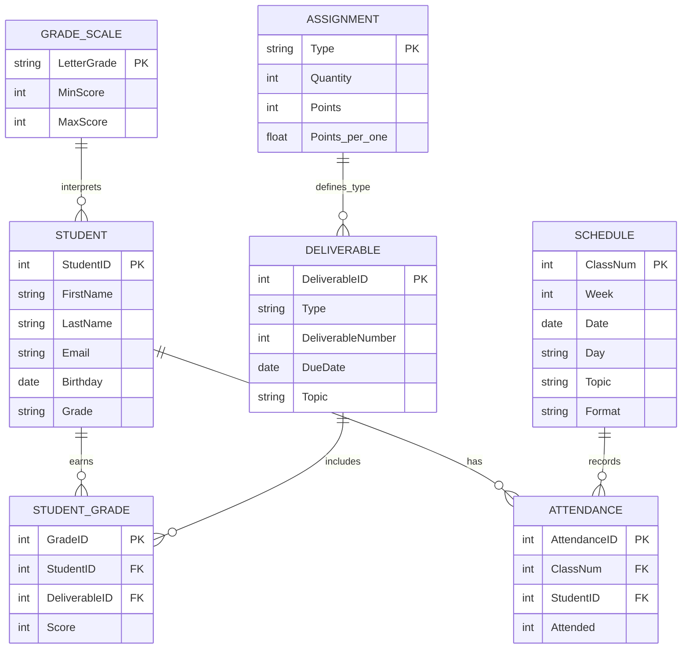

<!-- Let's Build 09 created 2026-06-16: refactored hands-on visual and code-based database design work into a guided Let's Build companion using the Grading Database. Companion lab: Lab 09 — Designing a Veterinary Clinic Database. -->

## Let's Build

<p align="center">
  
</p>

<p align="center">
Chapter 9 explained that database design is the bridge between business requirements and technical implementation. In this Let's Build (LB) you turn that thinking into action: you take the Grading Database (GDB) business rules, model them visually in Lucidchart, recreate the design as code using Mermaid, and translate the resulting diagram into executable SQL CREATE TABLE statements. The hands-on design work you do here is the source material for <strong>Lab 09 — Designing a Veterinary Clinic Database</strong>.
</p>

### Purpose

Move from reading about conceptual, logical, and physical database design to building real, implementable design artifacts. By the end, you should be able to translate any set of business rules into a visually clean Entity-Relationship Diagram (ERD), represent that ERD using code, and write DDL constraints that guarantee referential integrity in a working database.

### What You Will Practice

- Identifying core entities, attributes, and relationships from business requirements.
- Drawing a visual Crow's Foot ERD in Lucidchart with correct cardinality and optionality.
- Creating a versionable, text-based ERD using Mermaid diagram-as-code syntax.
- Translating ERD relationships into SQL foreign keys and table-level constraints.
- Choosing referential integrity actions (`ON DELETE RESTRICT` vs. `ON DELETE CASCADE`).

### Before You Begin

You need:
- A web browser to access **lucidchart.com** (free account).
- A text editor or Markdown viewer that supports Mermaid (such as VS Code with a Mermaid extension or the browser-based **mermaid.live**).
- Access to a SQLite or Access SQL environment to verify DDL statements (optional).
- About 60 minutes of focused time.
- The Chapter 9 reading, especially the database design levels (§9.3), relationship types (§9.7), and the mapping algorithm (§9.10).

---

### Task 1: Identify Business Rules and Entities

Before you draw any lines, you must extract the core facts and rules of the business domain. The Grading Database case study is built on the following requirements:

- **STUDENT**: Each student has a unique identifier, first name, last name, email address (which must be unique), birthday, and letter grade.
- **DELIVERABLE**: Each deliverable has a unique ID, a type (e.g., Quiz, Homework), a sequential number, a due date, and a topic.
- **STUDENT_GRADE**: Connects students to deliverables and stores the score earned. A student can have scores for many deliverables, and a deliverable can be scored for many students. Each score belongs to one student-deliverable pair.
- **ASSIGNMENT**: Defines deliverable rules — each assignment type has a quantity, points, and weight. One assignment type defines many deliverables.
- **SCHEDULE**: Tracks class sessions by class number, week, date, day of week, topic, and delivery format.
- **ATTENDANCE**: Connects a student to a class session on the schedule and records whether they attended.
- **GRADE_SCALE**: Standard rules mapping numeric scores to letter grades.

**Expected output:** A short list of the 7 entities and their core attributes in your notes. This acts as your blueprint for drawing the diagram.

> 📘 **Concept connection:** An entity is a person, place, thing, or event that the database needs to represent. If a concept has multiple instances (like many students or many deliverables), it becomes an entity. If a value is a single fact about an entity (like a student's email), it becomes an attribute.

---

### Task 2: Design the ERD in Lucidchart

This task translates the business rules into a visual blueprint using Lucidchart, a drag-and-drop tool widely used in industry.

1. Go to **lucidchart.com** and sign in.
2. Click **New Document** → **Blank Diagram**.
3. In the left panel shape library, search for and enable **Entity Relationship** shapes.
4. Drag an **Entity** shape onto the canvas for each of the 7 tables identified in Task 1.
5. Define attributes inside each entity box. Bold and label primary keys with **PK** (e.g., `StudentID` in `STUDENT`) and foreign keys with **FK**.
6. Draw relationship connectors between the entities:
   - `STUDENT` to `STUDENT_GRADE` (1:N)
   - `DELIVERABLE` to `STUDENT_GRADE` (1:N)
   - `STUDENT` to `ATTENDANCE` (1:N)
   - `SCHEDULE` to `ATTENDANCE` (1:N)
   - `ASSIGNMENT` to `DELIVERABLE` (1:N)
   - `GRADE_SCALE` to `STUDENT` (1:N)
7. Configure cardinality and optionality on each line using Crow's Foot notation:
   - Select the line, and use the toolbar dropdowns to set the end points.
   - **Mandatory One (`||`)**: Applied to the parent side (e.g., `STUDENT` is required for a `STUDENT_GRADE` record).
   - **Optional Many (`o{`)**: Applied to the child side (e.g., a student can exist with zero or many grades).

**Expected output:** A clean, visually organized ERD in Lucidchart showing all 7 entities, attributes, primary/foreign keys, and Crow's Foot relationship indicators.

---

### Task 3: Code the ERD in Mermaid

Visual diagrams are excellent for presentations, but modern developers use **diagram-as-code** to store structures in version control. You will write a Mermaid text file that renders into an ERD.

1. Open **mermaid.live** in your browser or create a new file `ch09-gdb.md` in VS Code.
2. Write the Mermaid definition, declaring entities with their attributes and key labels:



3. Read cardinalities in Mermaid using the syntax table:

| Symbol | Meaning | Example Interpretation |
|---|---|---|
| `\|\|` | Exactly one (required) | Each grade belongs to one student |
| `o{` | Zero or many (optional many) | A student may have zero or many grades |
| `\|{` | One or many (required many) | A class must have at least one attendance record |
| `o\|` | Zero or one (optional one) | A record may or may not exist |

**Expected output:** A working Mermaid code block that renders a complete, correct relational schema without syntax errors.

---

### Task 4: Translate the Blueprint to CREATE TABLE Statements

An ER diagram is a blueprint. The final step is translating that blueprint into SQL DDL commands that set up the database tables.

Write the `CREATE TABLE` DDL for the three core tables: `STUDENT`, `DELIVERABLE`, and the associative table `STUDENT_GRADE`.

```sql
-- Create STUDENT Table
CREATE TABLE STUDENT (
    StudentID INTEGER PRIMARY KEY,
    FirstName TEXT NOT NULL,
    LastName TEXT NOT NULL,
    Email TEXT UNIQUE,
    Birthday DATE,
    Grade TEXT
);

-- Create DELIVERABLE Table
CREATE TABLE DELIVERABLE (
    DeliverableID INTEGER PRIMARY KEY,
    Type TEXT NOT NULL,
    DeliverableNumber INTEGER NOT NULL,
    DueDate DATE,
    Topic TEXT
);

-- Create STUDENT_GRADE Table (Associative Entity)
CREATE TABLE STUDENT_GRADE (
    GradeID INTEGER PRIMARY KEY AUTOINCREMENT,
    StudentID INTEGER NOT NULL,
    DeliverableID INTEGER NOT NULL,
    Score INTEGER CHECK (Score BETWEEN 0 AND 100),
    FOREIGN KEY (StudentID) REFERENCES STUDENT(StudentID) ON DELETE RESTRICT,
    FOREIGN KEY (DeliverableID) REFERENCES DELIVERABLE(DeliverableID) ON DELETE RESTRICT,
    UNIQUE (StudentID, DeliverableID)
);
```

**Expected output:** Valid DDL SQL script containing primary keys, foreign keys, uniqueness constraints, value range checks, and referential actions.

---

### Check Your Work

Use this checklist to verify that your design artifacts are correct before moving on:

- [ ] **Entities and Columns**: Does every entity have a clear Primary Key (PK) designated?
- [ ] **Junction Table**: Does the `STUDENT_GRADE` table contain foreign keys (FK) referencing both `STUDENT` and `DELIVERABLE`?
- [ ] **Business Rule Enforcement**: Does `STUDENT_GRADE` include a unique constraint on `(StudentID, DeliverableID)` to prevent duplicate entries for the same deliverable?
- [ ] **Referential Integrity**: Do the SQL CREATE TABLE statements contain `ON DELETE RESTRICT` for foreign keys to prevent orphan records?
- [ ] **Mermaid Syntax**: Does the Mermaid code render successfully without syntax errors in mermaid.live?
- [ ] **Crow's Foot Alignment**: Does the relationship line between `STUDENT` and `STUDENT_GRADE` show a mandatory circle and line (`||`) on the STUDENT side and a crow's foot (`o{`) on the grade side?

---

### What This Shows

Designing a database is a separate discipline from querying it. The work you completed shows:
1. **Design First, Build Second**: Setting up ERDs prevents layout mistakes (such as duplicate fields or wrong foreign keys) before you write any SQL.
2. **Tool Specialization**: Lucidchart helps you discover and collaborate on a design visually; Mermaid helps you document and track changes in code.

#### Lucidchart vs. Mermaid at a Glance

| Dimension | Lucidchart | Mermaid |
|---|---|---|
| **Primary Use** | Visual design and collaboration | Text-based, version-controlled diagrams |
| **Interface** | Drag-and-drop, graphical UI | Written syntax inside Markdown or code |
| **Best For** | Early-stage design, stakeholder meetings | Technical documentation, Git tracking |
| **Precision** | Easy to draw; rules depend on designer | Enforces relational structure via syntax rules |

---

### Common Mistakes

- **Confusing attributes with entities**: Adding multiple columns for phone numbers (`Phone1`, `Phone2`) inside the `STUDENT` table instead of creating a separate related table `STUDENT_PHONE` (violating 1NF).
- **Misplacing the Foreign Key**: Putting the foreign key on the "one" side of a relationship (e.g., putting `GradeID` in the `STUDENT` table), which limits a student to a single grade.
- **Omitting Constraints**: Forgetting to add `NOT NULL` constraints on foreign keys in child tables, which allows orphan child records to exist without a parent.
- **Ignoring Referential Actions**: Failing to specify `ON DELETE RESTRICT` or `ON DELETE CASCADE` in SQL, leaving deletions to default DBMS behaviors that might corrupt database integrity.

---

### Submit or Save

Save your files using these names:
- Lucidchart exported file: `LB09_Lucidchart_ERD_<YourName>.pdf`
- Mermaid text file: `LB09_Mermaid_ERD_<YourName>.txt`
- SQL DDL script: `LB09_DDL_Grading_Database_<YourName>.sql`

There is no LMS submission for this Let's Build. The hands-on work you practiced here will be applied to **Lab 09 — Designing a Veterinary Clinic Database**, where you will design the database structure for the PetVax clinic case study.

---

### Peek Ahead — Chapter 10

In Chapter 10, you will return to writing SQL queries. Now that your database has a clean, normalized, multi-table structure, you will learn to write advanced SQL queries — using window functions, common table expressions (CTEs), and CASE expressions — that rely on exactly this type of design to generate complex reports and business diagnostics.
