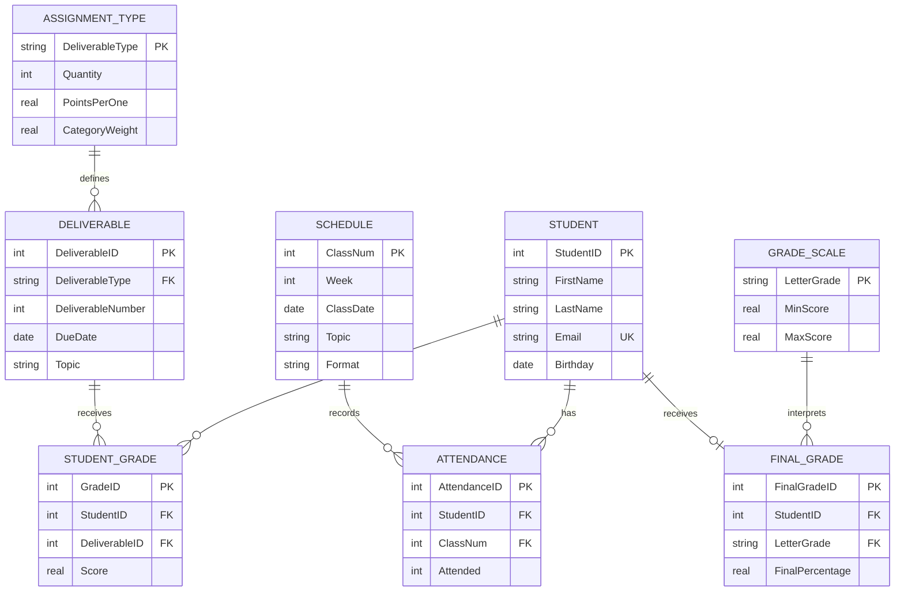

<!-- metadata: date="2026-05-18"; chapter="09"; section="main-rewritten"; title="Chapter 10: From Data to Design"; description="Introduces database design as the process of translating business requirements into reliable relational structures using the SDLC, ER modeling, Crow's Foot notation, normalization, and ERD-to-table mapping."; author="Nimrod Dvir, PhD" -->
# Chapter 9: From Data to Design

*Building Reliable Information Systems from Business Requirements*

Good SQL depends on good design. Up to this point, you have learned how to work with databases: how to retrieve data, join tables, summarize records, calculate grades, and build reports. Those skills matter. But every query you write depends on decisions that were made earlier: what tables exist, what each table means, which keys identify records, and which relationships connect the data.

This chapter shifts from **using databases** to **designing databases**. The central question changes from “How do I query this structure?” to “What structure should exist in the first place?”

Database design is the bridge between business needs and technical implementation. It translates real-world requirements into entities, attributes, relationships, keys, constraints, and diagrams. When design is done well, SQL becomes clear and powerful. When design is done poorly, SQL becomes a workaround.

---

## Learning Objectives

After completing this chapter, you will be able to:

1. Explain why database design should precede implementation.
2. Describe how poor design creates insertion, update, and deletion anomalies.
3. Explain where database design fits within the System Development Life Cycle (SDLC).
4. Translate business requirements into entities, attributes, relationships, and business rules.
5. Distinguish among conceptual, logical, and physical database design.
6. Interpret and create entity-relationship diagrams (ERDs).
7. Use Crow's Foot notation to represent cardinality and optionality.
8. Identify one-to-one, one-to-many, and many-to-many relationships.
9. Explain weak entities, associative entities, recursive relationships, and specialization/generalization.
10. Apply normalization as a design-quality check.
11. Translate ER diagrams into relational table structures using a mapping algorithm.
12. Compare Lucidchart and Mermaid as tools for documenting ERDs.
13. Evaluate common database modeling mistakes before implementation.

---

## Chapter Roadmap

| Section | Main Question | Core Idea |
|---|---|---|
| 10.1 | Why does design matter? | Good queries require good structure. |
| 10.2 | What goes wrong with poor design? | Anomalies are symptoms of bad structure. |
| 10.3 | Where does design fit in system development? | Database design belongs inside the SDLC. |
| 10.4 | How do requirements become structure? | Business rules become entities, attributes, and relationships. |
| 10.5 | What is ER modeling? | ERDs visually model data before implementation. |
| 10.6 | How do we read relationship notation? | Crow's Foot notation shows cardinality and optionality. |
| 10.7 | What relationship types matter most? | 1:1, 1:N, and M:N relationships shape table design. |
| 10.8 | How do we handle advanced patterns? | Weak, associative, recursive, and subtype structures extend the ER model. |
| 10.9 | How does normalization support design? | Normal forms help test whether structure is reliable. |
| 10.10 | How do diagrams become tables? | The mapping algorithm converts ERDs into schemas. |
| 10.11 | What tools help document design? | Lucidchart is visual; Mermaid is ERD-as-code. |
| 10.12 | What mistakes should designers avoid? | Most database failures are predictable. |

---

## 9.1 From Querying Data to Designing Systems

### 9.1.1 Good Queries Require Good Design

A database query can only work with the structure it is given. If tables mix unrelated facts, if keys are unstable, or if relationships are missing, even a technically correct query may produce misleading results.

Consider a grading database. Suppose one flat table stores student names, student emails, deliverable details, attendance, assignment weights, and scores. You can still write SQL against that table. But the query will be fragile because the design itself is fragile. You may need to remove duplicate rows, guess which copy of an email address is correct, or manually reconstruct relationships that should have been built into the schema.

A well-designed database reduces that burden. It stores each kind of fact in the right place and connects those facts through keys. Then SQL can focus on answering questions rather than repairing structure.

> **Key Takeaway:**  
> Many “query problems” are actually design problems in disguise.

### 9.1.2 The Shift from User to Designer

Earlier chapters emphasized working with existing databases. You wrote queries, joined tables, handled missing data, calculated averages, and built reports. Chapter 10 changes your role. You are no longer only a database user. You are now becoming a database designer.

The designer asks different questions:

- What information must this system remember?
- Which real-world objects, events, or concepts deserve their own table?
- Which attributes belong with which entity?
- Which relationships should be required, optional, one-to-many, or many-to-many?
- Which rules should be enforced by the database rather than remembered by users?
- How will this structure change when the organization grows?

This is a higher-level skill. It requires technical understanding, but it also requires business interpretation. Database design is not just about tables. It is about representing an organization’s logic accurately.

### 9.1.3 Design as Translation

Database design translates business language into data structure.

| Business Language | Database Design Translation |
|---|---|
| “Students submit assignments.” | `STUDENT`, `DELIVERABLE`, and `STUDENT_GRADE` entities are needed. |
| “Each deliverable has a due date.” | `DueDate` belongs in `DELIVERABLE`, not repeated in every grade row. |
| “Each student can earn one score per deliverable.” | `STUDENT_GRADE` needs a uniqueness rule on `(StudentID, DeliverableID)`. |
| “Attendance is recorded for each class meeting.” | `ATTENDANCE` connects `STUDENT` and `SCHEDULE`. |
| “Grades are interpreted using a grading scale.” | `GRADE_SCALE` stores letter-grade thresholds. |

Design makes these rules visible before implementation. SQL enforces them later.

---

## 9.2 The Cost of Poor Design: Data Anomalies

Poor database design creates predictable failures. These failures are called **data anomalies**.

> **Definition:**  
> A **data anomaly** is a data integrity problem caused by storing data in a poorly structured or redundant way.

Anomalies are not random mistakes. They are structural consequences. If a database stores the same fact in many places, sooner or later those copies will diverge.

### 9.2.1 Starting Example: A Flat Grading Table

Imagine a table called `GRADE_FLAT`:

| StudentID | FirstName | LastName | Email | DeliverableType | DeliverableNumber | DueDate | PointsPerOne | Score |
|---:|---|---|---|---|---:|---|---:|---:|
| 101 | Alice | Johnson | alice@albany.edu | Quiz | 1 | 2026-02-05 | 10 | 9 |
| 101 | Alice | Johnson | alice@albany.edu | Quiz | 2 | 2026-02-12 | 10 | 8 |
| 101 | Alice | Johnson | alice@albany.edu | Exam | 1 | 2026-03-15 | 100 | 87 |
| 102 | Brian | Lee | brian@albany.edu | Quiz | 1 | 2026-02-05 | 10 | 7 |
| 102 | Brian | Lee | brian@albany.edu | Quiz | 2 | 2026-02-12 | 10 | 9 |

At first, the table looks convenient. Each row tells a story: one student, one deliverable, one score. But the table mixes several subjects:

- Student identity: `StudentID`, `FirstName`, `LastName`, `Email`
- Deliverable definition: `DeliverableType`, `DeliverableNumber`, `DueDate`, `PointsPerOne`
- Performance outcome: `Score`

That mixture creates anomalies.

### 9.2.2 Insertion Anomaly

An **insertion anomaly** occurs when you cannot add one fact without adding an unrelated fact.

Example: The instructor wants to add a new deliverable, “Project 1,” before any student has submitted it. In `GRADE_FLAT`, there is no clean place to store the new deliverable because every row also requires student and score information.

Bad options include:

- inserting a fake student,
- inserting a blank score,
- waiting until the first student submits,
- storing the deliverable somewhere else.

A relational design solves this by storing deliverables in their own table:

```text
DELIVERABLE(DeliverableID, DeliverableType, DeliverableNumber, DueDate, PointsPerOne)
```

Now a deliverable can exist before any score exists.

### 9.2.3 Update Anomaly

An **update anomaly** occurs when the same fact is stored in many rows, and updating only some copies creates inconsistency.

Example: Alice changes her email address. In the flat table, Alice’s email appears once for every deliverable. If Alice has 20 grade rows, the email must be updated 20 times. Missing one row creates conflicting versions of the same student.

A relational design solves this by storing Alice’s email once:

```text
STUDENT(StudentID, FirstName, LastName, Email)
```

Every grade row then refers to Alice through `StudentID`.

### 9.2.4 Deletion Anomaly

A **deletion anomaly** occurs when deleting one fact accidentally deletes another fact.

Example: Brian’s only recorded score is deleted because it was entered in error. If that row was also the only row containing Brian’s student information, deleting the score removes Brian from the database entirely.

A relational design prevents this by separating student identity from grade outcomes:

```text
STUDENT(StudentID, FirstName, LastName, Email)
STUDENT_GRADE(GradeID, StudentID, DeliverableID, Score)
```

Deleting a grade does not delete the student.

### 9.2.5 Why Anomalies Matter

Anomalies damage trust. They make reports unreliable, audits harder, and business decisions weaker. They also increase the hidden labor of database work because analysts must spend time cleaning and reconciling data before they can answer questions.

> **Important:**  
> Database design aims to make these failures structurally difficult or impossible. A good schema does not depend on users remembering to “be careful.” It makes correctness easier by design.

---

## 9.3 Database Design in the System Development Life Cycle

### 9.3.1 What Is the SDLC?

The **System Development Life Cycle (SDLC)** is a structured framework for planning, building, deploying, and maintaining information systems. It helps teams move from a business problem to a working system through deliberate phases.

A database is not separate from this process. It supports workflows, reports, interfaces, analytics, security, and long-term maintenance. When database design is rushed or disconnected from the SDLC, the system may work at first but fail when requirements grow.

### 9.3.2 SDLC Phases from a Database Perspective

| SDLC Phase | Database Design Focus | Grading Database Example |
|---|---|---|
| Planning and analysis | Identify users, goals, reports, and business rules | Who enters grades? Who views reports? What does “final grade” mean? |
| Conceptual design | Identify entities and relationships | Students, deliverables, attendance records, grade records |
| Logical design | Define tables, attributes, keys, and constraints | `STUDENT`, `DELIVERABLE`, `STUDENT_GRADE`, foreign keys |
| Physical design | Choose platform-specific data types, indexes, and storage | Access AutoNumber, SQLite `INTEGER PRIMARY KEY`, PostgreSQL identity columns |
| Development | Implement tables, forms, queries, and constraints | Build tables and relationships in Access or SQL |
| Testing | Validate rules and outputs | Try entering a grade for a nonexistent student; confirm the database rejects it |
| Deployment | Move the database into active use | Load real roster data and begin grade entry |
| Maintenance | Adapt to new requirements | Add late penalties, multiple sections, or revised grading weights |

### 9.3.3 Conceptual, Logical, and Physical Design

Database design often happens at three levels.

| Design Level | Main Question | Example |
|---|---|---|
| Conceptual | What does the business domain contain? | A student earns grades on deliverables. |
| Logical | What tables, keys, and relationships are needed? | `STUDENT_GRADE` contains `StudentID`, `DeliverableID`, and `Score`. |
| Physical | How will this be implemented in a specific DBMS? | In Access, `GradeID` may be AutoNumber; in PostgreSQL, it may be `GENERATED AS IDENTITY`. |

The levels should not be collapsed too early. If you begin by choosing Access field types before understanding the business rules, the tool starts driving the design. That is backwards.

> **Key Takeaway:**  
> Design before implementation. The model should guide the tool, not the other way around.

---

## 9.4 From Requirements to Structure

Database design begins with requirements. Requirements describe what the system must do, what information it must store, what questions it must answer, and what rules it must enforce.

### 9.4.1 Requirements as Design Inputs

Suppose the instructor gives the following requirements for the Grading Database:

1. The database must store students.
2. The database must store deliverables such as quizzes, exercises, exams, and projects.
3. Each deliverable has a type, number, due date, topic, and possible points.
4. Each student may earn a score for each deliverable.
5. Attendance must be recorded for each class meeting.
6. Final grades must be calculated from weighted categories.
7. The system should support reports for individual students, class averages, missing work, and attendance rates.

These requirements imply structure.

| Requirement | Design Implication |
|---|---|
| Store students | Create a `STUDENT` entity. |
| Store deliverables | Create a `DELIVERABLE` entity. |
| Store deliverable categories and weights | Create `ASSIGNMENT_TYPE` or `GRADE_WEIGHT`. |
| Track each student’s score on each deliverable | Create `STUDENT_GRADE` as an associative entity. |
| Record attendance for each class meeting | Create `SCHEDULE` and `ATTENDANCE`. |
| Convert numeric grades to letters | Create `GRADE_SCALE`. |

### 9.4.2 Entities

> **Definition:**  
> An **entity** is a real-world object, concept, person, place, event, or transaction that the database needs to represent.

In the Grading Database, likely entities include:

| Entity | What It Represents |
|---|---|
| `STUDENT` | A person enrolled in the course |
| `DELIVERABLE` | A specific graded item, such as Quiz 1 |
| `STUDENT_GRADE` | One student’s score on one deliverable |
| `SCHEDULE` | One class meeting |
| `ATTENDANCE` | One student’s attendance status for one class meeting |
| `ASSIGNMENT_TYPE` | Category-level grading rules |
| `GRADE_SCALE` | Letter-grade thresholds |

A useful test: if the database must store many instances of something, and each instance has its own attributes or relationships, it may be an entity.

### 9.4.3 Attributes

> **Definition:**  
> An **attribute** is a property or characteristic of an entity.

Examples:

| Entity | Attributes |
|---|---|
| `STUDENT` | `StudentID`, `FirstName`, `LastName`, `Email` |
| `DELIVERABLE` | `DeliverableID`, `DeliverableType`, `DeliverableNumber`, `DueDate`, `Topic` |
| `STUDENT_GRADE` | `GradeID`, `StudentID`, `DeliverableID`, `Score` |
| `SCHEDULE` | `ClassNum`, `Week`, `ClassDate`, `Topic`, `Format` |
| `ATTENDANCE` | `AttendanceID`, `StudentID`, `ClassNum`, `Attended` |

Attributes can be classified in several ways.

| Attribute Type | Meaning | Example | Design Guidance |
|---|---|---|---|
| Simple | Cannot be usefully broken down | `Score` | Store directly. |
| Composite | Can be decomposed | Full address | Store as `Street`, `City`, `State`, `ZipCode` if parts matter. |
| Single-valued | One value per entity instance | `Birthday` | Store in the entity table. |
| Multi-valued | Multiple values per entity instance | Phone numbers | Create a separate related table. |
| Stored | Physically recorded | `Birthday` | Store if needed. |
| Derived | Calculated from stored values | Age | Usually compute in queries. |

### 9.4.4 Relationships

> **Definition:**  
> A **relationship** describes how entities are connected.

Examples:

- A `STUDENT` earns many `STUDENT_GRADE` records.
- A `DELIVERABLE` receives many `STUDENT_GRADE` records.
- A `SCHEDULE` class meeting has many `ATTENDANCE` records.
- A `STUDENT` has many `ATTENDANCE` records.
- An `ASSIGNMENT_TYPE` defines many `DELIVERABLE` records.

Relationships are where database design becomes powerful. Instead of copying the same information repeatedly, the design connects separate entities through keys.

### 9.4.5 Business Rules

A **business rule** is a statement about how the organization operates. Good database design turns important business rules into structural rules.

Examples:

| Business Rule | Structural Expression |
|---|---|
| Every grade must belong to one student. | `STUDENT_GRADE.StudentID` is a required foreign key. |
| Every grade must belong to one deliverable. | `STUDENT_GRADE.DeliverableID` is a required foreign key. |
| A student should not have two scores for the same deliverable. | Unique constraint on `(StudentID, DeliverableID)`. |
| A score must be between 0 and 100. | `CHECK (Score BETWEEN 0 AND 100)`. |
| A student may exist before any grades are entered. | `STUDENT` is independent of `STUDENT_GRADE`. |

The designer’s job is to discover these rules before implementation.

---

## 9.5 Entity-Relationship Modeling

### 9.5.1 What ER Modeling Is

**Entity-Relationship (ER) modeling** is a visual and conceptual method for designing databases before implementation. It represents entities, attributes, relationships, keys, cardinality, and optionality in a diagram.

ER modeling is useful because it separates design thinking from software implementation. Before writing SQL, the designer can ask:

- Are the right entities present?
- Are relationships clear?
- Are many-to-many relationships resolved correctly?
- Are required relationships marked as required?
- Are optional relationships allowed only where the business rule permits them?

ER modeling was introduced by Peter Chen in the 1970s and remains foundational because it gives business and technical stakeholders a shared language for discussing data structure.

### 9.5.2 ERD Elements

| ERD Element | Meaning | Relational Equivalent |
|---|---|---|
| Entity | Thing being represented | Table |
| Attribute | Property of an entity | Column |
| Identifier | Attribute that uniquely identifies entity instances | Primary key |
| Relationship | Association between entities | Foreign key or junction table |
| Cardinality | How many instances can be related | One-to-one, one-to-many, many-to-many |
| Optionality | Whether participation is required | Nullable or `NOT NULL` foreign key |

### 9.5.3 Key Hierarchy

Keys identify records and support relationships.

| Key Type | Meaning | Example |
|---|---|---|
| Superkey | Any attribute set that uniquely identifies a row | `{StudentID, FirstName}` |
| Candidate key | Minimal superkey | `{StudentID}` or `{Email}` if email is unique |
| Primary key | Candidate key selected as the official identifier | `StudentID` |
| Foreign key | Attribute that references another table’s key | `STUDENT_GRADE.StudentID` |
| Natural key | Real-world value used as identifier | University ID or email |
| Surrogate key | Artificial system-generated identifier | `GradeID` AutoNumber |

The primary key should be stable, unique, and never `NULL`. Surrogate keys are often preferred because they are short and unlikely to change. But natural keys may still be useful as unique business constraints.

### 9.5.4 Example: STUDENT and STUDENT_GRADE

At the conceptual level, the rule is:

> A student can earn many grades; each grade belongs to one student.

At the logical level, that becomes:

```text
STUDENT(StudentID, FirstName, LastName, Email)
STUDENT_GRADE(GradeID, StudentID, DeliverableID, Score)
```

At the physical SQL level, part of the implementation might look like:

```sql
CREATE TABLE STUDENT (
    StudentID INTEGER PRIMARY KEY,
    FirstName TEXT NOT NULL,
    LastName TEXT NOT NULL,
    Email TEXT UNIQUE
);

CREATE TABLE STUDENT_GRADE (
    GradeID INTEGER PRIMARY KEY,
    StudentID INTEGER NOT NULL,
    DeliverableID INTEGER NOT NULL,
    Score REAL,
    FOREIGN KEY (StudentID) REFERENCES STUDENT(StudentID)
);
```

The ERD explains the structure. SQL implements it.

---

## 9.6 Crow's Foot Notation

### 9.6.1 What Crow's Foot Notation Shows

**Crow's Foot notation** is a visual language for showing relationships in ER diagrams. It communicates two things:

1. **Cardinality**: how many records can participate?
2. **Optionality**: is participation required or optional?

The notation appears at the ends of relationship lines.

| Symbol | Meaning |
|---|---|
| `|` | One |
| `o` | Zero or optional |
| `<` or `{` | Many |

These symbols combine into patterns.

| Symbol Pattern | Meaning | Numeric Meaning |
|---|---|---|
| `||` | Exactly one | 1 |
| `o|` | Zero or one | 0..1 |
| `|<` or `|{` | One or more | 1..* |
| `o<` or `o{` | Zero or more | 0..* |

### 9.6.2 Reading Crow's Foot Notation

Consider this relationship:

```text
STUDENT ||--o{ STUDENT_GRADE
```

Read it in both directions:

- One `STUDENT` can have zero or many `STUDENT_GRADE` records.
- Each `STUDENT_GRADE` must belong to exactly one `STUDENT`.

That is a business rule. It says a student can exist before grades are entered, but a grade cannot exist without a student.

### 9.6.3 Crow's Foot to SQL

Crow's Foot notation guides implementation.

| ER Rule | SQL Design |
|---|---|
| Required relationship | Foreign key is `NOT NULL`. |
| Optional relationship | Foreign key may allow `NULL`. |
| One-to-many relationship | Foreign key goes on the many side. |
| Many-to-many relationship | Create an associative table. |
| Referential integrity | Add a `FOREIGN KEY` constraint. |

Example:

```text
STUDENT ||--o{ STUDENT_GRADE
```

SQL implication:

```sql
StudentID INTEGER NOT NULL,
FOREIGN KEY (StudentID) REFERENCES STUDENT(StudentID)
```

The `NOT NULL` reflects the mandatory participation of `STUDENT_GRADE`: every grade must belong to one student.

---

## 9.7 Understanding Relationship Types

### 9.7.1 One-to-One Relationships

A **one-to-one (1:1)** relationship exists when one record in Table A is associated with at most one record in Table B, and one record in Table B is associated with at most one record in Table A.

1:1 relationships are relatively rare. Often, two tables that appear to be 1:1 could be combined. However, separation can make sense when data is sensitive, optional, or accessed by different users.

#### Example: STUDENT and STUDENT_CREDENTIALS

```text
STUDENT(StudentID, FirstName, LastName, Email)
STUDENT_CREDENTIALS(StudentID, Username, PasswordHash, LastLogin)
```

Why separate them?

- Credentials are sensitive.
- Not every user should access password hashes.
- Authentication data may be maintained by a different system.
- Student profile data and credential data have different security requirements.

Crow's Foot reading:

```text
STUDENT ||--o| STUDENT_CREDENTIALS
```

A student may have zero or one credential record. Each credential record must belong to one student.

SQL sketch:

```sql
CREATE TABLE STUDENT_CREDENTIALS (
    StudentID INTEGER PRIMARY KEY,
    Username TEXT NOT NULL UNIQUE,
    PasswordHash TEXT NOT NULL,
    LastLogin DATETIME,
    FOREIGN KEY (StudentID) REFERENCES STUDENT(StudentID)
);
```

Here `StudentID` is both the primary key and a foreign key, enforcing one credential row per student.

### 9.7.2 One-to-Many Relationships

A **one-to-many (1:N)** relationship exists when one row in one table can be associated with many rows in another table, but each row on the many side belongs to one row on the one side.

This is the most common database relationship pattern.

Examples:

| One Side | Many Side | Meaning |
|---|---|---|
| `STUDENT` | `STUDENT_GRADE` | One student earns many grades. |
| `DELIVERABLE` | `STUDENT_GRADE` | One deliverable receives many grade records. |
| `SCHEDULE` | `ATTENDANCE` | One class meeting has many attendance records. |
| `CUSTOMER` | `ORDER` | One customer places many orders. |
| `COURSE` | `SECTION` | One course has many sections. |

Rule:

> In a 1:N relationship, the foreign key belongs on the many side.

Example:

```text
STUDENT ||--o{ STUDENT_GRADE
```

`StudentID` belongs in `STUDENT_GRADE`, not because a student “contains” grades, but because each grade needs to identify which student it belongs to.

### 9.7.3 Many-to-Many Relationships

A **many-to-many (M:N)** relationship exists when many records in Table A can relate to many records in Table B.

Examples:

- A student can complete many deliverables; each deliverable is completed by many students.
- A student can enroll in many courses; each course has many students.
- A product can appear in many orders; each order contains many products.
- An employee can work on many projects; each project has many employees.

Relational databases do not implement M:N relationships directly. They resolve them through an **associative entity**, also called a **junction table**, **intersection table**, or **bridge table**.

#### Example: STUDENT_GRADE as a Junction Table

The conceptual M:N relationship is:

```text
STUDENT }o--o{ DELIVERABLE
```

The relational solution is:

```text
STUDENT ||--o{ STUDENT_GRADE }o--|| DELIVERABLE
```

`STUDENT_GRADE` stores the intersection between one student and one deliverable.

```text
STUDENT_GRADE(GradeID, StudentID, DeliverableID, Score)
```

The `Score` belongs in the junction table because the score is not a fact about the student alone and not a fact about the deliverable alone. It is a fact about a specific student’s performance on a specific deliverable.

### 9.7.4 Relationships in the Grading Database

| Relationship | Type | Implementation | Why It Matters |
|---|---|---|---|
| `STUDENT` to `STUDENT_GRADE` | 1:N | `StudentID` FK in `STUDENT_GRADE` | Connects students to scores |
| `DELIVERABLE` to `STUDENT_GRADE` | 1:N | `DeliverableID` FK in `STUDENT_GRADE` | Connects deliverables to scores |
| `ASSIGNMENT_TYPE` to `DELIVERABLE` | 1:N | `DeliverableType` FK in `DELIVERABLE` | Connects category rules to deliverables |
| `STUDENT` to `ATTENDANCE` | 1:N | `StudentID` FK in `ATTENDANCE` | Tracks attendance per student |
| `SCHEDULE` to `ATTENDANCE` | 1:N | `ClassNum` FK in `ATTENDANCE` | Tracks attendance per class meeting |
| `GRADE_SCALE` to final grade interpretation | Lookup | Score range comparison | Converts numeric results to letters |

These relationships support analysis. For example, to report a student’s grade history, SQL joins `STUDENT`, `STUDENT_GRADE`, and `DELIVERABLE`. To analyze attendance, SQL joins `STUDENT`, `ATTENDANCE`, and `SCHEDULE`. The schema makes those questions possible.

---

## 9.8 Advanced ER Modeling Concepts

### 9.8.1 Weak Entities

A **weak entity** cannot be uniquely identified by its own attributes alone. Its identity depends on an owner entity.

Example: Suppose a `SECTION` is identified only within a course:

```text
COURSE(CourseID, CourseTitle)
SECTION(CourseID, SectionNumber, MeetingTime)
```

`SectionNumber = 1` is not globally unique. Many courses may have Section 1. The section is identified by the combination of `CourseID` and `SectionNumber`.

A weak entity often has:

- existence dependence on the owner,
- a partial key,
- a composite primary key including the owner’s key.

### 9.8.2 Associative Entities

An **associative entity** resolves an M:N relationship and may store attributes about the relationship itself.

Examples:

| M:N Relationship | Associative Entity | Relationship Attribute |
|---|---|---|
| Students complete deliverables | `STUDENT_GRADE` | `Score` |
| Students enroll in sections | `ENROLLMENT` | `EnrollmentDate`, `FinalGrade` |
| Products appear in orders | `ORDER_LINE` | `Quantity`, `UnitPrice` |
| Employees work on projects | `PROJECT_ASSIGNMENT` | `Role`, `HoursWorked` |

The pattern is universal. Whenever the relationship itself has attributes, the relationship deserves its own table.

### 9.8.3 Recursive Relationships

A **recursive relationship** occurs when an entity relates to itself.

Example:

```text
EMPLOYEE(EmployeeID, FirstName, LastName, ManagerID)
```

`ManagerID` is a foreign key that references `EMPLOYEE.EmployeeID`.

```sql
CREATE TABLE EMPLOYEE (
    EmployeeID INTEGER PRIMARY KEY,
    FirstName TEXT NOT NULL,
    LastName TEXT NOT NULL,
    ManagerID INTEGER,
    FOREIGN KEY (ManagerID) REFERENCES EMPLOYEE(EmployeeID)
);
```

This supports questions such as:

```sql
SELECT e.FirstName AS EmployeeFirstName,
       e.LastName AS EmployeeLastName,
       m.FirstName AS ManagerFirstName,
       m.LastName AS ManagerLastName
FROM EMPLOYEE AS e
LEFT JOIN EMPLOYEE AS m
    ON e.ManagerID = m.EmployeeID;
```

The table joins to itself. The aliases `e` and `m` allow SQL to treat the same table as two roles: employee and manager.

### 9.8.4 Specialization and Generalization

Specialization and generalization model “is-a” relationships.

Example:

```text
PERSON(PersonID, FirstName, LastName, Email)
STUDENT(PersonID, Major, ClassYear)
EMPLOYEE(PersonID, Department, JobTitle)
```

A student is a person. An employee is also a person. Some people may be both.

Two questions matter:

1. **Disjoint or overlapping?** Can a person belong to more than one subtype?
2. **Total or partial?** Must every person belong to at least one subtype?

| Constraint | Meaning | Example |
|---|---|---|
| Disjoint | One superclass instance can belong to only one subtype | A vehicle is either car or truck |
| Overlapping | One superclass instance can belong to multiple subtypes | A person can be student and employee |
| Total | Every superclass instance must belong to a subtype | Every account is checking or savings |
| Partial | Some superclass instances may not belong to a subtype | A person may be neither student nor employee |

### 9.8.5 Mapping Specialization to Tables

There are three common strategies.

| Strategy | Description | Pros | Cons |
|---|---|---|---|
| Superclass + subclass tables | Store shared fields in superclass and subtype fields in subtype tables | Normalized, flexible | Requires joins |
| Subclass tables only | Each subtype table stores all shared and subtype-specific fields | Simple for total specialization | Redundant shared fields |
| Single table with type column | One table stores all fields plus discriminator | Simple queries | Many NULLs and weaker constraints |

Most normalized relational designs prefer the superclass + subclass approach when subtypes have meaningful differences.

---

## 9.9 Normalization as a Design-Quality Check

ER modeling identifies the structure. Normalization tests whether that structure is reliable.

> **Definition:**  
> **Normalization** is the process of organizing tables so that each fact is stored in the right place, redundancy is reduced, and anomalies are prevented.

### 9.9.1 Normal Forms Review

| Normal Form | Question | Problem Fixed |
|---|---|---|
| 1NF | Does each cell contain one atomic value? | Lists and repeating columns |
| 2NF | Does every non-key attribute depend on the whole key? | Partial dependencies |
| 3NF | Does every non-key attribute depend only on the key? | Transitive dependencies |
| BCNF | Is every determinant a candidate key? | Special remaining dependency problems |

### 9.9.2 Applying Normalization to Design

Suppose a proposed table is:

```text
STUDENT_GRADE(StudentID, DeliverableID, FirstName, Email, DeliverableType, DueDate, Score)
```

Primary key: `(StudentID, DeliverableID)`

Problems:

- `FirstName` and `Email` depend only on `StudentID`.
- `DeliverableType` and `DueDate` depend only on `DeliverableID`.
- `Score` depends on the full key `(StudentID, DeliverableID)`.

The normalized design is:

```text
STUDENT(StudentID, FirstName, Email)
DELIVERABLE(DeliverableID, DeliverableType, DueDate)
STUDENT_GRADE(StudentID, DeliverableID, Score)
```

Normalization confirms what ER modeling suggests: student facts, deliverable facts, and score facts belong in separate places.

### 9.9.3 When to Denormalize

**Denormalization** deliberately reintroduces redundancy to improve read performance or simplify reporting.

Examples:

- storing a monthly sales summary table,
- creating a dashboard-ready reporting table,
- maintaining a materialized view,
- caching a current GPA or account balance.

Denormalization should come after a clean design exists. It is an optimization decision, not a shortcut around modeling.

> **Rule of Thumb:**  
> Normalize for correctness. Denormalize only with a documented reason, refresh process, and accountability rule.

---

## 9.10 From ER Diagrams to Relational Tables

The mapping algorithm translates an ERD into a relational schema. It turns a visual design into tables, columns, keys, and constraints.

### 9.10.1 Step 1: Map Strong Entities

For every strong entity, create a table.

Entity:

```text
STUDENT
- StudentID
- FirstName
- LastName
- Email
```

Relational table:

```text
STUDENT(StudentID, FirstName, LastName, Email)
```

SQL example:

```sql
CREATE TABLE STUDENT (
    StudentID INTEGER PRIMARY KEY,
    FirstName TEXT NOT NULL,
    LastName TEXT NOT NULL,
    Email TEXT UNIQUE
);
```

### 9.10.2 Step 2: Map Weak Entities

For a weak entity, include the owner’s primary key and the weak entity’s partial key.

Example:

```text
COURSE(CourseID, CourseName)
SECTION(CourseID, SectionNumber, MeetingTime)
```

SQL example:

```sql
CREATE TABLE SECTION (
    CourseID INTEGER NOT NULL,
    SectionNumber INTEGER NOT NULL,
    MeetingTime TEXT,
    PRIMARY KEY (CourseID, SectionNumber),
    FOREIGN KEY (CourseID) REFERENCES COURSE(CourseID)
);
```

### 9.10.3 Step 3: Map 1:N Relationships

In a one-to-many relationship, place the foreign key on the many side.

ER rule:

```text
STUDENT ||--o{ STUDENT_GRADE
```

Table design:

```text
STUDENT_GRADE(GradeID, StudentID, DeliverableID, Score)
```

`StudentID` is stored in `STUDENT_GRADE`.

### 9.10.4 Step 4: Map M:N Relationships

For many-to-many relationships, create a junction table.

Conceptual relationship:

```text
STUDENT }o--o{ DELIVERABLE
```

Relational design:

```text
STUDENT(StudentID, ...)
DELIVERABLE(DeliverableID, ...)
STUDENT_GRADE(StudentID, DeliverableID, Score)
```

SQL example:

```sql
CREATE TABLE STUDENT_GRADE (
    StudentID INTEGER NOT NULL,
    DeliverableID INTEGER NOT NULL,
    Score REAL,
    PRIMARY KEY (StudentID, DeliverableID),
    FOREIGN KEY (StudentID) REFERENCES STUDENT(StudentID),
    FOREIGN KEY (DeliverableID) REFERENCES DELIVERABLE(DeliverableID)
);
```

This version uses a composite primary key. Another valid version uses a surrogate `GradeID` plus a unique constraint:

```sql
CREATE TABLE STUDENT_GRADE (
    GradeID INTEGER PRIMARY KEY,
    StudentID INTEGER NOT NULL,
    DeliverableID INTEGER NOT NULL,
    Score REAL,
    UNIQUE (StudentID, DeliverableID),
    FOREIGN KEY (StudentID) REFERENCES STUDENT(StudentID),
    FOREIGN KEY (DeliverableID) REFERENCES DELIVERABLE(DeliverableID)
);
```

Both enforce one score per student per deliverable.

### 9.10.5 Step 5: Map Special Attributes

| Attribute Type | Mapping Rule | Example |
|---|---|---|
| Composite | Store components separately | `Address` becomes `Street`, `City`, `State`, `ZipCode` |
| Multi-valued | Create a separate table | `STUDENT_PHONE(StudentID, PhoneNumber)` |
| Derived | Do not store unless justified | Age computed from birthday |
| Optional | Allow `NULL` only if business rule permits | `MiddleName` may be nullable |

### 9.10.6 Complete Grading Database ERD in Mermaid

The following Mermaid diagram documents the core Grading Database design.



This diagram is intentionally more than decoration. It is a design artifact. It communicates which entities exist, what their keys are, where foreign keys belong, and how the system supports grade, attendance, and final-grade reporting.

---

## 9.11 Visual Schema Design Tools

Visual schema design means using diagrams to reason about structure before building. Two useful tools are Lucidchart and Mermaid.

### 9.11.1 Lucidchart

Lucidchart is a visual diagramming tool. It is useful when students or teams need a drag-and-drop interface, polished diagrams, or real-time collaboration.

Use Lucidchart when:

- the goal is stakeholder communication,
- students are learning ERD notation visually,
- diagrams need careful layout and formatting,
- teams need collaborative editing.

A typical Lucidchart workflow:

1. Start with an ERD or Crow's Foot template.
2. Add entities as boxes.
3. Add attributes inside each entity.
4. Mark primary keys and foreign keys.
5. Draw relationships.
6. Set cardinality and optionality.
7. Review the diagram for missing entities, unclear labels, or unresolved M:N relationships.

### 9.11.2 Mermaid

Mermaid is a text-based diagramming syntax that can render ERDs inside Markdown.

Use Mermaid when:

- the diagram belongs in documentation,
- the book or project is stored in GitHub,
- the design should be version-controlled,
- the diagram should be easy to regenerate or revise,
- AI tools are helping draft or edit the schema.

Basic Mermaid example:

```text
erDiagram
    STUDENT ||--o{ STUDENT_GRADE : earns
    DELIVERABLE ||--o{ STUDENT_GRADE : receives

    STUDENT {
        int StudentID PK
        string FirstName
        string LastName
    }

    DELIVERABLE {
        int DeliverableID PK
        string DeliverableType
        date DueDate
    }

    STUDENT_GRADE {
        int GradeID PK
        int StudentID FK
        int DeliverableID FK
        real Score
    }
```

### 9.11.3 Lucidchart vs. Mermaid

| Dimension | Lucidchart | Mermaid |
|---|---|---|
| Interface | Visual drag-and-drop | Text-based |
| Best for | Classroom design, stakeholder presentation | Markdown documentation, GitHub, version control |
| Strength | Easy visual editing | Reproducible diagrams as code |
| Limitation | Harder to version precisely | Less flexible visually |
| Recommended use | Early design and collaboration | Technical documentation and textbook source files |

> **Key Takeaway:**  
> Use visual tools to think. Use text-based tools to document. A strong designer can move between both.

---

## 9.12 Common Database Modeling Mistakes

### 9.12.1 Building Before Modeling

The most common mistake is starting with SQL before understanding the business rules.

Bad sequence:

```text
Open Access → Create tables → Guess fields → Fix problems later
```

Better sequence:

```text
Gather requirements → Identify entities → Define relationships → Draw ERD → Normalize → Implement
```

### 9.12.2 Treating Reports as Tables

A report combines facts for display. A table stores facts for long-term integrity. A common mistake is designing tables to look like the final report.

Example: A flat grade report may show student name, quiz score, attendance percentage, weighted average, and final letter grade in one output. That does not mean all those values belong in one table.

### 9.12.3 Failing to Resolve Many-to-Many Relationships

Putting multiple values in one field violates 1NF.

Bad design:

```text
STUDENT(StudentID, Name, DeliverableIDs)
```

Better design:

```text
STUDENT(StudentID, Name)
DELIVERABLE(DeliverableID, ...)
STUDENT_GRADE(StudentID, DeliverableID, Score)
```

### 9.12.4 Putting Foreign Keys on the Wrong Side

In a one-to-many relationship, the foreign key belongs on the many side.

Incorrect:

```text
STUDENT(StudentID, GradeID)
```

Correct:

```text
STUDENT_GRADE(GradeID, StudentID, DeliverableID, Score)
```

A student can have many grades, so `StudentID` belongs in the grade table.

### 9.12.5 Omitting Optionality

A relationship line without optionality leaves an important question unanswered.

Can a student exist without grades? Yes.

```text
STUDENT ||--o{ STUDENT_GRADE
```

Can a grade exist without a student? No.

That distinction affects `NULL` rules and foreign-key constraints.

### 9.12.6 Confusing Attributes with Entities

If an attribute has its own attributes or relationships, it may need to become an entity.

Example: If `Address` is only a mailing string, it can be an attribute. But if the system tracks address history, address type, move-in date, and verification status, `ADDRESS` should become an entity.

### 9.12.7 Storing Derived Values Too Early

Derived values should usually be calculated in queries.

Example:

- Store `Birthday`.
- Calculate `Age`.

Storing age creates an update problem because age changes over time.

### 9.12.8 Ignoring Naming Conventions

Inconsistent names create confusion.

Avoid:

```text
Student_ID, studentId, SID, student_number
```

Use consistent naming:

```text
StudentID
```

Naming does not replace design, but it makes design easier to read.

---

## 9.13 Design vs. Implementation

### 9.13.1 Logical Design Is Platform-Independent

Logical design defines what the database represents:

```text
STUDENT(StudentID, FirstName, LastName, Email)
```

This idea remains the same whether implemented in Access, SQLite, PostgreSQL, MySQL, or SQL Server.

### 9.13.2 Physical Design Is Platform-Specific

Physical design depends on the DBMS.

| Design Choice | Access | SQLite | PostgreSQL |
|---|---|---|---|
| Auto-incrementing key | AutoNumber | `INTEGER PRIMARY KEY` | `GENERATED AS IDENTITY` |
| Text field | Short Text / Long Text | `TEXT` | `VARCHAR` or `TEXT` |
| Date field | Date/Time | Often stored as text/date functions | `DATE` or `TIMESTAMP` |
| Boolean | Yes/No | Integer 0/1 | `BOOLEAN` |
| Relationship interface | Relationships window | Foreign-key SQL | Foreign-key SQL |

### 9.13.3 Why the Distinction Matters

A good logical design can move across platforms. A design that only works because of one tool’s quirks is fragile.

Example: A grading database may begin in Access for teaching. Later, it may move to PostgreSQL for a web application. If the logical design is sound, the migration mainly involves syntax and tooling. If the design is weak, migration exposes every hidden problem.

---

## 9.14 Strengths and Limits of ER Modeling

### 9.14.1 Strengths

ER modeling is useful because it:

- makes structure visible,
- supports communication between technical and non-technical stakeholders,
- reveals missing or ambiguous relationships,
- supports normalization,
- helps prevent costly redesign,
- creates a blueprint for SQL implementation.

### 9.14.2 Limits

ER modeling does not show everything.

| Limitation | Explanation |
|---|---|
| Behavior | ERDs do not show workflows, screens, or user actions. |
| Timing | ERDs do not fully show how processes unfold over time. |
| Complex rules | Some business rules require written documentation or constraints. |
| Large systems | Very large ERDs can become difficult to read. |
| Non-relational systems | NoSQL designs may use different modeling logic. |

### 9.14.3 Alternatives and Complements

| Modeling Approach | Best For | Relationship to ER Modeling |
|---|---|---|
| UML class diagram | Object-oriented software design | Includes behavior and methods more directly |
| Data flow diagram | Movement of data through processes | Complements ERD structure |
| Process model / BPMN | Workflows and business processes | Shows actions rather than data structure |
| NoSQL modeling | Document, key-value, graph, or column-family systems | Often starts from access patterns rather than normalization |

The ER model remains especially valuable for relational database design, but it is one tool in a broader design toolkit.

---

## 9.15 Key Concepts

- Database design translates business requirements into data structure.
- Good SQL depends on good database design.
- Data anomalies are symptoms of poor structure.
- The SDLC places database design inside a broader system-building process.
- Conceptual design identifies entities and relationships at a high level.
- Logical design defines tables, attributes, keys, and constraints independently of any specific DBMS.
- Physical design implements the logical model in a specific platform.
- ER modeling provides a visual language for representing entities, attributes, and relationships.
- Crow's Foot notation expresses cardinality and optionality.
- One-to-many relationships place the foreign key on the many side.
- Many-to-many relationships require an associative entity.
- Weak entities depend on owner entities for identity.
- Recursive relationships connect an entity to itself.
- Normalization tests whether a design stores each fact in the right place.
- Mermaid allows ERDs to be documented as text inside Markdown.
- Lucidchart supports visual ERD creation and stakeholder collaboration.

---

## 9.16 Chapter Summary

This chapter moved from querying databases to designing them. The main lesson is that reliable information systems do not happen accidentally. They are designed through deliberate choices about entities, attributes, relationships, keys, constraints, and business rules.

The chapter began by showing why good queries require good design. A poorly structured database creates anomalies: insertion anomalies, update anomalies, and deletion anomalies. These are not merely technical inconveniences. They undermine data quality, reporting accuracy, and organizational trust.

The chapter then placed database design inside the System Development Life Cycle. Planning, analysis, conceptual design, logical design, physical design, development, testing, deployment, and maintenance all shape the quality of the final system. Database design belongs early in that process because structural mistakes become more expensive after data and users depend on the system.

The chapter introduced ER modeling as a visual design method. Entities represent things the organization tracks, attributes describe those things, and relationships connect them. Crow's Foot notation expresses cardinality and optionality so that business rules become visible. One-to-one, one-to-many, and many-to-many relationships each produce different table structures.

Advanced modeling concepts extend this foundation. Weak entities, associative entities, recursive relationships, and specialization/generalization help designers represent realistic business domains. Normalization then acts as a design-quality check, ensuring that tables avoid redundancy and anomalies.

Finally, the chapter showed how diagrams become tables through the mapping algorithm and how tools such as Lucidchart and Mermaid support visual and text-based documentation. The goal is not to draw pretty diagrams. The goal is to design structures that make future SQL clearer, reporting more trustworthy, and information systems more reliable.

---

## 9.17 Review Questions

1. Why can technically correct SQL still produce misleading results when database design is poor?
2. What are insertion, update, and deletion anomalies? Give an example of each.
3. How does the SDLC help prevent database design problems?
4. What is the difference between conceptual, logical, and physical database design?
5. How do entities, attributes, and relationships differ?
6. What is the difference between a candidate key and a primary key?
7. Why are surrogate keys often useful?
8. How does Crow's Foot notation show optionality and cardinality?
9. Why does the foreign key belong on the many side of a one-to-many relationship?
10. Why can relational databases not implement many-to-many relationships directly?
11. What is an associative entity? Give an example outside the Grading Database.
12. What is a weak entity, and how does it differ from a strong entity?
13. What is a recursive relationship?
14. How does normalization support database design?
15. When might denormalization be justified?
16. What is the difference between Lucidchart and Mermaid as ERD tools?
17. Why should logical design remain independent of the DBMS?
18. What common modeling mistake do you personally find easiest to make, and how would you check for it?

---

## 9.18 References

Chen, P. P.-S. (1976). The entity-relationship model: Toward a unified view of data. *ACM Transactions on Database Systems*, *1*(1), 9--36. https://doi.org/10.1145/320434.320440

Connolly, T. M., & Begg, C. E. (2015). *Database systems: A practical approach to design, implementation, and management* (6th ed.). Pearson.

Date, C. J. (2004). *An introduction to database systems* (8th ed.). Pearson/Addison Wesley.

Elmasri, R., & Navathe, S. B. (2016). *Fundamentals of database systems* (7th ed.). Pearson.

Hoffer, J. A., Venkataraman, R., & Topi, H. (2019). *Modern database management* (13th ed.). Pearson.

Kroenke, D. M., & Auer, D. J. (2020). *Database concepts* (9th ed.). Pearson.

Laudon, K. C., & Laudon, J. P. (2024). *Management information systems: Managing the digital firm* (18th ed.). Pearson.

Mermaid. (n.d.). *Entity relationship diagrams*. Mermaid documentation. https://mermaid.js.org/syntax/entityRelationshipDiagram.html
