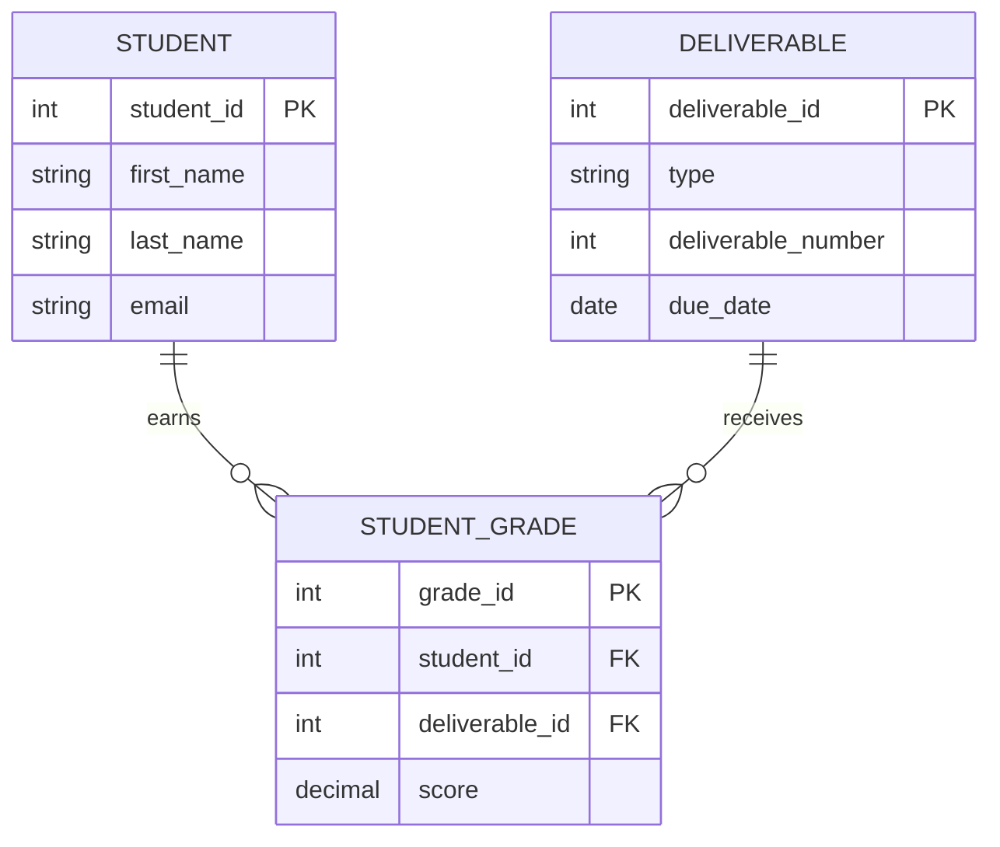

<!-- metadata: date="2026-06-12"; chapter="09"; section="main"; title="Chapter 9 – Database Design and ER Modeling"; description="Teaches students to design databases from business requirements using the SDLC, ER modeling, Crow's Foot notation, relationship types, and normalization as design-quality checks." -->
# Chapter 9: Database Design and ER Modeling

*From Business Requirements to Reliable Information Systems*

This chapter transitions students from querying existing databases to designing new ones from scratch. The chapter covers requirements analysis, conceptual modeling with ERDs, logical database design, and normalization review as a design discipline. The chapter emphasizes that good design determines what SQL is possible -- poor design limits every query and report built on top of it.

**After reading this chapter, students will be able to:**

- Translate business requirements into a conceptual ERD
- Apply normalization rules during logical database design
- Evaluate a database schema for design quality before implementation

## Chapter Overview

### Why Design Comes Before SQL

Up to this point, you have focused on asking questions of data. Through SQL, you have retrieved records, joined tables, calculated averages, and produced reports from the Grading Database. These skills are essential. But they depend on one assumption that is easy to overlook:

> **Good queries require good design.**

Even the most precise query cannot fix a poorly structured database. When tables are inconsistent, relationships are unclear, or business rules are missing from the schema, SQL becomes fragile. Many problems that look like query errors are actually design errors.

This chapter shifts from working with databases to designing them. That shift mirrors real professional practice. Analysts and engineers rarely receive perfect schemas. They are expected to evaluate designs, improve them, and build systems others can rely on.

📝 **Note:** As introduced in Chapters 6 and 7, the relational model and normalization are the structural backbone of good design. This chapter builds on both and connects them to a broader systems framework.

---

## The Cost of Poor Design: Data Anomalies

Before learning how to design well, it is worth understanding what goes wrong when design is poor. The problems are predictable. They are called **data anomalies**, and they occur when a database stores redundant or improperly organized data.

### Insertion Anomaly

You cannot add new data because unrelated required data is missing.

**Example:** A flat table stores students, deliverables, and grades in the same row. To add a new deliverable before any student is graded, you must either leave student fields blank or invent placeholder data. Neither is acceptable.

### Update Anomaly

A fact is stored in multiple rows. Changing it in one place but not others creates conflicts.

**Example:** A student's email appears in every row of a flat grading table. Changing that email requires updating every row. Miss one, and the database now has two different email addresses for the same student.

### Deletion Anomaly

Removing one record unintentionally destroys another.

**Example:** Deleting a student's only grade record from a flat table also removes the student's contact information, even though only the grade was meant to be deleted.

##### 🌍 Real-World Example
A retail company used a single spreadsheet to track customer orders. When a product was discontinued, deleting its order rows also deleted the customer contact data attached to those rows. The design created a deletion anomaly. Separating customers, products, and orders into distinct tables would have prevented the loss.

❗ **Important:** These anomalies are not edge cases. They are inevitable consequences of flat table structures. Every design principle in this chapter exists to make them structurally impossible.

---

## The System Development Life Cycle (SDLC)

### What Is the SDLC?

The **System Development Life Cycle (SDLC)** is a structured framework for planning, building, deploying, and maintaining information systems. It breaks development into deliberate phases, each with a specific purpose.

The core question the SDLC answers is simple: how do we move from a business problem to a working, sustainable information system?

Databases exist inside this larger process. They are not just tables. A database supports workflows, reporting needs, and long-term data integrity. When database design is disconnected from the SDLC, systems work initially but fail under real-world pressure.

🔑 **Key takeaway:** Mistakes made early are the most expensive to fix later. Thoughtful design at the start reduces long-term technical debt.

### SDLC Phases: A Database View

**Phase 1: Planning and Analysis** — Define why the system exists. Identify stakeholders, business requirements, and the questions the system must answer. No tables or SQL yet. The deliverable is a set of approved requirements.

**Phase 2: Design** — Translate requirements into structure. This phase has three levels:
- *Conceptual design:* abstract model of the domain, using an ER diagram
- *Logical design:* tables, keys, and relationships, independent of any platform
- *Physical design:* platform-specific choices such as data types, indexes, and security

**Phase 3: Development** — Implement the design using SQL DDL commands (`CREATE TABLE`, `PRIMARY KEY`, `FOREIGN KEY`). Development should reflect the blueprint, not reinterpret it.

**Phase 4: Testing** — Verify that the database enforces business rules. Confirm that a grade cannot exist without a valid student and deliverable. Validate that invalid entries are rejected.

**Phase 5: Deployment** — Move the database into active use. Populate initial data, configure user access, and verify that reporting works correctly with real data.

**Phase 6: Maintenance** — The longest phase. Requirements change, reports evolve, and new features are added. Well-designed databases adapt gracefully. Poorly designed ones require risky rewrites.

##### 🌍 Real-World Example
A hospital implemented an electronic records system without completing the design phase. Tables were created during coding. Six months after launch, adding a new patient category required restructuring three core tables and rewriting dozens of reports. The redesign cost more than the original build. A complete logical design at the start would have prevented this.

---

## From Requirements to Structure

Database design begins before any tables are created. The goal is to convert real-world business needs into a logical data model. That requires translation, not immediate coding.

### Identifying Core Design Elements

**Entities** represent things the organization needs to track. In the Grading Database: STUDENT, DELIVERABLE, CLASS SESSION, GRADE. Each entity becomes a candidate table.

**Attributes** describe the properties of each entity.
- STUDENT has FirstName, LastName, Email, StudentID.
- DELIVERABLE has Type, DueDate, DeliverableNumber.

Attributes are further classified as:
- **Simple vs. composite:** A simple attribute cannot be broken down (Salary). A composite attribute can (Address into Street, City, ZipCode). Store data in its smallest logical parts.
- **Single-valued vs. multi-valued:** A single-valued attribute holds one value per entity (BirthDate). A multi-valued attribute can hold several (PhoneNumbers).
- **Stored vs. derived:** A stored attribute is recorded directly (BirthDate). A derived attribute is calculated from stored data (Age). Compute derived values at query time rather than storing them.

**Relationships** explain how entities connect:
- A STUDENT earns many GRADES.
- A DELIVERABLE is associated with many STUDENT_GRADE records.
- A CLASS SESSION has many ATTENDANCE records.

### Design Before SQL

A common mistake is jumping straight to SQL: choosing data types too early, creating tables before understanding relationships, letting software defaults dictate structure. This produces designs that reflect tool convenience rather than business logic.

Effective design deliberately delays decisions such as:
- Whether an ID is an integer or UUID
- Which DBMS will be used
- How indexes will be applied

Those decisions belong to Phase 2 (physical design) or Phase 3, not Phase 1.

---

## Entity-Relationship (ER) Modeling

### What ER Modeling Is

Entity-Relationship (ER) modeling is a visual and conceptual method for designing databases before implementation. It describes what data exists, how it is structured, and how different pieces relate to one another, without committing to SQL or a specific platform.

The ER model was introduced by Peter Chen in 1976 as a standardized way to model data at a conceptual level. It has remained foundational to database education and practice for decades.

ER models bridge business understanding and technical design. They allow instructors, analysts, developers, and stakeholders to agree on structure before tables are created.

### Entities and Attributes in ERDs

Entities are represented as **rectangles**. Attributes in Chen notation are represented as **ovals** connected to the entity.

| Attribute Type | ERD Symbol | Example |
|---|---|---|
| Regular | Oval | FirstName |
| Key (identifier) | Underlined oval | StudentID |
| Multi-valued | Double oval | PhoneNumbers |
| Derived | Dashed oval | Age |
| Composite | Oval with sub-ovals | Address |

### The Key Hierarchy

Keys are attributes used to uniquely identify entities and link tables.

- **Superkey:** Any set of attributes that uniquely identifies an entity. `{StudentID, FirstName}` is a superkey, even though FirstName is unnecessary.
- **Candidate key:** A minimal superkey. No attribute can be removed without losing uniqueness. Both `StudentID` and `Email` may be candidate keys.
- **Primary key:** The candidate key selected as the main identifier. Must not contain null values. Shown with an underline in ER diagrams.
- **Foreign key:** An attribute in one table that references the primary key of another. It is the mechanism that links related tables.
- **Surrogate key:** A system-generated identifier (such as an auto-incrementing integer) used when no natural key is suitable. `StudentID` as an auto-incrementing integer is a surrogate key.

### Relationships: Cardinality and Participation

Relationships describe how entities are linked. ER modeling defines them using two constraints:

**Cardinality ratios** specify the maximum number of relationship instances an entity can participate in:
- **1:1** — One Department is managed by one Manager.
- **1:N** — One Department has many Employees.
- **M:N** — A Student can enroll in many Courses; a Course can have many Students.

**Participation constraints** specify whether participation is required:
- **Total (mandatory):** Every entity must participate. Represented by a double line. Every EMPLOYEE must belong to a Department.
- **Partial (optional):** Participation is not required. Represented by a single line. A Department can exist before any employees are assigned.

These two constraints combine to express precise business rules. They directly influence whether foreign keys allow NULL values, how constraints are enforced, and how missing data is interpreted.

---

## Crow's Foot Notation

### Why Crow's Foot Notation Matters

Crow's Foot notation is the most widely used visual language for expressing relationships in ER diagrams. It makes cardinality and optionality immediately visible without requiring text descriptions.

Industry tools including Microsoft Access, Lucidchart, Visio, and Draw.io all use Crow's Foot notation. This course uses it throughout.

### Core Symbols

Crow's Foot symbols are placed at the ends of relationship lines.

| Symbol | Meaning |
|---|---|
| `\|` | One (exactly one) |
| `o` | Optional (zero allowed) |
| `<` | Many (crow's foot) |

These symbols combine to express four relationship patterns:

| Text Symbol | Meaning | Cardinality |
|---|---|---|
| `\|\|` | Mandatory one | Exactly 1 |
| `o\|` | Optional one | 0 or 1 |
| `\|<` | Mandatory many | 1 or more |
| `o<` | Optional many | 0 or more |

### Reading Crow's Foot Diagrams

> Read the symbols from the perspective of the opposite entity.

```
STUDENT ||--o< STUDENT_GRADE
```

Read left to right: one STUDENT can have zero or many STUDENT_GRADE records.
Read right to left: each STUDENT_GRADE must belong to exactly one STUDENT.

The four relationship patterns with the Grading Database:

**Optional One (o|):** A STUDENT may have a final grade, but might not yet.
```
STUDENT o|--|| FINAL_GRADE
```

**Mandatory One (||):** Every STUDENT_GRADE must belong to one STUDENT.
```
STUDENT_GRADE ||--|| STUDENT
```

**Optional Many (o<):** A STUDENT may have many attendance records, or none yet.
```
STUDENT ||--o< ATTENDANCE
```

**Mandatory Many (|<):** A DELIVERABLE must have at least one STUDENT_GRADE once grading begins.
```
DELIVERABLE ||--|< STUDENT_GRADE
```

### Crow's Foot to SQL

Crow's Foot notation guides SQL implementation but does not replace it.

| ER Concept | SQL Implementation |
|---|---|
| Required relationship | `NOT NULL` foreign key |
| Optional relationship | Nullable foreign key |
| One-to-many | Foreign key in the "many" table |
| Referential integrity | `FOREIGN KEY` constraint |

##### 🌍 Real-World Example
An e-commerce platform diagrams its order system with Crow's Foot notation before writing any SQL. The diagram immediately reveals that a customer can place zero or many orders (`||--o<`), but every order must belong to exactly one customer. This forces the developers to add `CustomerID NOT NULL` as a foreign key in the ORDER table, preventing orphaned orders.

---

## Using Mermaid to Document ER Diagrams

**Mermaid** is a text-based diagramming tool that allows ER diagrams to be written as code inside Markdown files. Instead of drawing boxes and relationship lines manually, you describe entities, attributes, keys, and relationships using a simple syntax. This makes Mermaid especially useful for technical documentation, GitHub repositories, AI-assisted drafting, and course materials that need to stay editable over time.

Mermaid does not replace database design. It is a way to document a design clearly. The same decisions still apply: entities must be chosen carefully, primary keys must uniquely identify records, foreign keys must represent valid relationships, and cardinality must reflect actual business rules.

### Basic Mermaid ERD Syntax

A Mermaid ER diagram begins with `erDiagram`. Each entity can include attribute data types and key labels (`PK`, `FK`). The syntax below uses the Grading Database entities introduced throughout this chapter.

**Syntax (as written):**

```text
erDiagram
    STUDENT {
        int student_id PK
        string first_name
        string last_name
        string email
    }

    DELIVERABLE {
        int deliverable_id PK
        string type
        int deliverable_number
        date due_date
    }

    STUDENT_GRADE {
        int grade_id PK
        int student_id FK
        int deliverable_id FK
        decimal score
    }

    STUDENT ||--o{ STUDENT_GRADE : earns
    DELIVERABLE ||--o{ STUDENT_GRADE : receives
```

**Rendered result** (paste the code above into [mermaid.ai/live](https://mermaid.ai/live) to see it rendered):



`STUDENT_GRADE` functions as an associative entity: it connects students to deliverables and stores the relationship-specific attribute `score`. This is the same logic used when resolving a many-to-many relationship into two one-to-many relationships, as described in the next section.

### Mermaid Cardinality Reference

Mermaid uses Crow's Foot–style symbols. The table below maps each Mermaid marker to the notation already used in this chapter.

| Mermaid Symbol | Meaning | Example Reading |
|---|---|---|
| `\|\|--\|\|` | One-to-one (mandatory both sides) | One student has exactly one profile |
| `\|\|--o{` | One-to-many (optional many) | One student earns zero or more grades |
| `\|\|--\|{` | One-to-many (mandatory many) | One deliverable has one or more grade records |
| `}o--o{` | Many-to-many (optional both sides) | Resolve with an associative entity |

📝 **Note:** Mermaid renders Crow's Foot–style relational diagrams only — it does not support Chen notation ovals. Weak entities have no native double-border symbol; use `%% comment` annotation to flag them. `PK` and `FK` labels are display-only; Mermaid does not enforce constraints.

### Recommended Tool

Use **[mermaid.ai/live](https://mermaid.ai/live)** to write and preview Mermaid diagrams instantly — no installation, no account required. Paste any `erDiagram` block, see the result live, and share a link with collaborators.

Other supported environments:
- **GitHub and GitLab Markdown** — native rendering in `.md` files
- **VS Code** — install the *Mermaid Preview* extension for in-editor rendering

### When to Use Mermaid vs. a Visual Tool

| Use Mermaid when… | Use a visual tool (Lucidchart, Visio, Draw.io) when… |
|---|---|
| The diagram lives in a Markdown or documentation file | The goal is a polished stakeholder presentation |
| The schema is under version control (Git) | Live drag-and-drop collaboration is needed |
| You want AI assistance to generate or revise the diagram | Highly customized visual formatting is required |
| You need to iterate quickly during design | |

🔑 **Key takeaway:** Mermaid is best understood as **ERD-as-code**. It keeps diagrams close to the database documentation, making the design easier to revise, review, and maintain.

### Mermaid Design Checklist

Before treating a Mermaid ERD as complete, verify the following:

- Every entity represents one meaningful business object or event.
- Every table has a clear primary key.
- Foreign keys appear on the correct side of one-to-many relationships.
- Many-to-many relationships are resolved with associative entities.
- Relationship labels are written as meaningful verbs.
- Cardinality matches the business rule, not just what looks visually balanced.
- The diagram is readable enough that another person can explain it without assistance.

---

## Advanced ER Concepts

### Weak Entity Sets

A **weak entity set** is an entity that cannot be uniquely identified by its own attributes alone. Its existence depends on a relationship with an owner entity.

Key characteristics:
- **Existence dependence:** A weak entity cannot exist without its owner.
- **Partial key:** An attribute that distinguishes among weak entities related to the same owner.
- **Composite primary key:** The weak entity's key is the owner's primary key combined with the partial key.

In ERDs, weak entities use a **double-bordered rectangle**, their identifying relationship uses a **double-bordered diamond**, and the partial key uses a **dashed underline**.

**Example:** A HOMEWORK_SUBMISSION is a weak entity. It cannot exist without a DELIVERABLE. Its key is `{DeliverableID, SubmissionID}`.

### Associative (Intersection) Entities

An **associative entity** resolves a many-to-many relationship. In the relational model, M:N relationships cannot be implemented directly with a single foreign key. A new entity sits between the two original entities.

The associative entity:
- Contains foreign keys referencing both parent entities
- Often carries its own attributes describing the relationship
- Transforms one M:N into two 1:N relationships

**In the Grading Database**, STUDENT_GRADE is a classic associative entity:

```
STUDENT ||--o< STUDENT_GRADE >o--|| DELIVERABLE
```

A STUDENT can have many STUDENT_GRADE records. A DELIVERABLE can have many STUDENT_GRADE records. Each STUDENT_GRADE connects exactly one student to one deliverable and carries the Score attribute.

##### 🌍 Real-World Example
A hospital database tracks which doctors prescribe which medications to which patients. PRESCRIPTION is an associative entity. It contains foreign keys to DOCTOR, PATIENT, and MEDICATION, plus its own attributes such as Dosage and StartDate. Without it, a many-to-many relationship between doctors and medications would have no place to store the prescription-specific data.

### Specialization and Generalization

**Specialization (top-down):** Define subgroups of a superclass. STUDENT can be specialized into UNDERGRADUATE (with HighSchoolGPA) and GRADUATE (with GREScore). Subclasses inherit all attributes of the superclass.

**Generalization (bottom-up):** Identify common characteristics across several entities and create a shared superclass. CAR and TRUCK share VIN and LicensePlate, so they can be generalized into VEHICLE.

Two constraints govern these hierarchies:
- **Disjoint (d):** Each instance belongs to one subclass. A student is either Undergraduate or Graduate.
- **Overlapping (o):** An instance can belong to multiple subclasses. A university person can be both STUDENT and EMPLOYEE.

### Recursive Relationships

A **recursive relationship** occurs when an entity has a relationship with itself.

**Example:** EMPLOYEE manages EMPLOYEE. Modeled by adding a self-referencing foreign key (ManagerID) that references the same table's primary key.

```
EMPLOYEE ||--o< EMPLOYEE (manages)
```

---

## Normalization: Structural Integrity

ER modeling captures what entities and relationships exist. **Normalization** ensures the resulting table structures are free from redundancy and anomalies.

### Normal Forms

**First Normal Form (1NF):** Every column contains only atomic values. No repeating groups. Each row is unique.

**Second Normal Form (2NF):** The table is in 1NF, and every non-key attribute depends on the entire primary key, not just part of it. Eliminates **partial dependencies**.

**Third Normal Form (3NF):** The table is in 2NF, and no non-key attribute depends on another non-key attribute. Eliminates **transitive dependencies**. If ZipCode determines City, City belongs in a separate ZIP table, not in STUDENT.

**Boyce-Codd Normal Form (BCNF):** Every determinant must be a candidate key. A stricter version of 3NF.

### When to Denormalize

Normalization is not always taken to its highest level. **Denormalization** is the deliberate process of combining normalized tables to improve performance, accepting some redundancy.

Consider denormalization when:
- Queries require excessive joins across many tables
- Read-heavy applications need faster retrieval
- Reporting and analytics scenarios prioritize speed

🔑 **Key takeaway:** Normalize by default. Denormalize with justification and documented trade-offs.

---

## From ER Diagrams to Relational Tables

Translating an ER diagram into a relational schema follows a systematic process.

**Step 1 — Strong entities:** Create a table for each strong entity. Simple attributes become columns. The entity's identifier becomes the primary key.

**Step 2 — Weak entities:** Create a table for each weak entity. Include the owner's primary key as a foreign key. The primary key is the composite of the owner's PK and the partial key.

**Step 3 — Relationships by cardinality:**
- *1:1:* Add the PK of one table as an FK in the other. Place it in the table with total participation to minimize nulls.
- *1:N:* Add the PK of the "one" side as an FK in the "many" side table.
- *M:N:* Create an intersection table with foreign keys from both tables. Any relationship attributes become columns in the intersection table.
- *Recursive:* Add a self-referencing FK (for 1:N) or create an intersection table (for M:N).

**Step 4 — Special attributes:**
- Composite: Create separate columns for each component. Name becomes FirstName and LastName.
- Multi-valued: Create a separate table with the attribute and the entity's PK as a foreign key.
- Derived: Do not create a column. Compute at query time.

**Step 5 — Specialization hierarchies:** Three strategies exist:

| Strategy | Pros | Cons | Best When |
|---|---|---|---|
| Multiple tables (one per class) | Normalized, no NULLs | Requires JOINs | Integrity matters most |
| Subclass tables only | No JOINs, complete data | Only for total specialization | Every instance has a subclass |
| Single table | Fastest queries | Many NULLs, hard constraints | Few subclass-specific attributes |

---

## Design vs. Implementation

### Logical Design

**Logical design** focuses on what the database represents, not how it is built. It defines entities, attributes, relationships, keys, and constraints. These decisions remain valid across any platform.

### Physical Design

**Physical design** translates the logical model into a specific database system:
- **Data types:** TEXT vs. VARCHAR, INTEGER vs. REAL
- **Indexing:** Which columns need indexes for performance
- **Platform features:** AutoNumber in Access, AUTOINCREMENT in SQLite, SERIAL in PostgreSQL
- **Referential integrity actions:** `ON DELETE CASCADE`, `ON DELETE RESTRICT`, or `ON DELETE SET NULL`

### Why This Distinction Matters

Technologies change. Principles do not.

A well-designed database can be migrated between platforms, scaled to larger datasets, and extended without restructuring everything. A database designed around a specific tool becomes fragile when that tool changes.

Design is the long-term investment. Implementation is the short-term execution.

##### 🌍 Real-World Example
A university originally built its grade tracking system in Microsoft Access. Years later, the institution migrated to PostgreSQL. Because the original schema was designed at the logical level first, the migration required only syntax adjustments for data types and auto-increment fields. The entities, relationships, and constraints transferred cleanly. A poorly designed system would have required a full rebuild.

---

## Chapter Summary

Database design is a deliberate process. Structure does not emerge from data on its own. It is created by translating business needs, rules, and workflows into entities, relationships, and constraints.

Key ideas from this chapter:

- **Databases are designed, not discovered.** Structure is the result of translating business needs into a logical model.
- **Poor design causes predictable failures.** Insertion, update, and deletion anomalies are inevitable in flat, unnormalized structures.
- **The SDLC provides a framework.** Each phase, from planning through maintenance, shapes database quality. Skipping phases creates fragility.
- **ER modeling provides a shared visual language.** Entities, attributes, and relationships represent business meaning before any SQL is written.
- **Crow's Foot notation makes rules visible.** Cardinality and participation constraints are expressed directly in diagrams and enforced in SQL.
- **Advanced constructs handle real complexity.** Weak entities, associative entities, specialization, and recursive relationships extend the model to realistic scenarios.
- **Normalization ensures structural integrity.** Normal forms eliminate redundancy. Denormalization is a justified trade-off, not a default.
- **A systematic mapping algorithm translates diagrams into tables.** Each ER construct has a defined relational equivalent.
- **Good design supports long-term growth.** Systems built on solid design principles adapt to change without constant rework.

🧠 **Concept:** When SQL becomes hard to write and hard to read, the problem is usually the design, not the query.

---

## Key Terms

- **Associative Entity:** An entity created to resolve a many-to-many relationship. Contains foreign keys to both parent entities and often carries its own attributes.
- **Attribute:** A property or characteristic of an entity.
- **Candidate Key:** A minimal superkey. No attribute can be removed without losing uniqueness.
- **Cardinality Ratio:** A constraint specifying the maximum number of relationship instances an entity can participate in (1:1, 1:N, M:N).
- **Crow's Foot Notation:** A visual notation system using symbols (`||`, `o|`, `|<`, `o<`) to represent cardinality and participation in ER diagrams.
- **Data Anomaly:** A data integrity problem (insertion, update, or deletion) caused by poor table structure.
- **Denormalization:** The deliberate process of combining normalized tables to improve query performance, accepting some redundancy.
- **Derived Attribute:** An attribute whose value is calculated from other stored attributes.
- **Entity:** A real-world object or concept about which data is stored.
- **Entity-Relationship (ER) Model:** A conceptual data model using entities, attributes, and relationships to represent database structure.
- **ERD-as-code:** The practice of representing database diagrams using editable text syntax rather than only visual drawing tools.
- **Foreign Key:** An attribute in one table that references the primary key of another, establishing a link between them.
- **Generalization:** Identifying common characteristics across multiple entities and creating a shared superclass (bottom-up).
- **Logical Data Model:** A platform-independent model specifying tables, columns, keys, and constraints.
- **Mermaid:** A text-based diagramming syntax that creates ER diagrams and other visuals directly inside Markdown documentation.
- **Normalization:** The process of organizing tables to minimize redundancy and eliminate anomalies through a progression of normal forms (1NF, 2NF, 3NF, BCNF).
- **Participation Constraint:** Specifies whether entity participation in a relationship is required (total) or optional (partial).
- **Physical Data Model:** A technology-specific model specifying data types, indexes, and storage settings for a particular DBMS.
- **Primary Key:** The candidate key selected as the unique identifier for an entity. Must not contain null values.
- **Recursive Relationship:** A relationship in which an entity is related to itself.
- **SDLC (System Development Life Cycle):** A structured framework for planning, building, deploying, and maintaining information systems.
- **Specialization:** Defining subclasses of a superclass with distinct attributes or relationships (top-down).
- **Surrogate Key:** A system-generated artificial identifier used when no natural key is suitable.
- **Weak Entity Set:** An entity that cannot be uniquely identified by its own attributes and depends on an owner entity for its existence and identity.

---

## Review Questions

1. What are the three types of data anomalies? How does normalization prevent each one?
2. Explain the difference between a superkey, a candidate key, and a primary key.
3. Why is the SDLC important for database design? What happens when design is skipped or compressed?
4. Compare conceptual, logical, and physical data models. Who is the intended audience for each?
5. What is the difference between cardinality and participation? How are they shown in Crow's Foot notation?
6. What is a weak entity? When should you use one instead of a strong entity?
7. How is a many-to-many relationship resolved when mapping an ER diagram to relational tables?
8. What are the three strategies for mapping a specialization hierarchy to tables? What are the trade-offs?
9. When is denormalization appropriate, and what risks does it introduce?
10. Why should logical design remain independent of the chosen DBMS?
11. What are the advantages of using Mermaid for documenting ER diagrams compared to visual drawing tools?
12. How does Mermaid's text-based syntax support version control and technical documentation workflows?
