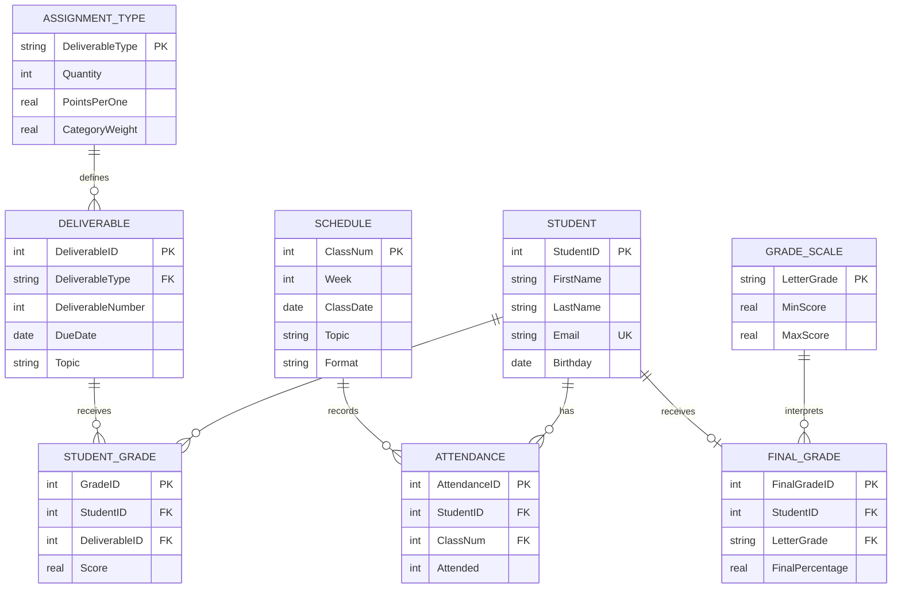

# Chapter 9: Database Design and ER Modeling

*Figure 9.1 — The database design lifecycle translates business requirements into physical tables.*

Up to this point, we have built database objects, worked with tables, created relationships, normalized data, and written SQL queries to retrieve and analyze information. That sequence matters because it gave us practical experience with what databases can do. But there is an important shift we need to make now.

<!-- PAGE BREAK -->
<div style="page-break-after: always;"></div>

# Core Concepts

## Supplementary Video

### Supplementary Video 1

<iframe width="560" height="315" src="https://www.youtube.com/embed/BTm-v0fpS50" title="Chapter 9 supplementary video 1" frameborder="0" allow="accelerometer; autoplay; clipboard-write; encrypted-media; gyroscope; picture-in-picture; web-share" referrerpolicy="strict-origin-when-cross-origin" allowfullscreen></iframe>

[Watch supplementary video 1](https://www.youtube.com/watch?v=BTm-v0fpS50)

# Core Concepts
<p align="center">
  
</p>

## 9.1 From Querying Data to Designing Systems

### 9.1.1 Good Queries Require Good Design

A database query can only work with the structure it is given. If tables mix unrelated facts, if keys are unstable, or if relationships are missing, even a technically correct query may produce misleading results.

Consider a grading database. Suppose one flat table stores student names, student emails, deliverable details, attendance, assignment weights, and scores. You can still write SQL against that table. But the query will be fragile because the design itself is fragile. You may need to remove duplicate rows, guess which copy of an email address is correct, or manually reconstruct relationships that should have been built into the schema.

A well-designed database reduces that burden. It stores each kind of fact in the right place and connects those facts through keys. Then SQL can focus on answering questions rather than repairing structure.

<div class="callout key-takeaway">
  <p><strong>🔑 Key Takeaway: Design problems disguised as query problems</strong></p>
  <p>Many "query problems" are actually design problems in disguise. If your SQL feels fragile, check the schema first.</p>
</div>

### 9.1.2 The Shift from User to Designer

Earlier chapters emphasized working with existing databases. You wrote queries, joined tables, handled missing data, calculated averages, and built reports. This chapter changes your role. You are no longer only a database user. You are now becoming a database designer.

The designer asks different questions:

- What information must this system remember?
- Which real-world objects, events, or concepts deserve their own table?
- Which attributes belong with which entity?
- Which relationships should be required, optional, one-to-many, or many-to-many?
- Which rules should be enforced by the database rather than remembered by users?
- How will this structure change when the organization grows?

The shift changes the questions you ask:

| Database User's Perspective                 | Database Designer's Perspective                                                 |
| ------------------------------------------- | ------------------------------------------------------------------------------- |
| How do I query this existing structure?     | What structure should exist in the first place?                                 |
| How do I join these tables to get a report? | Which real-world objects, events, or concepts deserve their own table?          |
| How do I handle this missing data?          | Which rules should be enforced by the database rather than remembered by users? |
| How do I filter these results?              | How will this structure scale and adapt as the organization grows?              |

This is a higher-level skill. It requires technical understanding, but it also requires business interpretation. Database design is not just about tables. It is about representing an organization's logic accurately.

### 9.1.3 Design as Translation

Database design translates business language into data structure.

| Business Language                                  | Database Design Translation                                              |
| -------------------------------------------------- | ------------------------------------------------------------------------ |
| "Students submit assignments."                     | `STUDENT`, `DELIVERABLE`, and `STUDENT_GRADE` entities are needed.       |
| "Each deliverable has a due date."                 | `DueDate` belongs in `DELIVERABLE`, not repeated in every grade row.     |
| "Each student can earn one score per deliverable." | `STUDENT_GRADE` needs a uniqueness rule on `(StudentID, DeliverableID)`. |
| "Attendance is recorded for each class meeting."   | `ATTENDANCE` connects `STUDENT` and `SCHEDULE`.                          |
| "Grades are interpreted using a grading scale."    | `GRADE_SCALE` stores letter-grade thresholds.                            |

Design makes these rules visible before implementation. SQL enforces them later.

## 9.2 The Cost of Poor Design: Data Anomalies

Poor database design creates predictable failures. These failures are called **data anomalies**.

<div class="callout discipline-definition">
  <p><strong>📘 Definition: Data anomaly</strong></p>
  <p>A <strong>data anomaly</strong> is a data integrity problem caused by storing data in a poorly structured or redundant way.</p>
</div>

Anomalies are not random mistakes. They are structural consequences. If a database stores the same fact in many places, sooner or later those copies will diverge.

### 9.2.1 Starting Example: A Flat Grading Table

Imagine a table called `GRADE_FLAT`:

| StudentID | FirstName | LastName | Email            | DeliverableType | DeliverableNumber | DueDate    | PointsPerOne | Score |
| --------: | --------- | -------- | ---------------- | --------------- | ----------------: | ---------- | -----------: | ----: |
|       101 | Alice     | Johnson  | alice@albany.edu | Quiz            |                 1 | 2026-02-05 |           10 |     9 |
|       101 | Alice     | Johnson  | alice@albany.edu | Quiz            |                 2 | 2026-02-12 |           10 |     8 |
|       101 | Alice     | Johnson  | alice@albany.edu | Exam            |                 1 | 2026-03-15 |          100 |    87 |
|       102 | Brian     | Lee      | brian@albany.edu | Quiz            |                 1 | 2026-02-05 |           10 |     7 |
|       102 | Brian     | Lee      | brian@albany.edu | Quiz            |                 2 | 2026-02-12 |           10 |     9 |

At first, the table looks convenient. Each row tells a story: one student, one deliverable, one score. But the table mixes several subjects:

- Student identity: `StudentID`, `FirstName`, `LastName`, `Email`
- Deliverable definition: `DeliverableType`, `DeliverableNumber`, `DueDate`, `PointsPerOne`
- Performance outcome: `Score`

That mixture creates anomalies.

### 9.2.2 Insertion Anomaly

An **insertion anomaly** occurs when you cannot add one fact without adding an unrelated fact.

Example: The instructor wants to add a new deliverable, "Project 1," before any student has submitted it. In `GRADE_FLAT`, there is no clean place to store the new deliverable because every row also requires student and score information.

Bad options include:

- inserting a fake student,
- inserting a blank score,
- waiting until the first student submits,
- storing the deliverable somewhere else.

A relational design solves this by storing deliverables in their own table:

```text
DELIVERABLE(DeliverableID, DeliverableType, DeliverableNumber, DueDate, PointsPerOne)
```

Now a deliverable can exist before any score exists.

### 9.2.3 Update Anomaly

An **update anomaly** occurs when the same fact is stored in many rows, and updating only some copies creates inconsistency.

Example: Alice changes her email address. In the flat table, Alice's email appears once for every deliverable. If Alice has 20 grade rows, the email must be updated 20 times. Missing one row creates conflicting versions of the same student.

A relational design solves this by storing Alice's email once:

```text
STUDENT(StudentID, FirstName, LastName, Email)
```

Every grade row then refers to Alice through `StudentID`.

### 9.2.4 Deletion Anomaly

A **deletion anomaly** occurs when deleting one fact accidentally deletes another fact.

Example: Brian's only recorded score is deleted because it was entered in error. If that row was also the only row containing Brian's student information, deleting the score removes Brian from the database entirely.

A relational design prevents this by separating student identity from grade outcomes:

```text
STUDENT(StudentID, FirstName, LastName, Email)
STUDENT_GRADE(GradeID, StudentID, DeliverableID, Score)
```

Deleting a grade does not delete the student.

### 9.2.5 Why Anomalies Matter

Anomalies damage trust. They make reports unreliable, audits harder, and business decisions weaker. They also increase the hidden labor of database work because analysts must spend time cleaning and reconciling data before they can answer questions.


*Figure 9.2 — Storing mixed subjects in a flat table creates insertion, update, and deletion anomalies.*

<div class="callout important">
  <p><strong>❗ Important: Design for correctness</strong></p>
  <p>Database design aims to make these failures structurally difficult or impossible. A good schema does not depend on users remembering to "be careful." It makes correctness easier by design.</p>
</div>

## 9.3 Database Design in the System Development Life Cycle

### 9.3.1 What Is the SDLC?

The **System Development Life Cycle (SDLC)** is a structured framework for planning, building, deploying, and maintaining information systems. It helps teams move from a business problem to a working system through deliberate phases.


*Figure 9.3 — Database design phases span planning, conceptual, logical, and physical stages in the SDLC.*

A database is not separate from this process. It supports workflows, reports, interfaces, analytics, security, and long-term maintenance. When database design is rushed or disconnected from the SDLC, the system may work at first but fail when requirements grow.

### 9.3.2 SDLC Phases from a Database Perspective

| SDLC Phase            | Database Design Focus                                     | Grading Database Example                                                        |
| --------------------- | --------------------------------------------------------- | ------------------------------------------------------------------------------- |
| Planning and analysis | Identify users, goals, reports, and business rules        | Who enters grades? Who views reports? What does "final grade" mean?             |
| Conceptual design     | Identify entities and relationships                       | Students, deliverables, attendance records, grade records                       |
| Logical design        | Define tables, attributes, keys, and constraints          | `STUDENT`, `DELIVERABLE`, `STUDENT_GRADE`, foreign keys                         |
| Physical design       | Choose platform-specific data types, indexes, and storage | Access AutoNumber, SQLite `INTEGER PRIMARY KEY`, PostgreSQL identity columns    |
| Development           | Implement tables, forms, queries, and constraints         | Build tables and relationships in Access or SQL                                 |
| Testing               | Validate rules and outputs                                | Try entering a grade for a nonexistent student; confirm the database rejects it |
| Deployment            | Move the database into active use                         | Load real roster data and begin grade entry                                     |
| Maintenance           | Adapt to new requirements                                 | Add late penalties, multiple sections, or revised grading weights               |

<!-- PAGE BREAK -->
<div style="page-break-after: always;"></div>

### 9.3.3 Conceptual, Logical, and Physical Design

Database design often happens at three levels.

| Design Level | Main Question                                    | Example                                                                                   |
| ------------ | ------------------------------------------------ | ----------------------------------------------------------------------------------------- |
| Conceptual   | What does the business domain contain?           | A student earns grades on deliverables.                                                   |
| Logical      | What tables, keys, and relationships are needed? | `STUDENT_GRADE` contains `StudentID`, `DeliverableID`, and `Score`.                       |
| Physical     | How will this be implemented in a specific DBMS? | In Access, `GradeID` may be AutoNumber; in PostgreSQL, it may be `GENERATED AS IDENTITY`. |

The levels should not be collapsed too early. If you begin by choosing Access field types before understanding the business rules, the tool starts driving the design. That is backwards.

<div class="callout key-takeaway">
  <p><strong>🔑 Key Takeaway: Design before implementation</strong></p>
  <p>The model should guide the tool, not the other way around.</p>
</div>

## 9.4 From Requirements to Structure

Database design begins with requirements. Requirements describe what the system must do, what information it must store, what questions it must answer, and what rules it must enforce.

### 9.4.1 Requirements as Design Inputs

Suppose the instructor gives the following requirements for the Grading Database:

1. The database must store students.
2. The database must store deliverables such as quizzes, exercises, exams, and projects.
3. Each deliverable has a type, number, due date, topic, and possible points.
4. Each student may earn a score for each deliverable.
5. Attendance must be recorded for each class meeting.
6. Final grades must be calculated from weighted categories.
7. The system should support reports for individual students, class averages, missing work, and attendance rates.

These requirements imply structure.

| Requirement                                    | Design Implication                               |
| ---------------------------------------------- | ------------------------------------------------ |
| Store students                                 | Create a `STUDENT` entity.                       |
| Store deliverables                             | Create a `DELIVERABLE` entity.                   |
| Store deliverable categories and weights       | Create `ASSIGNMENT_TYPE` or `GRADE_WEIGHT`.      |
| Track each student's score on each deliverable | Create `STUDENT_GRADE` as an associative entity. |
| Record attendance for each class meeting       | Create `SCHEDULE` and `ATTENDANCE`.              |
| Convert numeric grades to letters              | Create `GRADE_SCALE`.                            |


*Figure 9.4 — How business requirements translate into database design elements.*

### 9.4.2 Entities

<div class="callout discipline-definition">
  <p><strong>📘 Definition: Entity</strong></p>
  <p>An <strong>entity</strong> is a real-world object, concept, person, place, event, or transaction that the database needs to represent.</p>
</div>

In the Grading Database, likely entities include:

| Entity            | What It Represents                                    |
| ----------------- | ----------------------------------------------------- |
| `STUDENT`         | A person enrolled in the course                       |
| `DELIVERABLE`     | A specific graded item, such as Quiz 1                |
| `STUDENT_GRADE`   | One student's score on one deliverable                |
| `SCHEDULE`        | One class meeting                                     |
| `ATTENDANCE`      | One student's attendance status for one class meeting |
| `ASSIGNMENT_TYPE` | Category-level grading rules                          |
| `GRADE_SCALE`     | Letter-grade thresholds                               |

A useful test: if the database must store many instances of something, and each instance has its own attributes or relationships, it may be an entity.

### 9.4.3 Attributes

<div class="callout discipline-definition">
  <p><strong>📘 Definition: Attribute</strong></p>
  <p>An <strong>attribute</strong> is a property or characteristic of an entity.</p>
</div>

Examples:

| Entity          | Attributes                                                                  |
| --------------- | --------------------------------------------------------------------------- |
| `STUDENT`       | `StudentID`, `FirstName`, `LastName`, `Email`                               |
| `DELIVERABLE`   | `DeliverableID`, `DeliverableType`, `DeliverableNumber`, `DueDate`, `Topic` |
| `STUDENT_GRADE` | `GradeID`, `StudentID`, `DeliverableID`, `Score`                            |
| `SCHEDULE`      | `ClassNum`, `Week`, `ClassDate`, `Topic`, `Format`                          |
| `ATTENDANCE`    | `AttendanceID`, `StudentID`, `ClassNum`, `Attended`                         |

Attributes can be classified in several ways.

| Attribute Type | Meaning                             | Example       | Design Guidance                                                |
| -------------- | ----------------------------------- | ------------- | -------------------------------------------------------------- |
| Simple         | Cannot be usefully broken down      | `Score`       | Store directly.                                                |
| Composite      | Can be decomposed                   | Full address  | Store as `Street`, `City`, `State`, `ZipCode` if parts matter. |
| Single-valued  | One value per entity instance       | `Birthday`    | Store in the entity table.                                     |
| Multi-valued   | Multiple values per entity instance | Phone numbers | Create a separate related table.                               |
| Stored         | Physically recorded                 | `Birthday`    | Store if needed.                                               |
| Derived        | Calculated from stored values       | Age           | Usually compute in queries.                                    |

### 9.4.4 Relationships

<div class="callout discipline-definition">
  <p><strong>📘 Definition: Relationship</strong></p>
  <p>A <strong>relationship</strong> describes how entities are connected.</p>
</div>

Examples:

- A `STUDENT` earns many `STUDENT_GRADE` records.
- A `DELIVERABLE` receives many `STUDENT_GRADE` records.
- A `SCHEDULE` class meeting has many `ATTENDANCE` records.
- A `STUDENT` has many `ATTENDANCE` records.
- An `ASSIGNMENT_TYPE` defines many `DELIVERABLE` records.

Relationships are where database design becomes powerful. Instead of copying the same information repeatedly, the design connects separate entities through keys.

### 9.4.5 Business Rules

A **business rule** is a statement about how the organization operates. Good database design turns important business rules into structural rules.

Examples:

| Business Rule                                                  | Structural Expression                                    |
| -------------------------------------------------------------- | -------------------------------------------------------- |
| Every grade must belong to one student.                        | `STUDENT_GRADE.StudentID` is a required foreign key.     |
| Every grade must belong to one deliverable.                    | `STUDENT_GRADE.DeliverableID` is a required foreign key. |
| A student should not have two scores for the same deliverable. | Unique constraint on `(StudentID, DeliverableID)`.       |
| A score must be between 0 and 100.                             | `CHECK (Score BETWEEN 0 AND 100)`.                       |
| A student may exist before any grades are entered.             | `STUDENT` is independent of `STUDENT_GRADE`.             |

The designer's job is to discover these rules before implementation.

## 9.5 Entity-Relationship Modeling

### 9.5.1 What ER Modeling Is

**Entity-Relationship (ER) modeling** is a visual and conceptual method for designing databases before implementation. It represents entities, attributes, relationships, keys, cardinality, and optionality in a diagram.


*Figure 9.5 — Entity-Relationship Diagrams model logical business concepts and connections visually.*

ER modeling is useful because it separates design thinking from software implementation. Before writing SQL, the designer can ask:

- Are the right entities present?
- Are relationships clear?
- Are many-to-many relationships resolved correctly?
- Are required relationships marked as required?
- Are optional relationships allowed only where the business rule permits them?

ER modeling was introduced by Peter Chen in the 1970s and remains foundational because it gives business and technical stakeholders a shared language for discussing data structure.

### 9.5.2 ERD Elements

| ERD Element  | Meaning                                             | Relational Equivalent                 |
| ------------ | --------------------------------------------------- | ------------------------------------- |
| Entity       | Thing being represented                             | Table                                 |
| Attribute    | Property of an entity                               | Column                                |
| Identifier   | Attribute that uniquely identifies entity instances | Primary key                           |
| Relationship | Association between entities                        | Foreign key or junction table         |
| Cardinality  | How many instances can be related                   | One-to-one, one-to-many, many-to-many |
| Optionality  | Whether participation is required                   | Nullable or `NOT NULL` foreign key    |

### 9.5.3 Entity Notation in ERDs

In modern database modeling (such as designs documented in Lucidchart or Mermaid), entities are visually represented as rectangular tables. These tables are structured with three distinct columns to document the schema logic clearly before writing SQL:

1. **Identifiers (Keys)**: The first column displays key indicators. It shows `PK` for Primary Key, `FK` for Foreign Key, `UK` for Unique Key, or is left blank for regular attributes. When an attribute belongs to a composite key or a junction table, it may display multiple indicators (e.g., `PK, FK`).
2. **Field Names (Attributes)**: The second column lists the name of each attribute or field (e.g., `StudentID`, `FirstName`, `Email`).
3. **Data Types**: The third column specifies the data type for the field (e.g., `int`, `string`, `date`, `real`).

This three-column layout ensures that developers, database administrators, and business analysts can immediately identify the structure, constraints, and data definitions for every table in the database.

**Example: STUDENT Entity Notation**

| Identifiers | Field Name | Data Type |
| ----------- | ---------- | --------- |
| PK          | StudentID  | int       |
|             | FirstName  | string    |
|             | LastName   | string    |
| UK          | Email      | string    |
|             | Birthday   | date      |

<!-- PAGE BREAK -->
<div style="page-break-after: always;"></div>

### 9.5.4 Key Hierarchy

Keys identify records and support relationships.

| Key Type      | Meaning                                           | Example                                       |
| ------------- | ------------------------------------------------- | --------------------------------------------- |
| Superkey      | Any attribute set that uniquely identifies a row  | `{StudentID, FirstName}`                      |
| Candidate key | Minimal superkey                                  | `{StudentID}` or `{Email}` if email is unique |
| Primary key   | Candidate key selected as the official identifier | `StudentID`                                   |
| Foreign key   | Attribute that references another table's key     | `STUDENT_GRADE.StudentID`                     |
| Natural key   | Real-world value used as identifier               | University ID or email                        |
| Surrogate key | Artificial system-generated identifier            | `GradeID` AutoNumber                          |

The primary key should be stable, unique, and never `NULL`. Surrogate keys are often preferred because they are short and unlikely to change. But natural keys may still be useful as unique business constraints.

### 9.5.5 Example: STUDENT and STUDENT_GRADE

At the conceptual level, the rule is:

> A student can earn many grades; each grade belongs to one student.

At the logical level, that becomes:

```text
STUDENT(StudentID, FirstName, LastName, Email)
STUDENT_GRADE(GradeID, StudentID, DeliverableID, Score)
```

At the physical SQL level, part of the implementation might look like:

```sql
CREATE TABLE STUDENT (
    StudentID INTEGER PRIMARY KEY,
    FirstName TEXT NOT NULL,
    LastName TEXT NOT NULL,
    Email TEXT UNIQUE
);

CREATE TABLE STUDENT_GRADE (
    GradeID INTEGER PRIMARY KEY,
    StudentID INTEGER NOT NULL,
    DeliverableID INTEGER NOT NULL,
    Score REAL,
    FOREIGN KEY (StudentID) REFERENCES STUDENT(StudentID)
);
```

The ERD explains the structure. SQL implements it.

## 9.6 Crow's Foot Notation

### 9.6.1 What Crow's Foot Notation Shows

**Crow's Foot notation** is a visual language for showing relationships in ER diagrams. It communicates two things:

1. **Cardinality**: how many records can participate?
2. **Optionality**: is participation required or optional?


*Figure 9.6 — Crow's Foot notation symbols for relationship cardinality and optionality.*

Figure 9.6 shows the four standard Crow's Foot symbols that represent how entities connect. To read these symbols, look at where a relationship line meets an entity box. Each end of the line has two distinct markers:

* **The Inner Marker (Optionality/Minimum Cardinality)**: This symbol is placed further from the entity box (closer to the center of the line). It represents the **minimum cardinality** — the fewest number of records that *must* participate in the relationship. A circle (`o`) indicates **Optional** participation (a minimum of 0), meaning a parent record can exist without any related child records. A vertical hash mark (`|`) indicates **Mandatory** participation (a minimum of 1), meaning the relationship is required.
* **The Outer Marker (Cardinality/Maximum Cardinality)**: This symbol is closest to the entity box. It represents the **maximum cardinality** — the greatest number of records that *can* participate. A single vertical line (`|`) represents **One** (a maximum of 1), while a three-pronged "crow's foot" (`<`) represents **Many** (a maximum of many, with no upper limit).

The notation appears at the ends of relationship lines.

| Symbol     | Meaning          |
| ---------- | ---------------- |
| `\|`       | One              |
| `o`        | Zero or optional |
| `<` or `{` | Many             |

These symbols combine into patterns.

| Symbol Pattern | Meaning      | Numeric Meaning |
| -------------- | ------------ | --------------- |
| `\|\|`         | Exactly one  | 1               |
| `o\|`          | Zero or one  | 0..1            |
| `\|<` or `\|{` | One or more  | 1..*            |
| `o<` or `o{`   | Zero or more | 0..*            |

### 9.6.2 Reading Crow's Foot Notation

Consider this relationship:

```text
STUDENT ||--o{ STUDENT_GRADE
```

Read it in both directions:

- One `STUDENT` can have zero or many `STUDENT_GRADE` records.
- Each `STUDENT_GRADE` must belong to exactly one `STUDENT`.

That is a business rule. It says a student can exist before grades are entered, but a grade cannot exist without a student.

### 9.6.3 Crow's Foot to SQL

Crow's Foot notation guides implementation.

| ER Rule                   | SQL Design                         |
| ------------------------- | ---------------------------------- |
| Required relationship     | Foreign key is `NOT NULL`.         |
| Optional relationship     | Foreign key may allow `NULL`.      |
| One-to-many relationship  | Foreign key goes on the many side. |
| Many-to-many relationship | Create an associative table.       |
| Referential integrity     | Add a `FOREIGN KEY` constraint.    |

Example:

```text
STUDENT ||--o{ STUDENT_GRADE
```

SQL implication:

```sql
StudentID INTEGER NOT NULL,
FOREIGN KEY (StudentID) REFERENCES STUDENT(StudentID)
```

The `NOT NULL` reflects the mandatory participation of `STUDENT_GRADE`: every grade must belong to one student.

### 9.6.4 Traditional ER vs. Crow's Foot Notation

Entity-Relationship modeling has evolved since its introduction by Peter Chen in 1976. The two main graphical styles used today are:

* **Traditional Chen ER Notation**: Chen's original style represents entities as rectangles, attributes as ovals connected to entities, and relationships as diamonds with lines connecting the participating entities. Cardinality ratios (such as `1` or `N`) are written inside or near the diamonds. Minimum cardinality is expressed by single lines (optional) or double lines (total/mandatory). While conceptually clear, Chen's notation can quickly become visually crowded in large systems because every attribute is shown as a separate oval node.
* **Information Engineering (IE) Crow's Foot Notation**: Formalized by James Martin in 1990, the Crow's Foot model is much more popular in modern database design. It simplifies diagrams by nesting all attributes inside the entity rectangles, representing columns of a table. Relationships are shown as direct lines between the rectangles, using visual end symbols (crow's feet, circles, and hash marks) to express minimum and maximum cardinality. This approach keeps the diagram clean, organized, and closely aligned with the actual tables that will be built.

## 9.7 Understanding Relationship Types


*Figure 9.7 — Relational schemas implement 1:1, 1:N, and M:N relationships differently using keys.*

### 9.7.1 One-to-One Relationships

A **one-to-one (1:1)** relationship exists when one record in Table A is associated with at most one record in Table B, and one record in Table B is associated with at most one record in Table A.

1:1 relationships are relatively rare. Often, two tables that appear to be 1:1 could be combined. However, separation can make sense when data is sensitive, optional, or accessed by different users.

#### Example: STUDENT and STUDENT_CREDENTIALS

```text
STUDENT(StudentID, FirstName, LastName, Email)
STUDENT_CREDENTIALS(StudentID, Username, PasswordHash, LastLogin)
```

Why separate them?

- Credentials are sensitive.
- Not every user should access password hashes.
- Authentication data may be maintained by a different system.
- Student profile data and credential data have different security requirements.

Crow's Foot reading:

```text
STUDENT ||--o| STUDENT_CREDENTIALS
```

A student may have zero or one credential record. Each credential record must belong to one student.

SQL sketch:

```sql
CREATE TABLE STUDENT_CREDENTIALS (
    StudentID INTEGER PRIMARY KEY,
    Username TEXT NOT NULL UNIQUE,
    PasswordHash TEXT NOT NULL,
    LastLogin DATETIME,
    FOREIGN KEY (StudentID) REFERENCES STUDENT(StudentID)
);
```

Here `StudentID` is both the primary key and a foreign key, enforcing one credential row per student.

<!-- PAGE BREAK -->
<div style="page-break-after: always;"></div>

### 9.7.2 One-to-Many Relationships

A **one-to-many (1:N)** relationship exists when one row in one table can be associated with many rows in another table, but each row on the many side belongs to one row on the one side.

This is the most common database relationship pattern.

Examples:

| One Side      | Many Side       | Meaning                                        |
| ------------- | --------------- | ---------------------------------------------- |
| `STUDENT`     | `STUDENT_GRADE` | One student earns many grades.                 |
| `DELIVERABLE` | `STUDENT_GRADE` | One deliverable receives many grade records.   |
| `SCHEDULE`    | `ATTENDANCE`    | One class meeting has many attendance records. |
| `CUSTOMER`    | `ORDER`         | One customer places many orders.               |
| `COURSE`      | `SECTION`       | One course has many sections.                  |

<div class="callout tip">
  <p><strong>💡 Tip: Foreign key placement</strong></p>
  <p>In a 1:N relationship, the foreign key belongs on the many side.</p>
</div>

Example:

```text
STUDENT ||--o{ STUDENT_GRADE
```

`StudentID` belongs in `STUDENT_GRADE`, not because a student "contains" grades, but because each grade needs to identify which student it belongs to.

### 9.7.3 Many-to-Many Relationships

A **many-to-many (M:N)** relationship exists when many records in Table A can relate to many records in Table B.

Examples:

- A student can complete many deliverables; each deliverable is completed by many students.
- A student can enroll in many courses; each course has many students.
- A product can appear in many orders; each order contains many products.
- An employee can work on many projects; each project has many employees.

Relational databases do not implement M:N relationships directly. They resolve them through an **associative entity**, also called a **junction table**, **intersection table**, or **bridge table**.

#### Example: STUDENT_GRADE as a Junction Table

The conceptual M:N relationship is:

```text
STUDENT }o--o{ DELIVERABLE
```

The relational solution is:

```text
STUDENT ||--o{ STUDENT_GRADE }o--|| DELIVERABLE
```

`STUDENT_GRADE` stores the intersection between one student and one deliverable.

```text
STUDENT_GRADE(GradeID, StudentID, DeliverableID, Score)
```

The `Score` belongs in the junction table because the score is not a fact about the student alone and not a fact about the deliverable alone. It is a fact about a specific student's performance on a specific deliverable.

### 9.7.4 Relationships in the Grading Database

| Relationship                                | Type   | Implementation                        | Why It Matters                          |
| ------------------------------------------- | ------ | ------------------------------------- | --------------------------------------- |
| `STUDENT` to `STUDENT_GRADE`                | 1:N    | `StudentID` FK in `STUDENT_GRADE`     | Connects students to scores             |
| `DELIVERABLE` to `STUDENT_GRADE`            | 1:N    | `DeliverableID` FK in `STUDENT_GRADE` | Connects deliverables to scores         |
| `ASSIGNMENT_TYPE` to `DELIVERABLE`          | 1:N    | `DeliverableType` FK in `DELIVERABLE` | Connects category rules to deliverables |
| `STUDENT` to `ATTENDANCE`                   | 1:N    | `StudentID` FK in `ATTENDANCE`        | Tracks attendance per student           |
| `SCHEDULE` to `ATTENDANCE`                  | 1:N    | `ClassNum` FK in `ATTENDANCE`         | Tracks attendance per class meeting     |
| `GRADE_SCALE` to final grade interpretation | Lookup | Score range comparison                | Converts numeric results to letters     |

These relationships support analysis. For example, to report a student's grade history, SQL joins `STUDENT`, `STUDENT_GRADE`, and `DELIVERABLE`. To analyze attendance, SQL joins `STUDENT`, `ATTENDANCE`, and `SCHEDULE`. The schema makes those questions possible.

## 9.8 Advanced ER Modeling Concepts


*Figure 9.8 — Specialization hierarchies use supertypes, subtypes, and discriminator attributes.*

### 9.8.1 Weak Entities

A **weak entity** is an entity that cannot exist in the database without the existence of another "owner" or "parent" entity. Any entity that is not weak is called a strong entity. In an ERD, a weak entity is traditionally represented by a double-bordered rectangle, and its identifying relationship is shown as a double-bordered diamond.

Weak entities fall into two distinct structural categories depending on how their identity is established:

#### ID-Dependent Weak Entities
An ID-dependent weak entity is one where the identifier of the parent entity is required as part of the weak entity's composite primary key. In other words, the child cannot be uniquely identified without its parent's key. The relationship connecting them is called an **identifying relationship** and is represented in diagrams by a **solid line**.

*   **Example: APARTMENT (owned by BUILDING)**
    *   A building is named `Empire State Building`.
    *   An apartment is numbered `Suite 101`.
    *   Since many buildings have a "Suite 101," the apartment cannot be identified by its number alone. Its primary key must be a composite key: `(BuildingName, ApartmentNumber)`.
*   **Relational Structure:**
    ```text
    BUILDING(BuildingName, City, NumFloors)
    APARTMENT(BuildingName, ApartmentNumber, NumBedrooms, Rent)
    -- BuildingName is both a Foreign Key referencing BUILDING and part of the Composite Primary Key of APARTMENT.
    ```

#### Non-ID-Dependent Weak Entities
A non-ID-dependent weak entity is one that logically depends on a parent entity for its existence, but has its own independent primary key. The relationship connecting them is called a **non-identifying relationship** and is represented in diagrams by a **dashed line**.

*   **Example: PRESCRIPTION (owned by PATIENT)**
    *   A prescription cannot exist without a patient. It is existence-dependent.
    *   However, each prescription is assigned a unique `PrescriptionID` (such as a serial number).
    *   Therefore, the primary key of `PRESCRIPTION` is simply `PrescriptionID`. The parent's key (`PatientID`) is stored as a foreign key column to connect the tables, but it is not part of the primary key.
*   **Relational Structure:**
    ```text
    PATIENT(PatientID, FirstName, LastName, Birthday)
    PRESCRIPTION(PrescriptionID, PatientID, MedicationName, Dosage, Refills)
    -- PatientID is a Foreign Key referencing PATIENT, but PrescriptionID is the sole Primary Key.
    ```

### 9.8.2 Associative Entities

An **associative entity** (also called a junction table, intersection table, or bridge table) resolves an M:N relationship and stores attributes about the relationship itself.

Examples:

| M:N Relationship               | Associative Entity   | Relationship Attribute         |
| ------------------------------ | -------------------- | ------------------------------ |
| Students complete deliverables | `STUDENT_GRADE`      | `Score`                        |
| Students enroll in sections    | `ENROLLMENT`         | `EnrollmentDate`, `FinalGrade` |
| Products appear in orders      | `ORDER_LINE`         | `Quantity`, `UnitPrice`        |
| Employees work on projects     | `PROJECT_ASSIGNMENT` | `Role`, `HoursWorked`          |

The pattern is universal. Whenever the relationship itself has attributes, the relationship deserves its own table.

### 9.8.3 Recursive Relationships

A **recursive relationship** (or self-referencing relationship) occurs when an entity has a relationship with itself. Just like relationships between separate entities, recursive relationships can be one-to-one, one-to-many, or many-to-many. They are highly useful for modeling organizational hierarchies, network structures, or peer dependencies.

#### Examples of Recursive Relationships:

1.  **One-to-One (1:1): Person Sponsors Person**
    *   *Business Rule:* A person can sponsor at most one other person for membership, and each person is sponsored by at most one person.
    *   *Implementation:* A nullable `SponsorPersonID` foreign key column inside the `PERSON` table, which references `PersonID` in the same table, with a `UNIQUE` constraint.
2.  **One-to-Many (1:N): Employee Manages Employees**
    *   *Business Rule:* An employee can manage many other employees, but each employee reports to at most one manager.
    *   *Implementation:* A nullable `ManagerID` foreign key column in the `EMPLOYEE` table referencing `EmployeeID`.
3.  **Many-to-Many (M:N): Doctor Treats Doctors**
    *   *Business Rule:* A doctor can treat many other doctors as patients, and a doctor can be treated by many other doctors.
    *   *Implementation:* Since it is a many-to-many relationship, it cannot be stored in a single table. It requires a junction table (e.g. `DOCTOR_TREATMENT`) where both columns are foreign keys referencing `DoctorID` in the main `DOCTOR` table (e.g., `TreatingDoctorID` and `PatientDoctorID`).

Here is a 1:N recursive relationship example in the database:

```text
EMPLOYEE(EmployeeID, FirstName, LastName, ManagerID)
```

```sql
CREATE TABLE EMPLOYEE (
    EmployeeID INTEGER PRIMARY KEY,
    FirstName TEXT NOT NULL,
    LastName TEXT NOT NULL,
    ManagerID INTEGER,
    FOREIGN KEY (ManagerID) REFERENCES EMPLOYEE(EmployeeID)
);
```

This supports self-join queries such as:

```sql
SELECT e.FirstName AS EmployeeFirstName,
       e.LastName AS EmployeeLastName,
       m.FirstName AS ManagerFirstName,
       m.LastName AS ManagerLastName
FROM EMPLOYEE AS e
LEFT JOIN EMPLOYEE AS m
    ON e.ManagerID = m.EmployeeID;
```

The table joins to itself. The aliases `e` and `m` allow SQL to treat the same table as two roles: employee and manager.

<!-- PAGE BREAK -->
<div style="page-break-after: always;"></div>

### 9.8.4 Specialization and Generalization

Specialization and generalization model "is-a" relationships, establishing a hierarchy between a generic entity (the **supertype**) and more specific entities (the **subtypes**). All subtypes automatically inherit the primary key and all attributes of the supertype.

An attribute of the supertype called a **discriminator** indicates which subtype is appropriate for a given record.

#### Discriminator Design:
*   **For Disjoint Subtypes:** The discriminator is typically a simple attribute (e.g., `EmployeeType` with values like `'H'` for Hourly or `'S'` for Salaried).
*   **For Overlapping Subtypes:** The discriminator is represented by a group of boolean attributes (e.g., both `isStudent` and `isEmployee` can be set to true).

Two questions matter when defining subtype relationships:

1. **Disjointness Constraint (Disjoint vs. Overlapping):** Can a superclass instance belong to more than one subtype simultaneously?
2. **Completeness Constraint (Total vs. Partial):** Must every superclass instance belong to at least one subtype?

| Constraint  | Meaning                                                 | Example                                                                    |
| ----------- | ------------------------------------------------------- | -------------------------------------------------------------------------- |
| Disjoint    | One superclass instance can belong to only one subtype  | A vehicle is either a car or a truck.                                      |
| Overlapping | One superclass instance can belong to multiple subtypes | A person can be a student and an employee.                                 |
| Total       | Every superclass instance must belong to a subtype      | Every account is either a checking or a savings account.                   |
| Partial     | Some superclass instances may not belong to any subtype | A person may be neither a student nor an employee (just a generic person). |

### 9.8.5 Mapping Specialization to Tables

There are three common strategies to translate these hierarchies into physical tables:

| Strategy                      | Description                                                                                         | Pros                                                                    | Cons                                                                  |
| ----------------------------- | --------------------------------------------------------------------------------------------------- | ----------------------------------------------------------------------- | --------------------------------------------------------------------- |
| Superclass + subclass tables  | Store shared fields in the superclass table and subtype-specific fields in separate subtype tables. | Highly normalized, supports strict FK constraints, no wasted space.     | Requires joins to retrieve full subtype details.                      |
| Subclass tables only          | Eliminate the superclass table; each subtype table stores all shared and subtype-specific fields.   | Simple queries for a specific subtype, useful for total specialization. | Redundant schema design; hard to query all records as a single group. |
| Single table with type column | One table stores all fields (shared and subtype-specific) plus a discriminator column.              | Simple queries, high read performance.                                  | Waste of space (many NULLs); weaker check constraints.                |

Most normalized relational designs prefer the **superclass + subclass** approach when subtypes have meaningful differences. In this approach, the subclass table's primary key is also a foreign key referencing the superclass table.

## 9.9 Normalization as a Design-Quality Check

ER modeling identifies the structure. Normalization tests whether that structure is reliable.

<div class="callout discipline-definition">
  <p><strong>📘 Definition: Normalization</strong></p>
  <p><strong>Normalization</strong> is the process of organizing tables so that each fact is stored in the right place, redundancy is reduced, and anomalies are prevented.</p>
</div>

As introduced in Chapter 7, normalization uses a series of tests called normal forms. Here, we apply those same tests to check whether a proposed design is sound.

### 9.9.1 Normal Forms Review

| Normal Form | Question                                              | Problem Fixed                         |
| ----------- | ----------------------------------------------------- | ------------------------------------- |
| 1NF         | Does each cell contain one atomic value?              | Lists and repeating columns           |
| 2NF         | Does every non-key attribute depend on the whole key? | Partial dependencies                  |
| 3NF         | Does every non-key attribute depend only on the key?  | Transitive dependencies               |
| BCNF        | Is every determinant a candidate key?                 | Special remaining dependency problems |

### 9.9.2 Applying Normalization to Design

Suppose a proposed table is:

```text
STUDENT_GRADE(StudentID, DeliverableID, FirstName, Email, DeliverableType, DueDate, Score)
```

Primary key: `(StudentID, DeliverableID)`

Problems:

- `FirstName` and `Email` depend only on `StudentID`.
- `DeliverableType` and `DueDate` depend only on `DeliverableID`.
- `Score` depends on the full key `(StudentID, DeliverableID)`.

The normalized design is:

```text
STUDENT(StudentID, FirstName, Email)
DELIVERABLE(DeliverableID, DeliverableType, DueDate)
STUDENT_GRADE(StudentID, DeliverableID, Score)
```

Normalization confirms what ER modeling suggests: student facts, deliverable facts, and score facts belong in separate places.

### 9.9.3 When to Denormalize

**Denormalization** deliberately reintroduces redundancy to improve read performance or simplify reporting.

Examples:

- storing a monthly sales summary table,
- creating a dashboard-ready reporting table,
- maintaining a materialized view,
- caching a current GPA or account balance.

Denormalization should come after a clean design exists. It is an optimization decision, not a shortcut around modeling.

<div class="callout tip">
  <p><strong>💡 Tip: Normalize first, denormalize with reason</strong></p>
  <p>Normalize for correctness. Denormalize only with a documented reason, refresh process, and accountability rule.</p>
</div>

## 9.10 From ER Diagrams to Relational Tables

The mapping algorithm translates an ERD into a relational schema. It turns a visual design into tables, columns, keys, and constraints.


*Figure 9.9 — The mapping algorithm translates logical ERD structures systematically into tables and keys.*

### 9.10.1 Step 1: Map Strong Entities

For every strong entity, create a table.

Entity:

```text
STUDENT
- StudentID
- FirstName
- LastName
- Email
```

Relational table:

```text
STUDENT(StudentID, FirstName, LastName, Email)
```

SQL example:

```sql
CREATE TABLE STUDENT (
    StudentID INTEGER PRIMARY KEY,
    FirstName TEXT NOT NULL,
    LastName TEXT NOT NULL,
    Email TEXT UNIQUE
);
```

### 9.10.2 Step 2: Map Weak Entities

For a weak entity, include the owner's primary key and the weak entity's partial key.

Example:

```text
COURSE(CourseID, CourseName)
SECTION(CourseID, SectionNumber, MeetingTime)
```

SQL example:

```sql
CREATE TABLE SECTION (
    CourseID INTEGER NOT NULL,
    SectionNumber INTEGER NOT NULL,
    MeetingTime TEXT,
    PRIMARY KEY (CourseID, SectionNumber),
    FOREIGN KEY (CourseID) REFERENCES COURSE(CourseID)
);
```

<!-- PAGE BREAK -->
<div style="page-break-after: always;"></div>

### 9.10.3 Step 3: Map 1:N Relationships

In a one-to-many relationship, place the foreign key on the many side.

ER rule:

```text
STUDENT ||--o{ STUDENT_GRADE
```

Table design:

```text
STUDENT_GRADE(GradeID, StudentID, DeliverableID, Score)
```

`StudentID` is stored in `STUDENT_GRADE`.

### 9.10.4 Step 4: Map M:N Relationships

For many-to-many relationships, create a junction table.

Conceptual relationship:

```text
STUDENT }o--o{ DELIVERABLE
```

Relational design:

```text
STUDENT(StudentID, ...)
DELIVERABLE(DeliverableID, ...)
STUDENT_GRADE(StudentID, DeliverableID, Score)
```

SQL example:

```sql
CREATE TABLE STUDENT_GRADE (
    StudentID INTEGER NOT NULL,
    DeliverableID INTEGER NOT NULL,
    Score REAL,
    PRIMARY KEY (StudentID, DeliverableID),
    FOREIGN KEY (StudentID) REFERENCES STUDENT(StudentID),
    FOREIGN KEY (DeliverableID) REFERENCES DELIVERABLE(DeliverableID)
);
```

This version uses a composite primary key. Another valid version uses a surrogate `GradeID` plus a unique constraint:

```sql
CREATE TABLE STUDENT_GRADE (
    GradeID INTEGER PRIMARY KEY,
    StudentID INTEGER NOT NULL,
    DeliverableID INTEGER NOT NULL,
    Score REAL,
    UNIQUE (StudentID, DeliverableID),
    FOREIGN KEY (StudentID) REFERENCES STUDENT(StudentID),
    FOREIGN KEY (DeliverableID) REFERENCES DELIVERABLE(DeliverableID)
);
```

Both enforce one score per student per deliverable.

### 9.10.5 Step 5: Map Special Attributes

| Attribute Type | Mapping Rule                               | Example                                                |
| -------------- | ------------------------------------------ | ------------------------------------------------------ |
| Composite      | Store components separately                | `Address` becomes `Street`, `City`, `State`, `ZipCode` |
| Multi-valued   | Create a separate table                    | `STUDENT_PHONE(StudentID, PhoneNumber)`                |
| Derived        | Do not store unless justified              | Age computed from birthday                             |
| Optional       | Allow `NULL` only if business rule permits | `MiddleName` may be nullable                           |

### 9.10.6 SQL Column Property and Constraint Specifications

When mapping a logical database design to physical tables in SQL, specifying column properties and structural constraints is essential to enforce data integrity directly inside the database system. Rather than relying on frontend applications to check for valid inputs, a professional database design uses SQL's native constraints to prevent invalid data from ever being written.

The primary SQL column constraints used in physical design include:

*   **PRIMARY KEY (PK):** Uniquely identifies each record in a table. It implicitly applies both `UNIQUE` and `NOT NULL` constraints. No two rows can share the same primary key, and the primary key column cannot contain `NULL` values.
*   **FOREIGN KEY (FK):** Enforces referential integrity by linking a column in a child table to the primary key of a parent table. It ensures that the child table cannot contain a value in that column that does not already exist in the parent table's primary key (except for optional relationships, where the foreign key may be set to `NULL`).
*   **UNIQUE (UK):** Ensures that all values in a column (or a combination of columns) are distinct across all rows. Unlike a primary key, a table can have multiple `UNIQUE` columns, and they generally allow `NULL` values (depending on the DBMS).
*   **NOT NULL:** Specifies that a column must contain a value; it cannot be left blank or set to `NULL`. This is used to enforce mandatory participation in relationships and ensure critical fields (like `FirstName` or `OrderDate`) are always populated.
*   **DEFAULT:** Supplies a fallback value that the database will automatically insert if no value is explicitly provided for that column during an `INSERT` operation (e.g., `Quantity INT DEFAULT 1`).
*   **CHECK:** Restricts the range, format, or set of allowable values for a column using a logical expression. For instance, a check constraint can ensure a student's score is within valid grading boundaries (e.g., `Score REAL CHECK (Score BETWEEN 0.0 AND 100.0)`).

By systematically applying these constraints during logical-to-physical mapping, the database becomes self-validating, structurally preventing anomalies and guaranteeing referential integrity.

### 9.10.7 Worked Example: From Requirements to Schema

This section walks through the full design path for a small system so you can see how each step connects.

**Scenario:** A local coffee shop wants a database to track its menu items, customer orders, and which items appear in each order.

**Step 1 — Requirements:**

- The shop sells drinks and food items, each with a name, category (drink/food), and price.
- Customers place orders. Each order has a date and a total.
- An order can include many menu items; a menu item can appear in many orders.
- Each line in an order records the quantity ordered.

**Step 2 — Entities and attributes:**

```text
MENU_ITEM(ItemID, ItemName, Category, Price)
CUSTOMER(CustomerID, FirstName, LastName, Phone)
ORDER(OrderID, CustomerID, OrderDate)
```

**Step 3 — Relationships:**

- `CUSTOMER` to `ORDER`: one-to-many (one customer places many orders).
- `MENU_ITEM` to `ORDER`: many-to-many (resolved with a junction table).

**Step 4 — Junction table:**

```text
ORDER_LINE(OrderID, ItemID, Quantity)
```

**Step 5 — ERD in Crow's Foot notation:**

```text
CUSTOMER ||--o{ ORDER
ORDER ||--|{ ORDER_LINE
MENU_ITEM ||--o{ ORDER_LINE
```

**Step 6 — SQL implementation:**

```sql
CREATE TABLE CUSTOMER (
    CustomerID INTEGER PRIMARY KEY,
    FirstName TEXT NOT NULL,
    LastName TEXT NOT NULL,
    Phone TEXT
);

CREATE TABLE MENU_ITEM (
    ItemID INTEGER PRIMARY KEY,
    ItemName TEXT NOT NULL,
    Category TEXT NOT NULL,
    Price REAL NOT NULL
);

CREATE TABLE "ORDER" (
    OrderID INTEGER PRIMARY KEY,
    CustomerID INTEGER NOT NULL,
    OrderDate TEXT NOT NULL,
    FOREIGN KEY (CustomerID) REFERENCES CUSTOMER(CustomerID)
);

CREATE TABLE ORDER_LINE (
    OrderID INTEGER NOT NULL,
    ItemID INTEGER NOT NULL,
    Quantity INTEGER NOT NULL DEFAULT 1,
    PRIMARY KEY (OrderID, ItemID),
    FOREIGN KEY (OrderID) REFERENCES "ORDER"(OrderID),
    FOREIGN KEY (ItemID) REFERENCES MENU_ITEM(ItemID)
);
```

<div class="callout key-takeaway">
  <p><strong>🔑 Key Takeaway: The design path is consistent</strong></p>
  <p>Requirements → entities → attributes → relationships → ERD → SQL. This path works for a coffee shop, a grading system, or any business domain.</p>
</div>

<!-- PAGE BREAK -->
<div style="page-break-after: always;"></div>

### 9.10.8 Complete Grading Database ERD in Mermaid

The following Mermaid diagram documents the core Grading Database design.


```mermaid
erDiagram
    STUDENT ||--o{ STUDENT_GRADE : earns
    DELIVERABLE ||--o{ STUDENT_GRADE : receives
    ASSIGNMENT_TYPE ||--o{ DELIVERABLE : defines
    STUDENT ||--o{ ATTENDANCE : has
    SCHEDULE ||--o{ ATTENDANCE : records
    GRADE_SCALE ||--o{ FINAL_GRADE : interprets
    STUDENT ||--o| FINAL_GRADE : receives

    STUDENT {
        int StudentID PK
        string FirstName
        string LastName
        string Email UK
        date Birthday
    }

    ASSIGNMENT_TYPE {
        string DeliverableType PK
        int Quantity
        real PointsPerOne
        real CategoryWeight
    }

    DELIVERABLE {
        int DeliverableID PK
        string DeliverableType FK
        int DeliverableNumber
        date DueDate
        string Topic
    }

    STUDENT_GRADE {
        int GradeID PK
        int StudentID FK
        int DeliverableID FK
        real Score
    }

    SCHEDULE {
        int ClassNum PK
        int Week
        date ClassDate
        string Topic
        string Format
    }

    ATTENDANCE {
        int AttendanceID PK
        int StudentID FK
        int ClassNum FK
        int Attended
    }

    GRADE_SCALE {
        string LetterGrade PK
        real MinScore
        real MaxScore
    }

    FINAL_GRADE {
        int FinalGradeID PK
        int StudentID FK
        string LetterGrade FK
        real FinalPercentage
    }
```

This diagram is intentionally more than decoration. It is a design artifact. It communicates which entities exist, what their keys are, where foreign keys belong, and how the system supports grade, attendance, and final-grade reporting.

## 9.11 Visual Schema Design Tools

Visual schema design means using diagrams to reason about database structure and communicate business rules before writing a single line of SQL. Two especially powerful tools for this purpose are **Lucidchart** and **Mermaid**.

*   **Lucidchart** is a web-based, visual drag-and-drop diagramming tool. It is excellent for brainstorming, classroom collaboration, and presenting designs to business stakeholders who prefer a visual interface.
*   **Mermaid** is a text-based "diagram as code" syntax that renders diagrams dynamically inside Markdown files. It is ideal for developer documentation, version-controlled repositories (such as Git), and rapid prototyping when working alongside AI coding assistants.

| Dimension            | Lucidchart                                               | Mermaid                                                         |
| -------------------- | -------------------------------------------------------- | --------------------------------------------------------------- |
| **Interface**        | Visual drag-and-drop                                     | Text-based code editor                                          |
| **Best For**         | Collaborative design sessions, stakeholder presentations | Markdown documentation, version control (Git), schema scripting |
| **Primary Strength** | Easy visual arrangement, rich template library           | Highly portable, reproducible, easy to edit textually           |
| **Limitation**       | Harder to track changes (version control) of the file    | Layout is auto-calculated; less fine-grained visual control     |

### 9.11.1 Step-by-Step Lucidchart Workflow
To build a clear, relational ERD in Lucidchart, follow this structured process:

1.  **Open Document & Choose Entry Point:** Create a new document. You can search the Lucidchart template gallery for "Entity Relationship" or "Crow's Foot" to start with a pre-configured layout, or start with a blank canvas.
2.  **Enable the ERD Shape Library:** If starting from a blank canvas, click on **+ Shapes** in the left panel. Search for **Entity Relationship** and check the box to add it to your toolbar. This library provides specialized entity tables and relationship lines with Crow's Foot endpoints.
3.  **Add Entities:** Drag entity boxes onto the canvas. Name them using singular nouns (e.g., `CUSTOMER` or `ORDER`, not `CUSTOMERS` or `ORDERS`). Singular naming makes the logical model much cleaner.
4.  **Define Attributes and Keys:** Double-click the fields in the entity shapes to list your attributes. Clearly mark primary keys (PK) in the key column, and place foreign keys (FK) on the appropriate side of relationships.
5.  **Draw Relationships:** Hover over an entity shape, click on one of the red dots on its border, and drag a connector line to the related entity. Lucidchart allows you to select the line and change its start and end symbols in the top toolbar to represent the exact cardinality and optionality (e.g., Mandatory-One to Optional-Many).
6.  **Format for Readability:** Align your entities, reduce crossed lines, and use straight or copy routing to keep the layout organized.
7.  **Share and Collaborate:** Use the **Share** button to invite team members for real-time editing or peer review. ERDs improve through critique; having a classmate or colleague double-check your cardinalities often catches hidden logic errors.

### 9.11.2 Step-by-Step Mermaid Workflow
Mermaid allows you to write your database schema in plain text, which automatically renders into a Crow's Foot diagram. The step-by-step syntax workflow is:

1.  **Declare the Diagram Type:** Start with the `erDiagram` keyword. Optionally, you can control the rendering direction by writing `direction LR` (Left-to-Right) or `direction TB` (Top-to-Bottom) on the next line.
2.  **Define Entities and Attributes:** Write the entity name, followed by curly braces `{}`. Inside the braces, declare the data type, attribute name, and optional key markers like `PK` or `FK`.
    ```mermaid
    STUDENT {
        int StudentID PK
        string FirstName
        string LastName
        string Email UK
    }
    ```
3.  **Write Relationship Statements:** Connect entities using Mermaid's relationship syntax. Use `||` for exactly one, `|{` for one or more, `o|` for zero or one, and `o{` for zero or more, followed by a colon and a relationship label:
    ```mermaid
    STUDENT ||--o{ STUDENT_GRADE : earns
    ```
4.  **Resolve Many-to-Many Relationships:** Always insert an associative entity block (e.g., `STUDENT_GRADE` or `ENROLLMENT`) to act as the junction table, connecting the parent entities via two one-to-many relationships.

### 9.11.3 The Hybrid Workflow: Mermaid inside Lucidchart
A powerful approach combines the portability of text with the rich styling of a visual canvas. Lucidchart supports importing Mermaid code directly to generate visual diagrams:

1.  In Lucidchart, click **File > Import Data** or locate the **Import** button in the shape panel.
2.  Select **Mermaid** from the list of import options.
3.  Paste your Mermaid `erDiagram` code into the text editor.
4.  Lucidchart will automatically parse the code and generate editable visual shapes on your canvas.

This hybrid workflow allows you to quickly draft a schema using text, import it into Lucidchart to present to stakeholders, and maintain the text-based version in your Git repository for version control.

<div class="callout tip">
  <p><strong>💡 Tip: Think visually, document textually</strong></p>
  <p>Use visual tools like Lucidchart to brainstorm and collaborate. Use text-based tools like Mermaid to document and version-control your schemas in markdown. A skilled database designer is comfortable moving between both worlds.</p>
</div>

## 9.12 Common Database Modeling Mistakes


*Figure 9.10 — A design-first workflow produces cleaner, more reliable schemas than coding-first workflows.*

### 9.12.1 Building Before Modeling

The most common mistake is starting with SQL before understanding the business rules.

<div class="callout avoid">
  <p><strong>❌ Avoid: Tool-first design</strong></p>
  <p>Bad: Open Access → Create tables → Guess fields → Fix problems later.<br>
  Better: Gather requirements → Identify entities → Define relationships → Draw ERD → Normalize → Implement.</p>
</div>

### 9.12.2 Treating Reports as Tables

A report combines facts for display. A table stores facts for long-term integrity. A common mistake is designing tables to look like the final report.

Example: A flat grade report may show student name, quiz score, attendance percentage, weighted average, and final letter grade in one output. That does not mean all those values belong in one table.

### 9.12.3 Failing to Resolve Many-to-Many Relationships

Putting multiple values in one field violates 1NF.

Bad design:

```text
STUDENT(StudentID, Name, DeliverableIDs)
```

Better design:

```text
STUDENT(StudentID, Name)
DELIVERABLE(DeliverableID, ...)
STUDENT_GRADE(StudentID, DeliverableID, Score)
```

<!-- PAGE BREAK -->
<div style="page-break-after: always;"></div>

### 9.12.4 Putting Foreign Keys on the Wrong Side

In a one-to-many relationship, the foreign key belongs on the many side.

Incorrect:

```text
STUDENT(StudentID, GradeID)
```

Correct:

```text
STUDENT_GRADE(GradeID, StudentID, DeliverableID, Score)
```

A student can have many grades, so `StudentID` belongs in the grade table.

### 9.12.5 Omitting Optionality

A relationship line without optionality leaves an important question unanswered.

Can a student exist without grades? Yes.

```text
STUDENT ||--o{ STUDENT_GRADE
```

Can a grade exist without a student? No.

That distinction affects `NULL` rules and foreign-key constraints.

### 9.12.6 Confusing Attributes with Entities

If an attribute has its own attributes or relationships, it may need to become an entity.

Example: If `Address` is only a mailing string, it can be an attribute. But if the system tracks address history, address type, move-in date, and verification status, `ADDRESS` should become an entity.

### 9.12.7 Storing Derived Values Too Early

Derived values should usually be calculated in queries.

Example:

- Store `Birthday`.
- Calculate `Age`.

Storing age creates an update problem because age changes over time.

### 9.12.8 Ignoring Naming Conventions

Inconsistent names create confusion.

<div class="callout good-practice">
  <p><strong>✅ Good Practice: Consistent naming</strong></p>
  <p>Pick one convention and stick with it. Use <code>StudentID</code> everywhere, not <code>Student_ID</code>, <code>studentId</code>, <code>SID</code>, or <code>student_number</code> in different places.</p>
</div>

### 9.12.9 Vague Relationship Labels

Many designers draw lines between entities and label them with generic words like "has," "belongs to," or "associates with." These vague labels obscure the actual business rules and make the diagram much harder to interpret for both developers and business users.

*   **Avoid:** `CUSTOMER -- has -- ORDER` or `STUDENT -- belongs_to -- GRADE`
*   **Prefer:** Active, descriptive verbs that capture the real-world business action, such as `CUSTOMER -- places -- ORDER`, `INSTRUCTOR -- teaches -- SECTION`, or `STUDENT -- earns -- STUDENT_GRADE`. Clear labels ensure that the ERD acts as an unambiguous representation of the organization's business policies.

### 9.12.10 Treating Diagrams as Mere Decoration

A common institutional mistake is treating the ERD as a post-implementation visual—something generated *after* tables have already been built to include in a report or slide deck. When treated as decoration, the diagram loses its primary value as a logical design tool.

An ERD is a formal blueprint. It should be used to reason about keys, identify normalization issues, and resolve structural constraints *before* writing any `CREATE TABLE` statements. Modifying a line in a diagram takes seconds; modifying a table structure after millions of records have been written and application queries have been deployed is incredibly expensive and risky.

### 9.12.11 Table Overloading (The Giant Table Trap)

In an attempt to avoid joins and keep queries simple, some designers overload a single table with too many unrelated attributes. This is often called the "giant table trap" or overloading.

*   **Example:** A `CUSTOMER_ORDER` table that stores Customer ID, Customer Name, Customer Email, Order ID, Order Date, Item ID, Item Name, Quantity, and Unit Price in every single row.
*   **The Consequence:** This violates 2NF and 3NF, creating the exact insertion, update, and deletion anomalies detailed in Section 9.2. A well-designed database separates these subjects into `CUSTOMER`, `ORDER`, `MENU_ITEM`, and `ORDER_LINE` tables, and joins them using foreign keys when a report is needed.

## 9.13 Design vs. Implementation

### 9.13.1 Logical Design Is Platform-Independent

Logical design defines what the database represents:

```text
STUDENT(StudentID, FirstName, LastName, Email)
```

This idea remains the same whether implemented in Access, SQLite, PostgreSQL, MySQL, or SQL Server.

### 9.13.2 Physical Design Is Platform-Specific

Physical design is heavily dependent on the chosen database engine (DBMS). While logical design uses general concepts (like "Text" or "Integer"), physical design requires selecting exact data types and syntax supported by the target platform.

The table below compares how standard logical design choices translate into physical structures across five common DBMS platforms:

| Design Choice / Data Type     | Microsoft Access             | SQLite                    | PostgreSQL                         | MySQL                | Microsoft SQL Server      |
| ----------------------------- | ---------------------------- | ------------------------- | ---------------------------------- | -------------------- | ------------------------- |
| **Auto-Incrementing PK**      | AutoNumber                   | `INTEGER PRIMARY KEY`     | `GENERATED BY DEFAULT AS IDENTITY` | `AUTO_INCREMENT`     | `IDENTITY(1,1)`           |
| **Short Text** (e.g., Names)  | Short Text (up to 255 chars) | `TEXT`                    | `VARCHAR(N)`                       | `VARCHAR(N)`         | `VARCHAR(N)`              |
| **Long Text** (e.g., Notes)   | Long Text (Memo)             | `TEXT`                    | `TEXT`                             | `TEXT` or `LONGTEXT` | `VARCHAR(MAX)`            |
| **Whole Numbers**             | Number (Integer / Long)      | `INTEGER`                 | `INT` or `BIGINT`                  | `INT` or `BIGINT`    | `INT` or `BIGINT`         |
| **Exact Decimals** (Currency) | Currency / Decimal           | `REAL` / `NUMERIC`        | `NUMERIC(p,s)` or `MONEY`          | `DECIMAL(p,s)`       | `DECIMAL(p,s)` or `MONEY` |
| **Date & Time**               | Date/Time                    | `TEXT` (ISO 8601 strings) | `DATE` or `TIMESTAMP`              | `DATE` or `DATETIME` | `DATE` or `DATETIME2`     |
| **Boolean** (True/False)      | Yes/No                       | `INTEGER` (0 or 1)        | `BOOLEAN`                          | `TINYINT(1)`         | `BIT`                     |
| **Binary Large Objects**      | OLE Object                   | `BLOB`                    | `BYTEA`                            | `BLOB` or `LONGBLOB` | `VARBINARY(MAX)`          |
| **Relationship Enforcement**  | Relationships Window         | Foreign-key SQL           | Foreign-key SQL                    | Foreign-key SQL      | Foreign-key SQL           |

### 9.13.3 Why the Distinction Matters

A good logical design can move across platforms. A design that only works because of one tool's quirks is fragile.

Example: A grading database may begin in Access for teaching. Later, it may move to PostgreSQL for a web application. If the logical design is sound, the migration mainly involves syntax and tooling. If the design is weak, migration exposes every hidden problem.

## 9.14 Strengths and Limits of ER Modeling

ER modeling is useful because it makes structure visible, supports communication between technical and non-technical stakeholders, reveals missing or ambiguous relationships, supports normalization, helps prevent costly redesign, and creates a blueprint for SQL implementation.

But ER modeling has limits:

| Limitation             | Explanation                                                       |
| ---------------------- | ----------------------------------------------------------------- |
| Behavior               | ERDs do not show workflows, screens, or user actions.             |
| Timing                 | ERDs do not fully show how processes unfold over time.            |
| Complex rules          | Some business rules require written documentation or constraints. |
| Large systems          | Very large ERDs can become difficult to read.                     |
| Non-relational systems | NoSQL designs may use different modeling logic.                   |

Other modeling approaches complement ER diagrams:

| Modeling Approach    | Best For                                             |
| -------------------- | ---------------------------------------------------- |
| UML class diagram    | Object-oriented software design                      |
| Data flow diagram    | Movement of data through processes                   |
| Process model / BPMN | Workflows and business processes                     |
| NoSQL modeling       | Document, key-value, graph, or column-family systems |

The ER model remains especially valuable for relational database design, but it is one tool in a broader design toolkit.

## Chapter Summary

This chapter moved from querying databases to designing them. The main lesson is that reliable information systems do not happen accidentally. They are designed through deliberate choices about entities, attributes, relationships, keys, constraints, and business rules.

The chapter began by showing why good queries require good design. A poorly structured database creates anomalies: insertion anomalies, update anomalies, and deletion anomalies. These undermine data quality, reporting accuracy, and organizational trust.

Database design belongs inside the System Development Life Cycle. Planning, analysis, conceptual design, logical design, physical design, development, testing, deployment, and maintenance all shape the quality of the final system. Database design belongs early in that process because structural mistakes become more expensive after data and users depend on the system.

ER modeling provides a visual design method. Entities represent things the organization tracks, attributes describe those things, and relationships connect them. Crow's Foot notation expresses cardinality and optionality so that business rules become visible. One-to-one, one-to-many, and many-to-many relationships each produce different table structures.

Advanced modeling concepts extend this foundation. Weak entities, associative entities, recursive relationships, and specialization/generalization help designers represent realistic business domains. Normalization then acts as a design-quality check, ensuring that tables avoid redundancy and anomalies.

The mapping algorithm shows how diagrams become tables. Tools such as Lucidchart and Mermaid support visual and text-based documentation. The goal is not to draw pretty diagrams. The goal is to design structures that make future SQL clearer, reporting more trustworthy, and information systems more reliable.

Chapter 10 will apply these designs by writing advanced SQL queries against the Grading Database schema you have now learned to design.

*Review and practice questions for this chapter are in the Review and Reflection companion.*

---

## References

Chen, P. P.-S. (1976). The entity-relationship model: Toward a unified view of data. *ACM Transactions on Database Systems*, *1*(1), 9--36. https://doi.org/10.1145/320434.320440

Connolly, T. M., & Begg, C. E. (2015). *Database systems: A practical approach to design, implementation, and management* (6th ed.). Pearson.

Date, C. J. (2004). *An introduction to database systems* (8th ed.). Pearson/Addison Wesley.

Elmasri, R., & Navathe, S. B. (2016). *Fundamentals of database systems* (7th ed.). Pearson.

Hoffer, J. A., Venkataraman, R., & Topi, H. (2019). *Modern database management* (13th ed.). Pearson.

Kroenke, D. M., & Auer, D. J. (2020). *Database concepts* (9th ed.). Pearson.

Laudon, K. C., & Laudon, J. P. (2024). *Management information systems: Managing the digital firm* (18th ed.). Pearson.

Mermaid. (n.d.). *Entity relationship diagrams*. Mermaid documentation. https://mermaid.js.org/syntax/entityRelationshipDiagram.html
