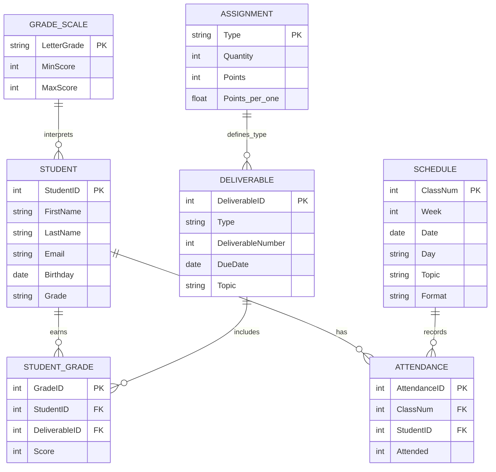

<!-- metadata: date="2026-03-08"; chapter="09"; section="lets-build"; title="Chapter 9 Let's Build"; description="Hands-on practice for database design" -->

# Let's Build: Chapter 9 -- ER Modeling in Practice


## Overview

This companion provides hands-on practice with the design concepts from Chapter 9. You will create Entity-Relationship Diagrams using two industry tools -- Lucidchart (visual, drag-and-drop) and Mermaid (text-based, code-friendly) -- and translate designs into SQL.

---

## Part I: Creating an ER Diagram with Lucidchart (Grading Database Case)

This section moves from theory into hands-on design. The goal is not just to draw a diagram, but to **think like a database designer**. We will use the **Grading Database** as our running example and create a complete Entity-Relationship Diagram using **Lucidchart**, a free, browser-based diagramming tool widely used in industry and academia.

At this stage, you are not writing SQL. You are designing structure.

### Why Start with Lucidchart?

Lucidchart is particularly well suited for learning ER modeling because it:

- Uses **visual, drag-and-drop elements**
- Supports **Crow's Foot notation**
- Makes **relationships and cardinalities explicit**
- Encourages *design-first thinking* before implementation

Most importantly, Lucidchart forces you to slow down and ask the right questions: What are the entities? How are they connected? Which relationships are required, optional, one-to-one, or one-to-many?

### Step 1: Set Up a New ER Diagram

1. Go to **lucidchart.com** and sign in using a Google or Microsoft account.
2. From the dashboard, click **New Document**.
3. Choose **Blank Diagram**.
4. In the left-hand shape library panel:
   - Enable **Entity Relationship** shapes (ERD or Crow's Foot).
   - You should now see shapes for **Entity**, **Relationship**, and **Attributes**.

### Step 2: Identify the Core Entities

Before drawing anything, recall what we already know from the previous chapters. The grading system is no longer one flat table. It consists of **multiple real-world entities**, each deserving its own table.

For the first ERD, we will focus on:

- **STUDENT**
- **DELIVERABLE**
- **STUDENT_GRADE** (junction/associative entity)
- **ASSIGNMENT**
- **ATTENDANCE**
- **SCHEDULE**
- **GRADE_SCALE**

Start with **entities first**, attributes second, and relationships third.

### Step 3: Create Entity Boxes

Drag an **Entity** shape onto the canvas for each table.

**Example -- STUDENT Entity:**

```
STUDENT
-------------------------
PK  StudentID
    FirstName
    LastName
    Email
    Birthday
    Grade
```

Conventions to follow:

- Prefix primary keys with **PK**
- Use clear, descriptive attribute names
- Do not include foreign keys yet (those emerge from relationships)

Repeat this process for the other entities:

```
DELIVERABLE
-------------------------
PK  DeliverableID
    Type
    DeliverableNumber
    DueDate
    Topic
```

```
STUDENT_GRADE
-------------------------
PK  GradeID
FK  StudentID
FK  DeliverableID
    Score
```

Notice that **STUDENT_GRADE** is an **associative (intersection) entity**, created to resolve the many-to-many relationship between STUDENT and DELIVERABLE.

### Step 4: Add Relationships

Draw **relationship connectors** between entities, starting with the most obvious connections:

- STUDENT -> STUDENT_GRADE
- DELIVERABLE -> STUDENT_GRADE
- STUDENT -> ATTENDANCE
- SCHEDULE -> ATTENDANCE
- ASSIGNMENT -> DELIVERABLE

At this stage, focus on *which entities are connected* before refining cardinality.

### Step 5: Apply Cardinality Using Crow's Foot Notation

Refine the diagram by adding **cardinality and optionality**.

Lucidchart allows you to specify one vs. many and required vs. optional on each end of a relationship line.

**Example -- STUDENT to STUDENT_GRADE:**

Ask the business questions:

- Can a student exist without grades? -> Yes (optional)
- Can a student have many grades? -> Yes (many)

So the relationship is:

- STUDENT: **optional many** (zero or more STUDENT_GRADE records)
- STUDENT_GRADE: **required one** (each record belongs to exactly one STUDENT)

Repeat this reasoning for each relationship.

### Step 6: Introduce Foreign Keys

Once relationships are clear, annotate **foreign keys** inside the child entities.

For example, in STUDENT_GRADE:

- `StudentID` is a foreign key referencing STUDENT
- `DeliverableID` is a foreign key referencing DELIVERABLE

At the ERD stage, you are not writing SQL -- you are asserting *dependency and ownership*. This is where design and normalization converge visually.

### Step 7: Validate the Diagram Against Business Rules

Before calling the ERD complete, validate it:

- Can the diagram answer:
  - "What grades does a student have?"
  - "Which deliverables are upcoming?"
  - "Who attended which class session?"
- Is every fact stored **once and only once**?
- Do relationships prevent impossible states (for example, a grade without a student)?

If the diagram feels cluttered, that is often a sign of missing entities, incorrect relationships, or attributes placed in the wrong table.

### What You Have Accomplished

By completing this Lucidchart ERD, you have:

- Translated business requirements into structure
- Designed a normalized schema visually
- Created a blueprint that can be implemented in Microsoft Access, SQLite, or PostgreSQL

Most importantly, you have **designed first and coded second** -- the hallmark of professional database development.

---

## Part II: Recreating the Grading Database ERD Using Mermaid

Lucidchart is excellent for visual design, but modern system development also benefits from **diagram-as-code**. Mermaid is a JavaScript-based tool that lets you write an ER diagram in plain text and render it automatically inside:

- GitHub README files
- Markdown-based textbooks and documentation
- VS Code (with a Mermaid preview extension)
- Static site generators and wikis

This is especially useful because your ERD becomes **versionable, editable, and portable**.

### Why Mermaid for ER Modeling?

Mermaid is valuable because it:

- Keeps your ERD **in the same place as your writing and SQL**
- Makes design changes **trackable through Git commits**
- Encourages consistent naming and clean schema thinking
- Integrates with AI tools for rapid generation and modification

The trade-off: Mermaid is less "drag-and-drop friendly," but much easier to maintain once you learn the syntax.

### Mermaid ER Diagram: The Grading Database Schema

Below is a Mermaid ER diagram that mirrors the same entities and relationships modeled in Lucidchart:



<details><summary>🎨 Image Generation Prompt (Static Version of Mermaid ERD)</summary>

**Filename**: `figure-10.14-grading-database-erd.png`
**Caption**: "Figure 10.14 -- Grading Database Entity-Relationship Diagram"
**Gemini Prompt**: "Create a professional, clean educational diagram for a college textbook showing an entity-relationship diagram for a Grading Database. Include seven entity rectangles: STUDENT (with StudentID PK, FirstName, LastName, Email, Birthday, Grade), DELIVERABLE (with DeliverableID PK, Type, DeliverableNumber, DueDate, Topic), STUDENT_GRADE (with GradeID PK, StudentID FK, DeliverableID FK, Score), ASSIGNMENT (with Type PK, Quantity, Points, Points_per_one), SCHEDULE (with ClassNum PK, Week, Date, Day, Topic, Format), ATTENDANCE (with AttendanceID PK, ClassNum FK, StudentID FK, Attended), and GRADE_SCALE (with LetterGrade PK, MinScore, MaxScore). Connect them with Crow's Foot notation showing: STUDENT one-to-optional-many STUDENT_GRADE, DELIVERABLE one-to-optional-many STUDENT_GRADE, STUDENT one-to-optional-many ATTENDANCE, SCHEDULE one-to-optional-many ATTENDANCE, ASSIGNMENT one-to-optional-many DELIVERABLE, GRADE_SCALE one-to-optional-many STUDENT. Use a blue and warm-gold color palette. Modern flat design, white background. Minimal text labels -- only entity names and attribute names."

</details>

### How to Read Cardinalities in Mermaid

Mermaid uses a Crow's Foot-inspired syntax:

| Symbol | Meaning | Example Interpretation |
|--|--|--|
| `\|\|` | Exactly one (required) | Each grade belongs to one student |
| `o{` | Zero or many (optional many) | A student may have zero or many grades |
| `\|{` | One or many (required many) | A class must have at least one attendance record |
| `o\|` | Zero or one (optional one) | A record may or may not exist |
| `\|\|--o{` | One-to-many (optional on many) | One student can have many grades |

**Example:**

```mermaid
STUDENT ||--o{ STUDENT_GRADE : earns
```

Interpretation:

- Each STUDENT_GRADE row must reference exactly one STUDENT.
- A STUDENT can exist with zero, one, or many grade records.

This matches real grading logic: students can exist before grades are entered.

### Where to Render Mermaid Diagrams

- **GitHub / GitLab**: Mermaid renders automatically in Markdown files.
- **VS Code**: Install a Mermaid preview extension to see diagrams while writing.
- **Mermaid Live Editor** (mermaid.live): Useful for quick testing and debugging syntax.

### Practical Tip: Keep Mermaid and SQL Aligned

A productive workflow:

1. Write or update the Mermaid ERD
2. Implement the schema in SQL
3. Keep both under version control

Placing them side by side -- Mermaid ERD for visual structure, SQL DDL for implementation -- trains you to think like a designer, not just a coder.

### Checkpoint: Does This ERD Match Our Business Questions?

Use these validation checks:

- Can we list all grades for a student? -> Yes: STUDENT -> STUDENT_GRADE -> DELIVERABLE
- Can we identify upcoming deliverables and who has scores missing? -> Yes: DELIVERABLE + STUDENT_GRADE with LEFT JOIN
- Can we track attendance by class session? -> Yes: SCHEDULE -> ATTENDANCE -> STUDENT
- Can we translate numeric score ranges into letter grades? -> Yes: via GRADE_SCALE rules table

If the answer is "yes" across the board, the ERD is doing its job.

---

## Part III: Mermaid vs. Lucidchart -- Choosing the Right Tool

Both tools support ER modeling but serve different purposes and workflows. Understanding when to use each is part of becoming a competent system designer.

| Dimension | Lucidchart | Mermaid |
|--|--|--|
| **Primary Use** | Visual design and collaboration | Text-based, version-controlled diagrams |
| **Interface** | Drag-and-drop, graphical UI | Written syntax inside Markdown or code |
| **Learning Curve** | Very low (intuitive for beginners) | Moderate (requires learning syntax) |
| **Best For** | Early-stage design, brainstorming, group work | Documentation, reproducibility, technical workflows |
| **Collaboration** | Real-time visual collaboration | Asynchronous via Git and Markdown files |
| **Precision** | Easy to draw; rules depend on user discipline | Enforces structure through syntax |
| **Integration** | Standalone diagramming tool | Integrates directly with documentation and code |
| **Change Tracking** | Manual versioning | Automatic via text diffs (Git-friendly) |

**When to use Lucidchart**: Exploring ideas visually, collaborating with non-technical stakeholders, iterating quickly on relationships and layout.

**When to use Mermaid**: Documenting a finalized design, embedding diagrams in technical documentation, maintaining schemas alongside SQL and code.

> Lucidchart helps you *discover* the design. Mermaid helps you *preserve* the design.

In practice, professional workflows often use **both** -- Lucidchart for exploration and communication, Mermaid for documentation and long-term maintenance.

---

## Part IV: From ER Diagrams to CREATE TABLE Statements

Design does not end with a diagram. An ER diagram is the **blueprint**, not the final product. The next step is translating that blueprint into executable SQL.

### What an ER Diagram Already Gives You

A well-constructed ER diagram already contains everything needed to write `CREATE TABLE` statements:

- **Entities** -> Tables
- **Attributes** -> Columns
- **Primary Keys** -> `PRIMARY KEY` constraints
- **Relationships** -> `FOREIGN KEY` constraints
- **Cardinality and optionality** -> `NOT NULL`, foreign key placement, and junction tables

If your ER diagram is correct, the SQL almost writes itself.

### Example: Translating the Grading Database ER Model

From the ER model, we identify three core entities: STUDENT, DELIVERABLE, and STUDENT_GRADE (the junction table). Each becomes a table definition in SQL.

#### STUDENT

```sql
CREATE TABLE STUDENT (
    StudentID INTEGER PRIMARY KEY,
    FirstName TEXT NOT NULL,
    LastName TEXT NOT NULL,
    Email TEXT UNIQUE
);
```

What came directly from the ER diagram:

- `StudentID` identified as the primary key
- Name and email as attributes
- Email marked as unique

#### DELIVERABLE

```sql
CREATE TABLE DELIVERABLE (
    DeliverableID INTEGER PRIMARY KEY,
    Type TEXT NOT NULL,
    DeliverableNumber INTEGER NOT NULL,
    DueDate DATE
);
```

The ER diagram already told us:

- Deliverables are independent entities
- Each deliverable has a unique identifier
- Attributes describe the deliverable, not the student

#### STUDENT_GRADE (Junction Table)

```sql
CREATE TABLE STUDENT_GRADE (
    GradeID INTEGER PRIMARY KEY,
    StudentID INTEGER NOT NULL,
    DeliverableID INTEGER NOT NULL,
    Score REAL NOT NULL,
    FOREIGN KEY (StudentID) REFERENCES STUDENT(StudentID),
    FOREIGN KEY (DeliverableID) REFERENCES DELIVERABLE(DeliverableID)
);
```

This table exists **because of the ER diagram**:

- Many-to-many relationship between students and deliverables
- The relationship carries additional data (`Score`)
- Foreign keys enforce the relationship
- `NOT NULL` on foreign keys reflects the required participation shown in the diagram

### Referential Integrity in Practice

When implementing foreign keys, you must also decide what happens when a referenced record is modified or deleted. Common options include:

| Action | Behavior | When to Use |
|--|--|--|
| `ON DELETE CASCADE` | Automatically deletes child records when parent is deleted | Audit logs, temporary records |
| `ON DELETE RESTRICT` | Prevents deletion of parent if child records exist | Grading systems, financial records |
| `ON DELETE SET NULL` | Sets foreign key to NULL in child records when parent is deleted | Optional relationships |

For a grading system, `ON DELETE RESTRICT` is typically appropriate -- you should not be able to delete a student who has grade records.

### ER Modeling Prevents Common SQL Mistakes

Without ER modeling, developers often duplicate columns across tables, guess where foreign keys belong, forget to enforce constraints, and add "temporary" columns that become permanent problems. ER diagrams eliminate guesswork. They force you to **decide structure before writing code**.

### Automatic SQL Generation

One practical advantage of Lucidchart is that it can **generate SQL directly from an ER diagram**:

1. Select the ER diagram
2. Click **Export**
3. Choose **SQL / Database Schema**
4. Select the target database (PostgreSQL, MySQL, etc.)

Lucidchart will produce `CREATE TABLE` statements, primary key definitions, and foreign key constraints. This is useful for verifying design decisions, learning how diagrams map to SQL, and accelerating early implementation.

> **Important**: Generated SQL should always be **reviewed**, not blindly executed. Design decisions still require human judgment.

### Design First, SQL Second

Strong database systems follow a consistent pattern:

1. Understand the business problem
2. Model the structure visually (ER diagram)
3. Validate relationships and dependencies
4. Translate the model into SQL

Skipping the design phase leads to brittle systems that rely on ad-hoc fixes. Following it produces databases that are easier to query, safer to modify, and more resilient over time.

ER diagrams are not documentation artifacts. They are **decision-making tools**. `CREATE TABLE` statements are simply the implementation of those decisions.
