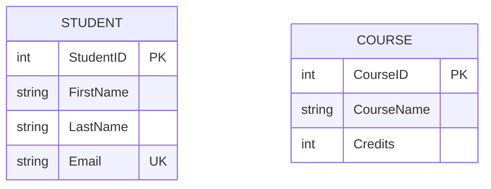
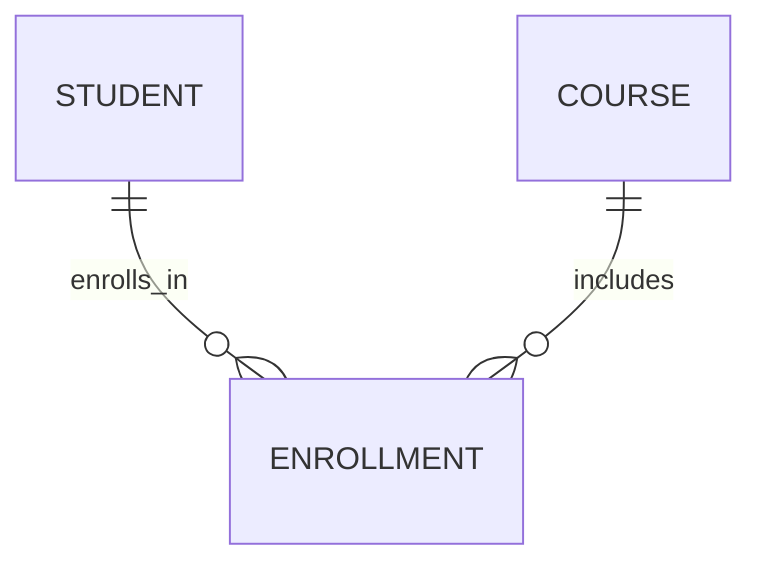
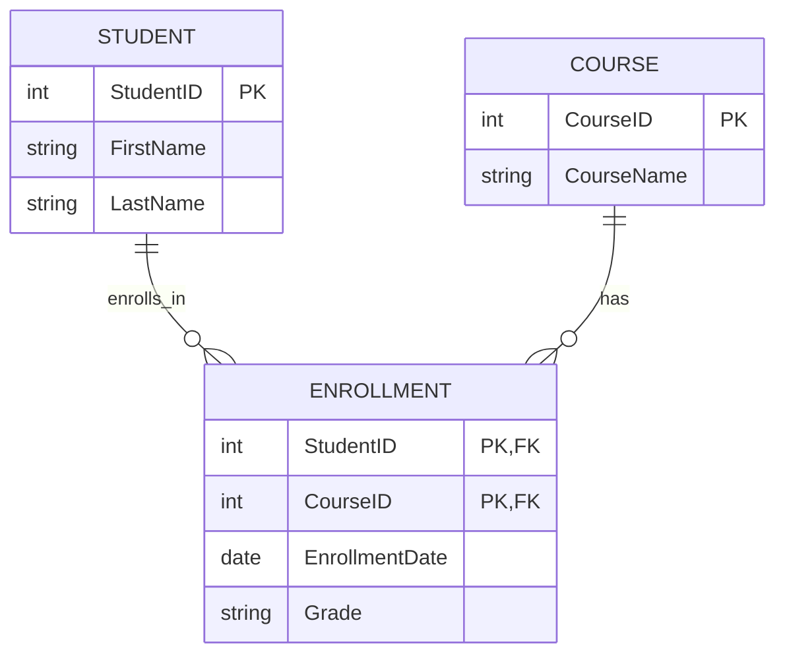
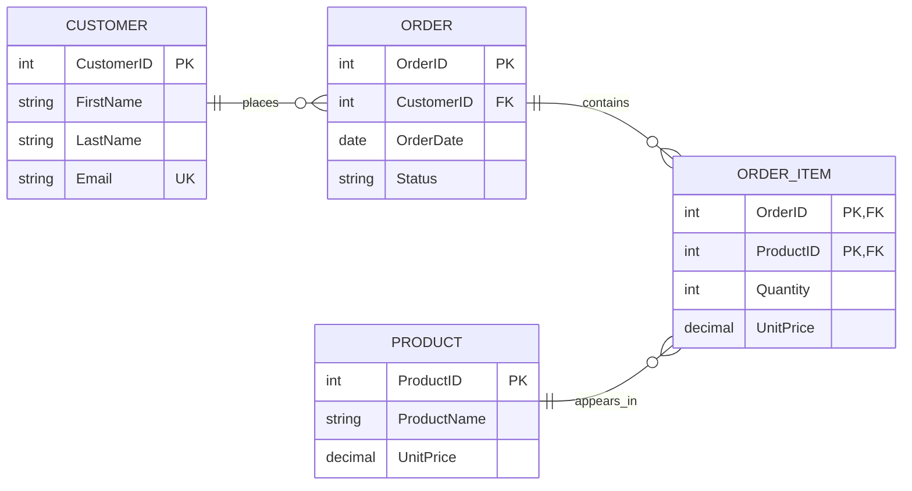

<!-- metadata: date="2026-06-11"; chapter="09"; type="source"; title="Source: Creating ERD with Lucidchart/Mermaid"; description="Source material for chapter 9" -->

## Practical Guide: Creating ERDs in Lucidchart and Mermaid

The conceptual side of data modeling matters, but students also need a practical workflow for turning business rules into actual diagrams. Two especially useful tools are **Lucidchart**, which supports visual drag-and-drop modeling, and **Mermaid**, which supports text-based “diagram as code” modeling. Lucidchart is especially strong for brainstorming, classroom collaboration, and stakeholder review, while Mermaid is excellent for documentation, version control, and quick schema sketches inside Markdown files or technical notes (Lucid Software, n.d.-a, n.d.-b; Mermaid, n.d.). ([Lucidchart][1])

### Before You Start — Model the Business Rules First

Before opening any tool, students should identify the **entities**, **attributes**, **keys**, and **relationship rules** that the diagram must represent. In other words, the diagram should begin with business meaning, not with box-drawing enthusiasm. A useful starting checklist is: What are the main things the organization wants to track? What uniquely identifies each one? How are they related? Which relationships are optional, mandatory, one-to-many, or many-to-many? This approach aligns with both standard ERD practice and Lucidchart’s own guidance that ERDs are used to identify entities, attributes, and relationships before or during database design (Lucid Software, n.d.-a; Mermaid, n.d.). ([Lucidchart][2])

For example, in a university registration system, the initial design decisions might look like this:

* `STUDENT` — identified by `StudentID`
* `COURSE` — identified by `CourseID`
* `ENROLLMENT` — associative entity connecting students and courses
* business rules:

  * a student can enroll in many courses;
  * a course can include many students;
  * each enrollment stores a date and grade.

Once that logic is clear, the tool becomes much easier to use because the model already has a backbone.

---

## Creating ERDs in Lucidchart

### Why Lucidchart Works Well for ERDs

Lucidchart’s current ERD workflow emphasizes three major strengths: using templates, manually building diagrams from ERD shape libraries, and importing database structures when appropriate. Lucid’s official materials also stress collaboration, customization, and easy sharing, which makes the platform especially suitable for classroom use, team projects, and iterative design review (Lucid Software, n.d.-a, n.d.-b). ([Lucidchart][1])

### Step-by-Step Guide: Building an ERD in Lucidchart

#### Step 1 — Open Lucidchart and choose how to begin

Lucidchart allows users to start from a **template**, a **blank canvas**, or an **imported source**. For beginners, starting from a template is often the fastest path because it already includes ERD-friendly shapes and formatting conventions. Lucid’s current documentation specifically recommends searching the template gallery for entity-relationship templates and then customizing from there (Lucid Software, n.d.-a, n.d.-b). ([Lucidchart][1])

#### Step 2 — Enable the ERD shape library

If starting from a blank canvas, open the shape manager and enable the **Entity Relationship** or **Crow’s Foot** shape library. This gives you access to entity boxes, relationship connectors, and notation-friendly shapes. Lucid’s Crow’s Foot templates are designed specifically to help users illustrate relationships in relational databases and debug existing models more clearly (Lucid Software, n.d.-b). ([Lucid Software][3])

#### Step 3 — Add the entities first

Drag entity boxes onto the canvas and name them with clear singular nouns such as `STUDENT`, `COURSE`, `INSTRUCTOR`, or `ORDER`. In database modeling, singular nouns improve readability because each box represents one type of thing rather than a vague collection. Lucid’s ERD guidance similarly frames ERDs around named entities and their relationships (Lucid Software, n.d.-a). ([Lucidchart][2])

#### Step 4 — Add attributes and mark keys

Inside each entity, list the important attributes. Mark the **primary key** clearly, and add likely foreign keys where the logical model requires them. A simple first draft may include only core fields; later drafts can add more detail. For example:

* `STUDENT(StudentID, FirstName, LastName, Email)`
* `COURSE(CourseID, CourseName, Credits)`
* `ENROLLMENT(StudentID, CourseID, EnrollmentDate, Grade)`

Lucid’s ERD workflow explicitly supports editing entity shapes, adding fields, and refining attributes as the model develops (Lucid Software, n.d.-a). ([Lucidchart][1])

#### Step 5 — Draw relationships using Crow’s Foot notation

Now connect the entities with relationship lines and set the correct cardinality at each end. For example, `STUDENT` to `ENROLLMENT` is one-to-many, and `COURSE` to `ENROLLMENT` is also one-to-many. If the original business rule is many-to-many, Lucidchart users should resolve it by introducing an associative entity such as `ENROLLMENT`, `ORDER_ITEM`, or `MEMBERSHIP`. Lucid’s templates and ERD tutorials are built around this exact kind of Crow’s Foot-based relational modeling (Lucid Software, n.d.-a, n.d.-b). ([Lucidchart][1])

#### Step 6 — Format for readability

After the structure is correct, improve readability by aligning entities, reducing line crossings, grouping related areas, and using consistent naming. Lucidchart’s interface supports styling, formatting, and conditional highlighting, which can make a classroom or project ERD much easier to interpret (Lucid Software, n.d.-a, n.d.-b). ([Lucidchart][1])

#### Step 7 — Review, revise, and share

Lucidchart is particularly useful because diagrams can be shared and reviewed collaboratively. That matters pedagogically: ERDs improve through critique. Students often discover missing entities, weak naming choices, or unresolved many-to-many relationships only after someone else reads the model and asks, “Wait — what exactly does this relationship mean?” Lucid’s official materials explicitly present sharing and collaboration as part of the ERD workflow rather than an afterthought (Lucid Software, n.d.-a, n.d.-b). ([Lucidchart][1])

### A Simple Lucidchart Workflow Example

Suppose you are modeling a grading system. A clean Lucidchart process would be:

1. Add `STUDENT`, `DELIVERABLE`, and `STUDENT_GRADE`.
2. Mark `StudentID` and `DeliverableID` as keys in the parent entities.
3. Create `STUDENT_GRADE` as the associative entity with `GradeID` or a composite key.
4. Connect `STUDENT` to `STUDENT_GRADE` with one-to-many.
5. Connect `DELIVERABLE` to `STUDENT_GRADE` with one-to-many.
6. Add attributes such as `Score`, `SubmissionDate`, and `FeedbackStatus`.
7. Rearrange and label until the logic is obvious.

That is a small but realistic example of turning business rules into a relational model.

---

## Creating ERDs in Mermaid

### Why Mermaid Is Useful

Mermaid takes a very different approach. Instead of drawing visually, the user writes a diagram in text. The official Mermaid documentation explains that ER diagrams are created with `erDiagram` syntax, entity definitions, attributes, and relationship statements using Crow’s Foot notation. Mermaid also supports keys such as `PK`, `FK`, and `UK`, comments on attributes, aliases, and layout direction such as `TB` or `LR` (Mermaid, n.d.). ([Mermaid][4])

This text-based approach is powerful because it is **version-control friendly**, easy to embed inside Markdown documentation, and quick to edit when database requirements change. Your uploaded Mermaid notes emphasize the same advantages — especially maintainability, readability, and direct integration into technical documentation. 

### Step-by-Step Guide: Building an ERD in Mermaid

#### Step 1 — Start with the `erDiagram` declaration

Every Mermaid ERD begins with the line:

```mermaid
erDiagram
```

This tells Mermaid that the following content should be parsed as an entity-relationship diagram (Mermaid, n.d.). ([Mermaid][4])

#### Step 2 — Define the entities

Each entity is written as a named block with attributes inside curly braces. Mermaid allows a type, an attribute name, and optional markers such as `PK`, `FK`, or `UK`. The official documentation notes that the attribute format is essentially `type name`, with optional key indicators and comments (Mermaid, n.d.). ([Mermaid][4])

Example:



#### Step 3 — Add relationships using Crow’s Foot syntax

Mermaid expresses relationships with a compact line syntax. The official documentation explains the general pattern as:

`<first-entity> [<relationship> <second-entity> : <relationship-label>]`

It also explains the cardinality markers, including `||` for exactly one, `|{` for one or more, `o|` for zero or one, and `o{` for zero or more (Mermaid, n.d.). ([Mermaid][4])

Example:



That means one student can appear in zero or more enrollment records, and one course can appear in zero or more enrollment records.

#### Step 4 — Add the associative entity for many-to-many relationships

In relational design, a many-to-many relationship normally becomes an associative entity. In Mermaid, this is written as another entity block with the foreign keys and any relationship attributes.



Mermaid’s documentation specifically supports multiple key markers on one attribute, such as `PK, FK`, which is especially useful for junction tables and associative entities (Mermaid, n.d.). ([Mermaid][4])

#### Step 5 — Control the direction if needed

Large diagrams can become messy quickly, so Mermaid supports directional control. The official syntax allows `TB` for top-to-bottom, `BT` for bottom-to-top, `LR` for left-to-right, and `RL` for right-to-left (Mermaid, n.d.). ([Mermaid][4])

Example:

```mermaid
erDiagram
    direction LR
```

This is especially useful when you want parent tables on the left and child tables on the right.

#### Step 6 — Use comments and keep the file readable

Mermaid diagrams are easier to maintain when they are organized in logical groups. For example, put user-related entities together, order-related entities together, and comment complex areas. Your uploaded Mermaid guide recommends grouping related entities, using descriptive relationship labels, and breaking very large schemas into several smaller diagrams rather than forcing everything into one unreadable monster diagram. 

---

## Lucidchart vs. Mermaid — When to Use Which

| Tool           | Best use case                                               | Main strength                                                | Main limitation                                      |
| -------------- | ----------------------------------------------------------- | ------------------------------------------------------------ | ---------------------------------------------------- |
| **Lucidchart** | Classroom design, stakeholder review, team collaboration    | Visual editing, templates, sharing, easy rearrangement       | Less ideal for version control of the diagram itself |
| **Mermaid**    | Technical documentation, Markdown notes, Git-based projects | Text-based, portable, reproducible, version-control friendly | Harder for beginners who think visually first        |

This distinction reflects the current strengths described in Lucid’s ERD materials and Mermaid’s official ERD syntax documentation (Lucid Software, n.d.-a, n.d.-b; Mermaid, n.d.). ([Lucidchart][1])

A practical teaching recommendation is to use **Lucidchart first** when students are learning ERD logic, then introduce **Mermaid** once they are ready to document schemas in a more technical and reproducible way. That sequence reduces cognitive overload while still exposing students to modern documentation practices.

---

## A Short Teaching Example Using Both Tools

Suppose the business rule is:

* one customer can place many orders;
* one order belongs to exactly one customer;
* one order can contain many order items;
* one product can appear in many order items.

In **Lucidchart**, students would drag out `CUSTOMER`, `ORDER`, `ORDER_ITEM`, and `PRODUCT`, add keys and attributes, then connect them with Crow’s Foot lines.

In **Mermaid**, the same model might be written as:



The logic is identical. Only the interface changes.

---

## Common Mistakes Students Make in Both Tools

Students often make the same design mistakes whether they use Lucidchart or Mermaid:

* treating a many-to-many relationship as if it can remain direct in a relational database;
* forgetting to identify the primary key;
* using weak relationship labels such as “has” when a more precise verb is available;
* overloading one entity with too many unrelated attributes; and
* drawing the diagram before clarifying the business rules.

Those are modeling problems, not software problems — and no tool can rescue a design that has not actually been thought through.

---

## References

Lucid Software. (n.d.-a). *ERDs in Lucidchart*. Lucidchart. ([Lucidchart][1])

Lucid Software. (n.d.-b). *Database ER diagram (crow’s foot) template*. Lucid. ([Lucid Software][3])

Lucid Software. (n.d.-c). *What is an entity relationship diagram (ERD)?* Lucidchart. ([Lucidchart][2])

Mermaid. (n.d.). *Entity relationship diagrams*. Mermaid Documentation. ([Mermaid][4])

If you want, I can now merge this directly into your full chapter and format it as a polished **chapter subsection with numbered headings, boxed tips, exercises, and a mini-lab**.

[1]: https://www.lucidchart.com/blog/entity-relationship-diagrams-in-lucidchart?utm_source=chatgpt.com "ERDs in Lucidchart | Lucidchart"
[2]: https://www.lucidchart.com/pages/nl/tutorial/erd?utm_source=chatgpt.com "Wat is een Entity Relationship Diagram (ERD) | Lucidchart"
[3]: https://lucid.co/templates/database-er-diagram-crows-foot?utm_source=chatgpt.com "Database ER diagram (crow's foot) Template | Lucid"
[4]: https://mermaid.js.org/syntax/entityRelationshipDiagram.html "Entity Relationship Diagrams | Mermaid"
