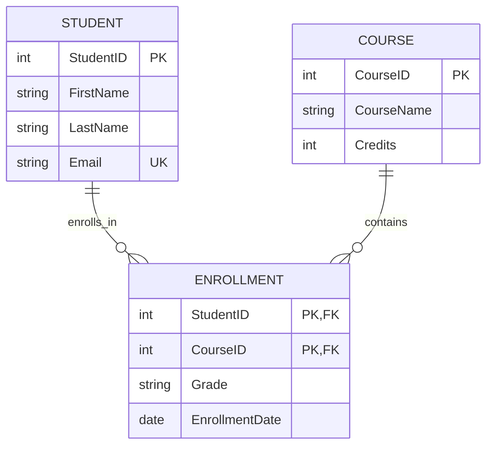

<!-- metadata: date="2026-06-11"; chapter="09"; type="source"; title="Source: GPT Sources Summary"; description="Source material for chapter 9" -->

## Highlights

* This chapter treats database modeling as a **design discipline**, not just a diagramming exercise.
* It explains **ERD fundamentals, the four main Crow’s Foot symbols, advanced modeling constructs, and relational implementation**.
* It also includes a **practical Lucidchart workflow** and a short **Mermaid subsection** for code-based ERDs.

---

# Chapter: Database Modeling and Design

## From Business Requirements to Reliable Database Structures

### Learning Objectives

By the end of this chapter, students should be able to:

* explain why database design matters for data quality, maintainability, and performance;
* distinguish among **conceptual, logical, and physical** database design;
* identify and model **entities, attributes, identifiers, relationships, cardinality, and participation**;
* interpret and apply **Crow’s Foot notation**, especially its four core relationship markers;
* model **weak entities, associative entities, subtype/supertype structures, and recursive relationships**;
* translate an ERD into a relational design using **primary keys, foreign keys, intersection tables, and normalization**;
* create and refine ERDs in **Lucidchart**; and
* recognize when a text-based approach such as **Mermaid** is useful for documentation and collaboration (Chen, 1976; Kroenke et al., 2020; Lucid Software, n.d.-a; Mermaid, n.d.; Microsoft, n.d.). ([DBLP][1])   

---

## 1. Why Database Modeling Matters

A database is never just a pile of tables. It is a representation of how an organization understands its world — customers, students, invoices, departments, products, orders, grades, and the rules that connect them. Good design improves clarity, reduces redundancy, supports change, and makes it easier to retrieve trustworthy information. Poor design produces the usual parade of misery: duplicated data, inconsistent updates, awkward queries, and business rules enforced only by hope and caffeine (Chen, 1976; Microsoft, n.d.). ([DBLP][1]) 

Database design is also inseparable from systems analysis. In the BITM330 materials, database development is positioned within the broader systems development life cycle: requirements are gathered, the system is designed, the database is created, and then the system is maintained over time. In other words, modeling comes before implementation for a reason — because building first and thinking later is a spectacularly efficient way to create technical debt (Kroenke et al., 2020).  

---

## 2. The Database Design Process

A useful way to teach database modeling is to distinguish among **requirements analysis**, **conceptual design**, **logical design**, and **physical design**. Requirements analysis asks what information the organization needs and what rules govern it. Conceptual design identifies the major entities and relationships. Logical design translates those ideas into table-oriented structures and constraints. Physical design specifies implementation details such as data types, indexing, defaults, and storage choices (Kroenke et al., 2020; Lucid Software, n.d.-a). ([lucidchart.com][2])   

### The Three Design Levels

| Level      | Main question                           | Typical focus                                     |
| ---------- | --------------------------------------- | ------------------------------------------------- |
| Conceptual | What exists in the domain?              | Entities, relationships, core business rules      |
| Logical    | How should the data be structured?      | Tables, keys, normalization, cardinality          |
| Physical   | How will this be implemented in a DBMS? | Data types, constraints, indexes, storage details |

This layered approach matters because each level solves a different problem. Conceptual design is about business meaning. Logical design is about structural correctness. Physical design is about implementation efficiency. Mixing them too early often confuses stakeholders and produces diagrams that are either too vague for developers or too technical for business users (Lucid Software, n.d.-a; Microsoft, n.d.). ([lucidchart.com][2])

---

## 3. ERDs: The Core Language of Database Modeling

The **entity-relationship model** was formalized by Peter Chen and remains one of the most influential ways to represent data requirements before implementation. ERDs help designers show what things matter in a system, what properties describe them, and how they are related. That is why ERDs remain central in database education and practice decades after their introduction (Chen, 1976). ([DBLP][1])

### 3.1 Entities

An **entity** is a person, object, event, or concept about which the organization wants to store data. Typical examples include `STUDENT`, `COURSE`, `CUSTOMER`, `ORDER`, or `PRODUCT`. Course materials correctly emphasize the distinction between an **entity class** and an **entity instance**: `STUDENT` is a class, while one specific student record is an instance (Kroenke et al., 2020). 

A good practical rule is this: if the business talks about it repeatedly, asks questions about it, and wants to store facts about it, it is probably an entity. If you find yourself naming entities with vague labels like “Data” or “Info,” the model is already waving a small red flag.

### 3.2 Attributes

**Attributes** describe entities. A student may have `StudentID`, `FirstName`, `LastName`, `Email`, and `EnrollmentDate`. A product may have `ProductID`, `Description`, `UnitPrice`, and `QuantityOnHand`. Attributes can be simple or composite, single-valued or multi-valued, stored or derived. For example, `Address` may be composite because it can be separated into `Street`, `City`, `State`, and `ZIP`; `Age` may be derived from `DateOfBirth` rather than stored directly (Chen, 1976; Lucid Software, n.d.-a). ([DBLP][1]) 

### 3.3 Identifiers and Keys

An **identifier** is an attribute — or combination of attributes — that distinguishes one entity instance from another. Course materials differentiate between unique and nonunique identifiers, which is essential for understanding why `StudentID` is a better key than `StudentName`. The same logic extends to **primary keys**, **candidate keys**, and **foreign keys** in relational design (Kroenke et al., 2020; Lucid Software, n.d.-a).   ([lucidchart.com][3])

### 3.4 Relationships

A **relationship** shows how entities are associated. `STUDENT` enrolls in `COURSE`; `CUSTOMER` places `ORDER`; `DEPARTMENT` employs `EMPLOYEE`. Relationships can be **binary** when they involve two entity types or **ternary** when they involve three. In teaching, binary relationships dominate because they map most directly to common database structures, but ternary relationships still matter when a three-way interaction cannot be simplified without losing meaning (Kroenke et al., 2020).  

---

## 4. Cardinality, Participation, and Crow’s Foot Notation

One of the most important jobs of an ERD is to express **business rules**. Not every customer places many orders. Not every department must have an employee immediately. Not every course currently has enrollments. These distinctions are captured through **cardinality** and **participation** (Chen, 1976; Lucid Software, n.d.-a). ([DBLP][1]) 

### 4.1 Cardinality

Cardinality tells us how many instances of one entity may be associated with another. Standard relationship types are:

* **1:1** — one-to-one
* **1:N** — one-to-many
* **N:M** — many-to-many

The BITM330 materials define **maximum cardinality** as the maximum number of entity instances that may participate in a relationship instance, and **minimum cardinality** as the minimum number that must participate. Minimum cardinality usually boils down to **optional (0)** or **mandatory (1)** participation (Kroenke et al., 2020). 

### 4.2 The Four Main Crow’s Foot Markers

Crow’s Foot notation is especially popular because it makes relationship rules visually compact. In the course materials, the four core markers are presented as the following combinations (Kroenke et al., 2020): 

| Crow’s Foot meaning | Business meaning |
| ------------------- | ---------------- |
| **Mandatory one**   | Exactly one      |
| **Optional one**    | Zero or one      |
| **Mandatory many**  | One or more      |
| **Optional many**   | Zero or more     |

In plain English, these four patterns are the real grammar of Crow’s Foot. If students truly understand them, they can read most ERDs. If they do not, the diagram becomes decorative wall art with attitude.

### 4.3 Traditional ER vs. Crow’s Foot

Traditional ER notation often uses rectangles for entities and diamonds for relationships, while Crow’s Foot uses lines plus endpoint markers to express both minimum and maximum participation. The course materials explicitly describe Crow’s Foot as the Information Engineering model, where the crow’s foot indicates “many,” a line indicates “one,” and optionality is expressed separately (Kroenke et al., 2020).  

---

## 5. Advanced ERD Constructs

### 5.1 Weak Entities

A **weak entity** cannot exist meaningfully without another entity. The BITM330 materials distinguish between a weak entity and a strong entity very clearly: a weak entity depends on another entity for existence, while a strong entity does not. An **ID-dependent weak entity** uses a composite identifier that includes the parent’s key; the relationship is **identifying**. A **non-ID-dependent weak entity** still depends conceptually on a parent, but its identifier does not have to include the parent’s key; the parent key still appears as a foreign key (Kroenke et al., 2020).  

A classic example is `ORDER_LINE`. An order line has no independent meaning without an `ORDER`. If you delete the order, the order line is semantically stranded — and databases, much like faculty meetings, contain enough stranded things already.

### 5.2 Associative Entities

An **associative entity** is used when a pure many-to-many relationship needs attributes of its own. The course materials define it as a new entity created to link the two original entities and hold attributes describing the relationship itself. For example, `ENROLLMENT` can connect `STUDENT` and `COURSE` while also storing `EnrollmentDate`, `Grade`, or `Status` (Kroenke et al., 2020). 

This idea is fundamental because many real systems are not just about whether two entities are connected, but about **how** they are connected. The relationship itself becomes data.

### 5.3 Subtypes and Supertypes

A **subtype** is a special case of a broader **supertype**. The materials explain that a supertype can include a **discriminator** attribute that determines which subtype applies, and that subtype structures can be **exclusive** or **inclusive**. The identifier of a subtype is the same as the identifier of the supertype because the subtype is still the same entity, just with additional specialization (Kroenke et al., 2020). 

For example, `EMPLOYEE` may have subtypes such as `FACULTY` and `STAFF`; `VEHICLE` may have `CAR` and `TRUCK`. Subtypes are useful when some attributes apply only to a subset of instances and you do not want to clutter the main entity with many sparsely populated columns.

### 5.4 Recursive Relationships

A **recursive** or **unary** relationship occurs when an entity relates to itself. The course materials note that a recursive relationship is a relationship among entities of the same class. Typical examples include `EMPLOYEE manages EMPLOYEE`, `COURSE requires COURSE`, or `PERSON refers PERSON` (Kroenke et al., 2020).  

Recursive structures are common in hierarchies. They deserve careful naming because poor labels make them harder to read than they need to be.

---

## 6. From ERD to Relational Design

Designing an ERD is only half the job. Eventually, the model must become tables that a DBMS can implement. That translation is where many students realize that conceptual elegance and implementation discipline are related, but not identical (Kroenke et al., 2020; Microsoft, n.d.).  ([Microsoft Support][4])

### 6.1 Mapping Common Relationships

The BITM330 design materials summarize the standard mapping rules well:

* In a **1:1** relationship, the key from one table can be placed in the other as a foreign key.
* In a **1:N** relationship, the parent key goes into the **many-side** as a foreign key.
* In an **N:M** relationship, a new **intersection table** is created, containing the keys from both related tables as a composite key (Kroenke et al., 2020).  

### 6.2 Example

Suppose we begin with this conceptual rule:

* A student can enroll in many courses.
* A course can have many students.
* Each enrollment stores a grade.

The relational implementation becomes:

* `STUDENT(StudentID, …)`
* `COURSE(CourseID, …)`
* `ENROLLMENT(StudentID, CourseID, Grade, EnrollmentDate)`

That third table is not an afterthought. It is the correct implementation of the many-to-many relationship because the relationship itself contains data.

### 6.3 Column Properties and Constraints

Physical design requires specifying data types, nullability, defaults, and constraints. The course materials emphasize that column properties must be defined for each table and that physical design moves the model from abstraction to implementable database specifications (Kroenke et al., 2020). 

A practical relational table does not stop at names. It also needs decisions such as:

* `StudentID INT PRIMARY KEY`
* `Email VARCHAR(100) UNIQUE`
* `EnrollmentDate DATE NOT NULL`
* `CourseID INT NOT NULL REFERENCES COURSE(CourseID)`

That is where database design stops being sketching and starts becoming engineering.

---

## 7. Normalization and Denormalization

Normalization is the formal process of structuring tables to reduce redundancy and prevent anomalies. Microsoft’s database design guidance emphasizes that normalization is especially useful after a preliminary design has been formed, because it helps verify whether information has been divided into the right tables. The same source also summarizes the first three normal forms in standard terms: atomic values for 1NF, full dependency on the whole primary key for 2NF, and independence of non-key attributes from one another for 3NF (Microsoft, n.d.). ([Microsoft Support][4])

### 7.1 The First Three Normal Forms

| Normal form | Main rule                                                                    |
| ----------- | ---------------------------------------------------------------------------- |
| **1NF**     | Each field contains one value only; no repeating groups                      |
| **2NF**     | Every non-key attribute depends on the whole key                             |
| **3NF**     | Non-key attributes depend on the key, the whole key, and nothing but the key |

In teaching, students often understand 1NF quickly, struggle with 2NF, and then pretend 3NF is just a philosophical mood. It is not. It is what keeps tables from hiding dependencies in places they do not belong.

### 7.2 Denormalization

The course materials also point out an important counterbalance: normalization is not the only goal. Denormalization may sometimes be chosen to improve performance, especially when repeated joins create unnecessary complexity for read-heavy systems. In other words, good design is a balance between structural purity and practical performance (Kroenke et al., 2020). 

This is a mature point, and an important one. Normalization is a design principle, not a religion.

---

## 8. Implementing ERDs in Lucidchart

Lucidchart is a practical tool for ERD creation because it supports blank canvases, templates, notation libraries, formatting, and team sharing. Its own ERD guidance states that users can start with a template, a blank workspace, or an imported document; add shapes, symbols, and notation lines; customize style and formatting; and then share the diagram for collaboration (Lucid Software, n.d.-a). ([lucidchart.com][3])

### 8.1 A Practical Lucidchart Workflow

#### Step 1 — Start the document

Open Lucidchart and either choose an ERD template or start with a blank canvas. For Crow’s Foot specifically, Lucid provides a dedicated database ER diagram template using Crow’s Foot notation, intended for database design and debugging (Lucid Software, n.d.-b). ([Lucid Software][5])

#### Step 2 — Identify entities from requirements

Begin from nouns in the business description. In a university example, likely entities are `STUDENT`, `COURSE`, `INSTRUCTOR`, and perhaps `ENROLLMENT`. Lucid’s tutorial frames ERDs as representations of entities, relationships, and attributes, which makes this noun-first approach appropriate (Lucid Software, n.d.-a). ([lucidchart.com][3])

#### Step 3 — Add attributes and keys

Inside each entity box, add the attributes that describe the entity. Mark the identifier clearly. At the conceptual stage, you may include only the most important attributes. At the logical stage, include primary keys and relevant foreign keys. Lucid’s ERD guidance explicitly supports conceptual, logical, and physical levels of modeling, which is useful when deciding how much detail to show (Lucid Software, n.d.-a). ([lucidchart.com][3])

#### Step 4 — Connect entities with the correct notation

Draw relationships and set their endpoints using Crow’s Foot notation. This is the stage where you decide whether the relationship is one-to-one, one-to-many, or many-to-many, and whether participation is optional or mandatory. Lucid’s ERD resources and Crow’s Foot templates are built precisely for this type of relationship modeling (Lucid Software, n.d.-a, n.d.-b). ([lucidchart.com][3])

#### Step 5 — Refine the model

Check for hidden many-to-many relationships, missing foreign keys, overloaded entities, and missing business rules. If a relationship has attributes of its own, consider whether it should become an associative entity. If one entity cannot exist without another, consider whether you are dealing with a weak entity. Lucid’s resources also note that ERDs are valuable not only for design, but for debugging existing database logic (Lucid Software, n.d.-a). ([lucidchart.com][3])

#### Step 6 — Share and review

Once the diagram is readable, share it with collaborators. Lucid emphasizes team sharing and collaboration as part of the ERD workflow, which is especially useful in classroom projects and group-based database design assignments (Lucid Software, n.d.-a). ([lucidchart.com][3])

### 8.2 What Lucidchart Is Especially Good At

Lucidchart is most useful when the modeling process is collaborative, visual, and iterative. It is particularly helpful for:

* classroom instruction;
* stakeholder review sessions;
* team projects;
* conceptual-to-logical transitions; and
* polished diagram presentation (Lucid Software, n.d.-a, n.d.-b). ([lucidchart.com][3])

---

## 9. Optional Subsection: Using Mermaid for ERDs

Although Lucidchart is strong for visual diagramming, Mermaid offers a useful **diagram-as-code** alternative. Mermaid’s ERD syntax is text-based, supports Crow’s Foot notation, allows attributes inside entity blocks, supports `PK`, `FK`, and `UK` markers, and lets users set diagram direction such as `TB` or `LR` (Mermaid, n.d.). ([Mermaid][6])

Mermaid can be especially valuable when the database design needs to live inside documentation, version control, or technical notes. The official documentation states that ER diagram statements use the form:

`<first-entity> [<relationship> <second-entity> : <relationship-label>]`

and that Mermaid uses the popular Crow’s Foot notation to express cardinality (Mermaid, n.d.). ([Mermaid][7])

### Example Mermaid ERD

This syntax is concise, readable, and portable. It is not always the best tool for collaborative classroom diagramming, but it is excellent for technical documentation and reproducible design notes (Mermaid, n.d.). ([Mermaid][7])

### Mermaid Inside Lucidchart

Lucidchart also supports Mermaid-driven diagram generation. Its Mermaid workflow page describes a process of opening Lucidchart, entering Mermaid code, generating a preview, refining the diagram, and then exporting or sharing it. Lucid also states that Mermaid syntax can be integrated directly into Lucidchart to create diagrams quickly (Lucid Software, n.d.-c). ([lucidchart.com][8])

That hybrid workflow is genuinely useful: sketch collaboratively in Lucidchart, document formally in Mermaid, and keep your design artifacts both visual and portable.

---

## 10. Common Mistakes in Database Modeling

### 10.1 Confusing entities with attributes

A frequent beginner mistake is modeling `Address`, `Email`, or `Price` as entities when they are really attributes — unless the business treats them as separate objects in their own right.

### 10.2 Ignoring many-to-many relationships

Many-to-many relationships are common in the real world but cannot usually remain “pure” in a relational implementation. They almost always need an intersection table or associative entity (Kroenke et al., 2020). 

### 10.3 Using vague relationship labels

A relationship label should say something meaningful, such as **enrolls in**, **places**, **belongs to**, or **manages**. If the label is vague, the model will be vague.

### 10.4 Treating diagrams as decoration

An ERD is not just a picture for an assignment submission. It is a logic model. If a business rule is not represented in the ERD, there is a good chance it will not be represented consistently in the database.

### 10.5 Overloading one table

A single huge table may look simple at first, but it often hides normalization problems, transitive dependencies, and update anomalies. Microsoft’s normalization guidance is especially useful here because it forces the designer to test whether each table structure is logically sound (Microsoft, n.d.). ([Microsoft Support][4])

---

## 11. A Short Worked Example

Suppose a business school wants to track students, courses, and enrollments.

### Conceptual view

* `STUDENT`
* `COURSE`
* `ENROLLMENT`

Business rules:

* A student may enroll in many courses.
* A course may contain many students.
* Each enrollment stores a grade and an enrollment date.

### Logical view

* `STUDENT(StudentID, FirstName, LastName, Email)`
* `COURSE(CourseID, CourseName, Credits)`
* `ENROLLMENT(StudentID, CourseID, Grade, EnrollmentDate)`

### Why this design works

This design correctly resolves the many-to-many relationship between `STUDENT` and `COURSE` into an associative entity, `ENROLLMENT`. It also avoids storing repeating course lists in the student table or repeating student lists in the course table, which would violate normalization principles and make updates harder to manage (Microsoft, n.d.; Kroenke et al., 2020). ([Microsoft Support][4]) 

If you were drawing this in Lucidchart, you would place three entities on the canvas, assign primary keys to `STUDENT` and `COURSE`, give `ENROLLMENT` the two foreign keys plus relationship attributes, and connect the entities with Crow’s Foot notation showing one-to-many from each parent table to `ENROLLMENT` (Lucid Software, n.d.-a, n.d.-b). ([lucidchart.com][3])

---

## Chapter Summary

Database modeling and design begin with understanding the business domain and end with implementable structures that a DBMS can enforce. ERDs provide the conceptual and logical bridge between requirements and tables. The key concepts are entities, attributes, identifiers, relationships, cardinality, and participation. Crow’s Foot notation is especially effective because it expresses the four core participation/cardinality combinations compactly. More advanced designs must also handle weak entities, associative entities, subtypes, and recursive relationships. From there, the model is translated into primary keys, foreign keys, intersection tables, and normalized relations. Tools such as Lucidchart make the modeling process visual and collaborative, while Mermaid provides a useful code-based alternative for documentation and reproducibility (Chen, 1976; Kroenke et al., 2020; Lucid Software, n.d.-a; Mermaid, n.d.; Microsoft, n.d.). ([DBLP][1])  

---

## References

Chen, P. P.-S. (1976). *The entity-relationship model—Toward a unified view of data*. *ACM Transactions on Database Systems, 1*(1), 9–36. ([DBLP][1])

Kroenke, D. M., Auer, D. J., Vandenberg, S. L., & Yoder, R. C. (2020). *Database concepts* (9th ed.). Pearson. ([Pearson][9])

Lucid Software. (n.d.-a). *Entity-relationship model*. Lucidchart. ([lucidchart.com][3])

Lucid Software. (n.d.-b). *Database ER diagram (crow’s foot) template*. Lucid. ([Lucid Software][5])

Lucid Software. (n.d.-c). *Mermaid diagram*. Lucidchart. ([lucidchart.com][8])

Mermaid. (n.d.). *Entity relationship diagrams*. ([Mermaid][6])

Microsoft. (n.d.). *Database design basics*. Microsoft Support. ([Microsoft Support][4])

If you want, I can turn this into a **chapter-ready Markdown file** with **boxed examples, key terms, review questions, and exercises**.

[1]: https://dblp.org/rec/journals/tods/Chen76?utm_source=chatgpt.com "dblp: The Entity-Relationship Model - Toward a Unified View of Data."
[2]: https://www.lucidchart.com/pages/de/tutorial/was-ist-ein-erd?utm_source=chatgpt.com "Was ist ein ERD? | ER-Modell Grundlagen und Beispiele | Lucidchart"
[3]: https://www.lucidchart.com/pages/de/tutorial/was-ist-ein-erd "Was ist ein ERD? | ER-Modell Grundlagen und Beispiele | Lucidchart"
[4]: https://support.microsoft.com/en-us/office/database-design-basics-eb2159cf-1e30-401a-8084-bd4f9c9ca1f5?utm_source=chatgpt.com "Database design basics - Microsoft Support"
[5]: https://lucid.co/templates/database-er-diagram-crows-foot?utm_source=chatgpt.com "Database ER diagram (crow's foot) Template | Lucid"
[6]: https://mermaid.js.org/syntax/entityRelationshipDiagram?utm_source=chatgpt.com "Entity Relationship Diagrams | Mermaid"
[7]: https://mermaid.js.org/syntax/entityRelationshipDiagram "Entity Relationship Diagrams | Mermaid"
[8]: https://www.lucidchart.com/pages/de/beispiele/mermaid-diagramm "Mermaid Diagramm – so einfach erstellen Sie ein Mermaid Diagramm"
[9]: https://www.pearson.com/us/higher-education/program/Kroenke-Database-Concepts-9th-Edition/PGM2048266.html?utm_source=chatgpt.com "Database Concepts"
