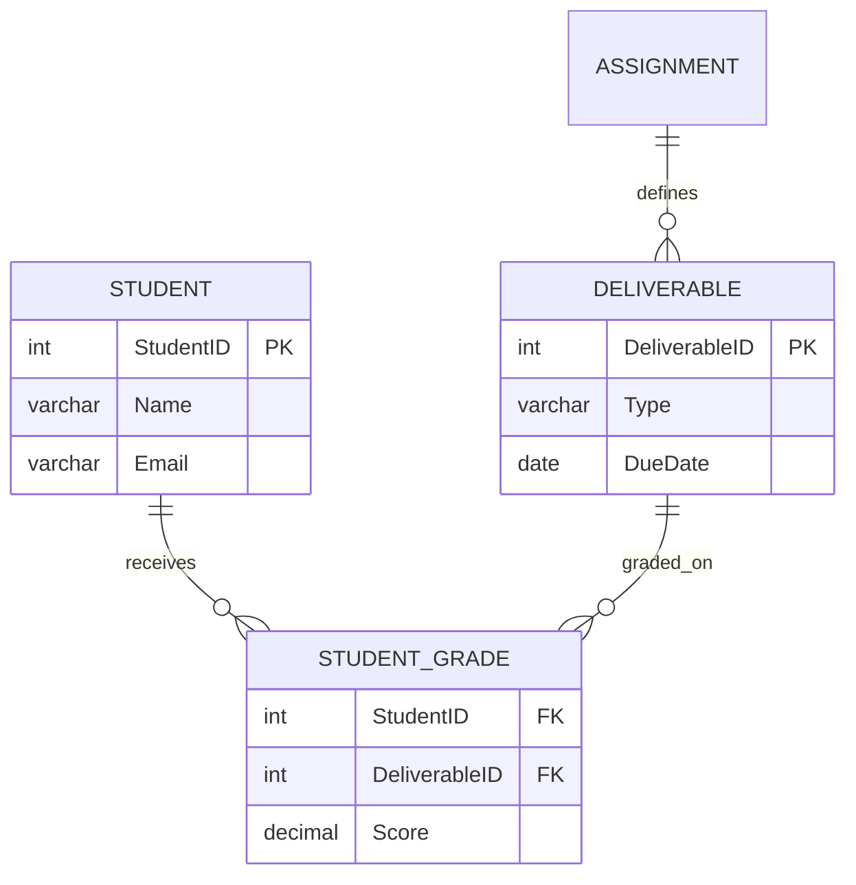

<!-- metadata: date="2026-06-11"; chapter="10"; type="source"; title="Source: ChatGPT Notebook"; description="Source material for chapter 10" -->

**Key highlights**

* A **textbook-grade Markdown chapter** suitable for your *BITM330* GitHub/Jupyter Book workflow.
* Includes **learning objectives, conceptual framing, schema diagrams (Mermaid), SQL examples, exercises, and teaching notes**.
* Organized to align with **database design → engineering → analytics → governance**, using the **grading database** as the longitudinal case.

---

# Chapter X

# Engineering Data Intelligence with Advanced SQL

## From Querying Tables to Designing Reliable Systems

> “Bad data structure does not improve when you layer visualization on top. Strong SQL design makes downstream analytics trustworthy.” 

---

# Learning Objectives

After completing this chapter, students should be able to:

1. Explain the difference between **querying data** and **engineering data systems**.
2. Diagnose **update, insert, and deletion anomalies** in poorly designed tables.
3. Transform flat data into a **normalized relational schema**.
4. Implement **business rules using constraints and indexes**.
5. Write advanced SQL queries using:

   * joins
   * aggregations
   * window functions
   * CTEs
6. Design **analytics pipelines directly inside SQL**.
7. Apply **governance and reliability principles** (ACID, transactions, triggers).

---

# 1. From Querying Data to Engineering Data Systems

SQL has two fundamentally different uses.

| Querying           | Data Engineering        |
| ------------------ | ----------------------- |
| Retrieve answers   | Build reliable systems  |
| Static tables      | Data pipelines          |
| Individual queries | Repeatable architecture |

### Engineering Mindset

A strong SQL engineer must think in terms of:

* **Relational Thinking** – connecting entities rather than isolated rows
* **Analytical Clarity** – structuring business questions into queries
* **Engineering Discipline** – building reusable, maintainable logic

---

# 2. Diagnosing Poor Data Design

Consider a flat table storing grades.

```id="5b6ti9"
GRADES_FLAT
(StudentID, Name, Email, Quiz, DueDate, Score)
```

| StudentID | Name  | Email                             | Quiz  | Score |
| --------- | ----- | --------------------------------- | ----- | ----- |
| 1         | Alice | [alice@u.edu](mailto:alice@u.edu) | Quiz1 | 85    |
| 1         | Alice | [alice@u.edu](mailto:alice@u.edu) | Quiz2 | 90    |
| 1         | Alice | [al@u.edu](mailto:al@u.edu)       | Quiz1 | 85    |

## Update Anomaly

Correcting Alice’s email requires multiple updates.

## Insert Anomaly

You cannot add a student unless they have a grade.

## Delete Anomaly

Deleting Bob’s only grade removes all his information.

---

## Detecting Structural Problems

```sql id="mec5qt"
SELECT StudentID,
       COUNT(DISTINCT Email)
FROM GRADES_FLAT
GROUP BY StudentID
HAVING COUNT(DISTINCT Email) > 1;
```

If SQL can detect inconsistency, **the schema allowed it**.

---

# 3. SQL-Driven Normalization

Normalization decomposes data into **independent entities**.

## Entity Extraction

### Students

```sql id="dtga22"
CREATE TABLE STUDENT AS
SELECT DISTINCT
       StudentID,
       Name,
       Email
FROM GRADES_FLAT;
```

### Deliverables

```sql id="c9b8se"
CREATE TABLE DELIVERABLE AS
SELECT
       Quiz AS DeliverableType,
       MIN(DueDate) AS DueDate
FROM GRADES_FLAT
GROUP BY Quiz;
```

---

# 4. The Relational Spine

Normalized schemas revolve around a **junction table**.



This structure eliminates redundancy while preserving relationships.

---

# 5. Reassembling Data with JOINs

Once normalized, SQL recombines data as needed.

```sql id="wti6ot"
SELECT
    s.Name,
    d.Type,
    sg.Score
FROM STUDENT s
JOIN STUDENT_GRADE sg
ON s.StudentID = sg.StudentID
JOIN DELIVERABLE d
ON sg.DeliverableID = d.DeliverableID;
```

The relational model allows us to **reconstruct views of reality dynamically**.

---

# 6. Encoding Business Rules in the Schema

Business policies must be enforced at the database level.

### Example rule

> One score per student per deliverable.

```sql id="h4bg8l"
ALTER TABLE STUDENT_GRADE
ADD CONSTRAINT unique_submission
UNIQUE (StudentID, DeliverableID);
```

Benefits:

* prevents duplicates
* simplifies application logic
* guarantees policy enforcement

---

# 7. Translating Raw Scores into Managerial Metrics

SQL converts operational data into **decision intelligence**.

```sql id="c4bnlp"
SELECT
  Score,
  CASE
     WHEN Score >= 90 THEN 'A'
     WHEN Score < 60 THEN 'F'
     ELSE 'Pass'
  END AS LetterGrade
FROM STUDENT_GRADE;
```

---

## Identifying At-Risk Students

```sql id="r9d5rv"
SELECT
  StudentID,
  AVG(Score) AS AverageScore,
  CASE
      WHEN AVG(Score) < 70 THEN 'At Risk'
      ELSE 'Good Standing'
  END AS Status
FROM STUDENT_GRADE
GROUP BY StudentID;
```

---

# 8. Time-Aware SQL

Databases can model **dynamic business logic**.

### Upcoming Deliverables

```sql id="itma7c"
SELECT *
FROM DELIVERABLE
WHERE DueDate BETWEEN CURRENT_DATE
AND CURRENT_DATE + INTERVAL '14 days';
```

---

# 9. Weighted Grade Calculations

Grades often involve weighted categories.

| Category  | Weight |
| --------- | ------ |
| Quizzes   | 20%    |
| Exercises | 30%    |
| Exams     | 50%    |

Example query:

```sql id="c2m1qg"
SELECT
    s.StudentID,
    SUM(sg.Score * a.Weight) / SUM(a.Weight) AS FinalGrade
FROM STUDENT_GRADE sg
JOIN ASSIGNMENT a
ON sg.DeliverableID = a.AssignmentID
JOIN STUDENT s
ON sg.StudentID = s.StudentID
GROUP BY s.StudentID;
```

---

# 10. Analytics with Window Functions

Traditional aggregation collapses rows.

Window functions preserve detail.

```sql id="rrsw57"
SELECT
    StudentID,
    Score,
    RANK() OVER (ORDER BY Score DESC) AS ClassRank,
    SUM(Score) OVER (PARTITION BY StudentID) AS RunningTotal
FROM STUDENT_GRADE;
```

Applications:

* class rankings
* running totals
* cohort comparisons

---

# 11. Designing Readable Pipelines with CTEs

Complex queries should be structured as **data pipelines**.

```sql id="9ppcrp"
WITH StudentAverages AS (
    SELECT
        StudentID,
        AVG(Score) AS AvgScore
    FROM STUDENT_GRADE
    GROUP BY StudentID
),
GradedStudents AS (
    SELECT *,
           CASE
             WHEN AvgScore >= 90 THEN 'A'
             ELSE 'B'
           END AS Grade
    FROM StudentAverages
)
SELECT *
FROM GradedStudents;
```

Benefits:

* readable logic
* modular transformations
* easier debugging

---

# 12. Creating Single Sources of Truth

Different stakeholders must rely on consistent definitions.

```sql id="gq7gg9"
CREATE VIEW GradebookSummary AS
SELECT
    StudentID,
    AVG(Score) AS AverageScore
FROM STUDENT_GRADE
GROUP BY StudentID;
```

Views ensure:

* standardized metrics
* shared analytics definitions

---

# 13. Indexes and Performance

Without indexes:

```
Full table scan
```

With indexes:

```
Direct lookup via index pointer
```

Example:

```sql id="tlm8so"
CREATE INDEX idx_student_grade
ON STUDENT_GRADE(StudentID, DeliverableID);
```

Trade-off:

| Benefit      | Cost          |
| ------------ | ------------- |
| Faster reads | Slower writes |

---

# 14. Transactions and Data Reliability

Database systems guarantee **ACID properties**.

```sql id="tgtmo0"
BEGIN;

UPDATE STUDENT_GRADE
SET Score = Score * 0.9;

COMMIT;
```

If an error occurs:

```sql id="xrhgyp"
ROLLBACK;
```

### ACID Principles

| Property    | Meaning                         |
| ----------- | ------------------------------- |
| Atomicity   | All operations succeed or none  |
| Consistency | Valid database state maintained |
| Isolation   | Safe concurrent execution       |
| Durability  | Data persists after failure     |

---

# 15. Self-Defending Data Architecture

Databases should actively protect themselves.

### Constraints

Prevent invalid states.

### Triggers

Automate auditing and rule enforcement.

```sql id="4cs9lu"
CREATE TRIGGER log_grade_change
AFTER UPDATE ON STUDENT_GRADE
FOR EACH ROW
EXECUTE FUNCTION insert_audit_log();
```

Triggers enable:

* audit trails
* automated governance

---

# 16. The SQL Intelligence Pipeline

Data engineering evolves through stages.


Strong SQL design turns **raw data into trusted intelligence systems**.

---

# Exercises

## Conceptual Questions

1. Explain why update anomalies occur in flat tables.
2. What role does the junction table play in normalization?
3. Why should business rules be implemented as constraints?

---

## SQL Practice

### 1 — Detect duplicates

Write a query identifying students with multiple email addresses.

### 2 — Normalize a table

Split the following table:

```
(StudentID, StudentName, DeliverableType, Score)
```

into three tables.

### 3 — Window analytics

Compute:

* class rank
* running total per student

---

# Summary

Advanced SQL is not just about querying data.

It is about **engineering reliable information systems** that:

* prevent inconsistency
* encode business policy
* generate analytics
* support decision intelligence.

---

If you want, I can also generate a **next-level version specifically for your BITM330 textbook**, including:

* **interactive SQL labs**
* **SQLite + Supabase compatible examples**
* **20–30 student exercises**
* **grading database dataset**
* **beautiful ER diagrams**
* **ready-to-publish Jupyter Book chapter**.

It would essentially become a **professional database chapter comparable to an O’Reilly SQL textbook.**
