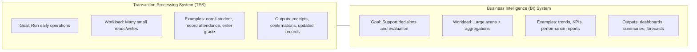
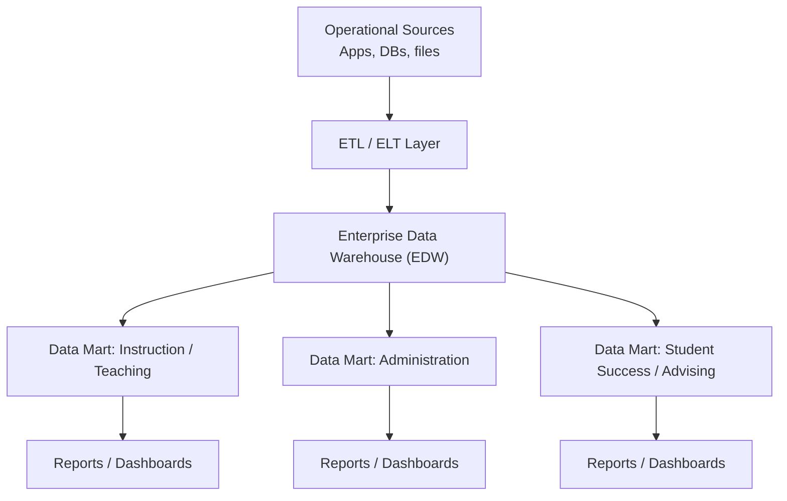
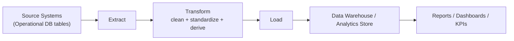
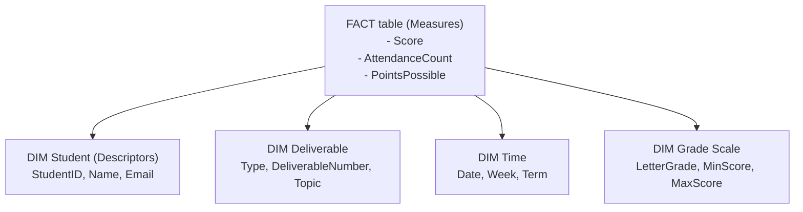
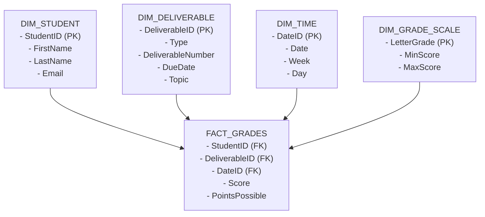
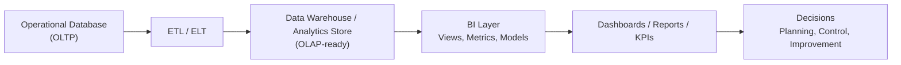

# Chapter 12: Business Intelligence and Analytics for Performance Improvement

*Turning Operational Data into Strategic Insight*

This chapter introduces business intelligence as the application of database technology to organizational decision-making. The chapter covers data warehousing concepts, ETL pipelines, star schemas, OLAP, dashboards, KPIs, and the Balanced Scorecard. The chapter shows how the technical skills built in earlier chapters translate directly into tools that managers use to monitor performance, identify trends, and act on evidence.

**After reading this chapter, students will be able to:**

- Describe the difference between operational systems and analytical systems
- Explain ETL, data warehouses, and star schemas in plain business language
- Build a simple dashboard or reporting query that tracks a key business metric

## Chapter Overview

This chapter introduces **Business Intelligence (BI)** as the organizational capability that transforms operational data into **insight, evaluation, and informed action**. While previous chapters focused on how data is **stored correctly** (normalization), **queried effectively** (advanced SQL), **designed systematically** (ER modeling and SDLC), and **administered reliably** (database administration), this chapter shifts attention to a different question:

> How does data actually support decisions?

Business Intelligence represents the transition from **recording what happened** to **understanding what it means**. Operational databases are excellent at capturing transactions such as grades, attendance records, and submissions. BI systems, by contrast, are designed to **analyze patterns**, **measure performance**, and **support managerial judgment**.

Throughout the chapter, students will see how data moves from **normalized operational systems** into **analytical environments** designed for reporting and evaluation. This includes understanding why operational schemas are not ideal for analytics, how data is reshaped for analysis, and how analytical queries differ from transactional ones.

The chapter also emphasizes that BI is not only a technical exercise. It is a **managerial capability**. Managers rely on BI outputs to:

* Monitor performance against targets
* Identify trends and anomalies
* Compare outcomes over time and across groups
* Support planning, control, and improvement decisions

As a running case, the **Grading Database** continues to serve as the central example. Earlier chapters treated the grading system as an operational database designed to ensure correctness and integrity. In this chapter, the same data is reinterpreted analytically: grades become **measures**, students and deliverables become **dimensions**, and time becomes a key axis of comparison.

By the end of the chapter, students will understand how well-designed databases become the foundation for business intelligence, and how BI systems turn reliable data into **organizational knowledge and performance insight**.

---

[Image: figure-12.1-bi-pipeline.png]
Caption: Business Intelligence sits between operational data and managerial decision-making, transforming raw records into actionable insight.
Prompt: Flow diagram showing Operational Database → ETL → Data Warehouse → Reports/Dashboards → Decision Makers

---

## Learning Objectives

By the end of this chapter, students will be able to:

* Explain core **business intelligence concepts** and how BI differs from operational data processing
* Distinguish between **operational systems** and **analytical systems**
* Design basic **data warehouse architectures** using star schemas
* Understand and implement **ETL processes** using SQL
* Explain **OLAP and dimensional modeling** concepts including facts, dimensions, and measures
* Create basic **analytics, reports, and dashboards** using SQL queries and views
* Describe modern BI trends including **data lakes**, **self-service BI**, and **ELT**
* Apply BI concepts to the **Grading Database** case across multiple platforms

---

## 1. Business Intelligence Fundamentals

### What Is Business Intelligence?

**Business Intelligence (BI)** refers to the collection of concepts, architectures, tools, and practices that enable organizations to **analyze data in order to support better decisions**. Unlike operational systems, which focus on recording individual events, BI systems focus on **understanding patterns, trends, and performance**.

At its core, BI is **decision-support**, not transaction processing.

Operational databases answer questions such as:

* Did this student submit Assignment 3?
* What score did Student 102 receive on Quiz 1?

BI systems answer fundamentally different questions:

* How are students performing over time?
* Which deliverables are most strongly associated with low outcomes?
* Are grades improving, declining, or stable across the semester?



BI systems assist organizations with:

* **Analysis of past and current performance**, such as averages, trends, and comparisons
* **Prediction and planning**, using historical data to anticipate future outcomes
* **Management control and evaluation**, enabling monitoring against targets and benchmarks

This distinction is critical. A well-designed operational database is necessary for BI, but it is **not sufficient**. BI requires reshaping, aggregating, and contextualizing data in ways that transaction systems are not optimized to do.

---

[Image: figure-12.2-tps-vs-bi.png]
Caption: Transaction systems record individual events, while BI systems analyze data to support evaluation and decision-making.
Prompt: Side-by-side comparison diagram of Transaction Processing System (TPS) vs Business Intelligence (BI) with example questions

---

### BI in the Data-Information-Knowledge Continuum

Business Intelligence occupies a central position in the progression from raw data to actionable knowledge.

In the **DIKW hierarchy** (Data to Information to Knowledge to Wisdom):

* **Data** consists of raw facts, such as individual grades or attendance records
* **Information** emerges when data is summarized or structured, such as average grades per assignment
* **Knowledge** arises when patterns and relationships are interpreted, such as identifying which types of assessments predict success
* **Wisdom** supports judgment and action, such as redesigning assessments or targeting interventions

Another useful framing is the **READ model**:

* **Representation**: Data is collected and structured in databases
* **Evaluation**: BI tools analyze and summarize the data
* **Action/Decision**: Managers interpret results and choose courses of action
* **Deployment**: Actions are taken based on insights

BI acts as the **bridge** between data storage and organizational insight. Without BI, organizations may have vast amounts of data but little understanding of what it means.

---

[Image: figure-12.3-dikw-hierarchy.png]
Caption: Business Intelligence transforms structured data into interpretable patterns that support organizational learning.
Prompt: DIKW pyramid with Business Intelligence highlighted between Information and Knowledge

---

### Types of BI Systems

Business Intelligence is not a single tool but a **family of systems** that vary in complexity and purpose.

#### Reporting Systems

Reporting systems are the most common and accessible form of BI. They focus on:

* Filtering data to relevant subsets
* Grouping records by meaningful categories
* Summarizing results with aggregation functions

Examples in the Grading Database:

* Average grade per deliverable
* Attendance rates by week
* Distribution of letter grades across the class

These systems typically rely on:

* Aggregation functions (`AVG`, `COUNT`, `SUM`)
* Grouping (`GROUP BY`)
* Time-based comparisons

#### Data Mining and Advanced Analytics

More advanced BI systems go beyond reporting to identify **patterns and predictions**, such as:

* Detecting at-risk students based on early performance indicators
* Identifying correlations between attendance and grades
* Classifying outcomes based on multiple variables

These approaches may include:

* Statistical models
* Machine learning algorithms
* Predictive analytics

While this course emphasizes **foundational BI**, understanding that BI exists on a spectrum helps clarify how basic summaries can evolve into powerful analytical systems.

#### Self-Service BI

A growing trend in BI is the democratization of analytics through **self-service tools**. Platforms such as **Microsoft Power BI**, **Tableau**, and **Google Looker** allow business users to:

* Connect to data sources directly
* Build visualizations through drag-and-drop interfaces
* Create and share dashboards without writing SQL

Self-service BI reduces the bottleneck of waiting for IT to produce reports. But it also introduces risks. Without proper data governance, different users may create conflicting metrics or misinterpret data. The balance between **accessibility and consistency** is a central challenge in modern BI environments.

##### 🌍 Real-World Example

A national retail chain with 400 stores uses Microsoft Power BI to give store managers access to daily sales dashboards. Managers no longer wait for IT reports. They filter by product category, date range, or region in real time. When one district manager noticed that a particular product line was underperforming on weekends across multiple stores, she escalated to procurement within hours. The insight came not from a data analyst but from a manager using self-service BI tools connected to the same operational database that records every sale.

---

Together, these BI fundamentals establish the conceptual foundation for the rest of the chapter. The next sections explore how data warehouses, ETL processes, and analytical structures make business intelligence possible in practice.

---

## 2. Data Warehousing Concepts

### Why Operational Databases Are Not Enough

Operational databases are designed to **support day-to-day transactions**, not large-scale analysis. Even when they are well normalized and carefully administered, they are optimized for **accuracy and concurrency**, not for insight generation.

Several characteristics of operational data make it poorly suited for analytics:

* **Dirty and inconsistent values** -- Operational systems often accept imperfect data. Typos, missing values, and inconsistent formats can exist as long as transactions can proceed.

* **Missing data** -- Not all information is available at the time of data entry. Optional fields, delayed updates, and incomplete records are common.

* **Changing records** -- Operational systems typically store only the current state. When a grade is updated or a student's status changes, the old value is overwritten, eliminating historical context.

* **Non-integrated sources** -- Data is often spread across multiple systems: grading platforms, attendance tools, learning management systems, and spreadsheets.

Running analytics directly on production databases introduces additional risks:

* Complex analytical queries can **slow down transactional workloads**
* Reporting logic may conflict with operational updates
* Mistakes in analytical queries can compromise live data

For these reasons, organizations separate **transaction processing** from **analytical processing**. Data warehousing formalizes this separation.

---

[Image: figure-12.5-operational-vs-analytics.png]
Caption: Separating analytics from operations protects system performance and data integrity.
Prompt: Diagram showing operational database overloaded by reporting queries, contrasted with a separate analytics environment

---

### What Is a Data Warehouse?

A **data warehouse** is a centralized repository designed specifically for **analysis and decision support**. Unlike operational databases, data warehouses are structured to support large queries, historical analysis, and cross-functional reporting.

Classic definitions describe a data warehouse as:

* **Subject-oriented** -- Organized around key business subjects such as students, courses, performance, or attendance, rather than operational processes.

* **Integrated** -- Data from multiple sources is cleaned, standardized, and combined into a consistent format.

* **Time-variant** -- Historical data is preserved. Each record is associated with a time dimension, enabling trend analysis and period-over-period comparisons.

* **Non-volatile** -- Data is not updated or deleted in the same way as operational systems. Instead, new records are appended over time, creating an accumulating historical record.

**Metadata** plays a critical role in data warehouses:

* Defining field meanings and data lineage
* Documenting data sources and refresh schedules
* Tracking transformation rules
* Supporting governance and auditing

##### 🌍 Real-World Example

A large hospital system operates dozens of clinical, billing, and patient management applications. Each system records data differently. Patient names are stored in different formats. Diagnoses use different code systems across departments. The hospital's data warehouse integrates all these sources into a single structure. Each night, an ETL job pulls records from every system, standardizes them, and loads the results into the warehouse. By morning, hospital administrators can view dashboards showing patient outcomes, readmission rates, and bed utilization across all facilities. Without the warehouse, these reports would require weeks of manual data assembly.

---

[Image: figure-12.6-data-warehouse.png]
Caption: A data warehouse integrates data from many sources into a stable, time-aware analytical structure.
Prompt: Conceptual architecture of a data warehouse showing multiple source systems feeding a centralized warehouse with metadata layer

---

### Data Warehouses vs. Data Marts

Not all organizations build a single, massive warehouse. Two common approaches exist.

#### Enterprise Data Warehouse (EDW)

An **Enterprise Data Warehouse**:

* Serves the entire organization
* Integrates data across departments
* Provides a single version of the truth

Advantages:

* Consistency across reports
* Strong governance
* Long-term scalability

Challenges:

* Higher cost and complexity
* Longer development time
* Greater organizational coordination required

#### Data Marts

A **data mart** is a smaller, focused analytical store designed for a specific department or function, such as:

* Academic performance analytics
* Enrollment and retention analytics
* Financial reporting

Advantages:

* Faster to build and deploy
* Lower cost
* Tailored to specific analytical needs

Challenges:

* Risk of data silos
* Potential inconsistency across marts if not coordinated



In practice, many organizations adopt a **hybrid approach**, using a central warehouse with specialized data marts layered on top. This balance reflects a core BI principle: analytical design always involves trade-offs between **scope, complexity, cost, and control**.

---

[Image: figure-12.7-edw-vs-data-mart.png]
Caption: Data marts trade enterprise consistency for speed and focus, while EDWs emphasize integration and governance.
Prompt: Comparison diagram showing Enterprise Data Warehouse feeding multiple departmental data marts

---

### Data Lakes: A Modern Complement

While data warehouses store **structured, pre-processed data**, many organizations also maintain **data lakes** -- repositories that store data in its **raw, unprocessed form** (structured, semi-structured, or unstructured).

Key differences:

| Characteristic | Data Warehouse | Data Lake |
|----------------|----------------|-----------|
| **Data format** | Structured, cleaned | Raw, any format |
| **Schema** | Defined before loading (schema-on-write) | Defined at query time (schema-on-read) |
| **Users** | Analysts, managers | Data scientists, engineers |
| **Best for** | Reporting, dashboards, KPIs | Exploration, machine learning, ad hoc analysis |

Data lakes are increasingly common in modern architectures. They complement rather than replace data warehouses. Organizations often use both: a data lake for flexible exploration and a data warehouse for trusted, governed reporting.

###### Why this matters

Students often ask: "Why not just put everything in one place?" The answer is that different analytical needs require different structures. A warehouse enforces consistency and business rules. A lake preserves raw flexibility. Using both together gives organizations the best of each approach.

These data warehousing concepts provide the structural foundation for the next sections, where we examine how data moves into analytical environments and how it is prepared for reporting and insight.

---

## 3. ETL Processes and Data Integration

### What Is ETL?

**ETL** stands for **Extract, Transform, Load**. It is the backbone of Business Intelligence systems and the primary mechanism through which operational data becomes trustworthy analytical data.

* **Extract** -- Data is pulled from one or more source systems. These sources may include operational databases, spreadsheets, APIs, or external services. Extraction focuses on access, not interpretation.

* **Transform** -- Extracted data is cleaned, standardized, validated, and reshaped. This step is where raw data becomes meaningful and consistent, and where most of the intellectual work in BI happens.

* **Load** -- Transformed data is inserted into analytical structures such as data warehouses, data marts, or analytical tables optimized for reporting and aggregation.

ETL separates **how data is captured** from **how data is analyzed**, allowing each system to do what it does best.



---

[Image: figure-12.8-etl-pipeline.png]
Caption: ETL pipelines convert raw operational data into structured, analytics-ready datasets.
Prompt: ETL pipeline diagram showing multiple source systems feeding into Extract → Transform → Load stages → Data Warehouse

---

### Common Transformations

The **Transform** stage is where data quality is enforced and business logic is applied. Typical transformations include:

* **Data cleaning and validation**
  * Removing duplicates
  * Handling missing values (imputation, exclusion, or flagging)
  * Enforcing valid ranges (e.g., grades between 0 and 100)

* **Code translation and standardization**
  * Converting codes into meaningful labels
  * Example: mapping numeric grades to letter grades using a `GRADE_SCALE` table
  * Standardizing inconsistent values (e.g., "HW", "Homework", "H.W." become "Homework")

* **Aggregation and derived attributes**
  * Calculating averages, totals, and counts
  * Deriving metrics such as final grade, attendance rate, or weighted score

* **Time-based transformations**
  * Adding time dimensions (semester, week, year)
  * Converting timestamps into reporting-friendly formats
  * Preserving historical snapshots rather than overwriting values

In the context of the **Grading Database**, transformation might include:

* Converting raw scores into standardized percentages
* Applying grading policies consistently across sections
* Enriching records with semester or course metadata

---

[Image: figure-12.9-etl-transformations.png]
Caption: Transformation reshapes inconsistent operational data into reliable analytical signals.
Prompt: Before-and-after table showing raw grades transformed into standardized scores with derived metrics

---

### ETL vs. ELT

Traditional ETL transforms data before loading it into the warehouse. An increasingly common alternative is **ELT (Extract, Load, Transform)**, which reverses the last two steps:

1. Data is extracted from sources
2. Raw data is loaded directly into a data lake or warehouse
3. Transformations happen inside the target system using SQL or processing engines

ELT is popular with modern cloud warehouses (such as Snowflake, BigQuery, and Redshift) that have enough processing power to handle transformations in place. The choice between ETL and ELT depends on:

* **Data volume**: ELT handles very large datasets more efficiently
* **Tool availability**: Cloud platforms often favor ELT architectures
* **Transformation complexity**: Complex business rules may still benefit from dedicated ETL pipelines

For this course, we use **ETL logic implemented in SQL**, which illustrates both approaches since the same SQL transformations can run as pre-load scripts (ETL) or as views and queries inside the database (ELT).

---

### ETL as a Trust-Building Process

ETL is not just a technical pipeline. It is a **trust mechanism**.

Decision-makers rely on BI outputs to:

* Evaluate performance fairly
* Allocate resources effectively
* Identify risks and opportunities early

If ETL processes are poorly designed:

* Reports conflict with one another
* Metrics lose credibility
* Users stop trusting the system, regardless of how advanced the analytics appear

Well-designed ETL pipelines:

* Encode **business rules** explicitly
* Apply those rules consistently across all data
* Make data quality visible and auditable

ETL is where **technical design meets organizational governance**. It ensures that analytical systems do not merely reflect stored data, but instead reflect **agreed-upon interpretations of reality**.

##### 🌍 Real-World Example

A regional bank processes customer transaction data from three separate core banking systems, each acquired through mergers. Field names differ across systems. Date formats differ. Some systems record branch codes using letters; others use numbers. The bank's ETL team spent months designing transformation rules to standardize all three sources into a single data warehouse schema. When regulators ask for a loan portfolio summary, the bank produces a consistent, auditable report within minutes. Before the ETL pipeline existed, that same report took two analysts a week to compile manually.

---

[Image: figure-12.10-etl-trust-layer.png]
Caption: Data quality in BI depends directly on ETL discipline.
Prompt: Layered diagram showing business rules embedded in ETL between raw data and dashboards

---

## 4. Online Analytical Processing (OLAP)

### What Makes Analytical Queries Different?

Analytical queries are fundamentally different from the transactional queries used in operational systems.

While transactional queries ask: *"What is the grade for this student on this assignment?"*, analytical queries ask:

* How did average grades change over time?
* Which deliverable types produce the lowest scores?
* How does performance differ across sections or semesters?

These questions share several characteristics:

* **Complex aggregations** -- Analytics frequently rely on `SUM`, `AVG`, `COUNT`, `MIN`, and `MAX`, often layered across multiple dimensions.

* **Historical and comparative analysis** -- BI systems analyze trends across time, compare periods, and evaluate performance relative to benchmarks.

* **Multi-dimensional thinking** -- Data is examined simultaneously across multiple perspectives, such as student, assignment type, time period, and course section.

The distinction is sometimes summarized as **OLTP vs. OLAP**:

| Characteristic | OLTP (Operational) | OLAP (Analytical) |
|----------------|--------------------|--------------------|
| **Purpose** | Record transactions | Analyze patterns |
| **Queries** | Simple, row-level | Complex, aggregated |
| **Users** | Clerks, applications | Analysts, managers |
| **Data** | Current state | Historical trends |
| **Optimization** | Fast reads/writes | Fast scans and aggregations |
| **Schema** | Normalized (3NF) | Denormalized (star/snowflake) |

OLAP systems are optimized to answer *many questions about many records*, rather than *one question about one record*.

---

[Image: figure-12.11-oltp-vs-olap.png]
Caption: Transactional queries retrieve individual facts; analytical queries explain patterns and trends.
Prompt: Side-by-side comparison showing transactional query vs analytical query across many rows and dimensions

---

### Dimensional Modeling Concepts

OLAP relies on **dimensional modeling**, a design approach that prioritizes clarity and analytical speed over strict normalization.

Key concepts include:

* **Facts vs. Dimensions**
  * **Facts** represent measurable events (for example, a student's score on a deliverable).
  * **Dimensions** provide context for those facts (who, what, when, where).

* **Measures vs. Descriptors**
  * **Measures** are numeric values used in calculations (Score, Points, AttendanceCount).
  * **Descriptors** are descriptive attributes used for filtering and grouping (StudentName, DeliverableType, Week).

* **Common dimensions** -- Across industries and use cases, certain dimensions appear repeatedly:
  * **Time** (date, week, semester, year)
  * **People** (students, instructors, staff)
  * **Products or activities** (assignments, deliverables, courses)
  * **Location or organizational units** (sections, departments, campuses)

In the **Grading Database**, scores are facts, while students, deliverables, and time serve as dimensions.



---

[Image: figure-12.12-facts-dimensions.png]
Caption: Facts record measurable events; dimensions provide analytical context.
Prompt: Fact table surrounded by Time, Student, and Deliverable dimensions

---

### Star Schemas and Analytical Structures

The most common dimensional structure is the **star schema**.

* A **fact table** sits at the center, containing:
  * Foreign keys to each dimension table
  * Numeric measures for analysis (e.g., Score, PointsPossible)

* **Dimension tables** radiate outward, each describing one analytical perspective (e.g., DIM_STUDENT, DIM_DELIVERABLE, DIM_TIME).

This structure is intentionally **denormalized**:

* Dimension tables often repeat descriptive attributes to avoid joins
* Joins between fact and dimension tables are predictable and simple
* Queries are easier to write and faster to execute

#### Snowflake Schemas

A variation called the **snowflake schema** normalizes dimension tables further, for example, separating deliverable categories from deliverable details. Snowflake schemas save storage but increase query complexity. In most BI environments, star schemas are preferred for their simplicity.



In BI, denormalization is not a design failure. It is a **performance and usability optimization**, made possible because ETL processes control data consistency before it enters the warehouse.

This design reflects a key BI principle:

> Operational systems prioritize correctness and integrity. Analytical systems prioritize interpretability and performance.

---

[Image: figure-12.13-star-schema.png]
Caption: Star schemas organize grading data for fast, intuitive analysis.
Prompt: Star schema diagram with FACT_GRADES at the center and DIM_STUDENT, DIM_DELIVERABLE, DIM_TIME, DIM_GRADE_SCALE around it

---

### OLAP Operations

OLAP systems support several common analytical operations that allow users to explore data from different angles:

* **Slice**: Select a single value from one dimension (e.g., show only Quiz scores)
* **Dice**: Select specific values from multiple dimensions (e.g., Quiz scores for Semester 1 students only)
* **Drill-down**: Move from a summary to more detail (e.g., from class average to student-level scores)
* **Roll-up**: Move from detail to a higher summary (e.g., from weekly averages to semester average)
* **Pivot**: Rotate the data perspective (e.g., switch from students on rows to deliverable types on rows)

These operations map directly to SQL constructs you already know: `WHERE` clauses (slice/dice), nested `GROUP BY` levels (drill-down/roll-up), and restructured `SELECT` statements (pivot). OLAP simply provides a conceptual vocabulary for these common analytical patterns.

##### 🌍 Real-World Example

A major grocery chain uses an OLAP cube to track product sales across 600 stores. A regional analyst performing a **slice** filters to just beverage sales. She then **drills down** from weekly store totals to daily aisle-level data after noticing an unexpected dip. She discovers that a promotional display was moved, reducing impulse purchases. She **rolls up** back to the regional view to check whether the dip is isolated or widespread. This entire exploration takes minutes because the OLAP structure is designed exactly for this type of multi-directional analysis.

---

## 5. Data Visualization and Reporting

### From Queries to Insight

SQL is a powerful analytical language, but **query results alone are rarely the end goal**. Rows and columns answer questions, yet decision-makers think in **patterns, trends, comparisons, and thresholds**. Visualization bridges this gap by transforming query outputs into forms the human brain can process quickly and reliably.

Key reasons raw SQL output is not enough:

* **Cognitive load**: Large result sets overwhelm attention and working memory.
* **Pattern blindness**: Trends over time, outliers, and distributions are difficult to see in tables.
* **Decision latency**: Executives need answers at a glance, not after manual interpretation.

Visualization supports **sensemaking** by:

* Compressing complexity into recognizable shapes
* Highlighting change and comparison
* Making exceptions and risks immediately visible

---

[Image: figure-12.16-sql-to-insight.png]
Caption: Visualization converts query output into patterns the brain can recognize instantly.
Prompt: SQL result table transforming into a line chart and bar chart

---

### Types of BI Outputs

Business Intelligence systems typically deliver insight through three complementary output types.

#### Standard Reports

Standard reports are structured, often scheduled outputs that present data in tabular or lightly visual formats.

Examples in the Grading Database:

* Average grade per deliverable
* Attendance rate by week
* Final grade distribution by letter grade

**SQL example (average score per deliverable):**

```sql
SELECT d.Type, d.DeliverableNumber, AVG(sg.Score) AS AvgScore
FROM DELIVERABLE d
JOIN STUDENT_GRADE sg ON d.DeliverableID = sg.DeliverableID
GROUP BY d.Type, d.DeliverableNumber;
```

This query feeds a **bar chart** comparing performance across assignments.

#### Interactive Dashboards

Dashboards combine multiple visualizations into a single interface and allow users to explore data dynamically.

Typical dashboard elements:

* Filters (semester, deliverable type, section)
* Linked charts (selecting a bar updates a detail table)
* Summary metrics displayed prominently at the top

##### 📝 **Note:**

SQL queries can be saved as **views** and consumed by dashboard tools such as Power BI, Tableau, or Supabase-integrated front ends. Using views ensures consistent logic across all reports.

#### KPIs and Performance Metrics

Key Performance Indicators (KPIs) reduce complexity to **signals** -- single numbers or indicators that tell decision-makers whether things are on track.

Examples in the Grading Database:

* Percentage of students passing (score >= 60)
* Average class score this week vs. last week
* Number of missing submissions

**SQL example (pass rate):**

```sql
SELECT 
  COUNT(CASE WHEN Score >= 60 THEN 1 END) * 1.0 / COUNT(*) AS PassRate
FROM STUDENT_GRADE;
```

KPIs answer *"Are we on track?"* rather than *"What exactly happened?"*

##### 🌍 Real-World Example

A streaming platform tracks three KPIs in real time: daily active users, average watch time per session, and content completion rate. These three numbers appear on a single dashboard visible to executives at all times. When watch time dropped 12% over a two-week period, the product team drilled into the underlying report data, identified a correlation with a recent UI change, and reversed the change within 48 hours. The KPI flagged the problem. The report explained it. A decision followed.

---

[Image: figure-12.17-bi-outputs.png]
Caption: BI outputs range from static reports to interactive dashboards and performance metrics.
Prompt: Diagram showing reports, dashboards, and KPIs as distinct but related BI artifacts

---

### Choosing the Right Visualization

Different questions demand different visual forms. A common mistake in BI is choosing chart types based on aesthetics rather than analytical purpose.

| Question Type | Recommended Visualization |
|---------------|---------------------------|
| Comparison across categories | Bar chart |
| Trend over time | Line chart |
| Part-to-whole relationship | Pie chart or stacked bar |
| Distribution of values | Histogram or box plot |
| Relationship between variables | Scatter plot |
| Single metric status | KPI card or gauge |

The goal is always **clarity over decoration**. A well-chosen simple chart communicates more effectively than an elaborate but confusing visualization.

###### Common mistake

Using a pie chart to compare more than 4-5 categories makes interpretation nearly impossible. Bar charts are almost always a better choice when comparing counts or values across multiple groups.

---

### Characteristics of Effective BI Reporting

Not all reports are useful. Effective BI outputs share several critical qualities.

#### Accuracy

* Results must reflect **correct logic and clean data**
* Depends on normalized sources, reliable ETL, and tested queries
* A visually appealing dashboard built on incorrect logic is worse than no dashboard at all

#### Timeliness

* Reports must arrive **when decisions are being made**
* Late insight is often irrelevant insight
* Balance freshness with system cost and stability
* Example: attendance trends updated daily; grade summaries updated after submission deadlines

#### Consistency

* The same metric must mean the same thing everywhere
* Definitions should not vary across dashboards, teams, or time periods
* Using **views** ensures that calculations such as "average grade" are defined once and used identically across all reports

#### Interpretability

* Visuals should answer clear questions without requiring explanation
* Avoid unnecessary complexity, animation, or decorative elements
* Labels, scales, and context matter

##### 💡 **Tip:**

If a stakeholder needs a verbal explanation to understand the chart, the chart needs redesign.

---

[Image: figure-12.19-effective-bi-reporting.png]
Caption: Effective BI reporting balances correctness with clarity.
Prompt: Good vs bad dashboard comparison highlighting clarity and overload

---

Data visualization and reporting complete the BI pipeline. SQL extracts and shapes the truth, but **visualization delivers that truth to human decision-makers** in forms they can act on.

---

## 6. BI Governance and Data Quality

Effective BI depends not only on technical infrastructure but also on **governance** -- the organizational policies, roles, and processes that ensure data remains trustworthy and consistently interpreted.

### Why Governance Matters

Without governance, BI environments tend to develop problems over time:

* **Metric proliferation**: Different departments create conflicting versions of the same KPI
* **Definition drift**: The meaning of terms like "active student" or "passing grade" varies across reports
* **Data quality decay**: Errors accumulate without systematic detection and correction
* **Security gaps**: Sensitive data becomes accessible to unauthorized users through poorly controlled dashboards

###### Why this matters

Governance is not a technical problem. It is an organizational one. The best ETL pipeline and the most accurate data warehouse will fail to support decisions if different teams define metrics differently or if no one owns data quality within specific domains.

### Key Governance Practices

* **Define metrics centrally**: Maintain a shared glossary of business terms and calculations. When "pass rate" is defined once, all reports use the same formula.

* **Assign data stewards**: Designate individuals responsible for data quality within specific domains (e.g., grading data, enrollment data).

* **Control access to BI outputs**: Not all dashboards should be visible to all users. Role-based access applies to analytics just as it does to operational databases.

* **Audit and monitor data pipelines**: ETL processes should be logged and periodically reviewed to detect failures, delays, or quality degradation.

* **Version control for reports**: When report logic changes, maintain a record of what changed and why.

Governance ensures that BI remains a **reliable organizational resource** rather than a collection of ad hoc analyses that no one fully trusts.

---

## Chapter Summary

Business Intelligence represents a shift in how organizations **use data** -- not merely how they store it. While operational databases focus on accuracy and efficiency in recording transactions, BI systems are designed to **extract meaning, evaluate performance, and support decisions**.

### From Data to Insight

BI systems transform **raw data into structured insight**. SQL, schemas, and warehouses provide the foundation, but insight emerges only when data is integrated, aggregated, and interpreted in context. A database records *what happened*; BI explains *what it means* and *what to do next*.

### Separation of Analytics from Operations

Operational systems are optimized for fast inserts, updates, and transactional integrity. Analytical systems are optimized for complex queries, historical comparison, and performance evaluation. Data warehouses enforce this separation, ensuring that analytics do not interfere with day-to-day operations.

### ETL as the Trust Layer

ETL processes ensure data quality, consistent definitions, and enforced business rules before data enters the analytical environment. Trust in BI outputs depends more on **ETL discipline** than on visualization tools. When ETL is weak, dashboards lose credibility. When ETL is strong, BI becomes a reliable decision platform.

### Dimensional Models Enable Performance Analysis

OLAP structures support multi-dimensional analysis, time-based comparison, and aggregation across categories. Star schemas and fact tables are intentionally denormalized to improve query performance and match how managers think about the business. This design trade-off is deliberate and controlled through ETL, not a violation of good practice.

### BI as Decision Support

At its best, Business Intelligence turns databases into **decision-support systems**. Managers evaluate performance using KPIs, analysts explore trends and anomalies, and organizations align actions with evidence rather than intuition. BI does not replace human judgment. It **amplifies it** by ensuring that decisions are grounded in reliable, timely, and interpretable data.



---

## Key Terms

* **Aggregation**: The process of combining multiple data values into a summary measure such as a sum, average, or count.
* **Business Intelligence (BI)**: The concepts, architectures, tools, and practices that enable organizations to analyze data for decision support.
* **Dashboard**: An interactive visual interface that combines multiple BI outputs (charts, KPIs, tables) into a single decision surface.
* **Data Lake**: A storage repository that holds raw data in its native format until it is needed for analysis; complements data warehouses.
* **Data Mart**: A focused analytical store designed for a specific department or business function.
* **Data Mining**: The process of discovering patterns, correlations, and anomalies in large datasets using statistical and machine learning techniques.
* **Data Warehouse**: A centralized repository designed for analysis and decision support, characterized as subject-oriented, integrated, time-variant, and non-volatile.
* **Denormalization**: The deliberate introduction of redundancy into analytical schemas to improve query performance and simplify reporting.
* **Descriptors**: Descriptive attributes in dimensional models used for filtering and grouping (e.g., StudentName, DeliverableType).
* **DIKW Hierarchy**: The progression from Data to Information to Knowledge to Wisdom; a framework for understanding how raw facts become actionable insight.
* **Dimension Table**: A table in a star schema that provides context for facts, describing who, what, when, or where.
* **Dimensional Modeling**: A design approach for analytical databases that organizes data into facts and dimensions for clarity and performance.
* **Drill-Down**: An OLAP operation that moves from a summary level to more detailed data.
* **ELT (Extract, Load, Transform)**: A variant of ETL where raw data is loaded first and transformed inside the target system.
* **Enterprise Data Warehouse (EDW)**: An organization-wide data warehouse that integrates data across all departments.
* **ETL (Extract, Transform, Load)**: The process of pulling data from source systems, cleaning and reshaping it, and loading it into analytical structures.
* **Fact Table**: The central table in a star schema containing numeric measures and foreign keys to dimension tables.
* **KPI (Key Performance Indicator)**: A quantifiable metric used to evaluate performance against targets or benchmarks.
* **Measures**: Numeric values in a fact table used for calculations and analysis (e.g., Score, AttendanceCount).
* **Metadata**: Data about data; in BI, metadata describes field meanings, data sources, transformation rules, and data lineage.
* **OLAP (Online Analytical Processing)**: A category of systems and techniques optimized for complex, multi-dimensional analytical queries.
* **OLTP (Online Transaction Processing)**: A category of systems optimized for recording and managing individual business transactions.
* **Pivot**: An OLAP operation that rotates the analytical perspective by swapping dimensions on rows and columns.
* **READ Model**: A framework for understanding BI: Representation, Evaluation, Action/Decision, Deployment.
* **Report**: A structured BI output, often tabular, that presents summarized data for monitoring and comparison.
* **Roll-Up**: An OLAP operation that moves from detailed data to a higher-level summary.
* **Schema-on-Read**: An approach where data structure is defined at query time (typical of data lakes).
* **Schema-on-Write**: An approach where data structure is defined before loading (typical of data warehouses).
* **Self-Service BI**: Tools and platforms that allow business users to create their own reports and dashboards without writing SQL.
* **Slice**: An OLAP operation that selects a single value from one dimension to filter the data.
* **Snowflake Schema**: A dimensional schema where dimension tables are further normalized into sub-tables.
* **Star Schema**: A dimensional schema with a central fact table surrounded by denormalized dimension tables.
* **View**: A saved SQL query that acts as a virtual table; commonly used in BI to encapsulate reusable analytical logic.

---

## Review Questions

1. What is Business Intelligence, and how does it differ from operational transaction processing?
2. Explain the DIKW hierarchy. Where does BI fit, and why is that position significant?
3. Why are normalized operational databases not ideal for analytical queries? Give at least three reasons.
4. Define the four characteristics of a data warehouse (subject-oriented, integrated, time-variant, non-volatile) and explain each using the Grading Database as an example.
5. Compare an Enterprise Data Warehouse with a Data Mart. When might an organization choose one over the other?
6. What is the difference between a data warehouse and a data lake? When would each be appropriate?
7. Describe the three stages of ETL and explain why the Transform stage is considered the most critical.
8. How does ELT differ from ETL? What technological changes have made ELT more common?
9. Why is ETL described as a "trust-building process"? What happens when ETL processes are poorly designed?
10. Explain the difference between facts and dimensions in dimensional modeling. Provide examples from the Grading Database.
11. What is a star schema? Why is denormalization acceptable in analytical environments but discouraged in operational ones?
12. Describe three OLAP operations (e.g., slice, dice, drill-down) and explain how each could be applied to grading data.
13. Compare three types of BI outputs (reports, dashboards, KPIs). What purpose does each serve?
14. What are the four characteristics of effective BI reporting? Which do you think is most important, and why?
15. Write a SQL query that calculates the average score per deliverable type in the Grading Database. Explain how this query supports a BI objective.

---

## Discussion Questions

1. **BI and Decision-Making**: Think of an organization you are familiar with (a university, employer, or club). What kinds of decisions could be improved with better data analysis? What data would be needed?

2. **The Trust Problem**: A department creates a dashboard showing student pass rates, but two different teams report different numbers for the same semester. What might cause this? How would you fix it?

3. **Self-Service BI Trade-offs**: Self-service BI tools make it easy for anyone to build reports. What are the benefits and risks of this democratization? How should organizations balance accessibility with consistency?

4. **Normalization vs. Denormalization**: In earlier chapters, you learned that normalization prevents redundancy and anomalies. Now you learn that data warehouses intentionally denormalize. Is this contradictory, or does it reflect different design goals? Explain.

5. **BI Ethics**: Should students have access to BI dashboards showing class performance analytics? What about dashboards that compare individual students to their peers? Where would you draw the line, and why?

6. **Future of BI**: How might advances in AI and machine learning change the role of Business Intelligence? Will traditional BI reporting become obsolete, or will it remain important?

---

## Let's Build: Business Intelligence with the Grading Database

This hands-on section applies Business Intelligence concepts to the **Grading Database**, demonstrating how operational academic data can be transformed into **analytical insight**. You will complete three parallel tutorials:

* **Tutorial 1**: Business Intelligence with Microsoft Access (queries, reports, dashboards)
* **Tutorial 2**: Business Intelligence with SQLite (SQL-based ETL and analysis)
* **Tutorial 3**: Business Intelligence with Supabase / PostgreSQL (cloud-hosted analytics)

All three tutorials focus on the same BI objectives using different tools, reinforcing the principle that **BI logic is platform-independent**.

---

## Hands-On BI Tutorial 1: Microsoft Access

### Why Start with Access?

Microsoft Access makes BI concepts tangible through its visual interface. You can see queries, reports, and dashboards take shape without writing raw SQL, making it an ideal starting point for understanding the BI pipeline.

---

### Step 1: Prepare the Operational Tables

Ensure the following tables exist in your Access database (from earlier chapters):

* `STUDENT(StudentID, FirstName, LastName, Email)`
* `DELIVERABLE(DeliverableID, Type, DeliverableNumber, DueDate)`
* `STUDENT_GRADE(GradeID, StudentID, DeliverableID, Score)`
* `ATTENDANCE(AttendanceID, ClassNum, StudentID, Attended)`

---

### Step 2: Define Relationships

Go to **Database Tools → Relationships** and define:

* `STUDENT.StudentID → STUDENT_GRADE.StudentID`
* `DELIVERABLE.DeliverableID → STUDENT_GRADE.DeliverableID`
* `STUDENT.StudentID → ATTENDANCE.StudentID`

Enable **Referential Integrity** for all relationships. This ensures no orphan grades or invalid attendance records exist in your analytical results.

---

### Step 3: Create Analytical Queries

These queries perform the **Transform** stage of the BI pipeline, reshaping operational data into analytical views.

#### Query 1: Average Score per Student

```sql
SELECT 
    STUDENT.FirstName & " " & STUDENT.LastName AS StudentName,
    AVG(STUDENT_GRADE.Score) AS AverageScore
FROM STUDENT
INNER JOIN STUDENT_GRADE 
    ON STUDENT.StudentID = STUDENT_GRADE.StudentID
GROUP BY STUDENT.FirstName, STUDENT.LastName;
```

**Insight:** Identifies high-performing and struggling students at a glance.

#### Query 2: Performance by Deliverable Type

```sql
SELECT 
    DELIVERABLE.Type,
    AVG(STUDENT_GRADE.Score) AS AvgScore
FROM DELIVERABLE
INNER JOIN STUDENT_GRADE 
    ON DELIVERABLE.DeliverableID = STUDENT_GRADE.DeliverableID
GROUP BY DELIVERABLE.Type;
```

**Insight:** Compares how students perform across quizzes, exams, and projects.

#### Query 3: Attendance vs. Performance

```sql
SELECT 
    STUDENT.FirstName & " " & STUDENT.LastName AS StudentName,
    COUNT(ATTENDANCE.Attended) AS ClassesAttended,
    AVG(STUDENT_GRADE.Score) AS AvgScore
FROM STUDENT
LEFT JOIN ATTENDANCE 
    ON STUDENT.StudentID = ATTENDANCE.StudentID 
    AND ATTENDANCE.Attended = True
LEFT JOIN STUDENT_GRADE 
    ON STUDENT.StudentID = STUDENT_GRADE.StudentID
GROUP BY STUDENT.FirstName, STUDENT.LastName;
```

**Insight:** Correlates attendance with academic performance -- a common BI question in education.

---

### Step 4: Build Reports

Access reports transform query results into formatted, printable outputs.

1. Select a saved query (e.g., Average Score per Student)
2. Go to **Create → Report Wizard**
3. Choose grouping (e.g., by deliverable type) and sorting (e.g., by average score descending)
4. Add summary footers showing class averages

Repeat for each analytical query to build a basic **reporting suite**.

---

### Step 5: Build Charts and a Dashboard

#### Charts

* **Bar chart**: Average score per deliverable type
* **Line chart**: Performance trends over time (by DueDate)

Use the chart wizard in Access or export data to Excel for richer visualization options.

#### Dashboard Form (Optional)

Create a **Navigation Form** that links:

* Analytical queries
* Reports
* Charts

Add combo boxes to filter by student or deliverable type. This simulates a **BI dashboard** within Access.

---

### Step 6: Export to External BI Tools (Optional)

* Export Access queries to **Excel** or **Power BI** using **External Data → Export**
* In Power BI, add slicers, filters, and trend lines for interactive exploration
* This demonstrates how Access can serve as a data source for enterprise BI platforms

---

## Hands-On BI Tutorial 2: SQLite

### Why SQLite for BI?

SQLite makes BI logic explicit through SQL. Every transformation, aggregation, and analytical view is written as code. This transparency is valuable for understanding exactly what the BI pipeline does, and for building skills that transfer directly to larger platforms.

**Tools:** SQLiteOnline.com (browser-based) or DB Browser for SQLite (desktop)

---

### Step 1: Operational Tables (Source Data)

Assume the following normalized operational tables already exist from earlier chapters:

* `STUDENT(StudentID, FirstName, LastName, Email)`
* `DELIVERABLE(DeliverableID, Type, DeliverableNumber, DueDate)`
* `STUDENT_GRADE(GradeID, StudentID, DeliverableID, Score)`
* `ATTENDANCE(AttendanceID, ClassNum, StudentID, Attended)`

These tables represent **transactional data**, not analytics-ready data.

---

### Step 2: ETL -- Create Analytical Views (Transform + Load)

Views perform the **Transform** and **Load** steps of the ETL pipeline using SQL. They reshape operational data into a structure optimized for analysis without modifying the source tables.

#### Grade Analytics View

```sql
CREATE VIEW GradeAnalytics AS
SELECT 
    s.StudentID,
    s.FirstName || ' ' || s.LastName AS StudentName,
    d.Type AS DeliverableType,
    d.DeliverableNumber,
    d.DueDate,
    sg.Score
FROM STUDENT s
JOIN STUDENT_GRADE sg ON s.StudentID = sg.StudentID
JOIN DELIVERABLE d ON sg.DeliverableID = d.DeliverableID;
```

This view joins normalized tables, standardizes naming, and produces a reusable analytical dataset. You can query it like a table:

```sql
SELECT * FROM GradeAnalytics;
```

#### Attendance Analytics View

```sql
CREATE VIEW AttendanceAnalytics AS
SELECT
    s.StudentID,
    s.FirstName || ' ' || s.LastName AS StudentName,
    COUNT(CASE WHEN a.Attended = 1 THEN 1 END) AS ClassesAttended,
    ROUND(AVG(g.Score), 2) AS AvgScore
FROM STUDENT s
LEFT JOIN ATTENDANCE a ON s.StudentID = a.StudentID
LEFT JOIN STUDENT_GRADE g ON s.StudentID = g.StudentID
GROUP BY s.StudentID;
```

---

### Step 3: Analytical Queries (BI Questions)

With views in place, analytical queries become straightforward and expressive.

#### Average Score per Student

```sql
SELECT 
    StudentName,
    ROUND(AVG(Score), 2) AS AverageScore
FROM GradeAnalytics
GROUP BY StudentName
ORDER BY AverageScore DESC;
```

**Insight:** Identifies high-performing and struggling students.

#### Performance by Deliverable Type

```sql
SELECT 
    DeliverableType,
    ROUND(AVG(Score), 2) AS AvgScore
FROM GradeAnalytics
GROUP BY DeliverableType;
```

**Insight:** Reveals which assessment types produce the strongest and weakest performance.

#### Time-Based Analysis (OLAP-Style)

```sql
SELECT 
    strftime('%Y-%m', DueDate) AS Month,
    ROUND(AVG(Score), 2) AS AvgScore
FROM GradeAnalytics
GROUP BY Month
ORDER BY Month;
```

**Insight:** Detects performance trends across the semester.

#### Pass Rate KPI

```sql
SELECT 
    ROUND(COUNT(CASE WHEN Score >= 60 THEN 1 END) * 100.0 / COUNT(*), 1) 
    AS PassRatePercent
FROM GradeAnalytics;
```

**Insight:** A single number that tells an instructor whether the class is on track.

#### Attendance vs. Performance Correlation

```sql
SELECT * FROM AttendanceAnalytics
ORDER BY ClassesAttended DESC;
```

**Insight:** Correlates attendance patterns with academic outcomes.

---

### Step 4: Simulated Star Schema (Optional Advanced Exercise)

For students who want to practice dimensional modeling, create explicit fact and dimension tables:

```sql
-- Dimension: Time
CREATE TABLE DIM_TIME (
    DateID INTEGER PRIMARY KEY,
    Date TEXT,
    Week INTEGER,
    Month TEXT,
    Semester TEXT
);

-- Dimension: Deliverable
CREATE TABLE DIM_DELIVERABLE (
    DeliverableID INTEGER PRIMARY KEY,
    Type TEXT,
    DeliverableNumber INTEGER,
    Topic TEXT
);

-- Fact: Grades
CREATE TABLE FACT_GRADES (
    StudentID INTEGER,
    DeliverableID INTEGER,
    DateID INTEGER,
    Score REAL,
    FOREIGN KEY (StudentID) REFERENCES STUDENT(StudentID),
    FOREIGN KEY (DeliverableID) REFERENCES DIM_DELIVERABLE(DeliverableID),
    FOREIGN KEY (DateID) REFERENCES DIM_TIME(DateID)
);
```

Load data using INSERT...SELECT from operational tables, then run the same analytical queries against the star schema.

---

### What You Built (SQLite BI Takeaways)

* ETL implemented using **SQL views** -- no external tools required
* Analytical datasets cleanly separated from operational tables
* OLAP-style queries without modifying source data
* SQLite used as a **lightweight BI sandbox** that teaches transferable SQL skills

---

## Hands-On BI Tutorial 3: Supabase (PostgreSQL)

### Why Supabase for BI?

Supabase runs **real PostgreSQL**, which means your BI queries use the same SQL dialect found in enterprise environments. Supabase also adds cloud-hosted access, role-based security, and API integration -- all of which mirror how BI systems operate in modern organizations.

---

### Step 1: Project Setup

1. Log in to **supabase.com**
2. Create a new project (e.g., *Grading Database BI*)
3. Navigate to the **SQL Editor**
4. Create operational tables (STUDENT, DELIVERABLE, STUDENT_GRADE, ATTENDANCE) and insert sample data

---

### Step 2: Create Analytical Views

PostgreSQL views serve the same role as in SQLite -- they encapsulate ETL logic and present analytics-ready data.

#### Student Performance View

```sql
CREATE VIEW StudentPerformance AS
SELECT 
    s.FirstName || ' ' || s.LastName AS StudentName,
    d.Type AS DeliverableType,
    d.DeliverableNumber,
    sg.Score,
    d.DueDate
FROM STUDENT s
JOIN STUDENT_GRADE sg ON s.StudentID = sg.StudentID
JOIN DELIVERABLE d ON sg.DeliverableID = d.DeliverableID;
```

#### Summary View with Averages

```sql
CREATE VIEW StudentSummary AS
SELECT 
    s.FirstName || ' ' || s.LastName AS StudentName,
    ROUND(AVG(sg.Score), 2) AS AvgScore,
    COUNT(sg.GradeID) AS TotalAssignments
FROM STUDENT s
JOIN STUDENT_GRADE sg ON s.StudentID = sg.StudentID
GROUP BY s.FirstName, s.LastName;
```

---

### Step 3: Analytical Queries

#### Performance by Deliverable Type

```sql
SELECT DeliverableType,
       ROUND(AVG(Score), 2) AS AvgScore
FROM StudentPerformance
GROUP BY DeliverableType
ORDER BY AvgScore;
```

#### Trend Analysis by Month

```sql
SELECT 
    TO_CHAR(DueDate, 'YYYY-MM') AS Month,
    ROUND(AVG(Score), 2) AS AvgScore
FROM StudentPerformance
GROUP BY TO_CHAR(DueDate, 'YYYY-MM')
ORDER BY Month;
```

##### 📝 **Note:**

PostgreSQL uses `TO_CHAR()` instead of SQLite's `strftime()` for date formatting. The same analytical logic applies; only the syntax changes between platforms.

#### At-Risk Students

```sql
SELECT StudentName, AvgScore
FROM StudentSummary
WHERE AvgScore < 70
ORDER BY AvgScore;
```

**Insight:** Identifies students who may need intervention before the semester ends.

---

### Step 4: Secure Analytics with Row-Level Security

In a cloud environment, not everyone should see all data. Supabase supports **Row-Level Security (RLS)** to restrict access.

```sql
ALTER TABLE STUDENT_GRADE ENABLE ROW LEVEL SECURITY;

CREATE POLICY read_grades
ON STUDENT_GRADE
FOR SELECT
USING (auth.role() = 'authenticated');
```

##### 📝 **Note:**

Security applies to analytics just as it does to operations. Dashboards should respect the same access controls as the underlying data.

---

### Step 5: Connect to External BI Tools (Optional)

Supabase exposes a PostgreSQL connection string that can be used by:

* **Power BI** (DirectQuery or Import mode)
* **Tableau** (PostgreSQL connector)
* **Google Looker / Looker Studio**

This transforms Supabase from a data store into a **BI backend** powering interactive dashboards.

---

### What You Built (Supabase BI Takeaways)

* Analytical views in cloud-hosted PostgreSQL
* Secure, shared analytics with Row-Level Security
* Enterprise-grade SQL in a managed environment
* Connection-ready backend for external BI tools

---

### Closing Perspective: BI Across Platforms

| Platform | BI Emphasis |
|----------|-------------|
| **Microsoft Access** | Visual query design, reports, and dashboards for non-technical users |
| **SQLite** | Explicit SQL-based ETL and analysis in a local sandbox |
| **Supabase (PostgreSQL)** | Cloud-hosted analytics with security, views, and external tool integration |

Together, these tutorials demonstrate that **BI logic is portable**. The same analytical questions, the same ETL principles, and the same reporting objectives apply regardless of the platform. What changes is the tool -- the thinking stays the same.

> Design → Normalize → Query → Analyze → Report → Decide

This pipeline -- from operational database to informed decision -- is the core promise of Business Intelligence.
