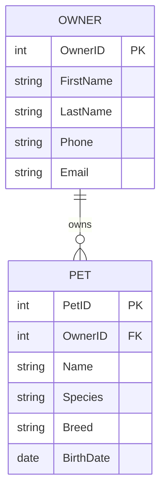

<!-- metadata: date="2026-06-21" -->

# Lab 09: Designing a PetVax Veterinary Clinic Database

<p align="center">
  
</p>

<p align="center"><em>Take the database design skills you practiced on the Grading Database and apply them to PetVax: extract business rules, draw an ERD, and write the DDL to make it real.</em></p>

# Overview

Chapters 1 through 7 taught you how to work with data that already exists in tables, relationships, and queries. Chapter 9 shifts your role: this time, **you are the designer**. You are not handed a finished database. You are given a set of business requirements and asked to create the schema yourself.

In the Let's Build, you practiced this on the Grading Database — extracting entities, drawing a Crow's Foot ERD in Lucidchart, representing it as Mermaid code, and writing CREATE TABLE statements with proper constraints. In this lab, you apply the same workflow to **PetVax**, the veterinary clinic you have been working with since Lab 02.

**This lab has two graded parts:**

1. **Quiz part** — auto-gradable check questions embedded in the steps below. Each answer comes from work you actually perform.
2. **File submission part** — a structured design document containing your ERD, Mermaid code, and DDL statements. An AI grader will review your submitted file.

**Estimated time:** 60–75 minutes.

> ⚠️ **Missing-file rule:** If the required design document is missing, you receive zero for the file-submission part and may receive zero for the entire lab.

# Scenario

PetVax is a growing veterinary clinic with three locations. Until now, the clinic has stored its records in a mix of spreadsheets, paper forms, and a basic Access database you built in earlier labs. The practice manager has decided it is time for a **professionally designed relational database** that can scale as the clinic grows.

You have been hired as the database designer. Your job is to take the clinic's business requirements, model them visually, and produce the SQL statements that will create the database. The clinic owner does not care about drawing tools — they care about whether the design captures the real rules of the business.

The business rules you must model:

1. Each **owner** has a unique ID, first name, last name, phone number, and email. An owner may have multiple pets.
2. Each **pet** has a unique ID, name, species, breed, birth date, and belongs to exactly one owner.
3. Each **veterinarian** has a unique ID, first name, last name, license number, and hire date.
4. Each **visit** represents one appointment. A visit has a unique ID, date, time, reason, and is for exactly one pet. A visit is handled by exactly one veterinarian. A pet can have many visits over time.
5. Each **treatment** has a unique ID, name, description, and standard fee. During a single visit, a pet may receive multiple treatments.
6. Each **visit treatment** records which treatment was performed during which visit, the actual charge amount (which may differ from the standard fee), and any notes.

<!-- PAGE BREAK -->
<div style="page-break-after: always;"></div>

# Part 1: Extract Entities and Attributes

Before you draw anything, you must identify what the database needs to store. From the business rules above, complete the following table.

| Entity | Primary Key | Important Attributes |
|--------|-------------|---------------------|
| OWNER | OwnerID | FirstName, LastName, Phone, Email |
| PET | | |
| VET | | |
| VISIT | | |
| TREATMENT | | |
| VISIT_TREATMENT | | |

Fill in every cell. The primary key column should contain the field you choose as the unique identifier. The attributes column should list at least three meaningful fields beyond the primary key.

# Part 2: Draw the Crow's Foot ERD

Use **Lucidchart** (free account at lucidchart.com) to create a Crow's Foot Entity-Relationship Diagram that shows all six entities from Part 1.

Your ERD must show:

- All entities as labeled rectangles
- All attributes listed inside each entity
- Primary keys underlined
- Relationship lines connecting related entities
- Correct cardinality symbols (one-and-only-one, one-or-many, zero-or-many)
- Correct optionality (mandatory vs. optional)

Export your diagram as a **PNG or PDF** and include it in your submission.

> **Check Question 1:** How many one-to-many relationships appear in your ERD?
> *(Count only the relationship lines connecting entities, not the attributes.)*

# Part 3: Write the Mermaid ERD

Convert your Lucidchart ERD into **Mermaid entity-relationship diagram syntax**. This gives you a versionable, text-based copy of your design that can be stored alongside your code.

Use this starting template and complete it for all six entities:



Copy the completed Mermaid code into your submission document. Test it at **mermaid.live** to confirm it renders correctly before you submit.

> **Check Question 2:** In your Mermaid diagram, which relationship uses the `||--o{` (one-to-zero-or-many) cardinality? Name the two entities.

<!-- PAGE BREAK -->
<div style="page-break-after: always;"></div>

# Part 4: Write the CREATE TABLE Statements

Translate your ERD into SQL DDL statements. Write one `CREATE TABLE` statement for each of the six entities. Every statement must include:

- The correct data types for each column
- A `PRIMARY KEY` constraint
- `FOREIGN KEY` constraints with `REFERENCES`
- `NOT NULL` constraints on required fields
- At least one `UNIQUE` constraint (on Owner Email)
- Appropriate `ON DELETE` or `ON UPDATE` actions where needed

Write your DDL for SQLite syntax. Use this template to start:

```sql
-- PetVax Veterinary Clinic Database Schema
-- Lab 09: Database Design

CREATE TABLE OWNER (
    OwnerID INTEGER PRIMARY KEY,
    FirstName TEXT NOT NULL,
    LastName TEXT NOT NULL,
    Phone TEXT,
    Email TEXT UNIQUE NOT NULL
);

-- Write CREATE TABLE for PET, VET, VISIT, TREATMENT, and VISIT_TREATMENT below
```

> **Check Question 3:** In your VISIT_TREATMENT table, which two foreign keys together form the composite primary key?

# Part 5: Verify Relationships with Test Data

After writing your DDL, plan three rows of test data that would violate referential integrity if the constraints are working correctly. For each, name the table, the violation, and why it should be rejected.

| # | Table | What the Row Tries to Do | Why It Should Fail |
|---|-------|--------------------------|---------------------|
| 1 | | | |
| 2 | | | |
| 3 | | | |

> **Check Question 4:** If you tried to insert a VISIT row with VetID = 999 (a veterinarian who does not exist in the VET table), what would happen in a properly constrained database?

# Lab Quiz

Answer all questions. Every answer comes from the design work you performed above.

## Question 1 — Relationship Count (Multiple Choice)

How many one-to-many relationships appear in your PetVax ERD?

- A. 3
- B. 4
- C. 5
- D. 6

## Question 2 — Cardinality (Multiple Choice)

Which cardinality best describes the relationship between VISIT and VISIT_TREATMENT?

- A. One-to-one
- B. One-to-many
- C. Many-to-many
- D. Zero-to-one

## Question 3 — Composite Key (Multiple Choice)

In your VISIT_TREATMENT table, the primary key is:

- A. A single auto-increment ID
- B. A composite of VisitID and TreatmentID
- C. A composite of VisitID, TreatmentID, and ChargeDate
- D. TreatmentID alone

## Question 4 — Foreign Key Constraint (Multiple Choice)

If a veterinarian retires and you delete their record from the VET table, what should happen to the visits they handled?

- A. The visits should be automatically deleted (CASCADE)
- B. The delete should be blocked if visits exist (RESTRICT)
- C. The VetID in those visits should be set to NULL (SET NULL)
- D. The visits should be reassigned to another vet automatically

## Question 5 — Entity Count (Multiple Choice)

How many entities did you identify from the PetVax business rules?

- A. 4
- B. 5
- C. 6
- D. 7

<!-- PAGE BREAK -->
<div style="page-break-after: always;"></div>

# Submission

Submit the following file to the Lab 09 file submission assignment:

**Required file:** `lab-09-petvax-erd-design.pdf`

Your submission must include all five parts in order:

1. **Part 1:** Completed entity-attribute table (6 rows)
2. **Part 2:** Crow's Foot ERD exported from Lucidchart (PNG or PDF)
3. **Part 3:** Complete Mermaid ERD code (all 6 entities, all relationships)
4. **Part 4:** Six CREATE TABLE statements with all constraints
5. **Part 5:** Three referential integrity violation examples

Combine everything into a single PDF. Label each part clearly. The AI grader will confirm that all five parts are present and that your design matches the business rules.

> ⚠️ If the design document is missing, you receive zero for the file-submission part and may receive zero for the entire lab.

# Lab 09 Completion Checklist

Before you submit, verify:

- [ ] Part 1: All 6 entity rows completed with primary key and attributes
- [ ] Part 2: Crow's Foot ERD shows all 6 entities, relationships, and correct cardinality
- [ ] Part 3: Mermaid code is complete and renders correctly at mermaid.live
- [ ] Part 4: Six CREATE TABLE statements include PRIMARY KEY, FOREIGN KEY, NOT NULL, and UNIQUE constraints
- [ ] Part 5: Three violation examples are specific and correct
- [ ] Quiz answers match the design decisions you made above
- [ ] The file is saved as a single PDF and uploaded to the correct assignment folder
