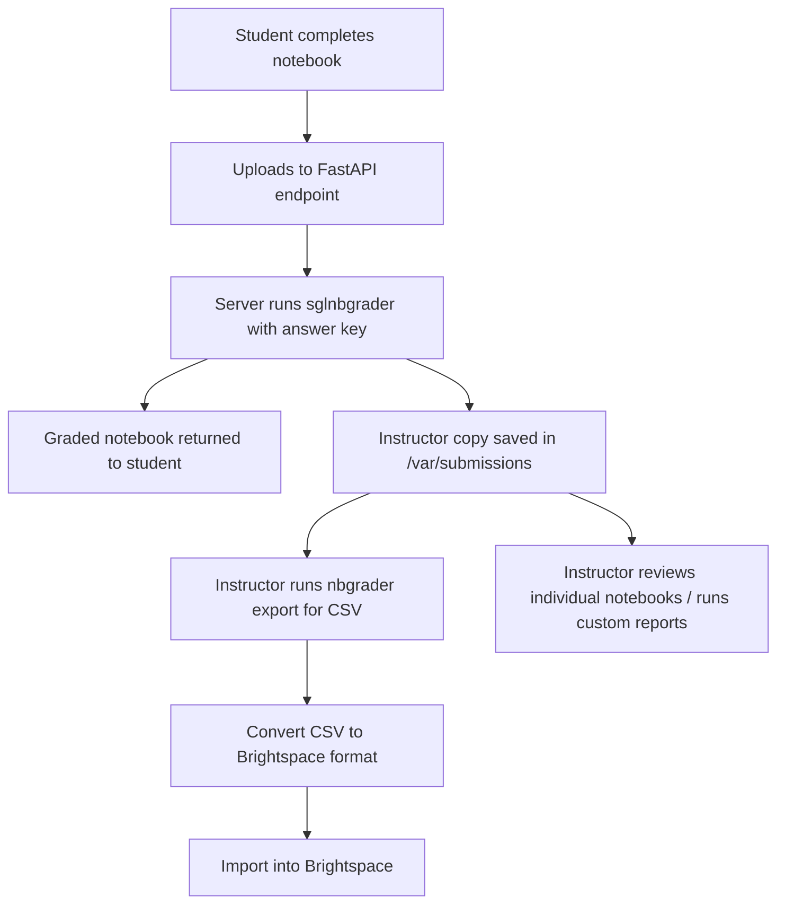

Below is a comprehensive summary of our entire discussion on grading Jupyter notebooks, with a focus on using `sglnbgrader` deployed on **Digital Ocean** to provide immediate student feedback, allow instructor review of submissions, and export grades to **Brightspace** (or CSV). This guide integrates all the options, code snippets, and architectural decisions we explored.

---

# Complete Guide to Auto‑Grading Jupyter Notebooks with `sglnbgrader` and Digital Ocean

## 1. Why Auto‑Grade Notebooks?

In courses that use Jupyter notebooks for assignments, manual grading is time‑consuming and delays feedback. Auto‑grading tools can:
- Provide **immediate feedback** to students.
- Ensure **consistent grading** across all submissions.
- Save instructor time by automating repetitive checks.
- Track student performance at a **granular level** (per‑question scores).

## 2. Overview of Notebook Grading Tools

| Tool          | Key Features                                                                 | Best For                                                                 |
|---------------|------------------------------------------------------------------------------|--------------------------------------------------------------------------|
| **nbgrader**  | Full pipeline: release, collect, grade. Integrates with JupyterHub.         | Comprehensive course management with manual/auto grading.               |
| **jupygrader**| Lightweight, Python‑based, outputs JSON/HTML.                               | Simple setups, immediate feedback, low infrastructure.                  |
| **Otter-Grader**| Modular, supports Python/R, containerised (Docker), LMS integration.       | Large‑scale courses, platform independence.                              |
| **sglnbgrader**| Uses LLMs (e.g., GPT‑4) to grade **qualitative answers** and explanations. | Grading written responses, open‑ended problems, or code with commentary.|

For your textbook chapter (which includes both conceptual questions and code), **`sglnbgrader`** is ideal because it can assess explanations and provide human‑like feedback, not just check for correct output.

## 3. Why `sglnbgrader`?

- **AI‑Powered**: Uses a language model to compare student answers against a reference solution.
- **Nbgrader‑Compatible**: Works with the same metadata format (`grade`, `points`, `solution` cells).
- **Rich Feedback**: Inserts HTML boxes directly into the graded notebook, showing what was wrong and why.
- **Flexible**: Can be run locally, on a server, or in a cloud function.

## 4. Deployment Options for Immediate Feedback

Students need to submit notebooks and receive feedback instantly. We considered three main hosting approaches:

### 4.1 Local Grading (Simplest)
- Students install `sglnbgrader` and run a script themselves.
- **Pros**: No server needed, immediate.
- **Cons**: Requires students to install software; no central record of submissions.

### 4.2 JupyterHub + Shared Directory
- `sglnbgrader` installed on JupyterHub; students save notebooks to a shared folder.
- A grading script runs automatically (or on demand) and writes feedback back.
- **Pros**: Integrated environment, central storage.
- **Cons**: Requires JupyterHub setup.

### 4.3 Digital Ocean Server with FastAPI (Recommended)
- Host a lightweight web service that accepts notebook uploads, grades them, and returns the graded file.
- **Pros**: Platform‑agnostic (students only need a browser), scalable, instructor can collect all submissions.
- **Why Digital Ocean?** Provides full control (Droplet) or managed containers (App Platform) at low cost (~$6/month). **Netlify** is not suitable because it cannot run Python back‑ends with long‑running processes and dependencies.

## 5. Detailed Digital Ocean Setup

### 5.1 Create a Droplet
- Ubuntu 22.04, minimal plan ($6/month).
- SSH in and install basics: `python3-pip`, `nginx` (optional for reverse proxy).

### 5.2 Set Up Python Environment
```bash
python3 -m venv grader-env
source grader-env/bin/activate
pip install fastapi uvicorn python-multipart sglnbgrader openai tiktoken nbformat pandas
```

### 5.3 FastAPI Application (`main.py`)

```python
from fastapi import FastAPI, File, UploadFile, HTTPException
from fastapi.responses import FileResponse
import os
import uuid
from sglnbgrader import Grader

app = FastAPI()
ANSWER_KEY_PATH = "answer_key.ipynb"   # Upload your reference notebook with nbgrader metadata

@app.post("/grade")
async def grade_notebook(file: UploadFile = File(...)):
    # Validate file type
    if not file.filename.endswith('.ipynb'):
        raise HTTPException(400, "Only .ipynb files are accepted")
    
    # Save uploaded file temporarily
    temp_id = str(uuid.uuid4())
    input_path = f"/tmp/{temp_id}_input.ipynb"
    output_path = f"/tmp/{temp_id}_graded.ipynb"
    
    content = await file.read()
    with open(input_path, "wb") as f:
        f.write(content)
    
    # Grade using sglnbgrader (requires OPENAI_API_KEY env variable)
    grader = Grader(ANSWER_KEY_PATH, model="gpt-4.1-nano")  # or your preferred model
    try:
        results = grader.grade_user_notebook(input_path)
        grader.write_feedback_to_notebook(input_path, results, output_path)
    except Exception as e:
        raise HTTPException(500, f"Grading failed: {str(e)}")
    
    # Optionally store a copy for instructor review
    instructor_dir = "/var/submissions/"
    os.makedirs(instructor_dir, exist_ok=True)
    instructor_copy = os.path.join(instructor_dir, f"{temp_id}_{file.filename}")
    grader.write_feedback_to_notebook(input_path, results, instructor_copy)
    
    # Return graded notebook
    return FileResponse(output_path, media_type="application/octet-stream", filename="graded_" + file.filename)
```

### 5.4 Running the Server
```bash
export OPENAI_API_KEY="your-key"
uvicorn main:app --host 0.0.0.0 --port 8000
```
For production, use **Gunicorn** with Uvicorn workers and set up Nginx as a reverse proxy with SSL.

## 6. Student Submission & Feedback Flow

1. **Student accesses a simple web page** (could be hosted on Netlify) with a file upload form.
2. They upload their completed `.ipynb` file.
3. The form POSTs to `https://your-server.com/grade`.
4. The server runs `sglnbgrader` against your answer key, generating a graded notebook.
5. The student’s browser downloads the graded notebook.
6. When opened in Jupyter, each graded cell shows an HTML box with:
   - Points earned
   - Correct answer (if applicable)
   - Explanation of what was wrong

**Example feedback cell** (as generated by `sglnbgrader`):


## 7. Instructor Review: Seeing Submissions and Mistakes

### 7.1 Collecting All Graded Notebooks
In the FastAPI code above, we saved a copy to `/var/submissions/`. You can access this directory via SCP or mount it as a network drive. Each file is named with a unique ID and the original filename.

### 7.2 Generating Per‑Question Reports with nbgrader Export
Even though you used `sglnbgrader`, the grading results are stored in the notebook metadata in nbgrader format. You can use **nbgrader’s export tools** to create a CSV with detailed scores.

First, install nbgrader on your server:
```bash
pip install nbgrader
```

Then run:
```bash
nbgrader export --to=grades.csv --assignment=ch03-assignment --exporter=detailed_exporter.DetailedExportPlugin
```

This CSV contains columns like:
- `student_id`, `last_name`, `first_name`
- For each graded cell: `cell_name_score`, `cell_name_points`, `cell_name_manual`
- You can see exactly which questions each student missed.

### 7.3 Automated Instructor Report Script
You can create a Python script that:
- Reads all graded notebooks from `/var/submissions/`
- Aggregates scores
- Produces a summary with per‑question averages and lists of struggling students.

```python
import nbformat
import glob
import pandas as pd

data = []
for nb_path in glob.glob("/var/submissions/*.ipynb"):
    nb = nbformat.read(nb_path, as_version=4)
    student_info = {}  # extract from metadata if you embed student ID
    # Example: read from first cell if you put student name there
    # For simplicity, assume we have a separate mapping file
    grades = {}
    for cell in nb.cells:
        if 'nbgrader' in cell.metadata:
            g = cell.metadata.nbgrader
            if g.get('grade'):
                grade_id = g['grade_id']
                points = g['points']
                score = cell.metadata.get('score', 0)
                grades[grade_id] = score
    data.append({**student_info, **grades})

df = pd.DataFrame(data)
df.to_csv("per_question_report.csv")
```

## 8. Exporting Grades to Brightspace

Brightspace expects a CSV with specific columns. We can convert the nbgrader export to that format.

### 8.1 Brightspace CSV Format
| Column Header                        | Description                                      | Example               |
|--------------------------------------|--------------------------------------------------|-----------------------|
| `OrgDefinedId` or `Username`         | Student identifier (matches roster)              | `1234567`             |
| `Assignment Name Points Grade`       | Grade column named exactly as in Brightspace     | `Ch3 Fundamentals Points Grade` |
| `End-of-Line Indicator`              | Must contain `#` in every row                    | `#`                   |

**Example**:
```
OrgDefinedId,Ch3 Fundamentals Points Grade,End-of-Line Indicator
1234567,85,#
1234568,92,#
```

### 8.2 Conversion Script
After exporting from nbgrader to `grades.csv`, run this script to generate `brightspace_ready.csv`:

```python
import pandas as pd

# Read nbgrader export (assumes columns: student_id, total_score, etc.)
df = pd.read_csv("grades.csv")

brightspace_df = pd.DataFrame()
brightspace_df["OrgDefinedId"] = df["student_id"]          # or df["email"] if using Username
brightspace_df["Ch3 Fundamentals Points Grade"] = df["total_score"]
brightspace_df["End-of-Line Indicator"] = "#"

brightspace_df.to_csv("brightspace_ready.csv", index=False)
```

### 8.3 Import into Brightspace
1. Navigate to **Grades** → **Enter Grades** → **Import**.
2. Upload the CSV.
3. Map columns if needed (Brightspace usually auto‑detects).
4. Preview and import.

## 9. Additional Instructor Dashboard (Optional)

You can build a simple dashboard (using Streamlit or another FastAPI page) that:
- Lists all submissions with timestamps.
- Shows aggregate statistics (average, min, max).
- Allows downloading individual graded notebooks.
- Visualises common wrong answers.

This could be hosted on the same Digital Ocean server.

## 10. Security & Cost Considerations

- **API Key**: Store your OpenAI API key in an environment variable; never hard‑code.
- **File Size Limits**: Limit upload size to avoid abuse (e.g., 10MB).
- **Authentication**: Add a simple token or password to the `/grade` endpoint so only your students can use it.
- **Costs**:
  - Digital Ocean Droplet: ~$6/month.
  - OpenAI API: depends on usage. For a class of 30 students with moderate‑length notebooks, expect a few dollars per assignment.
  - You can estimate token consumption using the script we discussed earlier (word/token counter).

## 11. Summary of Workflow



## 12. Next Steps & Customisation

- **Answer Key Notebook**: Prepare your reference notebook with nbgrader metadata. Use `nbgrader`'s assignment toolbar to mark graded cells.
- **Model Choice**: Experiment with different models (e.g., `gpt-4.1-nano` for speed, `gpt-4` for higher quality) to balance cost and accuracy.
- **Feedback Customisation**: `sglnbgrader` allows you to modify the prompt used for grading; you can tailor it to your rubric.
- **Integration with LMS**: Beyond Brightspace, you can similarly export to Canvas, Moodle, etc., by adjusting the CSV format.

---

This complete guide should give you everything you need to implement a robust auto‑grading system for Jupyter notebooks, leveraging the power of AI to provide immediate feedback while keeping you in full control of grading data and LMS integration. If you need help with any specific part—such as setting up the answer key notebook or writing the FastAPI error handling—just ask!