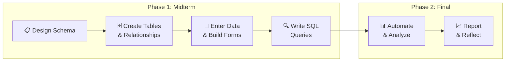

### 1.7.3 The Grading Database Project

The central hands-on project in this book is the **Grading Database** — a relational database that you will design, build, populate, query, and refine across the entire text. This is not a hypothetical exercise. You will model a real system: one that stores grades and attendance, calculates final grades, computes running averages, and presents results through forms and reports.

The **Grading Database** is a relational database system that tracks students, class sessions, deliverables (quizzes, assignments, exams), individual scores, and attendance records. It serves as the book's primary running case study, providing a consistent, familiar context for illustrating concepts across every chapter.

The canonical schema includes six core tables:

| Table             | Purpose                                     | Key Fields                                                                     |
| ----------------- | ------------------------------------------- | ------------------------------------------------------------------------------ |
| `STUDENT`       | Stores student records                      | `StudentID`, `FirstName`, `LastName`, `Email`, `Birthday`, `Grade` |
| `ASSIGNMENT`    | Defines deliverable types and weights       | `Type`, `Quantity`, `Points`, `Points_per_one`                         |
| `SCHEDULE`      | Tracks class sessions                       | `ClassNum`, `Week`, `Date`, `Day`, `Topic`, `Format`               |
| `ATTENDANCE`    | Records attendance per session              | `AttendanceID`, `ClassNum`, `StudentID`, `Attended`                    |
| `DELIVERABLE`   | Lists individual deliverables               | `DeliverableID`, `Type`, `DeliverableNumber`, `DueDate`, `Topic`     |
| `STUDENT_GRADE` | Captures scores per student per deliverable | `GradeID`, `StudentID`, `DeliverableID`, `Score`                       |

By the end of the project, your database will be a **working information system** capable of:

- **Storing structured academic data** — students, deliverables, individual grades, and attendance records across multiple related tables.
- **Enforcing data integrity** — using primary keys, foreign keys, data types, and relationships to ensure that every record is valid and connected.
- **Answering real questions with SQL** — retrieving grades, calculating averages by deliverable type, computing attendance percentages, and joining data across tables to produce meaningful results.
- **Supporting data entry through forms** — building Access forms that make it easy to input grades consistently and correctly, reducing manual errors.
- **Presenting results through reports** — generating clear, formatted outputs that a non-technical stakeholder could read and act on.
- **Automating repetitive tasks** — using macros to calculate final grades, refresh reports, and generate outputs with a single click.
- **Performing what-if analysis** — estimating minimum possible grades (if all remaining work scores zero) and maximum possible grades (if all remaining work scores perfectly).
- **Mapping numeric grades to letter grades** — using a lookup table and SQL joins to translate calculated averages into the grading scale.

*Figure 1.5 -- Simplified Entity Relationship Diagram for the Grading Database*

🎨 Image Generation Prompt

**Filename**: `figure-1.5-grading-db-erd.png`
**Caption**: "Figure 1.5 -- Simplified Entity Relationship Diagram for the Grading Database"
**Gemini Prompt**: "Create a clean, professional Entity Relationship Diagram for a college textbook. Show six tables: STUDENT, ASSIGNMENT, SCHEDULE, ATTENDANCE, DELIVERABLE, and STUDENT_GRADE. Each table is a rectangle with the table name as header and 3-4 key field names listed inside. Draw relationship lines between tables: STUDENT connects to ATTENDANCE and STUDENT_GRADE; SCHEDULE connects to ATTENDANCE; DELIVERABLE connects to STUDENT_GRADE and ASSIGNMENT. Use crow's foot notation for one-to-many relationships. Use a blue and warm-gold color scheme, clean grid layout, white background, professional typography."

---

### 1.7.4 How the Project Evolves

The Grading Database is built in two major phases, each corresponding to a milestone in the book:

**Phase 1 — Midterm: Foundation.** You will design a relational schema with at least four tables, create the tables and relationships in Microsoft Access, enter real data, build a data-entry form, and write SQL queries that retrieve student details, calculate averages by deliverable type, and compute attendance percentages.

**Phase 2 — Final: Integration and Analysis.** Building on the midterm database, you will create a formal Entity Relationship Diagram, write SQL table-creation scripts, calculate weighted final grades, perform minimum and maximum grade analysis, build macros for automation, and reflect on database administration and business intelligence concepts.

*Figure 1.6 -- Two-phase progression of the Grading Database project*

🎨 Image Generation Prompt

**Filename**: `figure-1.6-project-phases.png`
**Caption**: "Figure 1.6 -- Two-phase progression of the Grading Database project"
**Gemini Prompt**: "Create a static version of a two-phase project timeline for a college textbook. Phase 1 (Midterm) includes four steps: Design Schema, Create Tables & Relationships, Enter Data & Build Forms, Write SQL Queries. Phase 2 (Final) includes two steps: Automate & Analyze, Report & Reflect. Show these as a left-to-right flow with two colored regions (blue for Phase 1, warm-gold for Phase 2). Each step is a rounded rectangle connected by arrows. Use a blue and warm-gold color palette. Clean white background, professional flat design."

🎨 Gemini Prompt for Mermaid Static Version

**Gemini Prompt**: "Create a professional static version of a left-to-right flowchart with six nodes in two groups for a college textbook. Group 1 'Phase 1: Midterm' (light blue background): Design Schema, Create Tables & Relationships, Enter Data & Build Forms, Write SQL Queries. Group 2 'Phase 2: Final' (light warm-gold background): Automate & Analyze, Report & Reflect. Rounded rectangles with directional arrows, clean white outer background, suitable for print."

---

### 1.7.5 Why a Grading Database?

The Grading Database is deliberately chosen because it is a system you already understand as a user. You know what grades are, how attendance works, and what a final grade means. That familiarity removes the guesswork about business rules and lets you focus on the real learning objectives: how to **structure** data, how to **query** it, how to **protect** it, and how to **present** it.

At the same time, it is genuinely complex enough to surface real design challenges: one-to-many relationships, aggregate calculations, conditional logic, weighted scoring, and multi-table joins. These are the same patterns that appear in inventory systems, CRM platforms, healthcare records, and financial reporting — just applied to a domain you live in every day.

🧠 **Concept:**
The best way to learn database design is with a domain you already understand. When you know the business rules intuitively, you can focus on *how* the system represents them rather than *what* they mean. That is precisely why the Grading Database works so well as a teaching tool.

---

### 1.7.6 Professional Roles You Will Practice

By completing this project, you step into multiple professional roles:

| Role                             | What You Practice                                                                              |
| -------------------------------- | ---------------------------------------------------------------------------------------------- |
| **Data Architect**         | Designing structure and relationships                                                          |
| **SQL Developer**          | Writing correct and expressive queries                                                         |
| **Database Administrator** | Protecting reliability and integrity                                                           |
| **Analyst**                | Transforming data into insight                                                                 |
| **Communicator**           | Presenting technical results so that non-technical stakeholders can understand and act on them |

💡 **Tip:**
As you work through the Grading Database, keep track of which role you are playing at each step. Real-world database projects require all five — and understanding how they interact is itself a professional skill.
