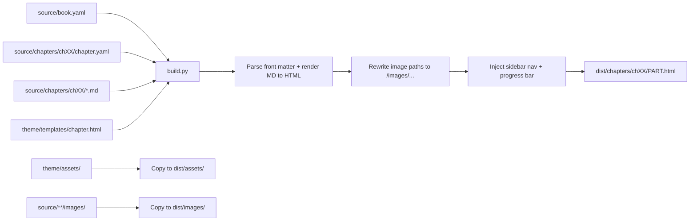

# Database Book Online Reader -- Plan

## Goal

A self-contained, portable folder that:

1. Holds the book's source MD files and images inside it.
2. Has a Python build script that converts each MD file to an HTML page.
3. Outputs a static reader (HTML/CSS/JS) with a left navigation sidebar and a reading-progress bar.
4. Replaces the older [book-platform/](../../book-platform/) (which currently has the sidebar but no progress bar and reads from `BITM330-Book-draft/chapter-drafts/` instead of being self-contained).

## Decisions confirmed

- Folder name: `database-book/`
- First pass content: mockup MD files for the first 3 chapters (placeholders), not a full migration
- Theme: keep the warm cream/green palette from [book-platform/app/static/styles.css](../../book-platform/app/static/styles.css)

## Proposed folder structure

```
database-book/
├── README.md                       # How to build, preview, and deploy
├── requirements.txt                # markdown, Jinja2, PyYAML, python-frontmatter
├── build.py                        # Main static-site builder: source/ -> dist/
├── serve.py                        # Optional tiny `python -m http.server` wrapper for local preview
├── .gitignore                      # Ignore dist/, .venv/, __pycache__
│
├── source/                         # ALL content lives here (self-contained, portable)
│   ├── book.yaml                   # Book title, author, chapter order, theme settings
│   ├── front-matter/
│   │   ├── cover.md                # Mockup placeholder
│   │   ├── acknowledgments.md      # Mockup placeholder
│   │   └── table-of-contents.md    # Auto-generated; can also be hand-edited
│   ├── chapters/                   # Initially: ch01, ch02, ch03 only (mockup content)
│   │   ├── ch01-introduction-to-course/
│   │   │   ├── chapter.yaml        # number, title, ordered list of parts
│   │   │   ├── main.md             # Mockup placeholder
│   │   │   ├── lets-build.md       # Mockup placeholder
│   │   │   ├── terms.md            # Mockup placeholder
│   │   │   ├── reflection.md       # Mockup placeholder
│   │   │   ├── rat.md              # Mockup placeholder
│   │   │   ├── lab.md              # Mockup placeholder
│   │   │   └── images/             # Per-chapter images, referenced as `images/foo.png`
│   │   ├── ch02-mis-and-bitm/      # Same structure, mockup content
│   │   └── ch03-what-is-data/      # Same structure, mockup content
│   └── shared/
│       └── images/                 # Cover art, logos, cross-chapter figures
│
├── theme/                          # Reader UI (templates + assets)
│   ├── templates/
│   │   ├── base.html               # Header, sidebar slot, content slot, footer
│   │   ├── index.html              # Book home (cover + chapter grid)
│   │   ├── chapter.html            # Chapter/part page with sidebar + progress bar
│   │   └── partials/
│   │       ├── sidebar.html        # Left nav: collapsible chapter list with parts nested
│   │       └── progress.html       # Top progress bar markup
│   └── assets/
│       ├── css/
│       │   ├── reader.css          # Layout, sidebar, progress bar
│       │   └── markdown.css        # Typography for rendered article body
│       └── js/
│           └── reader.js           # Scroll-based progress %, sidebar collapse, prev/next keys
│
└── dist/                           # Build output (gitignored, fully self-contained static site)
    ├── index.html
    ├── chapters/
    │   ├── ch01-introduction-to-course/
    │   │   ├── main.html
    │   │   ├── lets-build.html
    │   │   ├── ...
    │   └── ...
    ├── images/                     # Copied from source/**/images/
    └── assets/                     # Copied from theme/assets/
```

## How a page is built



## Reader features (rendered into every chapter page)

- Left sidebar: collapsible chapter list, with parts (`main`, `lets-build`, `terms`, `reflection`, `rat`, `lab`) nested under each chapter; active chapter and part highlighted.
- Progress bar: thin bar fixed at top of viewport that fills as the reader scrolls through the current part, plus a small "Ch 5 of 17" indicator in the sidebar.
- Prev/Next buttons at bottom of each part (keyboard left/right also works via `reader.js`).
- Mobile-responsive: sidebar collapses to a hamburger drawer on narrow screens.

## Key file responsibilities

- `database-book/build.py`: orchestrates the whole build. Adapts the front-matter stripping and image-link rewriting logic from [book-platform/app/content.py](../../book-platform/app/content.py) but writes static HTML files instead of serving them.
- `database-book/source/book.yaml`: single source of truth for chapter order and book-level metadata.
- `database-book/source/chapters/chXX-*/chapter.yaml`: per-chapter metadata (number, title, parts) so we don't rely on parsing folder names.
- `database-book/theme/templates/chapter.html`: the reader page template (sidebar + content + progress bar slots).
- `database-book/theme/assets/css/reader.css`: ports the cream/green palette from [book-platform/app/static/styles.css](../../book-platform/app/static/styles.css) and adds the progress-bar styles.
- `database-book/theme/assets/js/reader.js`: scroll-based progress bar, sidebar collapse, prev/next keyboard nav.

## Mockup content (first pass)

Three chapters scaffolded with mockup MD content so the build pipeline and reader UI can be verified end-to-end before any real content is migrated:

- `ch01-introduction-to-course/`
- `ch02-mis-and-bitm/`
- `ch03-what-is-data/`

Each gets all six parts (`main.md`, `lets-build.md`, `terms.md`, `reflection.md`, `rat.md`, `lab.md`) populated with short Lorem-ipsum-style placeholder text plus a few realistic structural elements (a heading, a paragraph, a bullet list, a code fence, a table, an image reference) so we exercise every rendering path. Real content can be dropped into these files later -- the structure stays the same.

Real-content migration from `BITM330-Book-draft/chapter-drafts/` is deferred to a follow-up pass once the reader is working.

## Existing `book-platform/` handling

- After the new `database-book/` is working, archive [book-platform/](../../book-platform/) by moving it to `archive/book-platform-2026-05-26/` (matches the existing `archive/` convention at the repo root) and deleting the original.

## Implementation todos

1. Scaffold `database-book/` folder with `README.md`, `requirements.txt`, `build.py` skeleton, `.gitignore`.
2. Define `source/book.yaml` and per-chapter `chapter.yaml` schemas.
3. Create mockup MD files (main, lets-build, terms, reflection, rat, lab) for the first 3 chapters with placeholder content.
4. Build the theme reusing the warm cream/green palette: `base.html`, `chapter.html`, `index.html`, sidebar partial, progress partial, `reader.css`, `markdown.css`, `reader.js`.
5. Implement `build.py`: walk `source/`, render each MD to a templated HTML page, rewrite image paths, copy assets, write `dist/`.
6. Add `serve.py` for local preview, run a smoke build, verify sidebar + progress bar work end-to-end against the mockup chapters.
7. Archive `book-platform/` to `archive/book-platform-2026-05-26/`.

---

## Mirror note

A working copy of this plan also lives at `c:\Users\nd115232\.cursor\plans\online_book_reader_636e172e.plan.md`. Keep both in sync if edits are made. This file under `.agents/plans/` is the canonical, repo-tracked version.
