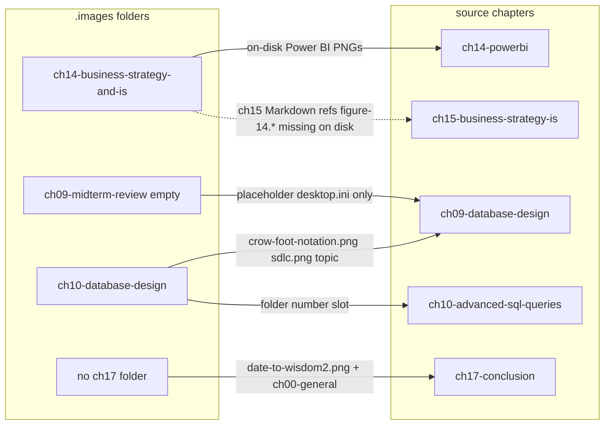

# Phase 1.5 — Resolve Unresolved Items Before Phase 2

## Goal

Close every Phase 1 approval gate item so Phase 2 can generate inventory with a trusted `chapter-map.json` and consistent Markdown discovery. **No file moves, no Markdown `.images` path rewrites** (per your choice).

---

## Resolution summary (evidence-based)



---

## Item 1 — Chapter map (fix ch14/ch15 confusion)

**Finding:** The canonical plan maps `ch14-business-strategy-and-is` → `ch14-powerbi`, which matches **on-disk** assets (`ch014-powerbi-views.png`, etc.). However, [`ch15-business-strategy-is/core-concepts.md`](C:\Users\nd115232\Documents\GitHub\dima-publishing\books\database-book\files\source\chapters\ch15-business-strategy-is\core-concepts.md) references `../../../.images/Ch14%20Business%20Strategy%20and%20IS/figure-14.*.png` — **those files do not exist anywhere under `.images`** (not in renamed folder, not in `archive/`).

**Resolution in `chapter-map.json`:**
- `ch14-business-strategy-and-is` → **primary** `ch14-powerbi` (`confidence: confirmed-mismatch`)
- Add `also_referenced_by: ["ch15-business-strategy-is"]` with `missing_assets: ["figure-14.0-overview.png", ...]` flagged for Phase 2 `status: missing-original`
- Do **not** remap the folder to ch15; the folder name is legacy, but on-disk content is Power BI

**Also correct auto-map gaps from Phase 1:**
- `ch01-welcome-to-the-textbook` → `ch01-introduction-to-course` (`high`)
- `ch02-mis-bitm` → `ch02-mis-and-bitm` (`high`)

**Content note for ch09/ch10:**
- `ch10-database-design/` holds `crow-foot-notation.png`, `sdlc.png` — **topic-aligned with ch09-database-design** despite folder number
- Record in map as `content_notes` under both `ch09-midterm-review` (empty placeholder) and `ch10-database-design` entries

---

## Item 2 — ch17-conclusion (no image folder)

**Resolution in `chapter-map.json`:**
```json
{
  "source_chapter": "ch17-conclusion",
  "chapter_id": "ch17",
  "images_folder": null,
  "asset_locations": ["ch00-general", ".images/(root)"],
  "loose_root_files": ["date-to-wisdom2.png"],
  "confidence": "high",
  "notes": "No ch17 folder; conclusion assets live in shared/general + one root loose file"
}
```
- `ch16-conclusion-from-data-to-wisdom` remains mapped to `ch16-final-review` per canonical plan (placeholder: `desktop.ini` only)
- **Do not create** `ch17-conclusion/` folder yet (Phase 3 decision)

---

## Item 3 — Nearly empty image folders

| Folder                                | On disk                  | Maps to source chapter                                | Disposition            |
| ------------------------------------- | ------------------------ | ----------------------------------------------------- | ---------------------- |
| `ch09-midterm-review`                 | `desktop.ini` only       | `ch09-database-design`                                | `placeholder: true`    |
| `ch11-database-administration`        | `desktop.ini` only       | `ch11-database-administration`                        | `placeholder: true`    |
| `ch13-advanced-database-techniques`   | `desktop.ini` only       | `ch13-advanced-database-techniques`                   | `placeholder: true`    |
| `ch15-final-review`                   | `desktop.ini` only       | `ch15-business-strategy-is`                           | `placeholder: true`    |
| `ch16-conclusion-from-data-to-wisdom` | `desktop.ini` only       | `ch16-final-review`                                   | `placeholder: true`    |
| `ch10-database-design`                | 2 images + `desktop.ini` | `ch10-advanced-sql-queries` (+ content note for ch09) | active, low file count |

Real assets for mismatched chapters live in offset folders per canonical table (e.g. ch08 content in `ch08-advanced-sql-queries/`).

---

## Item 4 — index.md broken links (ch01–ch04)

**Fix in publishing repo only** — update [`index.md`](C:\Users\nd115232\Documents\GitHub\dima-publishing\books\database-book\files\source\chapters\ch01-introduction-to-course\index.md) through ch04 to point at files that **exist today**:

| index.md label      | Current broken link       | Fix to                                                             |
| ------------------- | ------------------------- | ------------------------------------------------------------------ |
| Main Chapter        | `chNN-main-YYYY-MM-DD.md` | `core-concepts.md`                                                 |
| Let's Build         | `chNN-lets-build-...`     | `lets-build.md`                                                    |
| Review & Reflection | `chNN-reflection-...`     | `review-questions.md`                                              |
| Terms Treasury      | `chNN-terms-...`          | `terms-treasury.md`                                                |
| RAT                 | `chNN-rat-...`            | `rat.md`                                                           |
| Lab links           | `lab-NN-questions-...`    | **Remove or comment out** until lab files exist in publishing repo |

Files to edit:
- [`ch01-introduction-to-course/index.md`](C:\Users\nd115232\Documents\GitHub\dima-publishing\books\database-book\files\source\chapters\ch01-introduction-to-course\index.md)
- [`ch02-mis-and-bitm/index.md`](C:\Users\nd115232\Documents\GitHub\dima-publishing\books\database-book\files\source\chapters\ch02-mis-and-bitm\index.md)
- [`ch03-what-is-data/index.md`](C:\Users\nd115232\Documents\GitHub\dima-publishing\books\database-book\files\source\chapters\ch03-what-is-data\index.md)
- [`ch04-databases/index.md`](C:\Users\nd115232\Documents\GitHub\dima-publishing\books\database-book\files\source\chapters\ch04-databases\index.md)

**Phase 2 Markdown union scan** (your choice) will additionally walk:
- `G:\My Drive\0-Projects\!-important\BITM330-book-drive\BITM330-Book-draft\chapter-drafts\chNN-*\` — latest dated `main/`, `lets-build/`, `terms/`, `reflection/`, `rat/`
- [`book-media.md`](G:\My Drive\0-Projects\!-important\BITM330-book-drive\.images\book-media.md) `Placement` column
- Preference order unchanged: live Markdown > book-media > master-index

---

## Item 5 — 161 Cloudinary PIDs without local originals

**Phase 2 policy (no hunting required before inventory):**

| Condition                                       | `status`                        | `usage_evidence`               |
| ----------------------------------------------- | ------------------------------- | ------------------------------ |
| Cloudinary URL in union Markdown scan           | `used`                          | `cloudinary`                   |
| In `book-media.md` only                         | `used` or `candidate`           | `book-media`                   |
| Local original absent but Cloudinary present    | keep row; `original_path` blank | do not flag `missing-original` |
| Referenced locally, no disk file, no Cloudinary | `missing-original`              | `markdown`                     |

Optional **low-priority** archive pass during Phase 2: basename match only (no moves), to upgrade `candidate` rows where archive holds an obvious original. Not blocking.

---

## Item 6 — `archive/` (670 files)

**Phase 2 policy:**

- Default `status: archived` for all files under [`.images/archive/`](G:\My Drive\0-Projects\!-important\BITM330-book-drive\.images\archive)
- Override to `used` / `duplicate` only when union Markdown or ledger match succeeds
- Set `chapter_id` from path heuristics (`archive/ch02-*` → ch02) when parseable; else blank
- Do **not** flatten or move archive contents (Phase 3 proposal only)

---

## Loose root images (15) — approve in chapter-map

Embed approved destinations in `chapter-map.json` under `loose_root_relocation_proposals` (proposals only; **no moves** until Phase 3):

| File                                                                     | Proposed folder                                               |
| ------------------------------------------------------------------------ | ------------------------------------------------------------- |
| `ch1-model.jpg`, `ch1-student.jpg`                                       | `ch01-welcome-to-the-textbook`                                |
| `The-Read-Model.jpg`, `.png`, `@0.51x.png`                               | `ch02-mis-bitm`                                               |
| `types-of-databases.gif`                                                 | `ch03-what-is-data`                                           |
| `erd_example.png`, `table_relationships.png`                             | `ch04-databases` (flag `needs-review` if ERD belongs to ch06) |
| `aggregation_flow.png`, `Arithmetic-Expressions.png`                     | `ch05-sql`                                                    |
| `objectives.jpg`                                                         | `ch12-business-intelligence`                                  |
| `Star_Schema_Basic.png`, `dimensional-howworks2.webp`, `srar-schema.png` | `ch12-business-intelligence`                                  |
| `date-to-wisdom2.png`                                                    | ch17 virtual entry / `ch00-general`                           |

---

## Deliverables (this step)

1. **Write** [`.images/_inventory/chapter-map.json`](G:\My Drive\0-Projects\!-important\BITM330-book-drive\.images\_inventory\chapter-map.json) — approved map with all resolutions above, `schema_version`, `approved_date`, `markdown_sources` array
2. **Edit** 4 publishing `index.md` files (ch01–ch04)
3. **Re-run** read-only validation script (extend [`.tmp/phase1-audit.py`](G:\My Drive\0-Projects\!-important\BITM330-book-drive\.tmp\phase1-audit.py)) to confirm:
   - index.md links resolve
   - chapter-map covers all 17 source chapters + top-level media folders
   - zero originals touched

---

## Explicitly deferred (Phase 3)

- Broken `.images` path refs (`Ch0 General` → `ch00-general`, `Ch14 Business Strategy and IS` → `ch14-business-strategy-and-is`)
- Physical relocation of loose root images
- Creating `ch17-conclusion/` folder
- Importing missing ch15 `figure-14.*` assets

---

## Then Phase 2

With `chapter-map.json` approved and index.md fixed, proceed to generate `media-master.csv/json/html` and per-chapter inventories per the canonical plan, using union Markdown scan and the policies above.
